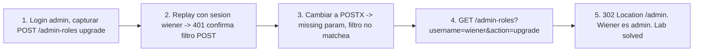

# Writeup: Method-based access control can be circumvented (PortSwigger)

- **Lab**: Method-based access control can be circumvented
- **URL**: https://portswigger.net/web-security/access-control/lab-method-based-access-control-can-be-circumvented
- **Categoría**: Access control / HTTP method bypass / Verb tampering
- **Dificultad**: Practitioner
- **Credenciales**: `wiener:peter` (target promoter), `administrator:admin` (recon)

---

## 1. Objetivo

Promoverse a admin desde la cuenta de wiener. El endpoint `/admin-roles` acepta el campo `username` y `action=upgrade`. El check de admin se aplica solo a requests con método `POST`. Cambiando el método a `GET` (o cualquier verbo no listado en el filtro), el filtro no matchea y el handler ejecuta la acción igual.

### Insight central

Antipatrón típico (Servlet Java, mod_rewrite, custom middleware):

```
if request.method == "POST" and request.path == "/admin-roles":
    require_admin()
# else: pasa sin chequeo
```

El filtro de auth está acoplado al método HTTP. La lógica de negocio del controller acepta múltiples métodos (`@RequestMapping` sin `method=POST` explícito, `doGet()` y `doPost()` que delegan al mismo handler, etc.). Resultado: el filtro autoriza POST, pero GET enruta a la misma acción sin pasar por el filtro.

Verb tampering como clase: cualquier control que enumere métodos específicos en lugar de denegar por default es bypass-able con métodos no enumerados.

---

## 2. Recon y resolución

### 2.1 Recon con cuenta admin

Login `administrator:admin`, panel admin, click "Upgrade" sobre cualquier user. Burp captura:

```
POST /admin-roles HTTP/2
Cookie: session=<admin-session>
Content-Type: application/x-www-form-urlencoded

username=carlos&action=upgrade
```

Response 302 con `Location: /admin`. Acción confirmada: `POST /admin-roles` con `username` y `action=upgrade`.

### 2.2 Replay con sesión wiener (control)

Logout, login `wiener:peter` en otra ventana. Replay la misma request en Repeater pero con la cookie de wiener. Esperado: 401/403 si el filtro funciona contra POST. Confirma que existe un check, sólo que está pegado al método.

### 2.3 Probing del filtro: cambiar método

Test 1: cambiar `POST` por `POSTX` (verbo inválido).

```
POSTX /admin-roles HTTP/2
```

Si responde "missing parameter" o algo distinto a 401, el filtro no matcheó; el dispatcher tampoco reconoce `POSTX` y devuelve error de parsing genérico. Confirma que la auth está atada a literal `POST`.

Test 2: cambiar a GET con params en body.

```
GET /admin-roles HTTP/2
Cookie: session=<wiener-session>
Content-Type: application/x-www-form-urlencoded
Content-Length: 30

username=wiener&action=upgrade
```

Response: `400 Bad Request — "Missing parameter 'username'"`. **Cuidado interpretándolo**: 400 ≠ 401. La auth ya pasó (el handler ejecuta), pero los frameworks por defecto no parsean body en GET. Los params tienen que ir en query string.

### 2.4 Vector definitivo: GET con query string

```
GET /admin-roles?username=wiener&action=upgrade HTTP/2
Cookie: session=5zYUFsbZ0Wf9kbVxgIisNIKUCXEsfb9C
```

Response:

```
HTTP/2 302 Found
Location: /admin
```

Wiener promovido. Refresh `/my-account?id=wiener`, ahora es admin. Lab solved.

### 2.5 Lección de la confusión 400 vs 401

Cuando aparece "missing parameter", el reflejo es pensar "no llegó al endpoint correcto, sigue bloqueado". Pero 400 significa **el handler corrió**: pasó auth, pasó routing, intentó leer params y no los encontró. 401 sería "no estás autorizado", 403 "no tenés permiso", 404 "no existe". Cada code marca un punto distinto en el pipeline. Distinguirlos guía qué fix probar:

- 401/403 → todavía estás bloqueado por auth. Probá otro método.
- 400 "missing X" → auth ya pasó. El bug es de transporte (params en lugar incorrecto, encoding mal, content-type wrong).
- 404 → endpoint no existe con ese path/método. Probá otra URL.

---

## 3. Por qué funciona

### 3.1 Anatomía del filtro acoplado al método

**Servlet Java (típico vector de este bug)**:

```java
// SecurityFilter.java
public void doFilter(ServletRequest req, ServletResponse resp, FilterChain chain) {
    HttpServletRequest http = (HttpServletRequest) req;
    if (http.getMethod().equals("POST") && http.getRequestURI().startsWith("/admin-roles")) {
        if (!isAdmin(http.getSession())) {
            ((HttpServletResponse) resp).setStatus(401);
            return;
        }
    }
    chain.doFilter(req, resp);
}

// AdminRolesServlet.java
public class AdminRolesServlet extends HttpServlet {
    protected void doGet(HttpServletRequest req, HttpServletResponse resp) {
        handle(req, resp);  // misma logica para GET
    }
    protected void doPost(HttpServletRequest req, HttpServletResponse resp) {
        handle(req, resp);  // misma logica para POST
    }
    private void handle(HttpServletRequest req, HttpServletResponse resp) {
        String username = req.getParameter("username");
        String action = req.getParameter("action");
        if ("upgrade".equals(action)) {
            promoteUser(username);
            resp.sendRedirect("/admin");
        }
    }
}
```

El filtro chequea POST. El servlet implementa `doGet` y `doPost` con la misma lógica. GET pasa el filtro sin auth y ejecuta la lógica idéntica.

### 3.2 Otras manifestaciones del verb tampering

- **HEAD bypass**: muchos frameworks tratan HEAD como GET sin body. Si el filtro chequea solo POST/PUT/DELETE, HEAD pasa.
- **Métodos custom**: `POSTX`, `FOOBAR`, `MOVE`, `CONNECT`. Frameworks que no validan estrictamente devuelven 200/400 en lugar de 405; algunos enrutan al handler default.
- **WebDAV methods**: `PROPFIND`, `MKCOL`, `LOCK`, `COPY`, `MOVE`. Si el server tiene mod_dav o equivalente cargado, estos métodos pueden alcanzar handlers regulares.
- **Method override headers**: `X-HTTP-Method-Override: PUT` en una request POST. Algunos frameworks (Spring, Express con middleware específico) lo respetan.
- **OPTIONS** suele estar permitido por default y revelar métodos disponibles.

### 3.3 Por qué se cae en este patrón

- **Doc del framework no es clara**: `@RequestMapping("/admin")` en Spring acepta todos los métodos a menos que especifiques `method=RequestMethod.POST`. Defaults peligrosos.
- **Filtros legacy migrados a APIs nuevas**: el filtro fue escrito en la era de form POST y se mantuvo cuando el endpoint pasó a aceptar JSON via PUT/PATCH.
- **Allowlist en lugar de denylist al revés**: "denegar admin a non-admin si POST" en lugar de "deny by default, allow admin si is_admin".
- **Testing solo del happy path**: pruebas unitarias prueban POST autorizado y POST no autorizado, no GET sin auth.

### 3.4 Implementación correcta

```java
// Fix 1 - allowlist de metodos en el filtro
private static final Set<String> METHODS_REQUIRING_AUTH =
    Set.of("GET", "POST", "PUT", "PATCH", "DELETE", "HEAD", "OPTIONS");

if (METHODS_REQUIRING_AUTH.contains(http.getMethod())
    && http.getRequestURI().startsWith("/admin-roles")) {
    requireAdmin(http.getSession());
}
```

```java
// Fix 2 - aplicar el check en el handler, no en el filtro
public class AdminRolesServlet extends HttpServlet {
    protected void doGet(HttpServletRequest req, HttpServletResponse resp) {
        requireAdmin(req.getSession());  // duplicado en cada method
        handle(req, resp);
    }
    protected void doPost(HttpServletRequest req, HttpServletResponse resp) {
        requireAdmin(req.getSession());
        handle(req, resp);
    }
}
```

```java
// Fix 3 - mejor: deny by default con anotaciones (Spring Security)
@RestController
@PreAuthorize("hasRole('ADMIN')")
public class AdminRolesController {
    @RequestMapping("/admin-roles")  // todos los metodos
    public ResponseEntity<?> handle(...) { ... }
}
```

Patrón general: **deny by default**. La auth se declara una vez por endpoint y se aplica a todos los métodos. El filtro nunca enumera métodos específicos para chequear.

### 3.5 Conexión con el lab anterior

| Lab | Disparidad explotada |
|---|---|
| `url-based-access-control-can-be-circumvented` | frontend lee request line, backend respeta `X-Original-URL` |
| **`method-based-access-control-can-be-circumvented` (este)** | filtro autoriza por método específico, handler corre con cualquier método |

Ambos son **defensa parcial mal acoplada**: el control mira un atributo de la request (URL en uno, método en otro), pero el handler responde a otra dimensión. La intersección incompleta entre filtro y dispatcher es la vulnerabilidad.

---

## 4. Resumen



Tres ideas:

1. **Método HTTP no es atributo de seguridad**: enumerar métodos en filtros es allowlist al revés (deny by default invertido). Allowlist debe estar en métodos permitidos, no en métodos chequeados.
2. **Filtro y handler tienen que coincidir en superficie**: si el handler acepta GET y POST, el filtro tiene que correr para GET y POST. Cualquier asimetría entre los dos abre bypass.
3. **400 Bad Request ≠ 401 Unauthorized**: 400 dice "el handler corrió". Si pasaste auth y caes en 400, el bug es de transporte (params, encoding); seguís con eso, no con auth.

---

## 5. Contramedidas

1. **Deny by default**: cada endpoint declara explícitamente quién puede acceder. Sin decorator/anotación → falla cerrado.
2. **Auth en handler o middleware aplicable a todos los métodos**: anotaciones tipo `@PreAuthorize` (Spring), decorators tipo `@require_admin` (Flask, Django), middleware que matchea por path no por método.
3. **Bloquear métodos no usados explícitamente**: si tu app sólo necesita GET/POST, configurar el server para 405 Method Not Allowed en todo lo demás. mod_security, nginx `limit_except`, AWS WAF rule.
4. **Tests automatizados de access control**: por cada endpoint sensible, test que verifica 401 con method=POST y 401 con method=GET/PUT/DELETE/HEAD/OPTIONS/POSTX.
5. **Audit logging que registre el método y el resultado de auth**: detectar patterns de probing (mismo path con muchos métodos en pocos minutos).
6. **Code review checklist**: cualquier filtro que mencione `getMethod()` es candidato a bug. Revisar si el handler asociado acepta más métodos que los listados.
7. **Bloquear method override headers**: si no usas `X-HTTP-Method-Override`, strippealo en el frontend.
8. **Defensa en profundidad**: auth en filtro + auth en handler. Si una capa falla, la otra cubre.

---

## 6. Referencias

- PortSwigger Web Security Academy. (s.f.). *Lab: Method-based access control can be circumvented*. https://portswigger.net/web-security/access-control/lab-method-based-access-control-can-be-circumvented
- PortSwigger Web Security Academy. (s.f.). *Access control vulnerabilities and privilege escalation*. https://portswigger.net/web-security/access-control
- OWASP Foundation. (2021). *A01:2021 - Broken Access Control*. https://owasp.org/Top10/A01_2021-Broken_Access_Control/
- OWASP Foundation. (s.f.). *Authorization Cheat Sheet*. https://cheatsheetseries.owasp.org/cheatsheets/Authorization_Cheat_Sheet.html
- OWASP Foundation. (s.f.). *Access Control Cheat Sheet*. https://cheatsheetseries.owasp.org/cheatsheets/Access_Control_Cheat_Sheet.html
- OWASP Foundation. (s.f.). *Testing for Bypassing Authorization Schema*. https://owasp.org/www-project-web-security-testing-guide/v42/4-Web_Application_Security_Testing/05-Authorization_Testing/02-Testing_for_Bypassing_Authorization_Schema
- MITRE Corporation. (2024). *CWE-284: Improper Access Control*. https://cwe.mitre.org/data/definitions/284.html
- MITRE Corporation. (2024). *CWE-287: Improper Authentication*. https://cwe.mitre.org/data/definitions/287.html
- MITRE Corporation. (2024). *CWE-693: Protection Mechanism Failure*. https://cwe.mitre.org/data/definitions/693.html
- MITRE Corporation. (2024). *CWE-650: Trusting HTTP Permission Methods on the Server Side*. https://cwe.mitre.org/data/definitions/650.html
- IETF. (2022). *RFC 9110: HTTP Semantics — §9 Methods*. https://www.rfc-editor.org/rfc/rfc9110#section-9
- Stuttard, D., & Pinto, M. (2011). *The Web Application Hacker's Handbook* (2nd ed.). Wiley. Cap. 8 (Attacking Access Controls).
- Inventario interno (umbrella): [`inventario/04-explotacion/web/explotacion-broken-access-control.md`](../../../inventario/04-explotacion/web/explotacion-broken-access-control.md)
- Lab hermano de bypass por capas asimétricas: [`learning/portswigger/url-based-access-control-can-be-circumvented/writeup.md`](../url-based-access-control-can-be-circumvented/writeup.md)
