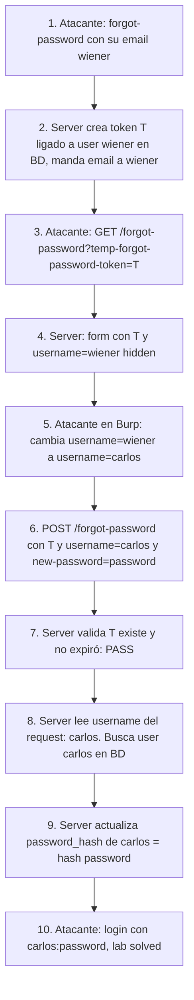

# Writeup: Password reset broken logic (PortSwigger)

- **Lab**: Password reset broken logic
- **URL**: https://portswigger.net/web-security/authentication/other-mechanisms/lab-password-reset-broken-logic
- **Categoría**: Authentication / Password reset con token no ligado al usuario (confused deputy)
- **Dificultad**: Apprentice
- **Credenciales propias**: `wiener:peter` (con email accesible)
- **Credenciales objetivo**: `carlos` (sin acceso a su email)

---

## 1. Objetivo

El lab tiene un flujo de password reset estándar: form para pedir reset por email, email con link tokenizado, página final con campos de nueva password. El bug: el formulario final manda **dos** datos sensibles, el `temp-forgot-password-token` (que el server valida correctamente) y un campo `username` (que el server **confía sin validar contra el token**). Cambiando el `username` antes de submitir, el server resetea el password de la cuenta indicada en el request, no la asociada al token.

Vos pedís reset para `wiener` (tu cuenta), recibís un token válido para `wiener`. En el POST final cambiás `username=wiener` por `username=carlos` y le ponés `password=password`. Carlos termina con password `password` y vos entrás como él.

### El insight central

Este es el **confused deputy** clásico aplicado a password reset: el server tiene autoridad para cambiar passwords (eso es legítimo). Recibe input de un cliente que dice "cambiale el password a `carlos` con este token". El server valida el token (que es para `wiener`) pero le obedece al cliente sobre a quién aplicar la operación. La autoridad del server es real; lo que falta es que el server derive *de su propio estado* a quién corresponde el token, en vez de creerle al cliente.

La fix es de una línea: en vez de `User.find(username=request.form['username'])`, usar `token.user`. Si el token está ligado a un usuario en la BD (que es como debería estar), esa relación se respeta y el cliente no puede mentir sobre la identidad.

---

## 2. Reconocimiento

### 2.1 Mapear el flujo legítimo con tu cuenta

Login → Logout → "Forgot password?" → submitir `[email protected]`.

Email Client en la barra del lab → abrir el email recibido → seguir el link:

```
GET /forgot-password?temp-forgot-password-token=il7aji7vj9tfwOzOajmlru6wgjl9kpeb HTTP/2
```

Te lleva a un form con dos inputs visibles ("New password" y "Confirm new password") y dos hidden fields:

```html
<input type="hidden" name="temp-forgot-password-token" value="il7aji7vj9tfwOzOajmlru6wgjl9kpeb">
<input type="hidden" name="username" value="wiener">
```

El `username=wiener` hidden es la señal del bug. En una implementación correcta, el username no necesitaría estar en el request (el server lo deriva del token); que esté presente en el form es el smell que lleva a probar el bypass.

Capturar el POST del submit en Burp:

```http
POST /forgot-password?temp-forgot-password-token=il7aji7vj9tfwOzOajmlru6wgjl9kpeb HTTP/2
Host: 0aa20068040c9eda800f7137007200c4.web-security-academy.net
Cookie: session=Q9WqiIquaf9WhOiA2Aoerl24qCgcjmLJ
Content-Type: application/x-www-form-urlencoded

temp-forgot-password-token=il7aji7vj9tfwOzOajmlru6wgjl9kpeb&username=wiener&new-password-1=password&new-password-2=password
```

### 2.2 Por qué el smell del campo `username` es importante

En la mayoría de implementaciones razonables, el form de reset sólo necesita: el token (de URL o hidden) y la nueva password. El username (o user ID) no debería viajar como input controlable por el cliente; el server lo deriva del token. Cuando ves un campo `username` en el form, hay tres opciones:

1. **El server lo derivá y este campo es decorativo** (display only, server lo ignora). Improbable: por qué incluirlo entonces.
2. **El server lo usa para confirmación visual** ("estás reseteando el password de wiener, ¿confirmás?"). En ese caso debería estar protegido contra tampering (CSRF token + integrity check, o derivado del token).
3. **El server lo usa como input para la operación**. Bug.

La heurística operativa: **hidden inputs en flujos sensibles son sospechosos por default**. Probar a cambiarlos es barato (un request) y la información negativa (el server lo ignora o rechaza el cambio) ya descarta la opción 3.

---

## 3. Resolución

### 3.1 Tampering del username

En Repeater (o intercept), cambiar `username=wiener` → `username=carlos` y submitir:

```http
POST /forgot-password?temp-forgot-password-token=il7aji7vj9tfwOzOajmlru6wgjl9kpeb HTTP/2
...
temp-forgot-password-token=il7aji7vj9tfwOzOajmlru6wgjl9kpeb&username=carlos&new-password-1=password&new-password-2=password
```

Respuesta:
```http
HTTP/2 302 Found
Location: /
```

El 302 a `/` es el response esperado del flow legítimo (terminó el reset). El server no validó que el token pertenezca a carlos; aplicó el cambio de password a quien dice el campo `username`.

### 3.2 Login como carlos

Logout de cualquier sesión activa. Login con `carlos:password`. Redirect a `/my-account?id=carlos`. Lab solved.

---

## 4. Por qué funciona

### 4.1 Confused deputy en autenticación

"Confused deputy" es el problema clásico donde un agente con autoridad legítima ejecuta operaciones a pedido de un cliente con menos autoridad, cuando el agente confía en input del cliente para decidir el target de la operación. La autoridad del agente es real; el bug está en *cómo identifica el target*.

En password reset:

- El server tiene autoridad para cambiar passwords (función legítima).
- El cliente solicita "cambiá el password de X usando este token".
- El server, para identificar X, **debería usar el dato auténtico**: el token, que está en la BD ligado a un user_id concreto.
- En vez de eso, lee `username` del request y busca al usuario por ese campo. El cliente miente sobre la identidad y el server le obedece.

El patrón aparece en muchos otros sitios: IDOR (`GET /api/users/123/orders` cambiado a `users/456`), pasos de checkout (`item_id` cambiado a uno con descuento), endpoints de admin que reciben `target_user` como param. En todos los casos la fix es derivar la identidad del lado autorizado, no del input del cliente.

### 4.2 La fix correcta: schema con relación token ↔ user

```python
# Schema
class PasswordResetToken(db.Model):
    token = Column(String(64), primary_key=True)  # secrets.token_urlsafe(32)
    user_id = Column(Integer, ForeignKey('users.id'), nullable=False)
    expires_at = Column(DateTime, nullable=False)
    consumed_at = Column(DateTime, nullable=True)

# Endpoint (correcto)
@app.route('/forgot-password', methods=['POST'])
def reset_password():
    token_value = request.form['temp-forgot-password-token']
    token = PasswordResetToken.query.filter_by(token=token_value).first()
    if not token or token.consumed_at or token.expires_at < datetime.now():
        return generic_error()  # respuesta uniforme
    user = token.user  # <- DERIVADO DEL TOKEN, no del request
    user.password_hash = bcrypt.hashpw(request.form['new-password-1'].encode(), bcrypt.gensalt())
    token.consumed_at = datetime.now()
    db.session.commit()
    return redirect('/login')
```

Cuatro principios:

1. **El token tiene un user dueño** en BD (FK a users.id). No es un blob opaco que el server interpreta cada vez.
2. **La identidad del user se deriva del token**, no de un campo del request.
3. **El token se invalida tras uso** (`consumed_at`). Aunque el atacante lo capture después, ya no sirve.
4. **Respuestas uniformes** para cualquier rama de fallo (token inválido, expirado, consumido), evitando enum.

### 4.3 ¿Por qué este bug es frecuente en producción?

Tres razones:

1. **Tentación de "pasar todo al backend para no perder contexto"**: el frontend tiene el username después del paso "ingresar email", lo embebe como hidden, el backend asume que el frontend lo manda correcto.
2. **Migraciones a microservicios sin re-pensar el modelo**: el endpoint de reset pasó a otro servicio que no tiene acceso a la tabla de tokens; le pasan token + username, y "valida" cada cosa por separado.
3. **Tests cubren el happy path**: el atacante reemplaza el username, los tests automatizados pasan el username correcto. El bug no aparece en tests funcionales.

Defensa contra los tres: code review específico para flujos de auth, threat modeling explícito, tests negativos que prueban tampering.

### 4.4 Otras clases de bugs en password reset (para detectar en otros labs)

| Clase | Trigger | Cómo se ataca |
|---|---|---|
| **Token no ligado al usuario** (este lab) | Username en request | Tampering del username |
| **Token predecible** | Tokens cortos, secuenciales o derivados de timestamp | Predicción / enumeración |
| **Token leakeado vía Referer** | Reset page hace requests a recursos externos | Capturar Referer en server controlado |
| **Token sin expiración / reusable** | TTL infinito o no se consume tras uso | Replay del token tras tiempo o múltiples veces |
| **Password reset poisoning vía Host** | Server arma URL del email con `Host` del request | Mandar reset con `Host: attacker.com`; víctima clickea link al atacante |
| **Username/email enumeration** | Respuesta diferente según existencia | Side-channel idéntico al login enum |
| **Brute-force del token** | Token de baja entropía (4-6 dígitos) sin rate-limit | Probar todos los códigos contra un email conocido |

Cada una se ataca distinto pero la fix raíz comparte el principio: *no confiar en el cliente para identidad, autorización ni configuración del flow*.

---

## 5. Resumen de la cadena



Tres ideas para llevarse:

1. **Confused deputy es el patrón canónico de password reset roto**. El server tiene autoridad legítima; el bug es de quién deriva el target. La fix es de una línea: usar `token.user`, no `request.form['username']`.
2. **Hidden inputs en flujos sensibles son red flag**. Si un campo no necesita ser cliente-controlable, no debería estar como input. Cuando aparece, asumir que el bug está ahí hasta probar lo contrario.
3. **El campo "username" en form de reset es smell universal**. La pregunta correcta para diseñar el flow: "¿cómo el server identifica al usuario que está reseteando?" Si la respuesta es "el cliente le dice", hay bug.

---

## 6. Contramedidas

En orden de robustez:

1. **Derivar el usuario del token, no del request**. Schema con FK `(token, user_id)` en BD. Single source of truth.
2. **Tokens criptográficamente fuertes**: `secrets.token_urlsafe(32)` o equivalente, 128+ bits de entropía.
3. **Expiración corta (15-60 min) y un solo uso**. `consumed_at` columna, validar en cada uso.
4. **No mandar el username (o cualquier otro identificador) como hidden field**. Si por UX hay que mostrar al usuario qué cuenta está reseteando, derivarlo server-side y renderizar como texto, sin input editable.
5. **CSRF token en el form de reset** (incluso si la sesión está pre-auth). Defensa en profundidad.
6. **Headers `Referrer-Policy: no-referrer`** en la página de reset. Bloquea leakage del token vía Referer si la página tiene recursos externos.
7. **Rate-limiting** per-IP y per-email en `/forgot-password` (envío de email) y per-token en `/reset` (intentos contra un mismo token).
8. **Respuestas uniformes** en `/forgot-password`: misma respuesta exista o no el email. Mensaje genérico.
9. **No usar `Host` header del request** para construir URLs del email. Usar `PUBLIC_BASE_URL` desde config server-side.
10. **Notificación al usuario** cuando se solicita un reset y cuando se completa, con info de IP/UA. Detección post-explotación.
11. **Logging de patrones anómalos**: alta tasa de resets desde misma IP, múltiples intentos contra tokens distintos, requests con `Host` raro.

---

## 7. Referencias

- PortSwigger Web Security Academy. (s.f.). *Lab: Password reset broken logic*. https://portswigger.net/web-security/authentication/other-mechanisms/lab-password-reset-broken-logic
- PortSwigger Web Security Academy. (s.f.). *Other authentication mechanisms*. https://portswigger.net/web-security/authentication/other-mechanisms
- OWASP Foundation. (s.f.). *Forgot Password Cheat Sheet*. https://cheatsheetseries.owasp.org/cheatsheets/Forgot_Password_Cheat_Sheet.html
- OWASP Foundation. (s.f.). *Authentication Cheat Sheet*. https://cheatsheetseries.owasp.org/cheatsheets/Authentication_Cheat_Sheet.html
- MITRE Corporation. (2024). *CWE-640: Weak Password Recovery Mechanism for Forgotten Password*. https://cwe.mitre.org/data/definitions/640.html
- MITRE Corporation. (2024). *CWE-841: Improper Enforcement of Behavioral Workflow*. https://cwe.mitre.org/data/definitions/841.html
- MITRE Corporation. (2024). *ATT&CK Technique T1556: Modify Authentication Process*. https://attack.mitre.org/techniques/T1556/
- Hardy, N. (1988). *The Confused Deputy*. Operating Systems Review 22(4). — paper original que define el patrón confused deputy.
- Stuttard, D., & Pinto, M. (2011). *The Web Application Hacker's Handbook* (2nd ed.). Wiley. Cap. 6 (Attacking Authentication), §6.6 (Forgotten Password).
- Writeups hermanos:
  - [`learning/portswigger/username-enumeration-via-different-responses/writeup.md`](../username-enumeration-via-different-responses/writeup.md) — primer lab auth, side-channel en respuesta.
  - [`learning/portswigger/2fa-simple-bypass/writeup.md`](../2fa-simple-bypass/writeup.md) — segundo lab auth, broken state machine en MFA.
- Inventario interno: [`inventario/04-explotacion/web/explotacion-password-reset-flaws.md`](../../../inventario/04-explotacion/web/explotacion-password-reset-flaws.md)
