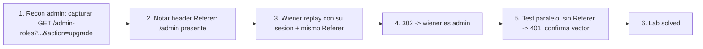

# Writeup: Referer-based access control (PortSwigger)

- **Lab**: Referer-based access control
- **URL**: https://portswigger.net/web-security/access-control/lab-referer-based-access-control
- **Categoría**: Access control / Header trust / Client-controlled authz
- **Dificultad**: Practitioner
- **Credenciales**: `wiener:peter` (target promoter), `administrator:admin` (recon)

---

## 1. Objetivo

Promoverse a admin desde wiener. El endpoint `/admin-roles?username=X&action=upgrade` no chequea sesión/rol. Chequea el header `Referer`: si vale `/admin` (el panel admin, que sí está protegido), autoriza la acción. Razonamiento del dev: "si el cliente vino del admin panel, el cliente es admin". El bug: `Referer` lo setea el cliente, no el server. En Burp/curl se forja.

Wiener manda:

```
GET /admin-roles?username=wiener&action=upgrade
Cookie: session=<wiener>
Referer: https://<lab>/admin
```

Server lee el `Referer`, autoriza, ejecuta upgrade. 302 → wiener admin.

### Insight central

**Referer es información, no autorización**. El cliente decide qué mandar (incluyendo nada, gracias a `Referrer-Policy: no-referrer`). Cualquier authz basada en `Referer` está autorizando al header, no al usuario.

Es la misma clase de error que:

- Confiar en `X-Forwarded-For` para identidad/IP whitelisting (atacante setea el header).
- Confiar en `Origin` para CSRF sin validar method/path/body (atacante puede mandar `Origin: <victim-domain>` desde curl).
- Confiar en `User-Agent` para detectar bots o decidir features (UA es trivial spoof).
- Confiar en cookies inseguras como `Admin=true` (cookie tampering, lab `user-role-controlled-by-request-parameter` del cluster).

La trampa específica del `Referer`: **se siente browser-set automático**. No es un header que devs seteen explícitamente como `Authorization` o `X-API-Key`. El dev piensa "el browser lo manda solo, viene del comportamiento normal del usuario". Pero browsers también obedecen políticas (`Referrer-Policy`), users pueden desactivarlo en privacy extensions, y herramientas como Burp lo manipulan trivialmente. Browser-set ≠ trustworthy.

---

## 2. Recon y resolución

### 2.1 Recon con admin

Login `administrator:admin`, panel admin, click "Upgrade" en cualquier user. Burp captura:

```
GET /admin-roles?username=carlos&action=upgrade
Cookie: session=<admin>
Referer: https://<lab>/admin
```

Response 302 a `/admin`. Notar: GET con query string (no POST con body), sin `confirmed=true`. Endpoint simple.

### 2.2 Replay con sesión wiener sin Referer

Logout, login `wiener:peter`, en otra ventana. Replay la request en Repeater con cookie de wiener pero sin tocar el `Referer` (Burp puede haberlo dejado o no, depende de cómo capturaste). Si el server responde 401/403, confirma que existe defensa.

### 2.3 Replay con sesión wiener manteniendo Referer

```
GET /admin-roles?username=wiener&action=upgrade HTTP/2
Cookie: session=vQfaDSR38jcl6PCwxbchptK9UNiSUBMs
Referer: https://0a9d00b403e75ef980f72bd10093006f.web-security-academy.net/admin
```

Response:

```
HTTP/2 302 Found
Location: /admin
```

Wiener promovido. Refresh `/my-account?id=wiener`, ahora es admin. Lab solved.

### 2.4 ¿Y si quitamos el Referer?

Test paralelo: misma request sin header `Referer`. Response esperada: 401/403. Confirma que la decisión está atada al header, no a la sesión. Esa simetría (con header → autoriza, sin header → bloquea) es el fingerprint de referer-based authz.

---

## 3. Por qué funciona

### 3.1 Anatomía del bug

```python
# Antipatron - authz delegada al Referer
@app.route('/admin-roles')
def admin_roles():
    referer = request.headers.get('Referer', '')
    if '/admin' not in referer:
        abort(401)
    # ejecuta la accion sin chequear sesion/rol
    promote_user(request.args['username'], request.args['action'])
    return redirect('/admin')
```

El razonamiento detrás: "el panel `/admin` está protegido (sólo admins lo ven). Si el browser linkea desde ahí, es porque el user es admin". Tres errores estructurales:

1. **Referer es client-controlled**: cualquier cliente que no sea un browser estándar (curl, Burp, scripts) lo setea como quiere. Los browsers también lo manipulan vía `Referrer-Policy`, link tags, JS.
2. **No hay correlación entre `Referer` y la sesión**: el server confía en que la cadena de navegación del cliente representa "fui admin antes". Pero la sesión es la que sabe quién es el cliente, no el `Referer`.
3. **Defensa transitiva no garantizada**: incluso si el `Referer` fuera honesto, "vino de /admin" implica "vio /admin", no "es admin ahora". Roles cambian; el header no se actualiza.

### 3.2 ¿Cuándo Referer es legítimamente útil?

- **Anti-CSRF (parcial)**: validar que `Origin` o `Referer` matchee el dominio propio antes de aceptar mutaciones. Es defensa-en-profundidad sumada a CSRF tokens, no reemplazo. Y se valida contra el dominio, no contra paths internos.
- **Analytics**: medir de dónde vienen los usuarios.
- **Hotlink protection**: rechazar requests a imágenes desde dominios externos. Mitigación de bandwidth, no security.
- **UX**: redirigir post-login al `Referer`. Para nada de auth.

Notar el patrón: cuando `Referer` se usa correctamente, es **información de bajo trust complementando otra defensa**, no la decisión principal.

### 3.3 Por qué se cae en este patrón

- **Frameworks de "URL-based access control"**: algunos middleware viejos (Spring Security legacy, IIS) configuran reglas tipo "endpoint X requiere haber visto endpoint Y antes". El `Referer` es la implementación trivial.
- **Auth retrofit**: la app empezó sin admin panel; cuando se agregó, el dev extrapoló la protección del UI (`/admin` requiere login admin) a los endpoints de acción (`/admin-roles`) con la heurística "si llegaron acá desde admin, son admin".
- **Testing manual sólo desde browser**: el dev testea clickeando "Upgrade" desde el panel y todo funciona. Browser manda Referer correcto. Pasa pruebas.
- **Mental model "trust the browser"**: persiste en muchos devs la idea de que el browser es un agente confiable. No lo es; el browser ejecuta lo que el cliente le pide, y el cliente puede ser un atacante con DevTools.

### 3.4 Implementación correcta

```python
# Fix - authz por sesion, ignorar Referer
@app.route('/admin-roles')
@require_admin  # decorator que chequea session.role == 'admin'
def admin_roles():
    promote_user(request.args['username'], request.args['action'])
    return redirect('/admin')
```

```python
# Fix con defensa en profundidad - sesion + CSRF
@app.route('/admin-roles', methods=['POST'])
@require_admin
@require_csrf_token  # token unico por sesion, validado en cada mutacion
def admin_roles():
    ...
```

Reglas:

1. **Authz por session**, siempre. La sesión es el único atributo que el server controla y ata a un usuario autenticado.
2. **Referer/Origin son defensa-en-profundidad** contra CSRF, no authz primaria.
3. **Mutaciones siempre por POST con CSRF token**, nunca por GET. GET no debería cambiar estado (semántica HTTP); además GET via link en email/img tag es CSRF trivial.

### 3.5 Comparación estructural con los otros bypass del cluster

| Lab | Atributo confiado erróneamente | Por qué falla |
|---|---|---|
| `url-based-access-control-can-be-circumvented` | path en request line | backend respeta header `X-Original-URL` también |
| `method-based-access-control-can-be-circumvented` | método HTTP literal | handler corre con cualquier método |
| `multi-step-process-with-no-access-control-on-one-step` | "vino del paso 1" | `confirmed=true` es flag client-controlled |
| **`referer-based-access-control` (este)** | `Referer` header | header lo setea el cliente |

Patrón estructural común: **server delega autorización a un atributo que el atacante puede manipular**. Fix común: **authz por sesión** (atributo que el server controla, atado al user autenticado), no por dato de la request.

### 3.6 Vectores adicionales: jugar con `Referer`

- **Referer falsificado completo**: `Referer: https://target/admin` desde Burp. Caso de este lab.
- **Referer parcial / substring**: si el server hace `if 'admin' in referer`, basta con `Referer: https://evil.com/admin/?fake=1`. Este lab probablemente requiere matchear path al final, pero variantes comunes son más laxas.
- **Referer ausente**: si el server tiene fallback "si no hay Referer, asumir interno", quitar el header bypass-ea.
- **Referer con redirect chain**: forzar al browser a generar el `Referer` correcto vía un redirect 302 desde `/admin`. Útil cuando el ataque debe correr en browser real (XSS), no en Burp.
- **Referrer-Policy en HTML del attacker**: setear `<meta name="referrer" content="unsafe-url">` para forzar el header full URL en redirects desde sitio del atacante.

---

## 4. Resumen



Tres ideas:

1. **Referer es client-controlled**: cualquier cliente lo manda como quiera. Browsers lo manipulan via `Referrer-Policy`. Curl/Burp lo forjan trivialmente. No es atributo de seguridad.
2. **Authz por sesión, siempre**: la sesión es lo único que el server ata al user autenticado. Cualquier otro atributo de la request (método, path, headers, cookies arbitrarias, body fields) es manipulable.
3. **"Browser-set automático" ≠ trustworthy**: persiste el mental model de browser como agente confiable. El browser obedece al cliente y el cliente puede ser hostil. Headers como `Referer`, `User-Agent`, `Accept-Language` son información, no autenticación.

---

## 5. Contramedidas

1. **Authz por session/JWT**, decorator/anotación `@require_role('admin')` en cada handler sensible.
2. **Mutaciones por POST + CSRF token**, no GET. CSRF token único per-session, validado server-side, randomizado por user.
3. **Referer sólo como defensa-en-profundidad para CSRF**: validar contra dominio propio (no path interno), sumado a CSRF token.
4. **Headers client-controlled bloqueados o normalizados en frontend**: si el server confía en `X-Forwarded-For`, `X-Real-IP`, `X-Original-URL`, asegurar que el frontend los strippea/sobreescribe.
5. **Tests automatizados**: por cada endpoint sensible, test con session válida pero sin/con `Referer` falsificado. Si el comportamiento difiere, es bug.
6. **Code review checklist**: cualquier read de `request.headers.get('Referer'/'Origin'/'User-Agent'/'X-Forwarded-*')` que afecte authz decisions es bug.
7. **Audit logging**: registrar (user_id, action, headers relevantes) para detectar discrepancias post-mortem entre lo que el server creyó y la sesión real.
8. **Threat modeling**: enumerar "qué pasa si el atacante setea cada header a un valor arbitrario". Frameworks/proxies internos a veces respetan headers que no debían exponer.

---

## 6. Referencias

- PortSwigger Web Security Academy. (s.f.). *Lab: Referer-based access control*. https://portswigger.net/web-security/access-control/lab-referer-based-access-control
- PortSwigger Web Security Academy. (s.f.). *Access control vulnerabilities and privilege escalation*. https://portswigger.net/web-security/access-control
- IETF. (2022). *RFC 9110: HTTP Semantics — §10.1.3 Referer*. https://www.rfc-editor.org/rfc/rfc9110#name-referer
- W3C. (2022). *Referrer Policy*. https://www.w3.org/TR/referrer-policy/
- OWASP Foundation. (2021). *A01:2021 - Broken Access Control*. https://owasp.org/Top10/A01_2021-Broken_Access_Control/
- OWASP Foundation. (s.f.). *Authorization Cheat Sheet*. https://cheatsheetseries.owasp.org/cheatsheets/Authorization_Cheat_Sheet.html
- OWASP Foundation. (s.f.). *Cross-Site Request Forgery Prevention Cheat Sheet*. https://cheatsheetseries.owasp.org/cheatsheets/Cross-Site_Request_Forgery_Prevention_Cheat_Sheet.html
- MITRE Corporation. (2024). *CWE-284: Improper Access Control*. https://cwe.mitre.org/data/definitions/284.html
- MITRE Corporation. (2024). *CWE-302: Authentication Bypass by Assumed-Immutable Data*. https://cwe.mitre.org/data/definitions/302.html
- MITRE Corporation. (2024). *CWE-807: Reliance on Untrusted Inputs in a Security Decision*. https://cwe.mitre.org/data/definitions/807.html
- Stuttard, D., & Pinto, M. (2011). *The Web Application Hacker's Handbook* (2nd ed.). Wiley. Cap. 8 (Attacking Access Controls).
- Inventario interno (umbrella): [`inventario/04-explotacion/web/explotacion-broken-access-control.md`](../../../inventario/04-explotacion/web/explotacion-broken-access-control.md)
- Labs hermanos del cluster (defensa parcial mal acoplada):
  - [`learning/portswigger/url-based-access-control-can-be-circumvented/writeup.md`](../url-based-access-control-can-be-circumvented/writeup.md)
  - [`learning/portswigger/method-based-access-control-can-be-circumvented/writeup.md`](../method-based-access-control-can-be-circumvented/writeup.md)
  - [`learning/portswigger/multi-step-process-with-no-access-control-on-one-step/writeup.md`](../multi-step-process-with-no-access-control-on-one-step/writeup.md)
