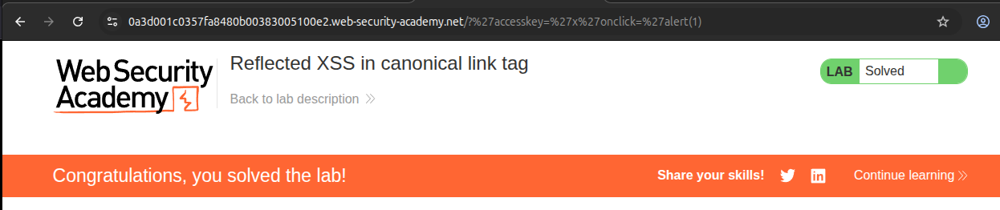
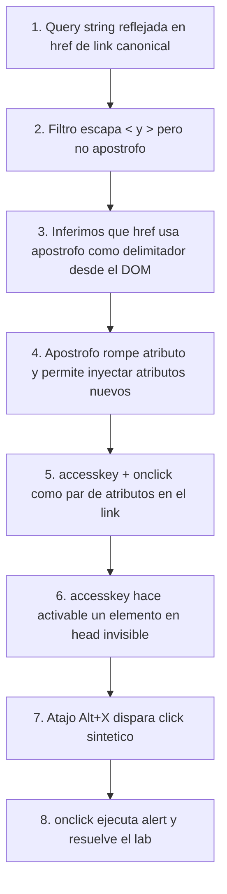

# Writeup: Reflected XSS into a canonical link tag (PortSwigger)

- **Lab**: Reflected XSS into a canonical link tag
- **URL**: https://portswigger.net/web-security/cross-site-scripting/contexts/lab-canonical-link-tag
- **Categoría**: XSS → Reflected → Contextos → Atributo (link tag en `<head>`)
- **Dificultad**: Practitioner

---

## 1. Objetivo

El home page del lab incluye un `<link rel="canonical">` cuyo `href` se construye reflejando la query string de la URL solicitada. El filtro **escapa `<` y `>`** (no se puede romper la etiqueta) pero **no escapa `'`**, y el atributo `href` se delimita con apóstrofos en el HTML que devuelve el servidor.

Para resolver el lab hay que **inyectar un atributo nuevo en el `<link>` que dispare `alert()`** sin poder romper la etiqueta.

### Lo que ya sabemos antes de tocar nada

- **Punto de inyección**: query string completa, reflejada dentro del `href` de un `<link rel="canonical">`.
- **Ubicación del tag**: dentro de `<head>`. Esto descarta payloads que dependen de visibilidad o de eventos de hover/scroll/etc. — el `<link>` no se renderiza en el documento.
- **Filtro**: angle brackets escapados → no podemos cerrar el `<link>` y abrir un `<script>` o `` nuevo. Toda la inyección tiene que vivir como **atributos del propio `<link>`**.
- **Pista del título**: "canonical link tag" — el lab gira en torno a un atributo dentro de un elemento que no responde a clicks/hover de manera natural.

---

## 2. Reconocimiento del contexto

### Reflexión benigna

Mandando un valor cualquiera:

```
https://lab/?test=foo
```

El `<head>` devuelto contiene:

```html
<link rel="canonical" href="https://lab/?test=foo">
```

Se confirma que la query string entera se concatena después de `?`. El filtro no toca caracteres ASCII normales.

### Probar el carácter de break-out

Para saber qué carácter rompe el atributo, hay que probar comilla simple y comilla doble por separado:

```
https://lab/?%27       (comilla simple)
https://lab/?%22       (comilla doble)
```

#### ⚠️ Trampa con DevTools — Elements panel mente

El **Elements panel de Chrome no muestra el HTML crudo del servidor**: muestra el **DOM ya parseado**, y **renormaliza** todos los atributos serializándolos con `"` aunque en el código fuente hubieran sido `'`. Eso confunde al diagnosticar el contexto.

| Vista | Refleja | Útil para |
|---|---|---|
| Elements panel (DevTools) | DOM tras parsear, atributos re-serializados con `"` | Ver la estructura final |
| **View Source (Ctrl+U)** | **Bytes literales del servidor** | **Diagnosticar XSS** |
| Network → Response | Bytes literales del servidor | Idem, pero más detalle |

Para esta clase de XSS reflexivo en atributos, **siempre View Source / Network → Response**, no Elements.

### Resultado real con `?'`

El Elements panel muestra:

```html
<link rel="canonical" href="https://lab/?" '>
```

El `'` aparece **fuera** del atributo `href`, como un atributo huérfano de valor vacío. Esto sólo es explicable de una forma: el HTML crudo del servidor delimita `href` con apóstrofos (no con comillas dobles), y el parser del navegador interpreta nuestro `'` como cierre del atributo. Es decir, el HTML real que sale del servidor es:

```html
<link rel='canonical' href='https://lab/?''>
```

Y el navegador lo parsea como:

- `href` (cerrado por el primer `'` del payload) = `https://lab/?`
- Un atributo huérfano llamado `'` con valor vacío

Para confirmar la inferencia de forma directa: View Source (Ctrl+U) o la pestaña Network → Response del DevTools enseñan los bytes literales del servidor con los `'` originales. El Elements panel no lo enseña porque renormaliza al serializar.

**Conclusión:** `'` rompe el atributo `href`. Tenemos primitivo para inyectar atributos nuevos al `<link>`.

---

## 3. Diseño del payload

Necesitamos un payload que cumpla tres cosas dentro del propio `<link>`:

1. **Cerrar el `href`** con `'`.
2. **Inyectar un atributo que vuelva al elemento "activable" pese a estar en `<head>`** (no se ve, no recibe hover, no recibe click natural).
3. **Adjuntar un manejador de evento** que ejecute `alert()` cuando el elemento se active.

### El atributo `accesskey` — la pieza clave

`accesskey` define una tecla rápida asociada al elemento. El comportamiento esperado al pulsarla, en navegadores modernos sobre elementos interactivos (botones, enlaces visibles, formularios), es:

1. El navegador enfoca el elemento.
2. Dispara un evento sintético de `click` sobre él.
3. Si el elemento tiene `onclick`, se ejecuta como JavaScript en el contexto de la página.

Sobre un `<link rel="canonical">` en `<head>` (un elemento **no interactivo**, no enfocable por defecto), el spec HTML5 **no garantiza** este comportamiento. Empíricamente Chrome sí dispara el `click` (y por tanto el `onclick`), por eso PortSwigger restringe la solución intencional a este navegador.

### Atajo de teclado por OS / navegador

Tabla compilada cruzando MDN y la propia documentación oficial del lab:

| Sistema | Navegador | Combinación para `accesskey="x"` | Fuente |
|---|---|---|---|
| Linux | Chrome | `Alt + X` | MDN + PortSwigger |
| Linux | Firefox | `Alt + Shift + X` o `Ctrl + Alt + X` | MDN |
| Windows | Chrome / Edge | `Alt + X` | MDN |
| Windows | Firefox | `Alt + Shift + X` | MDN |
| macOS | Chrome / Safari / Firefox | `Ctrl + Option + X` (= `Ctrl + Alt + X`) | MDN + PortSwigger |

> **Nota importante**: PortSwigger documenta explícitamente que **la solución intencional sólo funciona en Chrome**. Esto sugiere que la activación de `onclick` por `accesskey` sobre un `<link>` en `<head>` (un elemento no-interactivo) es comportamiento empírico de Chrome, no un comportamiento garantizado por el spec HTML5. Firefox y Safari pueden no disparar `click` sintético al activar el accesskey en este caso. Curiosidad: la propia guía de PortSwigger lista para Windows `ALT+SHIFT+X`, que es el shortcut de Firefox, no el de Chrome — inconsistencia en su doc.

### Payload final

```
'accesskey='x'onclick='alert(1)
```

URL completa:

```
https://lab/?'accesskey='x'onclick='alert(1)
```

(En la URL bar las comillas simples van literales; el navegador las codifica a `%27` solo si lo prefieres.)

---

## 4. Por qué funciona — parsing detallado

El servidor concatena ingenuamente la query string en la plantilla:

```python
# pseudocódigo del backend
canonical_html = "<link rel='canonical' href='https://lab/?" + user_input + "'>"
```

Con `user_input = "'accesskey='x'onclick='alert(1)"`, el HTML crudo emitido es:

```html
<link rel='canonical' href='https://lab/?'accesskey='x'onclick='alert(1)'>
```

El parser HTML del navegador procesa los apóstrofos como delimitadores de atributo. Cada `'` alterna entre "abrir valor" y "cerrar valor":

```
<link rel='canonical' href='https://lab/?'accesskey='x'onclick='alert(1)'>
                          ↑              ↑          ↑ ↑          ↑       ↑
                          1              2          3 4          5       6
```

| # | Rol del `'` |
|---|---|
| 1 | Abre `href` |
| 2 | Cierra `href`. Valor = `https://lab/?` |
| 3 | Abre `accesskey` |
| 4 | Cierra `accesskey`. Valor = `x` |
| 5 | Abre `onclick` |
| 6 | Cierra `onclick`. Valor = `alert(1)` |

DOM final:

```
<link rel="canonical"
      href="https://lab/?"
      accesskey="x"
      onclick="alert(1)">
```

Tag bien formado, tres atributos legítimos. Cuando el usuario pulsa `Alt+X` (Chrome/Linux), el navegador enfoca el `<link>`, dispara click sintético, ejecuta `onclick="alert(1)"` y salta el alert. Lab resuelto.

> **Referencia al spec**: el comportamiento "después de un atributo cerrado, encuentro otro caracter no-whitespace y lo trato como inicio de un nuevo atributo" está en WHATWG HTML Living Standard, sección "After attribute value (quoted) state": el caso "Anything else" emite un parse error `missing-whitespace-between-attributes` y reconsume el carácter en estado "before attribute name". Es lo que permite que `'href='...'accesskey='...` parsee como dos atributos separados sin necesidad de espacio entre ellos.

### Por qué el filtro de `<` `>` no salva al servidor

El filtro pensó en bloquear "salida de etiqueta" (no abrir `<script>` nuevos), pero **olvidó que el delimitador del atributo donde reflejaba era `'`**. Cualquier carácter que sea sintaxis del contexto donde escribes input es un primitivo de inyección — no basta con escapar lo "obvio". Aquí los caracteres significativos del contexto eran:

- `<` `>` → escapados ✅
- `'` → delimitador del atributo donde se reflejaba el input → **NO escapado** ❌

---

## 5. Resolución

URL final cargada en el navegador:

```
https://0a3d001c0357fa8480b00383005100e2.web-security-academy.net/?%27accesskey=%27x%27onclick=%27alert(1)
```

Pulsar `Alt+X` (Chrome en Linux) → salta `alert(1)` → lab marcado como **Solved**.

> **Restricción de navegador**: PortSwigger documenta que "the intended solution to this lab is only possible in Chrome". El payload se inyecta igual en cualquier navegador, pero la activación por accesskey sobre un `<link>` en `<head>` está confirmada en Chrome y no garantizada en Firefox/Safari.



---

## 6. Resumen de la cadena



Tres ideas que llevarse:

1. **El contexto manda**. La misma "regla" (escapar `<>`) que basta en cuerpo HTML es insuficiente dentro de un atributo: ahí el delimitador (`'` o `"`) también es sintaxis activa y hay que escaparlo.
2. **Elements panel ≠ HTML crudo**. Para diagnosticar XSS de atributo, View Source o la pestaña Response. El panel renormaliza apóstrofos a comillas dobles y oculta el primitivo.
3. **`accesskey` + `onclick` es el patrón canónico para XSS en elementos no-visibles** (head, hidden, off-screen). Convierte el ataque de "auto-disparable" a "requiere interacción del usuario", pero PortSwigger considera resuelto el lab si se ejecuta el alert tras la pulsación de tecla. Con un poco de social engineering ("pulsa Alt+X para continuar") se vuelve viable en la práctica.

---

## 7. Contramedidas

Defensas en orden de robustez:

1. **Output encoding consciente del contexto**. Codificar **todos** los caracteres con significado sintáctico en el contexto donde se inserta input. Para un atributo HTML eso incluye, como mínimo: `<` `>` `&` `"` `'`. Frameworks modernos (Jinja, Django, Razor, etc.) lo hacen por defecto si declaras correctamente que el dato va en un atributo.
2. **Elegir delimitador y comprometerse**. Si el template usa `href='...'`, escapar `'` (a `&#39;` o `&apos;`); si usa `href="..."`, escapar `"`. Mejor: que el motor de templates lo gestione, no escribirlo a mano.
3. **No reflejar la URL/query bruta en `<link rel="canonical">`**. El canonical debería ser una URL **fija o derivada server-side de un allow-list de paths conocidos**, no la query string del usuario. Usuarios maliciosos pueden meter cualquier cosa ahí.
4. **Content Security Policy (CSP)**. Una política estricta con `script-src` sin `'unsafe-inline'` bloquea la ejecución de manejadores `onclick` inline aunque el atacante consiga inyectarlos. Defensa en profundidad efectiva contra esta clase de XSS.
5. **Trusted Types** (Chrome/Edge). Obliga a que cualquier asignación a sinks peligrosos pase por una factoría auditable. Útil en aplicaciones nuevas; no aplica directamente al server-side rendering pero sí mitiga DOM XSS relacionado.

---

## 8. Referencias

- PortSwigger Web Security Academy. (s.f.). *Lab: Reflected XSS into a canonical link tag*. https://portswigger.net/web-security/cross-site-scripting/contexts/lab-canonical-link-tag
- PortSwigger Web Security Academy. (s.f.). *Cross-site scripting contexts*. https://portswigger.net/web-security/cross-site-scripting/contexts
- WHATWG. (s.f.). *HTML Living Standard — Attribute value (single-quoted) state*. https://html.spec.whatwg.org/multipage/parsing.html#attribute-value-(single-quoted)-state
- MDN Web Docs. (s.f.). *accesskey — global attribute*. https://developer.mozilla.org/en-US/docs/Web/HTML/Reference/Global_attributes/accesskey
- OWASP Foundation. (s.f.). *Cross Site Scripting Prevention Cheat Sheet*. https://cheatsheetseries.owasp.org/cheatsheets/Cross_Site_Scripting_Prevention_Cheat_Sheet.html
- Inventario interno: [`inventario/03-analisis-vulnerabilidades/web/analisis-xss.md`](../../../inventario/03-analisis-vulnerabilidades/web/analisis-xss.md)
