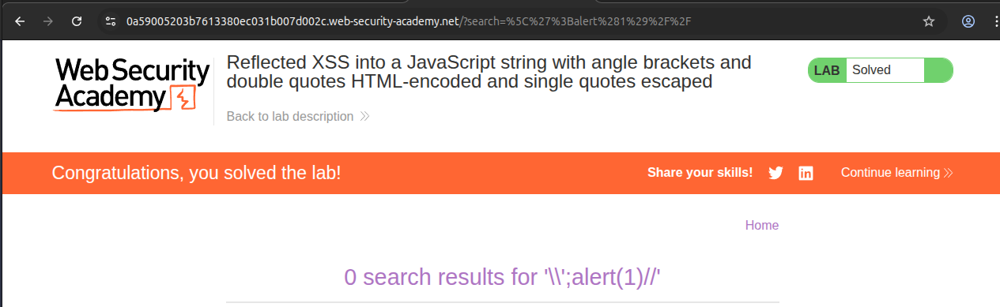
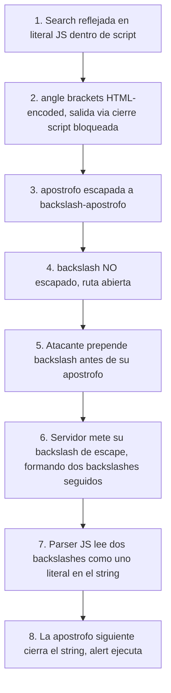

# Writeup: Reflected XSS into a JavaScript string with angle brackets and double quotes HTML-encoded and single quotes escaped (PortSwigger)

- **Lab**: Reflected XSS into a JavaScript string with angle brackets and double quotes HTML-encoded and single quotes escaped
- **URL**: https://portswigger.net/web-security/cross-site-scripting/contexts/lab-javascript-string-angle-brackets-double-quotes-encoded-single-quotes-escaped
- **Categoría**: XSS, Reflected, Contextos, JavaScript string dentro de `<script>`
- **Dificultad**: Practitioner

---

## 1. Objetivo

Mismo contexto que el lab anterior (búsqueda reflejada dentro de `var searchTerms = '...'` en un `<script>` inline), pero con un set de protecciones distinto. El título declara tres medidas:

- `<` y `>` HTML-encoded.
- `"` HTML-encoded.
- `'` escapado a `\'`.

El título omite, deliberadamente, qué pasa con `\`. Esa omisión es la pista más importante.

Para resolver el lab hay que ejecutar `alert()` rompiendo el string JS desde dentro, ya que las protecciones `<` y `>` cierran la salida vía `</script>` que era el bypass del lab anterior.

### Diferencia respecto al lab "single quote and backslash escaped"

Este lab y el [anterior](../reflected-xss-js-string-sq-backslash-escaped/writeup.md) son intencionalmente complementarios. Comparten contexto idéntico, lo único que cambia es el set de escapes activos:

| Caracter | Lab "sq + backslash escaped" | Este lab |
|---|---|---|
| `<` `>` | sin tocar | HTML-encoded |
| `'` | escapado | escapado |
| `\` | **escapado** | **NO escapado** |
| Salida que funcionaba | `</script>` rompiendo el bloque HTML | bypass del backslash desde dentro del string |

Cada lab cierra exactamente la salida que el otro abre. Es el mismo contexto JS-en-HTML auditado con dos políticas de escape distintas, y enseña que **escapar parcialmente nunca es suficiente, sólo la combinación cierra todas las salidas**.

---

## 2. Reconocimiento

Se hacen tres sondeos atómicos, uno por carácter, antes de tirar payloads compuestos.

### Sondeo 1: angle brackets

Búsqueda: `holamundo<`

Reflejo:
```js
var searchTerms = 'holamundo<';
```

Confirmado: `<` se HTML-encodea. El parser HTML al recorrer el `<script>` en *script data state* no ve un `<` de verdad, ve la secuencia de caracteres `&` `l` `t` `;`. No hay match con `</`, no entra en *script data less-than sign state*, no cierra el bloque. **La salida del lab anterior está cerrada.**

Verificable también probando el payload del lab anterior literal:
```
</script><script>alert(1)</script>
```
Que se refleja como:
```js
var searchTerms = '&lt;/script&gt;&lt;script&gt;alert(1)&lt;/script&gt;';
```
Texto inerte dentro del string JS.

### Sondeo 2: comilla simple

Búsqueda: `holamundo'`

Reflejo:
```js
var searchTerms = 'holamundo\'';
```

Tu `'` aparece como `\'`. Misma protección que el lab anterior. La salida directa rompiendo el string con `'` está cerrada.

### Sondeo 3: backslash (el decisivo)

Búsqueda: `holamundo\`

Reflejo:
```js
var searchTerms = 'holamundo\';
```

Tu `\` aparece **literal**, sin duplicar. Esto es lo que cambia el lab. Bonus didáctico: ese `\` único, sin payload alrededor, ya rompe el JS de la página, porque el `\` se come la `'` de cierre del template, dejando el string sin terminar y produciendo `SyntaxError` al cargar. Ese efecto es exactamente la base del bypass: si un `\` solo come la `'` siguiente, dos `\` consecutivos se neutralizan entre sí (escape de escape) y dejan la siguiente `'` viva. Es lo que vamos a explotar.

---

## 3. La idea del bypass: escape de escape

El filtro server-side hace dos pasadas separadas (al menos lógicamente):

1. Sustituye `'` por `\'`.
2. NO toca `\`.

La asimetría: el filtro asume que prepender un `\` antes de cada `'` neutraliza la comilla. Cierto **si** además neutralizas tus propios backslashes, porque si no, el atacante puede prepender él mismo un `\` que se "trague" el `\` del filtro.

Concretamente:

| Atacante envía | Filtro escapa | Reflejo en JS | Parser JS lee |
|---|---|---|---|
| `';alert(1)//` | `'` a `\'` | `'\';alert(1)//'` | `\'` apóstrofo literal dentro del string. **No cierra.** |
| `\';alert(1)//` | `'` a `\'` (no toca `\`) | `'\\';alert(1)//'` | `\\` un backslash literal dentro del string, **`'` cierra el string**, `;alert(1)` ejecutable, `//` comenta el resto. **Sale.** |

El parser JS, al ver `\\`, interpreta los dos backslashes como una sola secuencia de escape con valor "un backslash literal". La `'` siguiente queda libre para terminar el string. Es la inversa exacta de lo que el filtro pretendía: el filtro mete un `\` para escapar la `'`, el atacante mete otro `\` antes para que ese `\` del filtro se vuelva el segundo de un par `\\`, anulándolo como mecanismo de escape.

Si el filtro **también** escapase `\` (sustituyéndolo por `\\`), tu `\` se reflejaría como `\\` y el de la `'` que sigue se mantendría, formando `\\\\\'` en el HTML, que JS leería como dos backslashes literales más una apóstrofo escapada. Sigue dentro del string. Por eso el lab anterior cerraba esta ruta.

---

## 4. Payload y por qué funciona

Búsqueda enviada:

```
\';alert(1)//
```

Procesamiento server-side:
- `\` no se toca, queda como `\`.
- `'` se escapa a `\'`.
- `;alert(1)//` no contiene caracteres especiales para el filtro, queda como está.

Reflejo dentro del template:
```js
var searchTerms = '\\';alert(1)//';
```

Recorrido del parser JS, token a token:

| Token | Estado del parser | Significado |
|---|---|---|
| `'` | Inicio del literal | Abre el string |
| `\\` | Dentro del literal | Secuencia de escape, valor es un backslash literal en el contenido del string |
| `'` | Fin del literal | Cierra el string. Valor de `searchTerms`: `"\"` (un backslash) |
| `;` | Sentencia | Termina la asignación |
| `alert(1)` | Sentencia nueva | Llamada a función. Salta el alert |
| `//` | Comentario | Hasta fin de línea, se come el `';` que queda detrás |

El `';` final del template (que normalmente cerraba la sentencia de asignación) cae dentro del comentario, así que no genera SyntaxError. El parser JS termina su trabajo limpio, ejecuta `alert(1)`, lab solved.

### Variante oficial de PortSwigger

PortSwigger documenta el payload `\'-alert(1)//`. La diferencia con el de `;` es cosmética: en lugar de terminar la asignación de `searchTerms` y ejecutar `alert` como sentencia nueva, lo evalúa como parte de la propia asignación usando el operador `-`:

```js
var searchTerms = '\\'-alert(1)//';
```

Que JS lee como:
```js
var searchTerms = ('\\') - alert(1);
```

`'\\'` es un string con un backslash, `alert(1)` se ejecuta y devuelve `undefined` (lo que se convierte a `NaN` en operación numérica), `string - NaN` da `NaN`. La asignación termina con `searchTerms = NaN`. El alert se ejecuta como efecto colateral del operador `-`. Funcionalmente equivalente a la variante con `;`. Es preferencia estilística.

---

## 5. Resolución

URL final cargada en el navegador:

```
https://0a59005203b7613380ec031b007d002c.web-security-academy.net/?search=%5C%27%3Balert%281%29%2F%2F
```

Decodificada: `?search=\';alert(1)//`

Al cargar la página: salta `alert(1)`. Lab marcado como **Solved**.



---

## 6. Resumen de la cadena



Tres ideas para llevarse:

1. **Escapar parcialmente es como cerrar tres puertas y dejar una abierta.** En este lab, escapar `'`, `<`, `>`, `"` cubre cuatro vectores, pero olvidarse de `\` deja entrar al atacante por la quinta. La defensa por enumeración de chars peligrosos siempre tiene este riesgo. Defensa correcta: enumerar los chars **seguros** (allow-list) o usar codificadores idiomáticos en el lenguaje (JSON.stringify, json_encode) que conocen todos los meta-caracteres.
2. **El backslash es siempre meta-carácter en strings JS.** Ignorarlo al escapar es el error clásico. Cualquier escape de strings JS robusto debe procesar `\` antes que `'` y `"`, no después.
3. **Comparar este lab con el anterior es la lección de fondo.** Tienen contextos idénticos y sólo difieren en qué chars escapan. Los dos labs juntos demuestran que la combinación correcta es: escapar `\`, `'`, `<`, `>`. Quitar cualquiera de esos cuatro abre una ruta. PortSwigger los pone en orden para que el alumno reconstruya el principio "escape consciente del contexto que cubre todos los meta-caracteres del contexto".

---

## 7. Contramedidas

Las mismas que en el lab anterior, con énfasis en la lección específica de éste:

1. **No reflejar input no confiable dentro de `<script>` inline.** Patrón estructural: meter el dato en un atributo `data-*` con HTML-escaping y leerlo en cliente con `element.dataset.x`. Saca al input del contexto JS por completo.
2. **Si tiene que ir en JS inline, escapar TODOS los meta-caracteres del contexto.** El set mínimo es: `\` (debe procesarse primero o se neutralizan los siguientes), `'`, `"`, `<`, `>`, `&`, salto de línea, retorno de carro, tab. Saltarse cualquiera de estos abre alguna ruta de bypass conocida. La regla: si dudas si un caracter es meta, encódealo a `\xXX` o `\uXXXX`.
3. **Usar `JSON.stringify` o `json_encode` server-side y deserializar en cliente con `JSON.parse`.** Patrón:
   ```html
   <script>
       var searchTerms = JSON.parse(<%= h(json_encode(input)) %>);
   </script>
   ```
   Los serializadores JSON robustos escapan `\`, `'`, `"`, `<`, `>`, `&` a su forma `\uXXXX`, eliminando todas las rutas a la vez. Es la defensa más simple y la más robusta.
4. **Content Security Policy con `'unsafe-inline'` deshabilitado.** Aunque el atacante consiga inyectar JavaScript, la CSP impide que se ejecute si no tiene nonce o hash válidos. No protege la asignación a `searchTerms`, pero el `alert(1)` que se ejecuta como sentencia nueva sí está dentro del bloque inline y queda sometido a la política. En la práctica, cualquier intento de XSS basado en inyectar código a un script inline existente cae bajo la misma CSP que protege contra `<script>` inyectados.
5. **Linters / herramientas estáticas que detecten reflejos directos a `<script>`.** En revisiones de código y CI, marcar cualquier patrón de string concatenado dentro de un literal JS dentro de un `<script>` como sospechoso obliga a que el desarrollador lo justifique o lo migre al patrón seguro.

### Anti-patrón observado en este lab

El backend implementa lo que parece "escape de strings JS" sustituyendo `'` por `\'`. Pero olvida el primer paso obligatorio en cualquier escape de strings: **antes de escapar comillas, escapar backslashes**. La regla operacional es:

```
escape(input) = input
    .replace(/\\/g, '\\\\')   // primero, doblar backslashes
    .replace(/'/g, "\\'")     // después, escapar comillas
    .replace(/"/g, '\\"')
    .replace(/</g, '\\x3c')   // y los chars HTML por si acaso
    .replace(/>/g, '\\x3e')
```

El orden importa. Si haces primero las comillas y después los backslashes, escapas también los `\` que añadiste tú mismo, lo que es inocuo pero ineficiente. Si haces sólo las comillas y omites los backslashes, abres este lab.

---

## 8. Referencias

- PortSwigger Web Security Academy. (s.f.). *Lab: Reflected XSS into a JavaScript string with angle brackets and double quotes HTML-encoded and single quotes escaped*. https://portswigger.net/web-security/cross-site-scripting/contexts/lab-javascript-string-angle-brackets-double-quotes-encoded-single-quotes-escaped
- PortSwigger Web Security Academy. (s.f.). *Cross-site scripting contexts*. https://portswigger.net/web-security/cross-site-scripting/contexts
- ECMA International. (2024). *ECMA-262, String Literals, Section 12.9.4*. https://tc39.es/ecma262/#sec-literals-string-literals
- OWASP Foundation. (s.f.). *Cross Site Scripting Prevention Cheat Sheet, Output Encoding for JavaScript Contexts*. https://cheatsheetseries.owasp.org/cheatsheets/Cross_Site_Scripting_Prevention_Cheat_Sheet.html#output-encoding-for-javascript-contexts
- Writeup hermano del lab anterior: [`learning/portswigger/reflected-xss-js-string-sq-backslash-escaped/writeup.md`](../reflected-xss-js-string-sq-backslash-escaped/writeup.md)
- Inventario interno: [`inventario/03-analisis-vulnerabilidades/web/analisis-xss.md`](../../../inventario/03-analisis-vulnerabilidades/web/analisis-xss.md)
