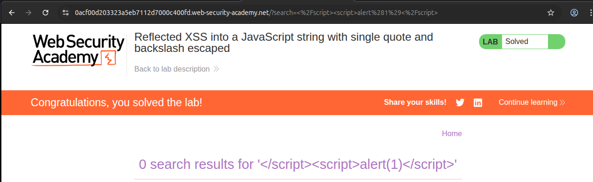
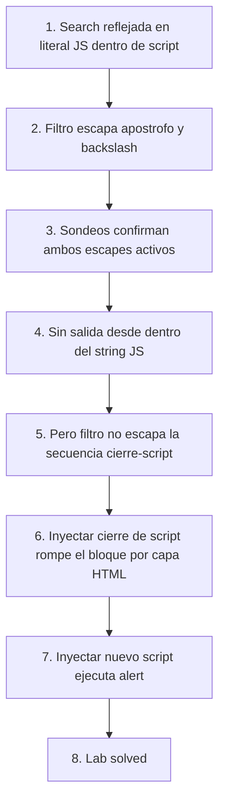

# Writeup: Reflected XSS into a JavaScript string with single quote and backslash escaped (PortSwigger)

- **Lab**: Reflected XSS into a JavaScript string with single quote and backslash escaped
- **URL**: https://portswigger.net/web-security/cross-site-scripting/contexts/lab-javascript-string-single-quote-backslash-escaped
- **Categoría**: XSS, Reflected, Contextos, JavaScript string dentro de `<script>`
- **Dificultad**: Practitioner

---

## 1. Objetivo

El lab refleja la query de búsqueda del usuario dentro de un literal de string en JavaScript que vive en un bloque `<script>` del home page. El servidor aplica dos protecciones contra inyección desde dentro del string: escapa `'` (a `\'`) y escapa `\` (a `\\`). En teoría, esto debería bastar para evitar XSS desde ese punto.

Para resolver el lab hay que ejecutar `alert()` en la página, lo que requiere romper la barrera del string a pesar de las protecciones.

### Contexto exacto del reflejo

Observado en View Source:

```html
<script>
    var searchTerms = 'A search term';
    document.write('');
</script>
```

La búsqueda del usuario aterriza en lugar de `A search term` (la primera línea). El segundo bloque, el `` con `tracker.gif`, no es el punto de inyección, es resultado del `document.write` que se ejecuta en el cliente.

### Lo que ya sabemos antes de tocar nada

- **Punto de inyección**: dentro de un literal `'...'` de JavaScript dentro de `<script>`.
- **Protecciones declaradas por el título**: `'` escapado, `\` escapado. Hay que verificarlo, no aceptarlo a ciegas.
- **Pista del título**: el patrón clásico de break-out vía `\` para neutralizar el escape de `'` no va a funcionar, porque `\` también está escapado. Hace falta otra ruta de salida.

---

## 2. Reconocimiento del contexto

### Sondeo 1: comilla simple

Búsqueda: `holamundo'`

Reflejo en HTML:

```html
<script>
    var searchTerms = 'holamundo\'';
    ...
</script>
```

Tu `'` aparece como `\'`. Dentro del string queda como apóstrofo literal, no cierra. Confirmado: **el escape de comilla simple está activo**.

### Sondeo 2: backslash

Búsqueda: `holamundo\`

Reflejo:

```html
<script>
    var searchTerms = 'holamundo\\';
    ...
</script>
```

Tu `\` aparece como `\\`. Dentro del string queda como un backslash literal, no como un escape de algo. Confirmado: **el escape de backslash también está activo**.

### Por qué los dos sondeos juntos cierran la salida "por dentro"

Si sólo estuviese escapada la comilla, el bypass clásico es metér un backslash que se coma el escape:

| Input | Reflejado como (sólo `'` escapado) | El parser JS lee |
|---|---|---|
| `\';alert(1);//` | `'\\';alert(1);//'` | `\\` = backslash literal, **`'` cierra el string**, `;alert(1);//` es código ejecutable |

Pero si **además** se escapa `\`:

| Input | Reflejado como (`'` y `\` escapados) | El parser JS lee |
|---|---|---|
| `';alert(1);//` | `'\';alert(1);//'` | `\'` = apóstrofo literal, todo lo demás dentro del string. No sale. |
| `\';alert(1);//` | `'\\\';alert(1);//'` | `\\` = backslash literal, `\'` = apóstrofo literal. No sale. |
| `\\';alert(1);//` | `'\\\\\';alert(1);//'` | dos backslashes literales, comilla escapada. No sale. |

Conclusión: **dentro del literal JS estamos atrapados**. La salida no es por dentro.

---

## 3. La salida: dos parsers en serie

La intuición clave del lab:

> El reflejo está en un `<script>`, pero `<script>` es un elemento HTML antes que un contenedor de JavaScript. Hay **dos parsers actuando en serie** sobre el documento.

1. El **parser HTML** procesa el documento primero. Cuando entra a `<script>`, conmuta a un modo especial llamado **"script data state"** (WHATWG HTML Living Standard). En ese estado simplemente acumula caracteres hasta que encuentra una secuencia que parece un end tag: `</` seguido de un nombre que matchea el del elemento abierto. **No le importa la sintaxis JS**: no sabe lo que es un string, una comilla, ni un escape.
2. Cuando el parser HTML cierra el `<script>` al ver `</script>`, **entrega el contenido acumulado al motor JavaScript** para que lo ejecute. Sólo entonces empieza el parser JS.

### La asimetría que se explota

El filtro server-side escapa `'` y `\` porque su modelo mental es "estoy metiendo input dentro de un string JS, neutralizo la sintaxis JS de cierre de string". Razonable. Pero **no escapa `<` ni `>` ni la secuencia `</script>`**, porque desde la lente del filtro esos caracteres no son sintaxis JS de cierre de string. Y tiene razón en que no lo son. **Pero sí son sintaxis HTML del bloque `<script>` que contiene al string.** El filtro está pensando en una capa, el atacante ataca la capa de arriba.

Esto significa que si el input contiene `</script>` literal, el parser HTML cierra el bloque ahí mismo, **antes** de que el motor JS vea nada. Lo que quede después del `</script>` queda fuera del bloque, y se procesa como HTML normal: si es otro `<script>`, se ejecuta como un script independiente.

---

## 4. Payload y por qué funciona

Búsqueda:

```
</script><script>alert(1)</script>
```

El servidor lo refleja sin modificar (ni `'` ni `\` aparecen en el payload, los filtros no se disparan). El HTML resultante:

```html
<script>
    var searchTerms = '</script><script>alert(1)</script>';
    document.write(...);
</script>
```

Recorrido del parser HTML, paso a paso:

1. Ve `<script>` y entra en *script data state*.
2. Acumula caracteres en buffer interno: `\n    var searchTerms = '`.
3. Llega a `<`. Entra en *script data less-than sign state*.
4. Llega a `/`. Entra en *script data end tag open state*.
5. Lee `script`. Hace match con el nombre del elemento abierto.
6. Llega a `>`. **Cierra el primer bloque `<script>`.** Su contenido es: `var searchTerms = '`.
7. El motor JS recibe ese contenido. Es JavaScript inválido (string literal sin cerrar). Lanza `SyntaxError`. **No ejecuta nada de ese script, pero tampoco aborta el resto de la página.**
8. El parser HTML continúa. Lee `<script>alert(1)</script>` y lo procesa como un nuevo bloque `<script>` independiente.
9. El motor JS recibe `alert(1)`, lo ejecuta. **Salta el alert. Lab resuelto.**
10. Detrás queda `';\n    document.write(...);\n</script>`. El parser HTML lo procesa como texto del documento. El `';` se renderiza como caracteres en la página. El `</script>` final del template intenta cerrar un bloque que ya no está abierto y es ignorado. El resto se queda como contenido del body.

### Visualización del corte

```
HTML que ve el parser:                    Lo que el parser hace:

<script>                                  ── abre bloque
    var searchTerms = '                   ── acumula contenido JS (sin parsear JS)
</script>                                 ── ¡cierra bloque! contenido JS = "var searchTerms = '"
                                          ── motor JS recibe contenido, lanza SyntaxError, sigue
<script>alert(1)</script>                 ── nuevo bloque, alert(1) ejecuta
';                                        ── texto del documento
    document.write(...);                  ── texto del documento
</script>                                 ── ignorado, no hay bloque abierto
```

### Por qué los escapes del filtro no aplican

Crucialmente, el filtro escapa `'` y `\` que aparecen **dentro del input**. Nuestro payload `</script><script>alert(1)</script>` no contiene `'` ni `\`. El filtro no tiene nada que escapar. Pasa intacto. El servidor probablemente está haciendo algo equivalente a:

```python
# pseudocódigo del backend
search_terms = user_input.replace("\\", "\\\\").replace("'", "\\'")
html = f"<script>\n    var searchTerms = '{search_terms}';\n    ...\n</script>"
```

Lo que escapa caracteres especiales para JS strings, pero no para HTML. Esa diferencia es la vulnerabilidad.

---

## 5. Resolución

URL final cargada en el navegador:

```
https://0acf00d203323a5eb7112d7000c400fd.web-security-academy.net/?search=%3C%2Fscript%3E%3Cscript%3Ealert%281%29%3C%2Fscript%3E
```

Que decodificado es: `?search=</script><script>alert(1)</script>`.

Al cargar la página: salta `alert(1)`. Lab marcado como **Solved**.



---

## 6. Resumen de la cadena



Tres ideas para llevarse:

1. **El contexto es jerárquico, no plano**. Un literal JS dentro de `<script>` está envuelto por dos parsers, no uno. Escapar la sintaxis del parser interno (JS string) deja la del externo (HTML script data state) sin tocar.
2. **`</script>` es la salida universal de JS-en-HTML**. Mientras el filtro no escape `<`, `>` o específicamente la secuencia `</script>`, este patrón funciona en cualquier reflejo dentro de un bloque `<script>`, sin importar cómo sea de robusto el escape de strings JS.
3. **Sondeos atómicos antes del payload**. Probar `'` y `\` por separado, no juntos. Aunque el título lo declare, observarlo te entrena a no creer la propaganda del lab y a desarrollar la habilidad de validar protecciones en la vida real.

---

## 7. Contramedidas

Defensas en orden de robustez:

1. **No reflejar input no confiable dentro de `<script>` inline**. La defensa estructural: si el dato debe ir al cliente, ponerlo en un atributo `data-*` de HTML (con HTML-escaping) y que el JS lo lea desde ahí con `document.querySelector(...).dataset.x`. Eso saca el reflejo del contexto JS por completo.
2. **Si tiene que ir en JS inline, codificar para JS string Y para HTML**. Es decir, además de escapar `'` y `\`, **escapar `<` (a `<` o `\x3c`) y `>` (a `>` o `\x3e`)**. Con `<` codificado como `<`, la secuencia `</script>` nunca se forma como bytes literales en el HTML, así que el parser HTML no la detecta. El parser JS sí ve `</script>` que es un string normal sin significado especial.
3. **JSON-encode el dato y leerlo con `JSON.parse`**. Patrón idiomático: `var searchTerms = JSON.parse('<%= json_encode(input) %>');`. Los serializadores JSON robustos escapan `<`, `>`, `&`, `'`, `"` y backslash a sus formas `\uXXXX`, eliminando la posibilidad de break-out por cualquier vía.
4. **Content Security Policy (CSP) sin `'unsafe-inline'`**. Si el script inyectado viene con `<script>` inline, una CSP estricta sin `'unsafe-inline'` lo bloquea sin importar que el atacante haya conseguido inyectarlo. El primer `<script>` legítimo de la página seguiría funcionando si tiene nonce o hash; el inyectado por el atacante no, porque no los tiene.
5. **Trusted Types**. No aplica directamente al reflected XSS server-side, pero mitiga DOM-based XSS adyacente que pueda existir en la misma aplicación.

### Anti-patrón frecuente

Un error común al intentar arreglar este lab a mano es escapar **sólo** `<` y `>` literales en el input (HTML escaping), sin tocar el escape JS. Eso protege contra `</script>` directo, pero abre una vulnerabilidad nueva: si el input es `';alert(1);//`, el HTML escaping no toca nada (no hay `<` ni `>`) y el escape JS no se aplica si no se hizo. Hay que aplicar **ambas** capas, en el orden correcto, no elegir una.

---

## 8. Referencias

- PortSwigger Web Security Academy. (s.f.). *Lab: Reflected XSS into a JavaScript string with single quote and backslash escaped*. https://portswigger.net/web-security/cross-site-scripting/contexts/lab-javascript-string-single-quote-backslash-escaped
- PortSwigger Web Security Academy. (s.f.). *Cross-site scripting contexts*. https://portswigger.net/web-security/cross-site-scripting/contexts
- WHATWG. (s.f.). *HTML Living Standard, Script data state*. https://html.spec.whatwg.org/multipage/parsing.html#script-data-state
- OWASP Foundation. (s.f.). *Cross Site Scripting Prevention Cheat Sheet, Output Encoding for JavaScript Contexts*. https://cheatsheetseries.owasp.org/cheatsheets/Cross_Site_Scripting_Prevention_Cheat_Sheet.html#output-encoding-for-javascript-contexts
- Inventario interno: [`inventario/03-analisis-vulnerabilidades/web/analisis-xss.md`](../../../inventario/03-analisis-vulnerabilidades/web/analisis-xss.md)
