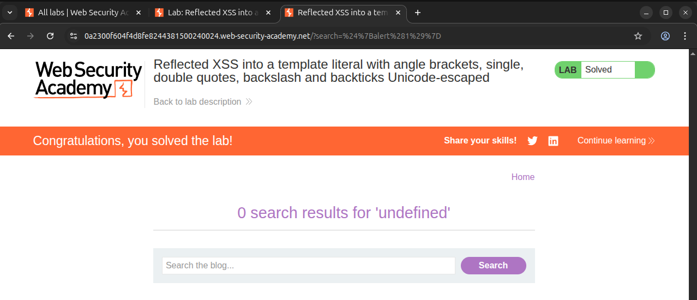
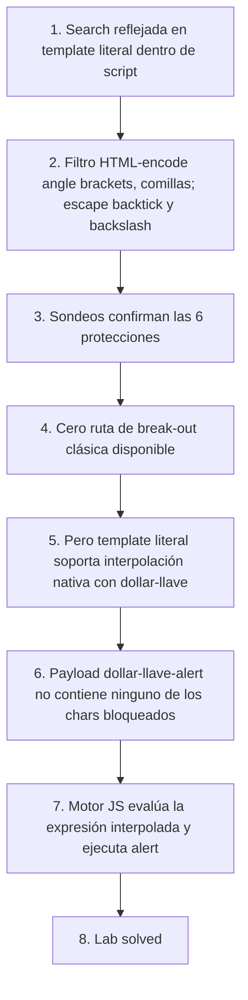

# Writeup: Reflected XSS into a JavaScript template literal with angle brackets, single, double quotes, backslash and backticks Unicode-escaped (PortSwigger)

- **Lab**: Reflected XSS into a JavaScript template literal with angle brackets, single, double quotes, backslash and backticks Unicode-escaped
- **URL**: https://portswigger.net/web-security/cross-site-scripting/contexts/lab-javascript-template-literal-angle-brackets-single-double-quotes-backslash-backticks-escaped
- **Categoría**: XSS, Reflected, Contextos, Template literal de JavaScript dentro de `<script>`
- **Dificultad**: Practitioner

---

## 1. Objetivo

La búsqueda del usuario se refleja dentro de un **template literal** de JavaScript (delimitado por backticks `` ` ``) en un bloque `<script>` del home page. El servidor aplica una batería agresiva de protecciones que cubre todos los puntos de fuga clásicos de XSS:

- `<` y `>` HTML-encoded.
- `'` y `"` HTML-encoded.
- `` ` `` (backtick) escapado.
- `\` (backslash) escapado.

Para resolver el lab hay que ejecutar `alert(...)` **dentro del propio template literal**, sin romper la cadena ni inyectar tags HTML adicionales.

### Contexto exacto del reflejo

Forma observada (View Source del home):

```html
<script>
    var searchTerms = `<USER_INPUT>`;
    document.write('');
</script>
```

La búsqueda aterriza en `<USER_INPUT>`, dentro de los backticks. El bloque `` con `tracker.gif` se renderiza después en cliente vía `document.write` y no es punto de inyección.

### Lo que ya sabemos antes de tocar nada

- **Punto de inyección**: dentro de un template literal `` `...` `` dentro de `<script>`.
- **Container nuevo**: a diferencia del lab hermano ([`reflected-xss-js-string-sq-backslash-escaped`](../reflected-xss-js-string-sq-backslash-escaped/writeup.md)), aquí el string NO es `'...'` sino `` `...` ``. Esa diferencia es central.
- **Pista del título**: con `<`, `>`, `` ` ``, `\`, `'`, `"` todos neutralizados, las dos rutas clásicas están bloqueadas:
  - **Salir del bloque `<script>` por capa HTML** (la solución del lab hermano vía `</script><script>...`): bloqueada porque `<` y `>` están HTML-encoded.
  - **Cerrar el string por dentro y concatenar JS** (clásico de strings JS): bloqueada porque `` ` ``, `'`, `"` y `\` están todos escapados.
- **La única arista que el filtro NO puede neutralizar sin romper el container**: la sintaxis interna del template literal, que es **parte del lenguaje** y no requiere ninguno de los caracteres bloqueados.

---

## 2. Reconocimiento del contexto

### Sondeos atómicos para confirmar las protecciones

Una búsqueda por carácter en lugar de aceptar el título a ciegas. Reflejos observados en View Source:

| Input | Reflejado como | Confirma |
|---|---|---|
| `holamundo<` | `` `holamundo&lt;` `` | `<` HTML-encoded |
| `holamundo>` | `` `holamundo&gt;` `` | `>` HTML-encoded |
| `holamundo'` | `` `holamundo&#39;` `` | `'` HTML-encoded |
| `holamundo"` | `` `holamundo&#34;` `` | `"` HTML-encoded |
| `` holamundo` `` | `` `holamundo\`` `` | `` ` `` escapado a `\` ` |
| `holamundo\` | `` `holamundo\\` `` | `\` escapado a `\\` |

Las seis rutas tradicionales de break-out están cerradas. Pero observa qué NO probamos: `$` y `{`.

### Por qué `$` y `{` son la grieta

El filtro fue diseñado pensando en **dos categorías** de input peligroso:

1. Caracteres que rompen el string actual (delimitadores: `` ` `` `'` `"`, escape: `\`).
2. Caracteres que rompen el bloque HTML que contiene al string (`<`, `>` para fabricar `</script>`).

Con esos dos vectores cerrados, el modelo mental del autor del filtro probablemente fue: "el atacante está atrapado dentro de los backticks, y ningún carácter de los que dejo pasar tiene significado especial dentro de un string". **Eso es cierto para strings regulares (`'...'` y `"..."`), no para template literals.**

Dentro de un template literal, la secuencia `${expresión}` **no es texto literal: es sintaxis de interpolación del lenguaje**. El motor JavaScript la parsea como una expresión, la evalúa, y splicea el resultado en el string. Es una característica del JS desde ES2015. El filtro puede haber asumido que estaba protegiendo "un string", pero estaba protegiendo "un string aumentado con un mini-DSL de interpolación".

---

## 3. La diferencia entre `'string'` y `` `template` ``

El lab hermano de comilla simple lo resolvía saltándose el contexto JS por completo (cerrando `</script>` por capa HTML). Aquí la salida no es vertical (subir a HTML) sino **horizontal**: el container actual ya tiene un mecanismo de evaluación de código incorporado, sólo hay que invocarlo.

Comparación lado a lado:

```js
// String regular: NO interpola.
const a = '${1+1}';  // a === '${1+1}' como caracteres literales.

// Template literal: SÍ interpola.
const b = `${1+1}`;  // b === '2', porque ${1+1} se evaluó.

// Template literal con efecto secundario:
const c = `${alert(1)}`;  // alert ejecuta. c === 'undefined' (lo que retorna alert).
```

La sintaxis de `${...}` está reservada y **no necesita ninguno de los caracteres que el filtro bloquea**. Sólo `$`, `{`, contenido de la expresión (`alert(1)` son letras + paréntesis + dígito), y `}`. Ninguno está en la lista negra del filtro.

---

## 4. Payload y por qué funciona

Búsqueda:

```
${alert(1)}
```

El servidor lo refleja sin modificar. El HTML resultante en `<script>`:

```html
<script>
    var searchTerms = `${alert(1)}`;
    document.write('');
</script>
```

Lo que sucede en el motor JS al ejecutar el bloque:

1. El parser HTML cierra `<script>` cuando encuentra `</script>` (al final del bloque, sin involucrar el input). Entrega el contenido al motor JS.
2. Motor JS empieza a parsear. Llega al template literal `` `...` ``.
3. Dentro del template literal, lee caracter a caracter hasta encontrar `${`.
4. `${` cambia el estado del parser de "TemplateString" a "TemplateExpression". Ahora interpreta los siguientes tokens como una expresión JS hasta encontrar `}`.
5. Parsea `alert(1)` como una llamada a función con argumento `1`.
6. **Evalúa la expresión**: ejecuta `alert(1)`. Salta el alert. La función retorna `undefined`.
7. El parser vuelve a "TemplateString" en el `}`.
8. El template literal final tiene el valor `'undefined'` (la representación string de lo que retornó `alert`). Ese valor se asigna a `searchTerms`.
9. La página continúa, `document.write(...)` ejecuta sin error y dibuja el ``. El lab queda marcado como **Solved** porque `alert(1)` ya corrió.

### Visualización del corte

```
Bytes que ve el motor JS:                 Estado del parser:
                                          
var searchTerms = `                       ── inicia template literal
                                          ── modo TemplateString
${                                        ── transiciona a TemplateExpression
alert(1)                                  ── parsea expresión, ejecuta -> alert
}                                         ── vuelve a TemplateString
`                                         ── cierra template literal
;                                         ── statement complete
```

### Por qué el filtro no se entera

El filtro escapa caracteres concretos del input. Nuestro payload `${alert(1)}` consiste en:

- `$`, `{`, `}`: no están en la lista bloqueada.
- `a`, `l`, `e`, `r`, `t`, `(`, `1`, `)`: caracteres alfanuméricos y paréntesis, no están bloqueados.

Cero matches. El filtro pasa el input intacto. El servidor probablemente está haciendo algo equivalente a:

```python
# pseudocódigo del backend
search_terms = (user_input
    .replace("\\", "\\\\")            # escape backslash primero
    .replace("`", "\\`"))             # escape backtick
    # ... y luego pasa por html.escape() que cubre <, >, ', "
html = f"<script>\n    var searchTerms = `{search_terms}`;\n    ...\n</script>"
```

Codifica para "string JS con backticks" más HTML escape. Pero el `${...}` está fuera de su modelo de amenazas porque para ellos es una característica benigna del lenguaje, no un vector.

---

## 5. Resolución

URL final cargada en el navegador (payload URL-encoded):

```
https://<lab-host>.web-security-academy.net/?search=%24%7Balert%281%29%7D
```

Decodificado: `?search=${alert(1)}`.

Al cargar la página: salta `alert(1)`. Lab marcado como **Solved**.



---

## 6. Resumen de la cadena



Tres ideas para llevarse:

1. **El "string" no es una caja negra; el tipo de delimitador define las reglas**. JS tiene tres delimitadores de string (`'`, `"`, `` ` ``) y los template literals son una bestia distinta porque su sintaxis incluye un sub-lenguaje de interpolación. Cualquier filtro que reflexione contenido en template literal sin escapar `${` está vulnerable, sin importar cuán robusto sea contra `'`, `"`, `\`.
2. **El break-out clásico (`</script>`) y el break-out por interpolación son rutas independientes**. El primer lab de la serie se resolvía verticalmente (subiendo de capa JS a capa HTML). Este lab se resuelve horizontalmente (usando una característica del propio container). Reconocer el container te dice cuál de las dos rutas considerar primero.
3. **Sondear `$` y `{` cuando el contexto es template literal**. Igual que la convención de probar `'` y `"` en strings regulares, en template literals el sondeo diagnóstico es `${1+1}`: si la respuesta refleja `2`, el contexto es vulnerable; si refleja `${1+1}` literal, el filtro escapó la interpolación correctamente.

---

## 7. Contramedidas

Defensas en orden de robustez:

1. **No usar template literals para reflejar input no confiable**. El antipatrón es elegir backticks "porque permiten multilínea" sin entender que añaden una superficie de ataque (interpolación) que las comillas regulares no tienen. Para reflejar dato del usuario, **usar un string regular** y escapar consistentemente comilla y backslash.
2. **Si tiene que ser template literal, escapar `$` cuando va seguido de `{`**. La regla específica: reemplazar la secuencia `${` (dos caracteres juntos) por `\${` (que en template literal se interpreta como literal `${` sin disparar interpolación). NO basta con escapar `$` solo: el motor JS sólo arranca la interpolación al ver `${`, así que si el atacante manda algo como `$$ {alert(1)}` o `${alert(1)}` el escape de `$` aislado no defiende. La defensa robusta es escapar la **secuencia** `${` literal o usar un encoder que la maneje.
3. **JSON-encode + asignar a variable**. Patrón idiomático: `var searchTerms = <%= JSON.stringify(input) %>;`. `JSON.stringify` produce un string entre comillas dobles con todo lo peligroso ya escapado, incluyendo `$` que se serializa como `$` (en la mayoría de implementaciones que aplican `\u` escaping a chars no-ASCII printable y especiales). El resultado es un literal de string regular, no template literal, y elimina el vector entero.
4. **No reflejar dentro de `<script>` inline en absoluto**. Defensa estructural: el dato va a un atributo `data-x` del HTML (sujeto a HTML escape estándar), y el JS lo lee con `document.querySelector(...).dataset.x`. El reflejo ya no está en contexto JS, sólo en contexto HTML attribute, donde las reglas son más simples y conocidas.
5. **Content Security Policy (CSP) sin `'unsafe-inline'`**. Si el atacante consigue inyectar otro `<script>`, una CSP con nonces o hashes lo bloquea. No defiende contra este lab específico (el alert ejecuta dentro del `<script>` legítimo del propio template, así que comparte el nonce), pero limita el impacto si se combina con técnicas de exfiltración o stored XSS.

### Anti-patrón frecuente

Filtrar a ciegas con un blocklist de "caracteres peligrosos para JS strings" (`'`, `"`, `\`, `` ` ``) y olvidar `$` y `{` porque "no son delimitadores". Es exactamente el bug del lab. La regla operativa: cuando el container es un template literal, la secuencia `${` es tan peligrosa como una comilla en un string regular. El escape correcto es reemplazar la secuencia literal `${` por `\${` (que el motor interpreta como dollar-sign + abrir-llave sin disparar interpolación), y mantener el escape de `\` y `` ` `` para no dejar romper el container.

Nota sobre Unicode escapes: en template literals, el reconocimiento de `${` se hace a nivel de carácter fuente antes de resolver escapes, así que `` `${alert(1)}` `` produce el string literal `"${alert(1)}"` y NO dispara interpolación. Esto cierra una ruta que parece prometedora pero no funciona; el bypass real es directo (mandar `${...}` sin ofuscación), no por escape Unicode.

---

## 8. Lección general: cada container es un lenguaje, no un buffer

Si el lab anterior de la serie (single-quote + backslash escaped) enseña que **un string vive dentro de un parser HTML** y por tanto hay dos parsers en serie, este lab enseña que **un string puede tener su propio sub-lenguaje** y por tanto el "interior" del string no es un buffer plano sino un mini-parser con su propia gramática.

Resumen taxonómico de los contextos JS de reflejo y dónde está la salida:

| Container | Salida primaria | Salida secundaria |
|---|---|---|
| `'string'` o `"string"` dentro de `<script>` | Cerrar string + concatenar JS | `</script>` por capa HTML |
| `` `template` `` dentro de `<script>` | `${expr}` por interpolación interna | `</script>` por capa HTML |
| HTML attribute `value="..."` | Cerrar attribute + meter `onclick=` | Cerrar tag con `>` |
| Inside HTML comment `<!-- ... -->` | `--><script>` | (no aplica) |

La pregunta operacional al ver un nuevo reflejo: "¿qué container es, y qué sub-lenguaje tiene ese container?"

---

## 9. Referencias

- PortSwigger Web Security Academy. (s.f.). *Lab: Reflected XSS into a JavaScript template literal with angle brackets, single, double quotes, backslash and backticks Unicode-escaped*. https://portswigger.net/web-security/cross-site-scripting/contexts/lab-javascript-template-literal-angle-brackets-single-double-quotes-backslash-backticks-escaped
- PortSwigger Web Security Academy. (s.f.). *Cross-site scripting contexts*. https://portswigger.net/web-security/cross-site-scripting/contexts
- ECMA International. (2024). *ECMAScript 2024 Language Specification, §13.2.8 Template Literals*. https://tc39.es/ecma262/#sec-template-literals
- WHATWG. (s.f.). *HTML Living Standard, Script data state*. https://html.spec.whatwg.org/multipage/parsing.html#script-data-state
- OWASP Foundation. (s.f.). *Cross Site Scripting Prevention Cheat Sheet, Output Encoding for JavaScript Contexts*. https://cheatsheetseries.owasp.org/cheatsheets/Cross_Site_Scripting_Prevention_Cheat_Sheet.html#output-encoding-for-javascript-contexts
- Writeup propio: [`learning/portswigger/reflected-xss-js-string-sq-backslash-escaped/writeup.md`](../reflected-xss-js-string-sq-backslash-escaped/writeup.md) — lab anterior de la serie, mismo contexto base (`<script>` con string JS) pero con container regular y break-out vía `</script>`.
- Inventario interno: [`inventario/03-analisis-vulnerabilidades/web/analisis-xss.md`](../../../inventario/03-analisis-vulnerabilidades/web/analisis-xss.md)
