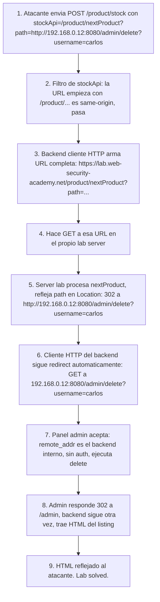

# Writeup: SSRF with filter bypass via open redirection (PortSwigger)

- **Lab**: SSRF with filter bypass via open redirection vulnerability
- **URL**: https://portswigger.net/web-security/ssrf/lab-ssrf-filter-bypass-via-open-redirection
- **Categoría**: SSRF + composición con open redirect (bypass por encadenamiento de features)
- **Dificultad**: Practitioner
- **Credenciales**: no requiere login

---

## 1. Objetivo

Mismo target final que los labs SSRF anteriores (panel admin en la red interna, borrar `carlos`), pero el filtro sobre `stockApi` ahora es **estricto y correcto en su propio contexto**: exige que la URL apunte al dominio del propio lab. Las representaciones alternativas de loopback (`127.1`, decimal, double encoding) ya no aplican porque ni siquiera permitiría una URL externa, sólo paths same-origin.

El admin vive en `http://192.168.0.12:8080/admin` (dato del brief del lab). Como el filtro sólo deja URLs del propio dominio, no hay forma directa de hacer que `stockApi` apunte ahí.

La pieza que rompe el muro es otra: el lab tiene en su mismo dominio un endpoint **`/product/nextProduct?path=...`** que hace un `302 Location: <path>` sin validar el destino. Es un open redirect clásico, normalmente clasificado como vulnerabilidad de bajo impacto cuando se reporta aislado.

Compuesto con un cliente HTTP server-side que sigue redirects automáticamente y un filtro que sólo valida el origen del primer hop, escala a SSRF arbitraria.

### El insight central

La severidad de una vulnerabilidad depende del contexto en el que vive, no de la vulnerabilidad aislada. Open redirect aislado:

- Severidad baja en bug bounties: facilita phishing porque el atacante manda un link al dominio confiable que termina en el suyo.
- No habilita SSRF, RCE, leak de datos, escalada por sí solo.

Compuesto con SSRF cuyo filtro es allowlist de origen + cliente HTTP que sigue redirects:

- Severidad crítica: convierte una "no-issue" más una "low-severity" en compromise interno completo.

Patrón general: las clasificaciones de severidad que vienen "por tipo de bug" son aproximaciones útiles pero engañosas. Lo que importa es la **interacción** con el resto del sistema.

---

## 2. Reconocimiento

### 2.1 Confirmar que el filtro de host es estricto

Capturar el "Check stock" en Burp y mandar a Repeater. Probar:

```
stockApi=http://127.1/admin
stockApi=http://192.168.0.12:8080/admin
```

Ambos rechazados con 400. El filtro ya no es blacklist (lab anterior); ahora exige same-origin. Esa es la señal de que la solución no está en jugar con el host del payload directo.

### 2.2 Encontrar el open redirect

Browse cualquier producto. Hay un botón "Next product" cuyo link es algo tipo:

```
GET /product/nextProduct?path=/product?productId=2 HTTP/2
```

Ese `path=` es el control. Observar la respuesta del server al hacer click:

```
HTTP/2 302 Found
Location: /product?productId=2
```

El server pone el valor de `path=` literal en `Location`. Probar con un destino arbitrario:

```
GET /product/nextProduct?path=https://www.google.com HTTP/2
```

Respuesta: `302 Location: https://www.google.com`. Confirmado: open redirect, no hay validación del destino. Cualquier valor de `path` se refleja como `Location`.

---

## 3. Resolución

### 3.1 Encadenar las dos primitivas

`stockApi` exige same-origin, así que apuntamos al endpoint de redirect dentro del propio dominio:

```
stockApi=/product/nextProduct?path=http://192.168.0.12:8080/admin/delete?username=carlos
```

URL-encodeado para transporte de form (`application/x-www-form-urlencoded`):

```
stockApi=%2Fproduct%2FnextProduct%3Fpath%3Dhttp%3A%2F%2F192.168.0.12%3A8080%2Fadmin%2Fdelete%3Fusername%3Dcarlos
```

### 3.2 Qué pasa server-side al recibir esto

1. **Filtro de `stockApi`** evalúa el valor. Como empieza con `/product/nextProduct...` (path same-origin del propio lab), pasa la validación: efectivamente *es* same-origin.
2. **Cliente HTTP del back-end** construye la URL completa concatenando el path con su propio origen: `https://0a5e00....web-security-academy.net/product/nextProduct?path=http://192.168.0.12:8080/admin/delete?username=carlos`. Hace GET a esa URL.
3. **Server del propio lab** procesa el `/product/nextProduct` y devuelve `302 Location: http://192.168.0.12:8080/admin/delete?username=carlos`.
4. **Cliente HTTP del back-end** sigue automáticamente el redirect (default en la mayoría de stdlibs HTTP). Hace GET a `http://192.168.0.12:8080/admin/delete?username=carlos`.
5. **Panel admin** (en `192.168.0.12:8080`) recibe el GET con `remote_addr` que parece interno (es el back-end del lab haciendo la petición). Asume confianza, ejecuta el delete, devuelve `302 Location: /admin`.
6. **Cliente HTTP del back-end** propaga la respuesta al cliente externo. Lab solved.

El truco está en el paso 1 vs 4: el filtro valida el primer hop ("¿es same-origin?"), pero el ataque se materializa en el último hop después de seguir redirects internamente. Hay un parser/validation differential implícito: el componente que valida y el componente que ejecuta no miran la misma URL.

### 3.3 Respuesta del lab al payload

```http
HTTP/2 200 OK
Content-Type: text/html; charset=utf-8

<!DOCTYPE html>
<html>
<head>
  <title>SSRF with filter bypass via open redirection vulnerability</title>
...
```

Como el último hop fue al admin, que devolvió 302 a `/admin`, el cliente HTTP siguió de nuevo y trajo el HTML del listing del admin. El back-end refleja ese HTML al cliente externo. Lab marca como Solved.

---

## 4. Por qué funciona (mecánica de la composición)

### 4.1 Severidad emergente: 1 + 1 = 10

Las dos primitivas aisladas:

| Primitiva | Severidad estándar | Por qué |
|---|---|---|
| `stockApi` con allowlist same-origin | Mitigado, no clasifica como vulnerabilidad | El filtro hace su trabajo (rechaza URLs externas) |
| Open redirect en `/product/nextProduct?path=` | Baja (informational en algunos triagers) | Sólo facilita phishing, no compromete nada por sí solo |

Compuestas por un componente que sigue redirects automáticamente:

| Composición | Severidad emergente |
|---|---|
| SSRF al panel admin interno | Crítica: borrar usuarios, escalada arbitraria, blast radius de toda la red interna |

Esto es lo que en literatura de seguridad se llama **"emergent vulnerability"**: el sistema combinado tiene propiedades de seguridad que ninguno de sus componentes tiene aislado. La defensa por componentes deja gaps en las interacciones.

### 4.2 La validación correcta es sobre el destino final, no sobre el primer hop

El filtro del lab valida si la URL declarada es same-origin. La respuesta correcta a este ataque, conservando la feature, es validar el destino *después* de seguir redirects, o **deshabilitar follow-redirects** en el cliente HTTP server-side.

Patrones de validación robusta para clientes HTTP que aceptan URL del usuario:

1. **Sin redirects**: `requests.get(url, allow_redirects=False)`. Si el server responde 30X, devolver error sin seguir. Forza al diseño a no necesitar la indirección.
2. **Redirects con re-validación**: aceptar el primer hop, leer el `Location` de cada redirect, re-validar contra la allowlist antes de seguir. Costoso pero seguro.
3. **Validación post-DNS sobre la IP final**: si lo único que importa es no llegar a IPs sensibles, validar la IP a la que se conecta cada hop, no la URL textual.

La fix elegante: **eliminar la feature de open redirect**. `path` no debería aceptar URLs absolutas, sólo IDs de producto. Eso cierra el vector original sin tocar el filtro de stockApi.

### 4.3 Open redirects son anti-pattern incluso sin SSRF

Open redirects suelen entrar al codebase de forma "inocente":

- "Necesitamos volver al usuario a donde estaba después del login" → `?redirect=/profile`. Atacante manda `?redirect=https://attacker.com`. Phishing.
- "Página intermedia con disclaimer antes de salir del sitio" → `?goto=https://partner.com`. Atacante usa `?goto=https://attacker.com`. Phishing.
- "API de tracking de clicks" → `/click?url=https://...`. Misma cosa.

La fix universal es validar el `redirect`/`goto`/`path` contra una allowlist de paths o de dominios partners. Patrón seguro:

```python
ALLOWED_REDIRECTS = ['/profile', '/dashboard', '/orders']
if path not in ALLOWED_REDIRECTS:
    abort(400)
```

O, si el universo de destinos es más abierto:

```python
parsed = urlparse(path)
if parsed.netloc and parsed.netloc not in ALLOWED_DOMAINS:
    abort(400)
```

Sin allowlist, cualquier endpoint que acepte un path/URL del cliente y lo refleje en `Location` es open redirect, y eventualmente compone con algo más para escalar.

### 4.4 Diferencia con los labs SSRF anteriores

| Lab | Filtro | Bypass |
|---|---|---|
| #1 (loopback básico) | Ninguno | N/A — directo |
| #2 (back-end) | Ninguno, pero target desconocido | Sweep del rango interno |
| #3 (blacklist) | Strings prohibidos (`localhost`, `127.0.0.1`, `admin`) | Representación alternativa (`127.1`) + double URL encoding |
| #4 (este, open redirect) | Allowlist same-origin | Composición con feature legítima del propio dominio |

Cada lab cambia la **clase de bypass**, no sólo el payload. La progresión enseña:

1. Identificar el filtro y su modelo de validación (string-match, regex, allowlist por origen, allowlist por IP final).
2. Mapear la superficie de ataque del propio dominio (en lab #4 había que encontrar el open redirect).
3. Elegir la técnica correcta según la clase del filtro.

---

## 5. Resumen de la cadena



Tres ideas para llevarse:

1. **La severidad emerge de la composición, no del bug aislado**. Open redirect "informational" + filtro "correcto en su contexto" + cliente HTTP "estándar de la industria" = SSRF crítica. La auditoría de seguridad debe incluir interacciones, no sólo componentes.
2. **Validar el destino final post-redirects, no sólo el primer hop**, cuando un componente server-side acepta URL del cliente. La respuesta más segura: deshabilitar follow-redirects en el cliente HTTP server-side y diseñar la feature para no requerir indirección.
3. **Open redirects son anti-pattern incluso sin SSRF**. Cualquier endpoint que refleja un path/URL en `Location` sin allowlist es bug latente que eventualmente se compone con otra cosa para escalar. Eliminar la feature o restringir destino a paths/dominios conocidos.

---

## 6. Contramedidas

En orden de robustez:

1. **No aceptar URLs del cliente para llamadas server-side**. Sigue siendo la fix raíz. Si `stockApi` viene del config server-side y no del cliente, no hay SSRF posible aunque haya open redirects, allowlists rotas, etc.
2. **Eliminar open redirects**: `/product/nextProduct?path=` debería aceptar IDs de producto, no URLs/paths. La fix es:
   ```python
   product_id = int(request.args['nextId'])
   return redirect(f'/product?productId={product_id}')
   ```
   Imposible apuntar fuera del propio dominio porque el path es construido server-side.
3. **Deshabilitar follow-redirects en el cliente HTTP server-side**. Si la feature de stock no necesita seguir redirects (no debería), `allow_redirects=False`. Cualquier intento de SSRF via redirect chain falla en el primer 30X.
4. **Validación post-DNS sobre IP final** de cada hop si la feature requiere seguir redirects. Bloquear loopback, RFC 1918, link-local. Usar la IP resuelta para conectar (anti DNS-rebinding).
5. **Allowlist de destinos finales** en vez de allowlist de origen. La validación correcta no es "¿la URL empieza con mi dominio?" sino "¿el destino final del request es uno de los hosts permitidos?".
6. **Egress filtering a nivel de red**. Bloquear desde el back-end del lab cualquier conexión saliente a `192.168.0.0/24` excepto los servicios estrictamente necesarios. Defense in depth: incluso si app tiene SSRF y open redirect, no llega a destinos sensibles.
7. **Auth obligatoria en el panel admin de `192.168.0.12:8080`**, sin importar el origen del request. La asunción "está dentro de la red ⇒ confiable" sigue siendo el bug subyacente que hace que SSRF sea explotable. Auth siempre.

---

## 7. Referencias

- PortSwigger Web Security Academy. (s.f.). *Lab: SSRF with filter bypass via open redirection vulnerability*. https://portswigger.net/web-security/ssrf/lab-ssrf-filter-bypass-via-open-redirection
- PortSwigger Web Security Academy. (s.f.). *Open redirection*. https://portswigger.net/web-security/cross-site-scripting/dom-based/dom-based-open-redirection
- PortSwigger Web Security Academy. (s.f.). *Server-side request forgery (SSRF)*. https://portswigger.net/web-security/ssrf
- OWASP Foundation. (s.f.). *Server Side Request Forgery Prevention Cheat Sheet*. https://cheatsheetseries.owasp.org/cheatsheets/Server_Side_Request_Forgery_Prevention_Cheat_Sheet.html
- OWASP Foundation. (s.f.). *Unvalidated Redirects and Forwards Cheat Sheet*. https://cheatsheetseries.owasp.org/cheatsheets/Unvalidated_Redirects_and_Forwards_Cheat_Sheet.html
- MITRE Corporation. (2024). *CWE-918: Server-Side Request Forgery (SSRF)*. https://cwe.mitre.org/data/definitions/918.html
- MITRE Corporation. (2024). *CWE-601: URL Redirection to Untrusted Site (Open Redirect)*. https://cwe.mitre.org/data/definitions/601.html
- Stuttard, D., & Pinto, M. (2011). *The Web Application Hacker's Handbook* (2nd ed.). Wiley. Cap. 13 (Attacking Users: Other Techniques), §13.4 (Open Redirection Vulnerabilities).
- Writeups hermanos:
  - [`learning/portswigger/basic-ssrf-against-localhost/writeup.md`](../basic-ssrf-against-localhost/writeup.md) — SSRF a loopback sin filtros (lab #1).
  - [`learning/portswigger/basic-ssrf-against-backend-system/writeup.md`](../basic-ssrf-against-backend-system/writeup.md) — SSRF con discovery por fuzzing (lab #2).
  - [`learning/portswigger/ssrf-with-blacklist-filter/writeup.md`](../ssrf-with-blacklist-filter/writeup.md) — SSRF + bypass de blacklist (lab #3).
- Inventario interno: [`inventario/03-analisis-vulnerabilidades/web/analisis-ssrf.md`](../../../inventario/03-analisis-vulnerabilidades/web/analisis-ssrf.md)
