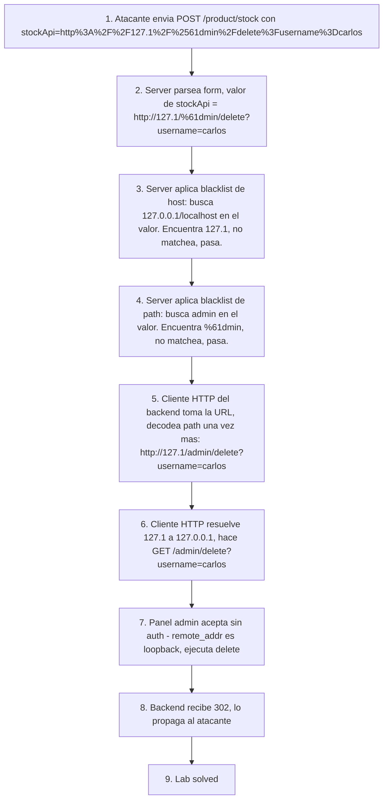

# Writeup: SSRF with blacklist-based input filter (PortSwigger)

- **Lab**: SSRF with blacklist-based input filter
- **URL**: https://portswigger.net/web-security/ssrf/lab-ssrf-with-blacklist-filter
- **Categoría**: SSRF + bypass de blacklist (representación alternativa de loopback + double URL encoding)
- **Dificultad**: Practitioner
- **Credenciales**: no requiere login

---

## 1. Objetivo

Mismo `stockApi` y mismo target final (panel admin en loopback, borrar `carlos`) que los dos labs Apprentice anteriores, pero ahora la aplicación tiene **dos blacklists independientes** que rechazan payloads "obvios":

- Blacklist de host: bloquea `localhost` y `127.0.0.1` literales.
- Blacklist de path: bloquea la palabra `admin` literal.

La respuesta cuando alguno de los dos matchea es `400 "External stock check blocked for security reasons"`.

Hay que evadir ambos filtros simultáneamente con dos técnicas distintas:

1. **Representación alternativa de loopback** que no contenga la string `127.0.0.1` ni `localhost`.
2. **Double URL encoding** sobre un carácter de `admin` para que el filtro decodee una vez y vea otra cosa, mientras que el cliente HTTP del back-end decodee dos veces y vea `admin`.

### El insight central

Una blacklist enumera *strings prohibidos*. Pero los protocolos involucrados (parser de URL, parser de IP, cliente HTTP, decodificador de URL encoding, resolver DNS) admiten **múltiples representaciones canónicas del mismo recurso**. Cualquier representación no enumerada en la blacklist pasa. La defensa correcta es allowlist post-resolución (ver §6).

---

## 2. Reconocimiento

Capturar la POST `/product/stock` en Burp y mandar a Repeater. Los intentos naive y sus respuestas:

| Payload (`stockApi=`) | Resultado |
|---|---|
| `http://localhost/admin` | 400 "External stock check blocked" (filtro de host) |
| `http://127.0.0.1/admin` | 400 "External stock check blocked" (filtro de host) |
| `http://127.0.0.1/anything` | 400 (mismo filtro, host literal todavía matchea) |
| `http://127.1/admin` | 400 "External stock check blocked" (filtro de path: `admin`) |
| `http://127.1/anything` | 200 "Could not connect" o similar (host pasa, path no matchea) |

La tabla revela que los filtros son **independientes** y se aplican a **dimensiones distintas** del payload. Hay que romper los dos en el mismo request.

---

## 3. Resolución

### 3.1 Bypass del filtro de host: `127.1`

Linux/POSIX (y la mayoría de stdlibs HTTP que delegan parsing al sistema) expanden notaciones cortas de IP:

- `127.1` → `127.0.0.1`
- `127.0.1` → `127.0.0.1`
- `0` → `0.0.0.0` o loopback en muchos kernels

La string `127.1` no contiene `127.0.0.1` ni `localhost` literales, así que la blacklist no matchea. El cliente HTTP del back-end igual conecta a `127.0.0.1` por la expansión.

Otros equivalentes que sirven contra blacklists tipo "string-match" (cada uno explota una capa distinta):

| Representación | Capa que la habilita |
|---|---|
| `127.1`, `127.0.1` | Parser de IP corto (POSIX) |
| `0` | Default del kernel (Linux interpreta `0` como loopback) |
| `2130706433` | Encoding decimal de 32 bits (`127*2^24 + 1`) |
| `0x7f000001` | Encoding hexadecimal |
| `017700000001` | Encoding octal |
| `[::1]` o `[::]` | IPv6 loopback (filtros que sólo miran v4 lo dejan pasar) |
| `localtest.me`, `nip.io` | DNS público que resuelve a 127.0.0.1 |

Todo esto bypass diferencias de "string del input" vs "destino real post-resolución".

### 3.2 Bypass del filtro de path: double URL encoding

`/admin` literal está bloqueado. URL encoding simple no alcanza: la mayoría de servers decodea el URL encoding *antes* de aplicar la blacklist, así que `%61dmin` se normaliza a `admin` y matchea igual.

Lo que sí funciona: encodear el `%` de `%61` mismo, dejándolo como `%2561`. La cadena de eventos:

1. **Cliente** envía `stockApi=http://127.1/%2561dmin` (form-encodeado para transporte).
2. **Server (filtro de blacklist)** decodea una vez el valor de `stockApi`. Resultado: `http://127.1/%61dmin`. La blacklist busca `admin` literal, encuentra `%61dmin`, no matchea, deja pasar.
3. **Server (cliente HTTP interno)** toma esa URL y la pasa a su librería HTTP, que decodea el path una segunda vez antes de armar el request. Resultado: `http://127.1/admin`. La petición real sale a `/admin`.

La técnica abusa de un **parser differential**: dos componentes en el mismo request decodean URL encoding un número distinto de veces. La blacklist trabaja sobre input "una vez decodeado"; el ejecutor trabaja sobre input "dos veces decodeado".

Es la misma clase de técnica que históricamente bypasseó WAFs con `%252e%252e` para `..` (path traversal) y proxies con caching para HTTP request smuggling. Cualquier vez que dos componentes consecutivos decodean lo mismo de forma asimétrica, hay potencial de bypass.

### 3.3 Payload final

URL final que queremos que el back-end ejecute:

```
http://127.1/admin/delete?username=carlos
```

Con double encoding sobre la `a` de `admin`:

```
http://127.1/%2561dmin/delete?username=carlos
```

Para mandarlo como valor de `stockApi` en `application/x-www-form-urlencoded`, **una sola** capa más de URL encoding (de transporte de form, no de bypass), encodeando `:`, `/`, `?`, `=` como tokens del path/query:

```
stockApi=http%3A%2F%2F127.1%2F%2561dmin%2Fdelete%3Fusername%3Dcarlos
```

Respuesta del lab:

```http
HTTP/2 302 Found
Location: /admin
Set-Cookie: session=...
```

Lab Solved.

---

## 4. Errores comunes (vividos durante este lab)

Estos dos errores son didácticos. Cualquiera que esté aprendiendo double URL encoding los va a cometer.

### 4.1 Bypassear sólo uno de los dos filtros

Primer intento equivocado:

```
stockApi=http%3A%2F%2F127.0.0.1%2F%2561dmin
```

Bypassea `admin` con `%2561dmin`, pero deja `127.0.0.1` literal. El filtro de host matchea, el server devuelve 400.

**Lección**: cuando una blacklist tiene reglas independientes (host, path, scheme...), todas se aplican al mismo request. Hay que evadir todas a la vez. Probar con un host que ya pasa (como `127.1` con un path benigno) confirma que el host bypass funciona; probar con un path que ya pasa con loopback prohibido confirma el path bypass; combinar ambos al final.

### 4.2 Encodear todo dos veces, incluido el `=` del separador de form

Segundo intento equivocado:

```
stockApi%253dhttp%253a%252f%252f127.1%252fadmin%252fdelete%253fusername%253dcarlos
```

Lo que pasó: encodee dos veces *toda* la línea, incluyendo el `=` que separa el nombre del campo de su valor. El server (parser de form `application/x-www-form-urlencoded`) decodea una vez y ve:

```
stockApi%3dhttp%3a%2f%2f127.1%2fadmin%2fdelete%3fusername%3dcarlos
```

Eso para el parser de form es un único string sin `=` literal: no es un par `clave=valor`, es un solo "campo" con un nombre rarísimo y sin valor. El server responde `"Missing parameter 'stockApi'"`.

**Lección**: el double encoding va sólo sobre el carácter que necesita evadir el filtro de blacklist, *dentro* del valor. La capa de transporte de form (URL encoding del cuerpo) se aplica *una sola vez*, sobre todos los caracteres del *valor*, dejando el `=` y `&` del *separador de form* literales. Las dos capas no son intercambiables aunque el algoritmo (URL encoding) sea el mismo:

| Capa | Aplica sobre | Cuántas veces |
|---|---|---|
| Form transport encoding | El *valor* completo (URL interna) | Una vez |
| Bypass encoding | Sólo el carácter a esconder del filtro (la `a` de `admin`) | Una vez extra (total dos veces sobre ese carácter) |
| Separadores de form (`=`, `&`) | No se encodean | Cero veces |

Una forma de pensarlo: primero construyo la URL interna que quiero que ejecute el back-end (`http://127.1/admin/delete?...`); aplico el bypass dentro de ella (`%61` → `%2561` sobre la `a` de `admin`); el resultado es el *valor literal* de `stockApi`; recién ahora aplico la capa de form encoding al valor entero (sin tocar `=`/`&` que son del form, no del valor).

---

## 5. Por qué funciona (en una capa más profunda)

### 5.1 Las blacklists son enumeraciones de "lo malo conocido"

El modelo mental de la blacklist: "rechazar lo que coincida con esta lista de strings prohibidos; aceptar todo lo demás". El supuesto implícito es que la lista cubre todas las representaciones de lo malo. Ese supuesto es falso siempre que el dominio del input tenga **codificaciones múltiples**, **representaciones alternativas** o **comportamientos del runtime que normalizan**.

URLs en particular tienen:
- Encoding de caracteres (`%XX`) anidable arbitrariamente.
- Múltiples notaciones de IP (decimal/octal/hex/short-form/IPv6/DNS).
- Schemes alternativos (`http://`, `https://`, `file://`, `gopher://`, `dict://`).
- Userinfo embedded (`http://attacker.com@127.0.0.1/` — algunos parsers usan `127.0.0.1` como host, otros `attacker.com`).
- Caracteres de control que algunos parsers ignoran (`\r`, `\n`, `\t`, `0x09` antes del host).
- Confusión `;`/`?`/`#` entre parsers tolerantes y estrictos.

Cualquier blacklist exhaustiva sobre URL es por construcción incompleta.

### 5.2 La fix correcta es allowlist *post-resolución*

Validación correcta para SSRF:

1. Parsear la URL con un parser estricto (rechazar URLs malformadas).
2. Resolver DNS para obtener la IP final.
3. Verificar que la IP **no** esté en rangos sensibles: loopback `127.0.0.0/8` y `::1`, RFC 1918 (`10/8`, `172.16/12`, `192.168/16`), link-local (`169.254/16`, `fe80::/10`), reservados (`0.0.0.0`, `255.255.255.255`).
4. Usar la **IP resuelta**, no el host original, para hacer la petición. Esto previene DNS rebinding (el DNS resuelve a IP pública la primera vez y a 127.0.0.1 la segunda).

Esto invierte el modelo: en vez de enumerar lo malo y dejar pasar lo demás, se enumera lo bueno (la IP final no está en rangos privados) y se rechaza todo lo que no califique. El número de representaciones del input deja de importar porque la validación se hace sobre el destino real.

### 5.3 Parser differentials son una clase de bug

El bypass de double encoding pertenece a una clase mayor: cualquier sistema con dos parsers consecutivos donde uno valida y otro ejecuta es vulnerable si los dos no acuerdan exactamente cómo normalizar el input. Otros ejemplos:

- **HTTP request smuggling**: front proxy y back-end disienten sobre dónde termina un request (Content-Length vs Transfer-Encoding, o malformaciones de cualquiera).
- **Path traversal con `%252e%252e`**: WAF decodea una vez, server de archivos decodea otra vez antes de resolver path.
- **Bypass de filtros de uploads con dobles extensiones**: `.php.jpg` que el filtro lee como `.jpg` pero Apache mod_rewrite ejecuta como `.php`.
- **Unicode normalization differential**: filtro compara strings antes de NFC normalization, runtime normaliza antes de actuar; caracteres con múltiples representaciones (acentos, ligaduras) bypassean.
- **JSON parser differentials**: dos parsers en el mismo pipeline interpretan distinto un JSON con keys duplicadas.

La regla operativa: cualquier vez que un check y una acción no comparten el mismo parser ni la misma normalización, hay clase de bug latente.

---

## 6. Resumen de la cadena



Tres ideas para llevarse:

1. **Blacklists son enumeraciones incompletas por construcción cuando el dominio del input admite múltiples representaciones**. SSRF, path traversal, XSS, SQLi, todos sufren la misma debilidad cuando se intentan defender con blacklist.
2. **Parser differential es una clase de bug, no un truco específico**. Doble encoding contra blacklist, request smuggling contra proxies, unicode normalization contra filtros: todas son la misma idea aplicada a parsers distintos. Reconocerlas como clase ayuda a anticiparlas.
3. **Validación correcta para SSRF es allowlist sobre el destino resuelto, no blacklist sobre el input**. Validar la IP final post-DNS, rechazar rangos sensibles, usar la IP resuelta para la conexión real. Eso elimina la clase entera de bypasses por representación.

---

## 7. Contramedidas

En orden de robustez:

1. **No aceptar URLs del cliente para llamadas server-side**. Sigue siendo la fix raíz: la blacklist del lab solo existe porque el diseño expone una URL configurable al cliente. Eliminarla mata el problema.
2. **Allowlist sobre IP resuelta post-DNS**. Si la feature requiere URL del cliente, validar:
   - Parsear con parser estricto (rechazar URLs malformadas).
   - Resolver DNS, obtener IP final.
   - Verificar que la IP no esté en rangos sensibles (loopback, RFC 1918, link-local, reservados).
   - Usar la IP resuelta, no el hostname original, para la conexión final (previene DNS rebinding).
3. **Allowlist explícita de hosts permitidos** si el universo de destinos es conocido. `stockApi` debería tener un dominio fijo en config; no necesita ser cliente-controlado.
4. **Decodificar URL encoding hasta convergencia (idempotente) antes de validar**. Si el código tiene que validar input encodeado, decodear repetidamente hasta que el resultado no cambie, *después* aplicar blacklist. Esto neutraliza double encoding pero no las representaciones alternativas de IP.
5. **Egress filtering a nivel de red**. Bloquear desde iptables/security-group/network-policy cualquier conexión saliente del componente público hacia loopback, RFC 1918 y link-local. Defense in depth: incluso si la app tiene SSRF, no llega a destinos sensibles.
6. **Auth obligatoria en todos los servicios internos**. La asunción "loopback ⇒ confiable" sigue siendo el bug subyacente del panel admin. Aunque el SSRF se mitigara, otra vía (RCE local, error handler vulnerable, debug endpoint) reabriría el camino al panel. Auth siempre.

---

## 8. Referencias

- PortSwigger Web Security Academy. (s.f.). *Lab: SSRF with blacklist-based input filter*. https://portswigger.net/web-security/ssrf/lab-ssrf-with-blacklist-filter
- PortSwigger Web Security Academy. (s.f.). *Server-side request forgery (SSRF)*. https://portswigger.net/web-security/ssrf
- OWASP Foundation. (s.f.). *Server Side Request Forgery Prevention Cheat Sheet*. https://cheatsheetseries.owasp.org/cheatsheets/Server_Side_Request_Forgery_Prevention_Cheat_Sheet.html
- MITRE Corporation. (2024). *CWE-918: Server-Side Request Forgery (SSRF)*. https://cwe.mitre.org/data/definitions/918.html
- MITRE Corporation. (2024). *CWE-184: Incomplete List of Disallowed Inputs*. https://cwe.mitre.org/data/definitions/184.html
- IETF. (2005). *RFC 3986: Uniform Resource Identifier (URI): Generic Syntax*. https://www.rfc-editor.org/rfc/rfc3986
- Stuttard, D., & Pinto, M. (2011). *The Web Application Hacker's Handbook* (2nd ed.). Wiley. Cap. 11 (Attacking Application Logic), §11.6 (URL/Filter Bypasses).
- Writeups hermanos:
  - [`learning/portswigger/basic-ssrf-against-localhost/writeup.md`](../basic-ssrf-against-localhost/writeup.md) — SSRF a loopback sin filtros (lab #1).
  - [`learning/portswigger/basic-ssrf-against-backend-system/writeup.md`](../basic-ssrf-against-backend-system/writeup.md) — SSRF a back-end interno con discovery por fuzzing (lab #2).
- Inventario interno: [`inventario/03-analisis-vulnerabilidades/web/analisis-ssrf.md`](../../../inventario/03-analisis-vulnerabilidades/web/analisis-ssrf.md)
