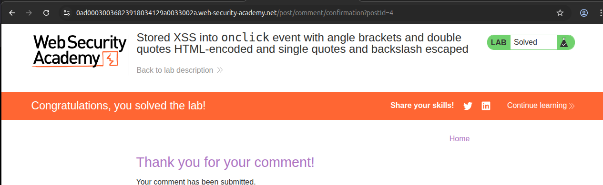
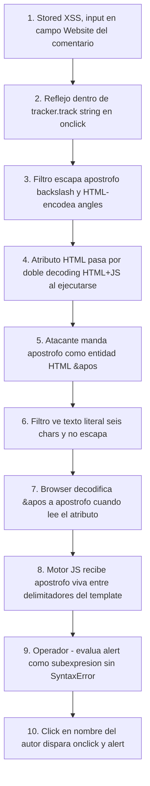

# Writeup: Stored XSS into onclick event with angle brackets and double quotes HTML-encoded and single quotes and backslash escaped (PortSwigger)

- **Lab**: Stored XSS into onclick event with angle brackets and double quotes HTML-encoded and single quotes and backslash escaped
- **URL**: https://portswigger.net/web-security/cross-site-scripting/contexts/lab-onclick-event-angle-brackets-double-quotes-html-encoded-single-quotes-backslash-escaped
- **Categoría**: XSS, Stored, Contextos, Atributo HTML event handler (`onclick`)
- **Dificultad**: Practitioner

---

## 1. Objetivo

Cuarto lab de la serie XSS Contexts y primer **stored** del path. El input vive en una BD (formulario de comentarios) y se sirve a quien visite la página de un post. El campo controlable es **Website URL** del comentario, que se renderiza en dos sitios del HTML del post: dentro de `href` y dentro de `onclick`. El interesante es el `onclick`, donde la URL aterriza como argumento de una llamada `tracker.track('...')` que es JavaScript dentro de un atributo HTML.

Para resolver el lab hay que provocar que se ejecute `alert(1)` cuando alguien hace click en el nombre del autor del comentario.

### Protecciones declaradas

El título nombra cuatro:

- `<` `>` HTML-encoded
- `"` HTML-encoded
- `'` escapado a `\'`
- `\` escapado a `\\`

Las cuatro juntas son las mismas que el lab "sq + backslash escaped" de la serie reflected. **Pero el contexto destino es distinto** y ahí está la grieta.

### Contexto exacto del reflejo

Tras postear un comentario con Website `http://test.example/?marker=hola123abc`, el HTML servido es:

```html
<a id="author"
   href="http://test.example/?marker=hola123abc"
   onclick="var tracker={track(){}};tracker.track('http://test.example/?marker=hola123abc');">
   nombretest
</a>
```

La Website URL aparece dos veces. La inyectable es la del `onclick`, donde queda como argumento string de `tracker.track`.

---

## 2. La diferencia estructural respecto a labs anteriores

En los labs reflected anteriores, el input aterrizaba dentro de `<script>...</script>` directamente. Ahí hay **un único proceso de decodificación**: el navegador HTML lee los bytes literales del `<script>` (en *script data state*) y los pasa al motor JS sin tocarlos. El servidor escapa para JS y eso es todo.

En este lab, el input aterriza dentro de un atributo HTML (`onclick="..."`). Los atributos HTML pasan por **dos decodificaciones consecutivas** cuando son event handlers:

1. **HTML decoding del valor del atributo.** Cualquier entidad HTML (`&apos;`, `&#39;`, `<`, `&amp;`...) se decodifica a su carácter literal. Esto pasa siempre, en cualquier valor de atributo HTML.
2. **Después, parsing JS** sobre el resultado. El motor de JavaScript recibe el string ya HTML-decoded y lo ejecuta como código.

El filtro server-side, en cambio, opera sobre el input **crudo** que llega del formulario. Si el atacante manda `&apos;`, el filtro ve seis caracteres `&`, `a`, `p`, `o`, `s`, `;`. **Ninguno de ellos es `'`** desde la perspectiva del filtro, así que la regla "escapar `'` a `\'`" no se dispara.

Pero el navegador, al renderizar el atributo, decodifica `&apos;` a `'` antes de pasárselo al motor JS. **El atacante delivera una `'` viva al motor JS sin haber tocado nunca el filtro.**

Esa asimetría entre lo que ve el filtro (input crudo) y lo que recibe el motor JS (input HTML-decoded) es el corazón del bypass. Es el mismo principio que [vimos en el bypass del WAF SQLi via XML hex entities](../sqli-filter-bypass-xml-encoding/writeup.md): WAF/filtro inspecciona el formato wire, parser intermedio decodifica antes de procesar, asimetría que se explota.

---

## 3. Sondeo de confirmación

Antes de tirar el payload, verificamos que la asimetría existe en este lab concreto. Postear un comentario con Website:

```
http://test.example/?test&apos;
```

Resultado en el DOM:

```html
<a id="author"
   href="http://test.example/?test'"
   onclick="var tracker={track(){}};tracker.track('http://test.example/?test'');">
   ...
</a>
```

Lectura del onclick:

```js
tracker.track('http://test.example/?test'');
                                          ↑↑
                                          │└── nuestro &apos; decodificado a ' por el parser HTML
                                          └─── la ' de cierre del template
```

Dos cosas que confirma este sondeo:

1. El `'` aparece **literal** (no `\'`) en el atributo. El filtro no lo escapó, porque desde su perspectiva el input nunca contuvo una `'`.
2. La ubicación del `'` decodificado es dentro del string de `tracker.track`, justo antes de la `'` de cierre del template. Esa proximidad es lo que vamos a explotar para inyectar código entre las dos comillas.

> Nota DevTools: el HTML que se ve aquí viene del Elements panel, ya con HTML decoding aplicado. Los bytes literales del servidor tienen `&apos;`, no `'`. Para diagnóstico de XSS conviene confirmar con View Source si hace falta, pero para este ataque lo que importa es lo que recibe el motor JS, que es lo que el Elements panel muestra.

El sondeo tal cual produce dos comillas seguidas sin operador entre ellas, lo que es SyntaxError en JS y no ejecuta el alert. Hace falta meter el payload entre las dos comillas con un operador que evalúe `alert(1)` como subexpresión sin romper la sintaxis.

---

## 4. Payload final

Postear un comentario nuevo con Website:

```
http://foo?&apos;-alert(1)-&apos;
```

Trace del flujo completo:

### Paso 1: filtro server-side

Input crudo: `http://foo?&apos;-alert(1)-&apos;`

El filtro busca: `'`, `<`, `>`, `"`, `\`. **Ninguno está presente como caracter literal.** Las entidades `&apos;` son secuencias de seis caracteres ASCII normales. `(`, `)`, `1`, `-`, `?`, letras: nada se escapa, nada se encodea. El filtro deja pasar el input intacto.

### Paso 2: HTML emitido

```html
onclick="var tracker={track(){}};tracker.track('http://foo?&apos;-alert(1)-&apos;');"
```

### Paso 3: HTML decoding del atributo

El navegador, al construir el DOM, decodifica las entidades del valor del atributo. `&apos;` se vuelve `'`. El valor real del atributo `onclick` (el código JS que se ejecutará al click) queda:

```js
var tracker={track(){}};tracker.track('http://foo?'-alert(1)-'');
```

### Paso 4: parsing JS al hacer click

El motor JS evalúa `tracker.track(EXPR)` donde `EXPR` es:

```
'http://foo?' - alert(1) - ''
```

Token a token:

| Token | Significado |
|---|---|
| `'http://foo?'` | String literal |
| `- alert(1)` | Operador resta. Para evaluar el lado derecho, JS **llama a `alert(1)`**. Salta el alert. La función devuelve `undefined`, que en operación numérica se convierte a `NaN`. |
| `- ''` | Operador resta. `NaN - 0 = NaN`. |
| Resultado | `tracker.track(NaN)`. La función `track` está definida como `track(){}` (vacía), así que la llamada es no-op. |

El alert se ejecuta como **efecto colateral de evaluar el operador `-`**. La asignación termina sin SyntaxError. Lab solved en cuanto alguien hace click en el nombre del autor.

### Por qué `-` y no `+`, `||`, `&&`

Cualquier operador binario que fuerce la evaluación del lado derecho funciona. `-` es la elección clásica porque:

- Es asimétrico (a diferencia de `,`), así que fuerza coerción numérica.
- Es de un solo caracter, no introduce caracteres que el filtro pudiera interceptar.
- No tiene short-circuit (a diferencia de `||` y `&&`), así que garantiza que `alert(1)` se evalúa siempre.
- Funciona aunque `alert` devuelva `undefined`, porque la coerción a `NaN` no produce error.

---

## 5. Resolución

URL del lab tras el comentario aceptado:

```
https://0ad000300368239180341290033002a.web-security-academy.net/post/comment/confirmation?postId=4
```

Volver al post, hacer click en el nombre del autor del comentario malicioso, salta `alert(1)`. Lab marcado como **Solved**.



---

## 6. Resumen de la cadena



Tres ideas para llevarse:

1. **El contexto "atributo HTML que es JS" tiene dos decodings, no uno**. Es un caso especial dentro del path "JS-en-HTML": el atributo siempre HTML-decodea su valor antes de pasarlo al motor JS. Cualquier entidad HTML pasa por debajo del filtro server-side y llega viva al JS. Por eso este lab abre una ruta que en el lab "sq + backslash escaped" reflected estaba cerrada, aunque las protecciones declaradas son las mismas.
2. **El bypass via entidades HTML es el patrón canónico cuando el filtro opera sobre input crudo**. Funciona en cualquier event handler (`onclick`, `onmouseover`, `onerror`, `onload`, etc.), en `href="javascript:..."`, en `style` con `expression()` (legacy IE), y en general en cualquier sitio donde HTML decoding preceda otro parser. La regla operacional para defensa: **no aceptar entidades HTML en input que va a contextos JS**, o decodificarlas server-side antes de aplicar el escape.
3. **El operador `-` es el truco minimalista para evaluar `alert(1)` como subexpresión**. Cuando el contexto te obliga a producir una expresión válida (no una sentencia), `-alert(1)-` te lo da gratis y sin SyntaxError. Otros idiomáticos: `||alert(1)||` (short-circuit, pero alert se evalúa si lado izquierdo es falsy), `,alert(1),` (operador coma, simple pero introduce comas que algunos filtros marcan), backticks como template literal en contextos sin paréntesis. `-` es el más limpio.

---

## 7. Contramedidas

Defensas en orden de robustez:

1. **No reflejar input no confiable dentro de event handlers HTML inline**. La defensa estructural más fuerte: la URL no debe construir directamente el código JS del `onclick`. En su lugar, ponerla en un atributo `data-url`, y leerla desde un script externo o inline que use `addEventListener('click', ...)`. Eso saca el input del contexto JS-en-HTML por completo.
   ```html
   <a data-url="USER_URL" id="author">nombretest</a>
   <script>
       document.getElementById('author').addEventListener('click', function(e) {
           tracker.track(this.dataset.url);
       });
   </script>
   ```
   Ahora el input vive en un contexto puramente HTML attribute, donde sólo hace falta HTML-encoding (`&` `<` `>` `"`), sin escape JS de ningún tipo.
2. **Si tiene que ir en event handler, decodificar entidades HTML antes de escapar para JS**. El filtro tiene que normalizar el input antes de procesar. Pseudocódigo:
   ```python
   normalized = html.unescape(raw_input)   # decodifica &apos;, <, etc. PRIMERO
   js_safe = (normalized
              .replace("\\", "\\\\")
              .replace("'", "\\'")
              .replace('"', '\\"')
              .replace("<", "\\x3c")
              .replace(">", "\\x3e"))
   ```
   El orden importa: primero HTML-decode (cierra la asimetría), después escape JS. Saltarse el primer paso es lo que abre el lab.
3. **Validación estricta del campo Website como URL**. Una URL legítima cumple un grammar muy concreto (RFC 3986). Una librería de URL parsing rechaza cualquier valor con `&apos;` o `'` o cualquier otro caracter no permitido en la parte de query antes de aceptarlo. La validación de tipo "es esto una URL" cierra esta clase de inyección a nivel de input, no de output.
4. **Content Security Policy con `'unsafe-inline'` deshabilitado**. Una CSP estricta sin `'unsafe-inline'` bloquea la ejecución de event handlers inline (`onclick`, `onload`, etc.) sin importar el contenido. Es defensa en profundidad: aunque el atacante consiga inyectar el handler, el navegador lo ignora. Requiere reescribir el código de la app para no usar handlers inline (usar `addEventListener` en su lugar), pero es la defensa más robusta del lote.
5. **Sanitización con allow-list, no deny-list**. El filtro de este lab implementa una deny-list: enumera caracteres peligrosos (`<`, `>`, `"`, `'`, `\`) y los escapa. Es un patrón frágil porque cualquier omisión deja una ruta abierta (como aquí, donde `&` no estaba en la lista y permitió delivery via entidades). Una allow-list que rechace todo lo que no encaje en `[a-zA-Z0-9:./?_=&-]` o similar es estructuralmente más robusta.

### Anti-patrón observado en este lab

El backend implementa escape para contexto JS string sin tener en cuenta que el contexto destino es un atributo HTML que decodifica antes de ejecutar. Es un caso clásico de "implementé escape para el último parser, ignoré los parsers intermedios". Defensa correcta: pensar en la cadena completa de parsers desde el byte que sale del servidor hasta la ejecución, y escapar para todos los meta-caracteres de todos esos parsers.

---

## 8. Referencias

- PortSwigger Web Security Academy. (s.f.). *Lab: Stored XSS into onclick event with angle brackets and double quotes HTML-encoded and single quotes and backslash escaped*. https://portswigger.net/web-security/cross-site-scripting/contexts/lab-onclick-event-angle-brackets-double-quotes-html-encoded-single-quotes-backslash-escaped
- PortSwigger Web Security Academy. (s.f.). *Cross-site scripting contexts*. https://portswigger.net/web-security/cross-site-scripting/contexts
- WHATWG. (s.f.). *HTML Living Standard, Attribute value (double-quoted) state and entity decoding*. https://html.spec.whatwg.org/multipage/parsing.html#tokenization
- OWASP Foundation. (s.f.). *Cross Site Scripting Prevention Cheat Sheet, RULE #3 JavaScript Encode Before Inserting Untrusted Data into HTML JavaScript Data Values*. https://cheatsheetseries.owasp.org/cheatsheets/Cross_Site_Scripting_Prevention_Cheat_Sheet.html
- Writeup hermano del SQLi WAF bypass que usa el mismo principio de asimetría parser/encoding: [`learning/portswigger/sqli-filter-bypass-xml-encoding/writeup.md`](../sqli-filter-bypass-xml-encoding/writeup.md)
- Inventario interno: [`inventario/03-analisis-vulnerabilidades/web/analisis-xss.md`](../../../inventario/03-analisis-vulnerabilidades/web/analisis-xss.md)
