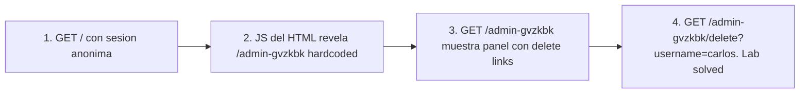

# Writeup: Unprotected admin functionality with unpredictable URL (PortSwigger)

- **Lab**: Unprotected admin functionality with unpredictable URL
- **URL**: https://portswigger.net/web-security/access-control/lab-unprotected-admin-functionality-with-unpredictable-url
- **Categoría**: Access control / Security through obscurity / Information leak en frontend
- **Dificultad**: Apprentice
- **Credenciales**: ninguna

---

## 1. Objetivo

Borrar la cuenta de `carlos`. Variante del lab `unprotected-admin-functionality`: el panel admin existe sin auth, pero el path es **aleatorio por instancia** (`/admin-XXXXXX` con sufijo random). El defender duplicó la apuesta a security through obscurity: si nadie conoce el path, nadie lo encuentra.

### Insight central

El path sigue **leakeando**, esta vez no en `robots.txt` sino en JavaScript del frontend. El defender intentó "ocultar" el link al panel mostrandolo solo si `isAdmin = true` en JS, pero **el path en sí está hardcoded en el script servido a todos**, incluyendo usuarios anónimos. La validación del rol se hizo en el cliente; el server entrega el código JS sin filtrar.

Pattern general: **cualquier dato que el frontend usa para decidir qué mostrar es accesible al atacante**, porque el frontend corre en su browser. Decisiones de visibilidad UI no son decisiones de seguridad.

---

## 2. Reconocimiento

### 2.1 Inspeccionar el HTML de la home

```html
<script>
var isAdmin = false;
if (isAdmin) {
   var topLinksTag = document.getElementsByClassName("top-links")[0];
   var adminPanelTag = document.createElement('a');
   adminPanelTag.setAttribute('href', '/admin-gvzkbk');
   adminPanelTag.innerText = 'Admin panel';
   topLinksTag.append(adminPanelTag);
   ...
}
</script>
```

Tres cosas explícitas:

- **Path filtrado**: `/admin-gvzkbk`. Hardcoded como string literal.
- **Bandera de role en cliente**: `var isAdmin = false`. El backend no setea esto basado en sesión real, lo manda fijo en el HTML para todos.
- **Lógica condicional inútil**: el `if (isAdmin)` no oculta el path, solo evita renderear el link en el DOM. El string sigue ahí en el source.

### 2.2 Confirmar zero auth

Visitar `/admin-gvzkbk` en browser muestra el panel con users + delete buttons. Sin login, sin cookie de sesión autenticada.

---

## 3. Resolución

Click en `Delete` junto a `carlos` en el panel admin. Server responde con `User deleted successfully!` y banner cambia a `is-solved`.

Equivalente con curl (requiere session cookie inicial del lab, aunque sea anónima):

```bash
curl 'https://<lab>/admin-gvzkbk/delete?username=carlos'
```

---

## 4. Por qué funciona

### 4.1 Frontend nunca puede enforce nada

Patrón canónico que se repite en muchas vulns:

- **Hidden inputs** con flags (`is_admin=false`) que el cliente cambia.
- **JavaScript que oculta features** según rol (cliente puede inspeccionar source).
- **Disabled buttons** (cliente los habilita en DevTools).
- **Validación client-side** (cliente la salta).
- **CSRF tokens generados client-side** (cliente los regenera).

La regla universal: **el cliente está bajo control del atacante**. Si un dato sensible llega al browser, ya está expuesto. Si una decisión de seguridad depende del comportamiento del cliente, ya está bypasseada.

### 4.2 Por qué este patrón aparece tanto

Devs piensan en términos de UX: "el botón solo se muestra si sos admin, así que solo admins lo ven". La pregunta real es distinta: "¿qué pasa si alguien ignora la UI y construye la request directamente?". Si la respuesta es "el server le permite la acción", el botón es decorativo, no defensivo.

Fix correcta:

```python
# Antipatron: panel sin auth, path random como unica defensa
@app.route('/admin-<random>')
def admin_panel_broken():
    return render_template('admin.html', users=User.all())

# Implementacion correcta
@app.route('/admin')  # path predecible OK, lo importante es la auth
@require_admin
def admin_panel_safe():
    return render_template('admin.html', users=User.all())
```

El path puede ser el más predecible del mundo. Lo único que importa es que el endpoint exija role=admin server-side.

### 4.3 Diferencia con el lab anterior

| Aspecto | Unprotected admin | Unpredictable URL (este) |
|---|---|---|
| Cómo se descubre el path | `robots.txt` | JavaScript del frontend |
| Path sample | `/administrator-panel` | `/admin-gvzkbk` (random por instancia) |
| Defensa intentada | Path declarado en archivo "no indexable" | Path random + bandera client-side |
| Por qué falla | robots.txt es público | JS se sirve a todos, role-check en cliente |
| Fix correcta | Auth en endpoint | Auth en endpoint (path puede ser cualquiera) |

Ambos labs prueban la misma lección: **obscuridad es defensa decorativa, auth es defensa real**.

---

## 5. Resumen



Tres ideas:

1. **Frontend nunca enforce**: cualquier defensa que dependa del comportamiento del cliente es teatro.
2. **Random URLs como defensa son entropía agregada al path, no auth**: el path leakea por mil vectores (JS, JSON responses, error messages, browser history compartido).
3. **El path puede ser predecible**: `/admin` está bien si el endpoint exige role server-side. La obscuridad es defensa-en-profundidad complementaria, nunca primaria.

---

## 6. Contramedidas

1. **Auth check server-side en cada endpoint sensible**: decorator/middleware `@require_admin`. Path puede ser predecible o random, irrelevante.
2. **No enviar al cliente datos que él no debería ver**: si `isAdmin` se calcula client-side a partir de la response del server, el server ya decidió qué mostrar; no hace falta el flag. Si el server filtra el JS por role, entonces sí podría ocultar el path. Pero la auth en el endpoint sigue siendo necesaria.
3. **Audit logging** de acciones admin para detección post-incidente.
4. **Tests automatizados** que verifiquen que cada endpoint admin devuelve 403 para users no-admin y 401 para anónimos.

---

## 7. Referencias

- PortSwigger Web Security Academy. (s.f.). *Lab: Unprotected admin functionality with unpredictable URL*. https://portswigger.net/web-security/access-control/lab-unprotected-admin-functionality-with-unpredictable-url
- PortSwigger Web Security Academy. (s.f.). *Access control vulnerabilities and privilege escalation*. https://portswigger.net/web-security/access-control
- OWASP Foundation. (2021). *A01:2021 - Broken Access Control*. https://owasp.org/Top10/A01_2021-Broken_Access_Control/
- OWASP Foundation. (s.f.). *Authorization Cheat Sheet*. https://cheatsheetseries.owasp.org/cheatsheets/Authorization_Cheat_Sheet.html
- MITRE Corporation. (2024). *CWE-284: Improper Access Control*. https://cwe.mitre.org/data/definitions/284.html
- MITRE Corporation. (2024). *CWE-540: Inclusion of Sensitive Information in Source Code*. https://cwe.mitre.org/data/definitions/540.html
- MITRE Corporation. (2024). *CWE-862: Missing Authorization*. https://cwe.mitre.org/data/definitions/862.html
- Stuttard, D., & Pinto, M. (2011). *The Web Application Hacker's Handbook* (2nd ed.). Wiley. Cap. 8 (Attacking Access Controls).
- Writeup hermano: [`learning/portswigger/unprotected-admin-functionality/writeup.md`](../unprotected-admin-functionality/writeup.md)
- Inventario interno: [`inventario/04-explotacion/web/explotacion-broken-access-control.md`](../../../inventario/04-explotacion/web/explotacion-broken-access-control.md)
