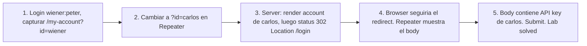

# Writeup: User ID controlled by request parameter with data leakage in redirect (PortSwigger)

- **Lab**: User ID controlled by request parameter with data leakage in redirect
- **URL**: https://portswigger.net/web-security/access-control/lab-user-id-controlled-by-request-parameter-with-data-leakage-in-redirect
- **Categoría**: Access control / IDOR / Data leakage in HTTP body / Defensa rota
- **Dificultad**: Apprentice
- **Credenciales**: `wiener:peter`

---

## 1. Objetivo

Mismo IDOR base (`/my-account?id=<X>`), pero el server **intenta** defenderse: si el `id` no coincide con la sesión, devuelve `302 Found` con `Location: /login`. La vulnerabilidad: el body de la 302 contiene la página completa con la API key del target, ya renderizada. El browser obedece el redirect y nunca muestra el body, pero cualquier cliente que no siga redirects (Burp Repeater, `curl` sin `-L`, fetch con `redirect: 'manual'`) ve los datos.

### Insight central

**Un redirect HTTP no es access control**. El status 302 sólo le dice al browser "andá a otro lado"; el body sigue viajando completo por la red. Si la app construye la respuesta en este orden:

```
1. Cargar User.find(request_id)
2. Renderizar template con datos del user cargado
3. Si user_id != session_id, agregar status=302 y Location header
4. Send response (status + headers + body)
```

el paso 3 se ejecuta **después** del paso 2. El template ya está armado y se envía igual. El defender confió en que el browser disimule la fuga, pero el dato salió del server.

---

## 2. Recon y resolución

### 2.1 Login y captura de la request normal

```
POST /login
username=wiener&password=peter

GET /my-account?id=wiener
Cookie: session=2D57u4Yw7gS5BDjr2sYdhwGgoMALiF9g
```

Response 200 con la cuenta de wiener.

### 2.2 Tampering: cambiar `id=wiener` por `id=carlos`

```
GET /my-account?id=carlos
Cookie: session=2D57u4Yw7gS5BDjr2sYdhwGgoMALiF9g
```

Response (extracto):

```
HTTP/2 302 Found
Location: /login
Content-Type: text/html; charset=utf-8
Content-Length: 3759

<!DOCTYPE html>
<html>
  ...
  <h1>My Account</h1>
  <div id=account-content>
    <p>Your username is: carlos</p>
    <div>Your API Key is: 3eIiuox6om0XcCWdJPKnEiTdmk5Pgp9E</div>
    ...
```

El body trae la página de cuenta de carlos completa. API key carlos: `3eIiuox6om0XcCWdJPKnEiTdmk5Pgp9E`. Submit, lab solved.

### 2.3 Por qué el browser oculta la fuga

El browser ve `302 Found` + `Location: /login` y dispara una nueva request al login, descartando el body de la 302. Para el usuario interactivo no hay rastro de la fuga: visualmente parece que la app rebotó al login. Pero la red ya transportó el HTML con la API key.

Clientes que **sí** muestran el body:

- Burp Suite Repeater (no sigue redirects por default).
- `curl` sin `-L`.
- `fetch(url, { redirect: 'manual' })` en JS.
- Wireshark / cualquier MITM.
- Logs/proxies que registran response bodies.

---

## 3. Por qué funciona

### 3.1 El antipatrón clásico

```python
# Antipatron - render antes del check
@app.route('/my-account')
@login_required
def my_account_broken():
    user = User.find(request.args['id'])         # 1. carga el user
    body = render_template('account.html', user=user)  # 2. renderiza
    if user.id != session['user_id']:
        return redirect('/login')                # 3. redirect... pero body ya hecho
    return body
```

Frameworks que retornan tuplas `(body, status, headers)` o donde el redirect helper no aborta el render hacen este bug fácil de cometer.

### 3.2 Variantes equivalentes del bug

Cualquier flujo donde el server **construye datos sensibles antes de validar permisos** filtra por la misma vía:

- Render template + status 4xx/3xx **con body**.
- Llenar JSON response con datos completos y luego setear `Forbidden`.
- Logs/audit que serializan la respuesta antes del status final.
- Templates con includes condicionales mal puestos: si el include corre antes del check, ejecutó queries y leaked datos a logs.

El status code es metadata; los datos viajan siempre que el body se llene.

### 3.3 Implementación correcta

```python
# Fix 1 - check antes de cargar
@app.route('/my-account')
@login_required
def my_account_safe_v1():
    requested_id = request.args.get('id')
    if requested_id != session['user_id']:
        return redirect('/login')                # cero data en body
    user = User.find(requested_id)
    return render_template('account.html', user=user)

# Fix 2 - derivar de sesion (mejor: ni siquiera aceptar id)
@app.route('/my-account')
@login_required
def my_account_safe_v2():
    user = User.find(session['user_id'])
    return render_template('account.html', user=user)

# Fix 3 - authz en el query (defensa profunda contra row-level mistakes)
@app.route('/my-account')
@login_required
def my_account_safe_v3():
    user = User.query.filter_by(id=session['user_id']).one_or_404()
    return render_template('account.html', user=user)
```

El patrón es el mismo: **autorizar antes de cargar/serializar**.

### 3.4 Por qué el redirect "se siente" como una defensa

El dev probablemente probó manualmente:

```
1. Login wiener.
2. URL bar: /my-account?id=carlos.
3. Browser muestra el login. "Funciona".
```

El browser hace de pantalla, el dev concluye que el access control está en orden. Es testing por canal incorrecto: el browser nunca fue el límite de seguridad, el server lo es. El test correcto es repetir con un cliente que no siga redirects automáticamente.

### 3.5 Patrón general: data leakage en respuestas con error

| Síntoma de canal incorrecto | Body de la response |
|---|---|
| `302 Found` + `Location: /login` | HTML completo con datos sensibles del recurso solicitado |
| `403 Forbidden` con cuerpo informativo | Stack trace, query SQL, nombres de campos privados |
| `404 Not Found` distinto a recurso inexistente | Discrimina existence (oracle de enumeración) |
| `401 Unauthorized` con detalle | Nombres de usuarios, emails válidos vs inválidos |
| `500 Internal Server Error` | Datos de DB en logs, query con parámetros, env vars |

Regla: el cuerpo de cualquier response debe ser consistente con el status. Si negás acceso, el body no puede contener el recurso negado.

### 3.6 Conexión con labs hermanos del cluster

| Lab | ID format | Defensa server-side |
|---|---|---|
| `user-id-controlled-by-request-parameter` | username | ninguna (200 directo) |
| `user-id-controlled-by-request-parameter-with-unpredictable-user-ids` | UUID | ninguna; barrera = entropía del ID |
| **`...with-data-leakage-in-redirect` (este)** | username | redirect 302 cosmético; body filtra |

Los tres tienen el mismo bug raíz (`User.find(request.args['id'])` sin authz check). Cambia la apariencia desde el browser, no la mecánica.

---

## 4. Resumen



Tres ideas:

1. **Status code y body son canales separados**: 302/403/404 indican intención, el body lleva los bytes. Filtrar uno no filtra el otro.
2. **Authz antes de cargar/renderizar**: cualquier query a un recurso o serialización debe estar gated por permiso. Rendering primero, checking después es buggy por construcción.
3. **Testing de access control con cliente sin browser-magic**: Repeater, curl sin `-L`, scripts. El browser oculta clases enteras de bugs (redirects que filtran, content-disposition que no se respeta, headers que se procesan distinto).

---

## 5. Contramedidas

1. **Authz check antes de cargar el recurso o renderizar**: deny-by-default, abort() temprano.
2. **Pipeline de respuesta atómico**: si el framework permite construir partial body + cambiar status, refactorizar para que el render sólo corra en el path autorizado.
3. **Tests automatizados con cliente no-following**: assert que `GET /my-account?id=otro` no devuelve `Your API Key is:` en el body, sin importar el status.
4. **Linter/SAST custom**: regla que detecte `render_template(... user ...)` seguido de un check de session sin abort previo.
5. **Sanitización de respuestas en error paths**: si tu framework permite hooks `after_request`, vaciar body cuando status es 3xx/4xx.
6. **Cuerpo mínimo en redirects**: la spec HTTP permite (RFC 9110 §15.4) un body en 3xx pero recomienda mensaje breve indicando el redirect, no contenido del recurso. Frameworks deberían generarlo automáticamente.
7. **Audit logging de status mismatch**: alertar si una response con `Location` también lleva content-length grande consistentemente.

---

## 6. Referencias

- PortSwigger Web Security Academy. (s.f.). *Lab: User ID controlled by request parameter with data leakage in redirect*. https://portswigger.net/web-security/access-control/lab-user-id-controlled-by-request-parameter-with-data-leakage-in-redirect
- PortSwigger Web Security Academy. (s.f.). *Insecure direct object references*. https://portswigger.net/web-security/access-control/idor
- IETF. (2022). *RFC 9110: HTTP Semantics — §15.4 Redirection 3xx*. https://www.rfc-editor.org/rfc/rfc9110#section-15.4
- OWASP Foundation. (2021). *A01:2021 - Broken Access Control*. https://owasp.org/Top10/A01_2021-Broken_Access_Control/
- OWASP Foundation. (s.f.). *Insecure Direct Object Reference Prevention Cheat Sheet*. https://cheatsheetseries.owasp.org/cheatsheets/Insecure_Direct_Object_Reference_Prevention_Cheat_Sheet.html
- OWASP Foundation. (s.f.). *Authorization Cheat Sheet*. https://cheatsheetseries.owasp.org/cheatsheets/Authorization_Cheat_Sheet.html
- MITRE Corporation. (2024). *CWE-639: Authorization Bypass Through User-Controlled Key*. https://cwe.mitre.org/data/definitions/639.html
- MITRE Corporation. (2024). *CWE-200: Exposure of Sensitive Information to an Unauthorized Actor*. https://cwe.mitre.org/data/definitions/200.html
- MITRE Corporation. (2024). *CWE-285: Improper Authorization*. https://cwe.mitre.org/data/definitions/285.html
- Stuttard, D., & Pinto, M. (2011). *The Web Application Hacker's Handbook* (2nd ed.). Wiley. Cap. 8 (Attacking Access Controls).
- Inventario interno (par cross-fase):
  - [`inventario/03-analisis-vulnerabilidades/web/analisis-idor.md`](../../../inventario/03-analisis-vulnerabilidades/web/analisis-idor.md)
  - [`inventario/04-explotacion/web/explotacion-idor.md`](../../../inventario/04-explotacion/web/explotacion-idor.md)
- Inventario interno (umbrella): [`inventario/04-explotacion/web/explotacion-broken-access-control.md`](../../../inventario/04-explotacion/web/explotacion-broken-access-control.md)
- Labs hermanos:
  - [`learning/portswigger/user-id-controlled-by-request-parameter/writeup.md`](../user-id-controlled-by-request-parameter/writeup.md)
  - [`learning/portswigger/user-id-controlled-by-request-parameter-with-unpredictable-user-ids/writeup.md`](../user-id-controlled-by-request-parameter-with-unpredictable-user-ids/writeup.md)
