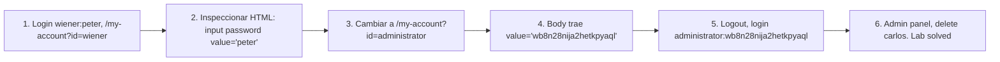

# Writeup: User ID controlled by request parameter with password disclosure (PortSwigger)

- **Lab**: User ID controlled by request parameter with password disclosure
- **URL**: https://portswigger.net/web-security/access-control/lab-user-id-controlled-by-request-parameter-with-password-disclosure
- **Categoría**: Access control / IDOR / Password disclosure / Privilege escalation chain
- **Dificultad**: Apprentice
- **Credenciales iniciales**: `wiener:peter`

---

## 1. Objetivo

Borrar al user `carlos` desde el admin panel. Para llegar al admin necesitamos su password. La app tiene dos bugs en cadena:

1. **IDOR**: `/my-account?id=<X>` no chequea ownership.
2. **Password disclosure en HTML**: el form de "change password" prefilla el `value` del input con el password actual en cleartext.

Combinados: pedir `/my-account?id=administrator` con sesión de wiener, leer el password del HTML, login como admin, delete carlos.

### Insight central

Un solo bug rara vez es el final del impacto. **Chaining**: IDOR horizontal (acceso a datos de otro user) se vuelve **vertical privesc** (control total) cuando el dato leakeado es una credencial. El IDOR aislado tiene impacto medio (data exposure); con password en HTML pasa a impacto crítico (account takeover de admin).

El segundo bug parece UX inocente: "prefillar el password para que el user no lo retipee al cambiar email u otros campos del form". Pero el server lo serializa en el HTML, expuesto a cualquiera que pueda renderizar la página de ese user. IDOR convierte "cualquiera que pueda renderizar" en "cualquier user autenticado".

---

## 2. Recon y resolución

### 2.1 Confirmar password disclosure en mi propia cuenta

Login `wiener:peter`, navegar a `/my-account?id=wiener`, F12 → Elements. El form trae:

```html
<input required type=password name=password value='peter'/>
```

Confirmado: el server inyecta el password actual del user en el atributo `value` del input. El browser muestra el campo enmascarado (caracteres como `••••••`) pero el HTML viaja en cleartext.

### 2.2 Explotar IDOR contra administrator

```
GET /my-account?id=administrator
Cookie: session=CwLLM4bN8HwptISiAR70zrqCSn2iHAbB
```

Response 200, body con la cuenta de administrator:

```html
<p>Your username is: administrator</p>
...
<form class="login-form" action="/my-account/change-password" method="POST">
    <input required type="hidden" name="csrf" value="zoKLcqVFqQack1q6QEPDWuGHimOIWLKS">
    <input required type=password name=password value='wb8n28nija2hetkpyaql'/>
    ...
</form>
```

Password admin: `wb8n28nija2hetkpyaql`.

### 2.3 Login y delete carlos

Logout de wiener, login `administrator:wb8n28nija2hetkpyaql`, panel admin, `Delete` junto a carlos. Lab solved.

---

## 3. Por qué funciona

### 3.1 Anatomía del bug de password disclosure

```python
# Antipatron - prerellenar value del password input
@app.route('/my-account')
@login_required
def my_account_broken():
    user = User.find(request.args['id'])
    return render_template('account.html', user=user)
```

```html
<!-- account.html -->
<input type="password" name="password" value="{{ user.password }}"/>
```

El bug está en serializar `user.password` al HTML. Pasa por:

1. **DB en cleartext** (peor de los pecados): no hash con bcrypt/argon2. La app puede leer el password porque lo guarda reversible.
2. **Render del template**: el ORM trae `User` con `password` poblado, el template helper lo escribe sin filtrar.

Cualquier app correcta hashea el password al crearlo y nunca lo recupera. Hash es one-way: comparás `bcrypt.verify(input, hash)`, jamás `hash → cleartext`.

### 3.2 Por qué la "máscara" del input no defiende

`<input type="password">` solo cambia cómo el browser **renderiza** los caracteres en pantalla (• en lugar de letras). El `value` se guarda y transmite en cleartext. Cualquier acción que lea el HTML (View Source, DevTools, scrapeo, intercept) lo ve. La máscara es UX para evitar shoulder surfing del propio user, no defensa contra el server.

### 3.3 Por qué se prerellena el password (UX antipattern)

El dev probablemente quiso: "si el user clickea Update email, no debería tener que retipear el password también". Solución correcta: tener forms separados para email y password (no compartir submission). O re-prompt del password sólo cuando hace falta.

Acá hay dos forms (`change-email` y `change-password`) pero el de password aun así trae el value precargado. No tiene sentido funcional: el user que quiere cambiar password va a tipear uno nuevo, no enviar el viejo. Es bug puro de implementación.

### 3.4 Implementación correcta

```python
# Fix - nunca enviar password al cliente
@app.route('/my-account')
@login_required
def my_account_safe():
    user = User.find(session['user_id'])  # tambien arregla IDOR
    return render_template('account.html', user=user)
```

```html
<!-- account.html -->
<form action="/my-account/change-password" method="POST">
    <label>Current password</label>
    <input type="password" name="current" required>
    <label>New password</label>
    <input type="password" name="new" required>
</form>
```

Password nunca sale del server. Para cambiar password, requerir current + new.

### 3.5 Otras formas de password leak en HTML

- `value` en input (este caso).
- Hidden field para "verificación".
- JSON embedded en `<script>`: `window.user = {password: "..."}`.
- Form action que pre-rellena auth en URL: `<form action="/api?token=...">`.
- Comments HTML con dump de debug: `<!-- {"username":"admin","password":"..."} -->`.
- Sourcemaps con strings de seed.
- Logs en DevTools console del frontend.

### 3.6 Chain horizontal → vertical privesc

| Lab | Vector inicial | Resultado |
|---|---|---|
| `user-id-controlled-by-request-parameter` | IDOR `?id=carlos` | API key de carlos (horizontal, data) |
| `...with-unpredictable-user-ids` | IDOR + GUID leak en blog | API key de carlos (horizontal, data) |
| `...with-data-leakage-in-redirect` | IDOR + body en 302 | API key de carlos (horizontal, data) |
| **`...with-password-disclosure` (este)** | IDOR + password en HTML | **Account takeover de admin (vertical, control)** |

El cambio de impacto viene de la **categoría del dato leakeado**. API key del blog sólo da acceso a la API; password de admin permite ejecutar acciones admin (delete users). Sin moverse del bug raíz.

---

## 4. Resumen



Tres ideas:

1. **Bugs en cadena cambian categoría de impacto**: IDOR aislado es info disclosure; con un segundo bug que leakea credenciales pasa a privesc total. Threat models tienen que considerar combinaciones, no bugs aislados.
2. **Password en cleartext del lado server es el pecado original**: si la DB guarda passwords reversibles (sin hash), cualquier render del user object es leak potencial. Hash one-way con bcrypt/argon2/scrypt elimina la categoría entera.
3. **Máscara del input no es seguridad**: `type="password"` cambia render visual; el `value` viaja en cleartext en el HTML. Cualquier serialización del campo password al cliente es disclosure.

---

## 5. Contramedidas

1. **Hash one-way** del password al registro/cambio: bcrypt, argon2id, scrypt. No usar MD5/SHA-1/SHA-256 sin salt.
2. **Nunca enviar el password al cliente**: ni en HTML, ni en JSON, ni en logs, ni en comments. Para cambiar password, pedir current + new.
3. **Forms separados por concern**: change-email no debe pedir password (o re-auth con flow dedicado, no precargado).
4. **Authz check antes de cargar el recurso**: si IDOR no existe, password disclosure local sólo afecta al propio user.
5. **DAST/SAST**: regla que detecta `name="password"` con `value=` no vacío en HTML response, o `password` populado en JSON salido del server.
6. **CSP** que prohíba inline scripts: dificulta exfiltración del password vía XSS si llega a estar en el DOM.
7. **Tests automatizados de access control**: por cada endpoint con `?id=`, verificar response no contiene strings sensibles del recurso de otro user.
8. **Logging restrictivo**: middleware que enmascara campos `password`, `token`, `key` antes de loggear request/response bodies.

---

## 6. Referencias

- PortSwigger Web Security Academy. (s.f.). *Lab: User ID controlled by request parameter with password disclosure*. https://portswigger.net/web-security/access-control/lab-user-id-controlled-by-request-parameter-with-password-disclosure
- PortSwigger Web Security Academy. (s.f.). *Insecure direct object references*. https://portswigger.net/web-security/access-control/idor
- OWASP Foundation. (2021). *A01:2021 - Broken Access Control*. https://owasp.org/Top10/A01_2021-Broken_Access_Control/
- OWASP Foundation. (2021). *A02:2021 - Cryptographic Failures*. https://owasp.org/Top10/A02_2021-Cryptographic_Failures/
- OWASP Foundation. (s.f.). *Password Storage Cheat Sheet*. https://cheatsheetseries.owasp.org/cheatsheets/Password_Storage_Cheat_Sheet.html
- OWASP Foundation. (s.f.). *Authentication Cheat Sheet*. https://cheatsheetseries.owasp.org/cheatsheets/Authentication_Cheat_Sheet.html
- MITRE Corporation. (2024). *CWE-639: Authorization Bypass Through User-Controlled Key*. https://cwe.mitre.org/data/definitions/639.html
- MITRE Corporation. (2024). *CWE-256: Plaintext Storage of a Password*. https://cwe.mitre.org/data/definitions/256.html
- MITRE Corporation. (2024). *CWE-200: Exposure of Sensitive Information to an Unauthorized Actor*. https://cwe.mitre.org/data/definitions/200.html
- MITRE Corporation. (2024). *CWE-522: Insufficiently Protected Credentials*. https://cwe.mitre.org/data/definitions/522.html
- Stuttard, D., & Pinto, M. (2011). *The Web Application Hacker's Handbook* (2nd ed.). Wiley. Cap. 8 (Attacking Access Controls).
- Inventario interno (par cross-fase):
  - [`inventario/03-analisis-vulnerabilidades/web/analisis-idor.md`](../../../inventario/03-analisis-vulnerabilidades/web/analisis-idor.md)
  - [`inventario/04-explotacion/web/explotacion-idor.md`](../../../inventario/04-explotacion/web/explotacion-idor.md)
- Inventario interno (umbrella): [`inventario/04-explotacion/web/explotacion-broken-access-control.md`](../../../inventario/04-explotacion/web/explotacion-broken-access-control.md)
- Labs hermanos del cluster IDOR:
  - [`learning/portswigger/user-id-controlled-by-request-parameter/writeup.md`](../user-id-controlled-by-request-parameter/writeup.md)
  - [`learning/portswigger/user-id-controlled-by-request-parameter-with-unpredictable-user-ids/writeup.md`](../user-id-controlled-by-request-parameter-with-unpredictable-user-ids/writeup.md)
  - [`learning/portswigger/user-id-controlled-by-request-parameter-with-data-leakage-in-redirect/writeup.md`](../user-id-controlled-by-request-parameter-with-data-leakage-in-redirect/writeup.md)
