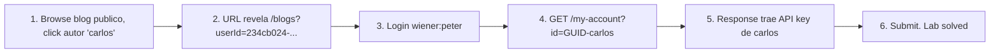

# Writeup: User ID controlled by request parameter, with unpredictable user IDs (PortSwigger)

- **Lab**: User ID controlled by request parameter, with unpredictable user IDs
- **URL**: https://portswigger.net/web-security/access-control/lab-user-id-controlled-by-request-parameter-with-unpredictable-user-ids
- **Categoría**: Access control / IDOR / Horizontal privilege escalation / GUID leak
- **Dificultad**: Apprentice
- **Credenciales**: `wiener:peter`

---

## 1. Objetivo

Mismo IDOR del lab anterior pero los users se identifican con GUIDs (UUIDs) en lugar de usernames. Cambiar `?id=carlos` no funciona; el endpoint pide el GUID exacto. Para resolver: encontrar el GUID de carlos y pasarlo en `/my-account?id=<GUID>`.

### Insight central

Los IDs random (UUID v4) tienen 122 bits de entropía: no son enumerables por brute-force. Pero **eso no soluciona el IDOR**. El bug sigue siendo que el server confía en el ID del cliente como autoridad de ownership. Si el atacante consigue el GUID del target por cualquier vía (leaks en HTML, JSON, logs, referer, sharing públicos), el IDOR se explota igual. UUIDs son defensa-en-profundidad, no reemplazo de authz check.

En este lab el leak está a la vista: el blog público linkea cada post a `/blogs?userId=<GUID>` para listar posts del autor. Un click revela el GUID.

---

## 2. Recon y resolución

### 2.1 Buscar leaks del GUID de carlos

Sin login, navegar al blog del lab. Posts firmados por `carlos` linkean al autor:

```
https://<lab>.web-security-academy.net/blogs?userId=234cb024-298a-43fc-8ca1-3acb74322e36
```

GUID extraído: `234cb024-298a-43fc-8ca1-3acb74322e36`.

### 2.2 Login y tampering

```
POST /login
username=wiener&password=peter
```

Una vez logueado, request a `/my-account` con el GUID de carlos:

```
GET /my-account?id=234cb024-298a-43fc-8ca1-3acb74322e36
Cookie: session=<wiener-session>
```

Response 200: `Your username is: carlos`, `Your API Key is: 5Kdgi2v7XilvaBdBTwgdNzvxG1ahw6ej`. Submit la API key. Lab solved.

---

## 3. Por qué funciona

### 3.1 IDs random no son control de acceso

UUID v4 tiene ~5.3×10^36 valores posibles. Brute-force directo no es viable. Pero el atacante no necesita forzar: necesita el ID concreto del target. Si la app expone ese ID en cualquier superficie pública o accesible, el random pierde valor.

Superficies típicas que filtran user IDs:

- **Author links en blogs/foros**: `/posts?author=<UUID>`, `/users/<UUID>`, `/profile/<UUID>`.
- **Comentarios firmados**: cada comment trae `{authorId: "<UUID>", ...}` en JSON embebido.
- **Mentions / @tags**: `<a href="/users/<UUID>">@carlos</a>`.
- **API responses con expansión**: `/posts?expand=author` devuelve `author.id` lleno.
- **Shared resources**: link público a "perfil de carlos" para SEO o reviews.
- **Referer header**: si carlos navegó desde su perfil, el referer leakea su GUID al destino.
- **Logs de acceso, error pages, sourcemaps**.

Cualquiera de esas superficies vuelve el random ID equivalente a un username.

### 3.2 La fix correcta sigue siendo authz por objeto

```python
# Antipatron - confia en el cliente
@app.route('/my-account')
@login_required
def my_account_broken():
    user = User.find(request.args['id'])  # cliente lo controla
    return render_template('account.html', user=user)

# Fix correcto - derivar de sesion (no necesita id)
@app.route('/my-account')
@login_required
def my_account_safe():
    user = User.find(session['user_id'])
    return render_template('account.html', user=user)
```

UUID v4 vs ID secuencial **no cambia esta implementación**. El bug es la línea `request.args['id']`, no el formato del ID.

### 3.3 Cuándo UUIDs sí ayudan (defensa-en-profundidad real)

UUID v4 random previene escenarios donde el ID **no leakea** y el atacante intenta enumeración a ciegas:

- Endpoints internos que nunca se exponen (gestión interna, jobs).
- Recursos accesibles solo por link compartido directamente (Google Drive "anyone with the link").
- Casos donde el ownership es el dueño + invitados explícitos, y el ID nunca aparece en superficies públicas.

En esos casos, UUID v4 hace la enumeración inviable. Pero solo si la app **realmente** no leakea el ID. En este lab no aplica: el blog público lo expone.

### 3.4 UUID v1 es enumerable

UUID v1 incluye timestamp + MAC del nodo generador. Si conocés un UUID legítimo, podés generar variantes cercanas en el tiempo (mismo nodo, segundos vecinos) y reducir el espacio de búsqueda de 2^122 a unos pocos miles. Por eso v4 (random) es la única variante segura para IDs públicos.

### 3.5 Diferencia con el lab predecesor

| Aspecto | Lab anterior (`user-id-controlled-by-request-parameter`) | Este lab (`...with-unpredictable-user-ids`) |
|---|---|---|
| ID format | username (`carlos`) | UUID v4 (`234cb024-...`) |
| Discovery | trivial (sabés el username target) | requiere recon (encontrar leak del GUID) |
| Bug subyacente | mismo: server confía en `request.args['id']` | mismo |
| Fix | mismo: derivar de sesión | mismo |
| Lección | IDOR canónico | UUID random no reemplaza authz |

---

## 4. Resumen



Tres ideas:

1. **Random IDs no son authz**: si el server no chequea ownership, el formato del ID es irrelevante una vez que el atacante lo conoce.
2. **El leak siempre existe**: algún endpoint público va a exponer el ID (autores, comments, sharing, mentions). Diseñar como si el ID fuera público.
3. **Recon en IDOR variantes**: el flujo de explotación es: identificar el endpoint vulnerable, identificar el ID del target, sustituir. Si los IDs son random, el segundo paso pasa de trivial a recon dirigido, pero rara vez es bloqueante.

---

## 5. Contramedidas

1. **Authz check por objeto**: `recurso.owner_id == session['user_id']` en cada query.
2. **Derivar target de sesión cuando es self-only**: `/my-account` sin parámetros.
3. **UUID v4 random** para IDs públicos: cuando la enumeración es un riesgo real (no es lo principal, pero suma como defensa-en-profundidad).
4. **Indirection layer** por sesión: tokens random per-session que mapean a IDs internos. Útil cuando el ID interno no debe exponerse al cliente.
5. **No exponer IDs en URLs públicas si se puede evitar**: usar slugs human-readable separados (`/blog/carlos`) que no sirven como key de authz.
6. **Audit logging**: detectar accesos cruzados (user A accede a recursos de user B) por anomalía.
7. **Tests automatizados de access control**: por cada endpoint de recurso, verificar que session de user A no puede leer recurso de user B, sin importar el formato del ID.

---

## 6. Referencias

- PortSwigger Web Security Academy. (s.f.). *Lab: User ID controlled by request parameter, with unpredictable user IDs*. https://portswigger.net/web-security/access-control/lab-user-id-controlled-by-request-parameter-with-unpredictable-user-ids
- PortSwigger Web Security Academy. (s.f.). *Insecure direct object references*. https://portswigger.net/web-security/access-control/idor
- OWASP Foundation. (s.f.). *Insecure Direct Object Reference Prevention Cheat Sheet*. https://cheatsheetseries.owasp.org/cheatsheets/Insecure_Direct_Object_Reference_Prevention_Cheat_Sheet.html
- OWASP Foundation. (s.f.). *API1:2023 Broken Object Level Authorization*. https://owasp.org/API-Security/editions/2023/en/0xa1-broken-object-level-authorization/
- OWASP Foundation. (2021). *A01:2021 - Broken Access Control*. https://owasp.org/Top10/A01_2021-Broken_Access_Control/
- IETF. (2005). *RFC 4122: A Universally Unique IDentifier (UUID) URN Namespace*. https://datatracker.ietf.org/doc/html/rfc4122
- MITRE Corporation. (2024). *CWE-639: Authorization Bypass Through User-Controlled Key*. https://cwe.mitre.org/data/definitions/639.html
- MITRE Corporation. (2024). *CWE-340: Generation of Predictable Numbers or Identifiers*. https://cwe.mitre.org/data/definitions/340.html
- MITRE Corporation. (2024). *CWE-284: Improper Access Control*. https://cwe.mitre.org/data/definitions/284.html
- Stuttard, D., & Pinto, M. (2011). *The Web Application Hacker's Handbook* (2nd ed.). Wiley. Cap. 8 (Attacking Access Controls).
- Inventario interno (par cross-fase):
  - [`inventario/03-analisis-vulnerabilidades/web/analisis-idor.md`](../../../inventario/03-analisis-vulnerabilidades/web/analisis-idor.md)
  - [`inventario/04-explotacion/web/explotacion-idor.md`](../../../inventario/04-explotacion/web/explotacion-idor.md)
- Inventario interno (umbrella): [`inventario/04-explotacion/web/explotacion-broken-access-control.md`](../../../inventario/04-explotacion/web/explotacion-broken-access-control.md)
- Lab hermano (variante con username): [`learning/portswigger/user-id-controlled-by-request-parameter/writeup.md`](../user-id-controlled-by-request-parameter/writeup.md)
