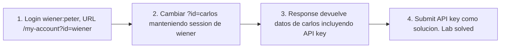

# Writeup: User ID controlled by request parameter (PortSwigger)

- **Lab**: User ID controlled by request parameter
- **URL**: https://portswigger.net/web-security/access-control/lab-user-id-controlled-by-request-parameter
- **Categoría**: Access control / IDOR / Horizontal privilege escalation
- **Dificultad**: Apprentice
- **Credenciales**: `wiener:peter`

---

## 1. Objetivo

Obtener la API key de `carlos`. La página `/my-account?id=wiener` muestra los datos de la cuenta cuyo `id` viene en la URL. El server toma ese `id` como autoridad de quién es el dueño del recurso, sin validar contra la sesión. Cambiando `id=wiener` por `id=carlos`, vemos los datos de carlos. IDOR canónico.

### Insight central

El server usa el parámetro `id` del cliente para ambas cosas: **identificar el recurso a leer** y **autorizar al cliente a leerlo**. El primer uso es legítimo (el server necesita saber qué cuenta cargar). El segundo es la vuln (el server asume que el cliente solo manda IDs propios). Authz debería derivar de la sesión, no del input.

---

## 2. Recon y resolución

URL legítima tras login: `/my-account?id=wiener`. Cambio en browser/curl:

```
GET /my-account?id=carlos
Cookie: session=<wiener-session>
```

Response 200 con: `Your username is: carlos`, `Your API Key is: W3iPZEiO36vW0noHxeG6I46uAxkh050Z`. Submit la API key como solución. Banner pasa a `is-solved`.

Una sola request. Sin fricción.

---

## 3. Por qué funciona

### 3.1 Confusión entre identificar y autorizar

Dos preguntas que el server tiene que separar:

1. **¿Qué objeto cargo?** → puede venir del cliente (URL, body, query param).
2. **¿Tiene este cliente permiso de ver/modificar este objeto?** → tiene que derivarse de la sesión, comparado contra el ownership del objeto.

Cuando ambas se contestan con el mismo dato del cliente, hay IDOR. El server hace `User.find(request.args['id'])` y devuelve el resultado, sin comparar contra `session['user_id']`.

### 3.2 Implementación correcta

```python
# Antipatron
@app.route('/my-account')
@login_required
def my_account_broken():
    user = User.find_by_username(request.args['id'])  # cliente lo controla
    return render_template('account.html', user=user)

# Implementacion correcta - derivar de sesion
@app.route('/my-account')
@login_required
def my_account_safe():
    user = User.find(session['user_id'])  # de la sesion, no del cliente
    return render_template('account.html', user=user)

# Si necesitas ver perfil de otro user (admin viendo profiles)
@app.route('/admin/users/<int:user_id>')
@require_admin
def admin_view_user(user_id):
    user = User.find(user_id)
    return render_template('admin/user.html', user=user)

# Si user A puede compartir su perfil con user B explicitamente
@app.route('/profile/<int:profile_id>')
@login_required
def view_profile(profile_id):
    profile = Profile.find(profile_id)
    if not profile.is_public and profile.owner_id != session['user_id']:
        abort(403)
    return render_template('profile.html', profile=profile)
```

Tres patterns:

1. **Self-only access**: target del recurso = `session['user_id']`. URL no necesita `?id=`.
2. **Admin access a otros**: endpoint separado con permission check.
3. **Sharing entre users**: ownership check explícito, opt-in del owner.

### 3.3 El parámetro `id` no debería ni existir

La URL `/my-account?id=wiener` es semánticamente redundante: la sesión ya identifica al user. El `?id=` es un smell que sugiere que el dev tomó atajos compartiendo endpoint para "self" y "other". La fix más simple: `/my-account` sin params, derivar de sesión.

### 3.4 Patrón general

IDOR aparece en cualquier endpoint donde el ID del recurso se mande explícito:

- `?orderId=42` → otras órdenes.
- `?invoiceId=99` → invoices ajenos.
- `?messageId=123` → DMs.
- `/api/users/42/photos` → photos de user 42.
- `?ticketId=ABC` → tickets de soporte ajenos.

La regla universal: **authz por objeto, no por endpoint**. Cada query a la DB se acompaña de un check de ownership o permission. ORMs maduros (Rails CanCanCan, Django Guardian, Laravel Policies) automatizan esto.

### 3.5 Comparación con labs hermanos del cluster

| Lab | Vector | Tipo de privesc |
|---|---|---|
| Unprotected admin | Path leakea, sin auth | Vertical (anónimo → admin) |
| User role controlled by parameter | Cookie `Admin=true` | Vertical (user → admin) |
| User role can be modified in profile | Mass assignment de `roleid` | Vertical (user → admin) |
| **User ID controlled by request parameter (este)** | URL param `?id=carlos` | **Horizontal** (user → otro user) |

Primer lab horizontal del cluster: no escalamos a admin, accedemos lateralmente a otro user del mismo nivel.

---

## 4. Resumen



Tres ideas:

1. **Identificar y autorizar son cosas distintas**. Identificar puede venir del cliente. Autorizar siempre del server.
2. **Endpoints "self-service" no necesitan `?id=`**: si el endpoint solo trabaja sobre el user actual, derivar de sesión y no exponer ID. Reduce superficie.
3. **IDOR es la sub-categoría más prevalente de Broken Access Control**: cada endpoint que toca recursos por ID es candidato. Tests automatizados de access control deberían cubrir TODOS esos endpoints.

---

## 5. Contramedidas

1. **Authz check por objeto**: `recurso.owner_id == session['user_id']` antes de devolver/modificar.
2. **Derivar target de sesión cuando el endpoint es self-only**: no aceptar `?id=` si no hace falta.
3. **Endpoints separados por authz domain**: `/me`, `/users/:id` (admin), `/profile/:id` (público).
4. **UUID v4 en lugar de IDs secuenciales**: defensa-en-profundidad, no reemplaza authz.
5. **Audit logging** de accesos a recursos: detectar enumeración.
6. **Tests automatizados**: por cada endpoint de recurso, verificar que user A no accede recurso de user B.
7. **Authorization framework**: Rails CanCanCan / Pundit, Django Guardian, Laravel Policies, OPA. Centraliza decisiones, evita olvidos.

---

## 6. Referencias

- PortSwigger Web Security Academy. (s.f.). *Lab: User ID controlled by request parameter*. https://portswigger.net/web-security/access-control/lab-user-id-controlled-by-request-parameter
- PortSwigger Web Security Academy. (s.f.). *Insecure direct object references*. https://portswigger.net/web-security/access-control/idor
- OWASP Foundation. (s.f.). *Insecure Direct Object Reference Prevention Cheat Sheet*. https://cheatsheetseries.owasp.org/cheatsheets/Insecure_Direct_Object_Reference_Prevention_Cheat_Sheet.html
- OWASP Foundation. (s.f.). *API1:2023 Broken Object Level Authorization*. https://owasp.org/API-Security/editions/2023/en/0xa1-broken-object-level-authorization/
- OWASP Foundation. (2021). *A01:2021 - Broken Access Control*. https://owasp.org/Top10/A01_2021-Broken_Access_Control/
- MITRE Corporation. (2024). *CWE-639: Authorization Bypass Through User-Controlled Key*. https://cwe.mitre.org/data/definitions/639.html
- MITRE Corporation. (2024). *CWE-284: Improper Access Control*. https://cwe.mitre.org/data/definitions/284.html
- Stuttard, D., & Pinto, M. (2011). *The Web Application Hacker's Handbook* (2nd ed.). Wiley. Cap. 8 (Attacking Access Controls).
- Inventario interno (par cross-fase):
  - [`inventario/03-analisis-vulnerabilidades/web/analisis-idor.md`](../../../inventario/03-analisis-vulnerabilidades/web/analisis-idor.md)
  - [`inventario/04-explotacion/web/explotacion-idor.md`](../../../inventario/04-explotacion/web/explotacion-idor.md)
- Inventario interno (umbrella): [`inventario/04-explotacion/web/explotacion-broken-access-control.md`](../../../inventario/04-explotacion/web/explotacion-broken-access-control.md)
