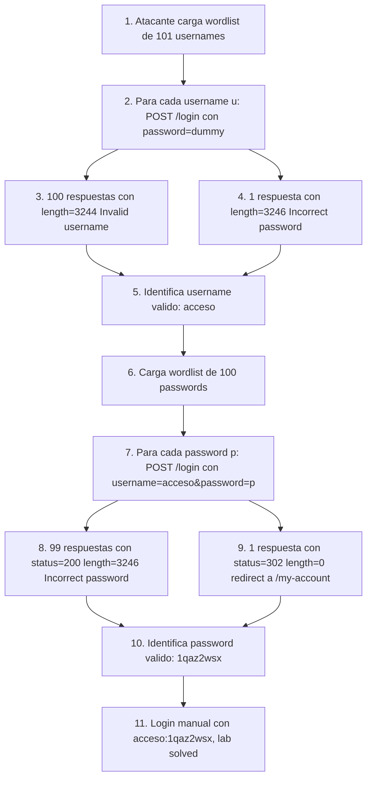

# Writeup: Username enumeration via different responses (PortSwigger)

- **Lab**: Username enumeration via different responses
- **URL**: https://portswigger.net/web-security/authentication/password-based/lab-username-enumeration-via-different-responses
- **Categoría**: Authentication / Username enumeration por side-channel + brute-force de password
- **Dificultad**: Apprentice
- **Credenciales**: las descubre el ataque (`acceso:1qaz2wsx` en mi instancia)

---

## 1. Objetivo

El lab tiene un login form. Cuando se envía un username **inexistente**, el server responde "Invalid username". Cuando se envía un username **existente** pero con password incorrecto, responde "Incorrect password". Esa diferencia textual divide el espacio de búsqueda en dos: primero se enumeran qué usernames son válidos vía el side-channel; después se brute-forcea el password sólo del username válido.

PortSwigger provee dos wordlists oficiales en la página del lab: ~100 usernames candidatos y ~100 passwords candidatos. Con el side-channel, el ataque es 100 + 100 = 200 requests. Sin él, sería 100 × 100 = 10.000 requests. **Reducción de 50x** sólo por explotar la diferencia.

### El insight central

La uniformidad de respuesta en errores de autenticación no es estética: es defensiva. Cualquier asimetría observable entre "username inválido" y "password inválido" (texto, longitud, status code, timing, headers, cookies) entrega al atacante exactamente la información que más le sirve: la mitad del espacio de credenciales.

---

## 2. Reconocimiento

Capturar el POST `/login` desde el navegador después de intentar loguear con cualquier username/password. Body típico:

```
username=test&password=test
```

Probar manualmente dos casos:

| Submit | Respuesta visible | Length |
|---|---|---|
| `username=test&password=test` | "Invalid username" | 3244 |
| `username=carlos&password=test` (asumiendo carlos existe) | "Incorrect password" | 3246 |

La diferencia textual es obvia y dispara la idea del side-channel. Más útil para automatizar: la diferencia de **longitud** (2 bytes en este lab, igual a la diferencia de longitud entre los strings "Invalid username" y "Incorrect password"). El status code no varía (los dos son 200 OK), por lo que la única señal automatizable es length. Eso ya alcanza.

---

## 3. Resolución

### 3.1 Por qué Burp Community no escala

Burp Community throttlea Intruder a ~1 req/s. 100 + 100 requests = ~3-4 minutos en cada fase, con la fricción de copiar wordlists y armar payload positions. Para este patrón (dos fases de brute-force con outlier-detection), un script con concurrencia limitada termina ambas fases en ~10 segundos.

### 3.2 Script de ataque

`bruteforce.py` en este mismo directorio. Estructura:

1. **Sesión HTTP** con `requests` + `urllib3` retry adapter, 20 workers concurrentes.
2. **Fase 1 (enumeración)**: para cada username del wordlist, POST `/login` con `password=invalid_dummy_pwd`. Registra `(status, length)` por respuesta. Identifica el outlier (cuyo `(status, length)` no matchea el modo).
3. **Fase 2 (brute-force)**: con el username válido descubierto, itera passwords. El intento exitoso devuelve un `(status, length)` distinto al "Incorrect password" (típicamente `302` con redirect a `/my-account`).
4. Imprime `username:password` final.

Uso:

```bash
python3 bruteforce.py <lab-host> usernames.txt passwords.txt
```

Output del run real:

```
[*] Fase 1 (enum usernames): probando 101 candidatos (workers=20)...
[*] distribucion (status,length): {(200, 3244): 100, (200, 3246): 1}
[+] username valido: acceso  (status=200, len=3246)

[*] Fase 2 (brute pwd): probando 100 candidatos (workers=20)...
[*] distribucion (status,length): {(200, 3246): 99, (302, 0): 1}
[+] password valido: 1qaz2wsx  (status=302, len=0)

[+] credenciales: acceso:1qaz2wsx
```

### 3.3 Lectura del output

**Fase 1**: 100 usernames produjeron `(200, 3244)` ("Invalid username"); uno produjo `(200, 3246)` ("Incorrect password"). El delta de length es exactamente 2 bytes, igual a `len("Incorrect password") - len("Invalid username")`. Side-channel limpio.

**Fase 2**: 99 passwords produjeron `(200, 3246)` ("Incorrect password"); uno produjo `(302, 0)` (redirect a `/my-account` con body vacío). El cambio de status code (200 → 302) es la firma más fuerte del login exitoso; el length=0 confirma (los redirects no llevan body).

### 3.4 Login final

Con `acceso:1qaz2wsx` en el form del navegador → redirect a `/my-account?id=acceso` → lab marca como Solved.

---

## 4. Por qué funciona

### 4.1 Side-channels en autenticación

Side-channel = canal de información no intencional que el sistema expone como subproducto de su comportamiento. En autenticación, son la categoría más explotable:

| Side-channel | Cómo se observa | Cómo se cierra |
|---|---|---|
| Texto del error ("Invalid username" vs "Incorrect password") | Lectura directa del body | Mensaje genérico único: "Invalid credentials" |
| Length del body | `Content-Length` o `len(response.text)` | Mensaje genérico de longitud fija (incluyendo whitespace control) |
| Status code (200 vs 302 vs 401 según rama) | `response.status_code` | Mismo status para todas las ramas de fallo |
| Timing (bcrypt sólo si user existe) | Medición de latencia | Hash dummy en rama "user not found"; bcrypt cost igual en ambas ramas |
| Cookies set (sesión preliminar sólo si user existe) | `Set-Cookie` headers | No setear cookies hasta auth completa |
| Rate-limiting per-username (lockout sólo si user existe) | Comportamiento del 5to intento | Rate-limit por IP, no por username (o ambos) |
| Existencia de endpoint de password reset | `/reset-password?email=X` con respuestas distintas | Mensaje uniforme aunque el email no exista |

Los labs de PortSwigger suelen mostrar uno solo a la vez (acá: texto + length). En sistemas reales múltiples coexisten y se combinan; el atacante usa el más fácil de observar.

### 4.2 Por qué la fix correcta es respuesta uniforme + constant time

La defensa principal: que el server responda **idénticamente** para todas las ramas de fallo. Implementación:

```python
def login(username, password):
    user = db.find_user(username)
    if user is None:
        # NO retornar inmediatamente. Hashear contra dummy para
        # mantener tiempo constante.
        bcrypt.checkpw(password.encode(), DUMMY_HASH)
        return generic_error("Invalid credentials")
    if not bcrypt.checkpw(password.encode(), user.hash):
        return generic_error("Invalid credentials")
    return success(user)
```

La rama "user not found" hace **el mismo trabajo computacional** que la rama "user found, wrong password". Sin ese hash dummy, un atacante mide latencia: respuestas rápidas indican username inválido (short-circuit antes del bcrypt), respuestas lentas indican username válido. Side-channel timing.

`generic_error` devuelve siempre el mismo body, status 401, sin Set-Cookie, sin headers diferenciadores.

### 4.3 Rate limiting es ortogonal pero no opcional

Aunque la respuesta sea uniforme, un atacante con la wordlist correcta y suficiente paciencia eventualmente acertará. Las defensas complementarias:

- **Rate limiting por IP** + **per-username** (los dos, no uno o el otro). Per-IP solo permite distributed brute-force; per-username solo facilita username enumeration por lockout differential.
- **Captcha después de N fallos** (3-5 típicamente). Bloquea automatización pero no afecta UX legítima.
- **Cuenta-lockout temporal** con jitter (no exactamente 5 minutos, sino entre 4 y 6) para no entregar timing exacto.
- **MFA** después del login exitoso. Si el atacante adivina el password, igual no entra.
- **Notificación al usuario** ante login desde IP nueva. Detección post-explotación.
- **Análisis de patrones** (UEBA): un cliente que prueba 50 usernames distintos en 10 segundos es claramente un atacante, sin importar si los strings parecen legítimos.

### 4.4 Comparación con password spraying

Password spraying invierte el problema: en vez de fijar username e iterar passwords (lo que dispara lockouts per-user), fija un password común (`Spring2024!`) e itera usernames. Cada username recibe un solo intento, evitando rate limit per-user. Útil contra políticas que sólo bloquean per-user.

Este lab no requiere spraying porque no hay rate limit per-user; el ataque clásico (fijar password dummy, iterar usernames) funciona porque:

1. La diferencia de respuesta divide el espacio.
2. No hay lockout que penalice múltiples intentos al mismo username (en fase 2, los 100 intentos contra `acceso` no disparan nada).

En sistemas reales con lockout, hay que combinar enumeración + spraying: enum con un password dummy compartido por todos (inocuo, no aumenta el contador de intentos malos), spraying con uno o dos passwords comunes. El ratio de descubrimiento baja pero sigue siendo viable.

---

## 5. Resumen de la cadena



Tres ideas para llevarse:

1. **Side-channels en auth son la categoría más explotable**. Texto, length, status, timing, cookies, lockout-differential, headers: todos cuentan. La defensa es respuesta literalmente idéntica más constant time.
2. **Username enumeration multiplica el ROI del brute-force por el tamaño de la wordlist de usernames**. 50x en este lab; en producción real puede ser 1000x si la wordlist de usernames es más grande.
3. **Rate limiting + captcha + MFA son ortogonales a la respuesta uniforme** y se acumulan. Diseñar como capas, no como alternativas.

---

## 6. Contramedidas

En orden de robustez:

1. **Mensaje de error genérico único** para todas las ramas de fallo de auth: "Invalid credentials". Mismo texto, mismo status (típicamente 401), mismo length, sin Set-Cookie diferenciado, sin headers que cambien.
2. **Constant-time response**: en la rama "user not found", hashear el password contra un hash dummy precomputado para que el tiempo total iguale al de la rama "user found, wrong password". Sin esto, timing attack reemplaza el text-based.
3. **Rate limiting per-IP + per-username** combinados. Per-username con jitter para no entregar timing exacto del lockout.
4. **Captcha después de 3-5 fallos** desde la misma IP o contra el mismo username. Bloquea automatización sin afectar usuarios legítimos.
5. **MFA obligatorio para todas las cuentas, no opcional**. Aunque el atacante adivine username y password, no entra sin el segundo factor.
6. **Logging y alertas** de patrones anómalos: 100 intentos fallidos desde la misma IP en 10 segundos, distribución de usernames probados que matchea wordlists conocidos.
7. **No exponer endpoints de auxiliares** (forgot-password, signup, account-recovery) que devuelvan distinto según existencia del username/email.

---

## 7. Referencias

- PortSwigger Web Security Academy. (s.f.). *Lab: Username enumeration via different responses*. https://portswigger.net/web-security/authentication/password-based/lab-username-enumeration-via-different-responses
- PortSwigger Web Security Academy. (s.f.). *Vulnerabilities in password-based login*. https://portswigger.net/web-security/authentication/password-based
- OWASP Foundation. (s.f.). *Authentication Cheat Sheet*. https://cheatsheetseries.owasp.org/cheatsheets/Authentication_Cheat_Sheet.html
- OWASP Foundation. (s.f.). *Forgot Password Cheat Sheet*. https://cheatsheetseries.owasp.org/cheatsheets/Forgot_Password_Cheat_Sheet.html
- OWASP Foundation. (s.f.). *WSTG-IDNT-04: Testing for Account Enumeration and Guessable User Account*. https://owasp.org/www-project-web-security-testing-guide/stable/4-Web_Application_Security_Testing/03-Identity_Management_Testing/04-Testing_for_Account_Enumeration_and_Guessable_User_Account
- MITRE Corporation. (2024). *CWE-204: Observable Response Discrepancy*. https://cwe.mitre.org/data/definitions/204.html
- MITRE Corporation. (2024). *CWE-307: Improper Restriction of Excessive Authentication Attempts*. https://cwe.mitre.org/data/definitions/307.html
- MITRE Corporation. (2024). *ATT&CK Technique T1110.001: Brute Force - Password Guessing*. https://attack.mitre.org/techniques/T1110/001/
- Stuttard, D., & Pinto, M. (2011). *The Web Application Hacker's Handbook* (2nd ed.). Wiley. Cap. 6 (Attacking Authentication).
- Inventario interno: [`inventario/04-explotacion/credenciales/explotacion-brute-force-advanced.md`](../../../inventario/04-explotacion/credenciales/explotacion-brute-force-advanced.md)
- Script: [`bruteforce.py`](bruteforce.py) en este directorio
