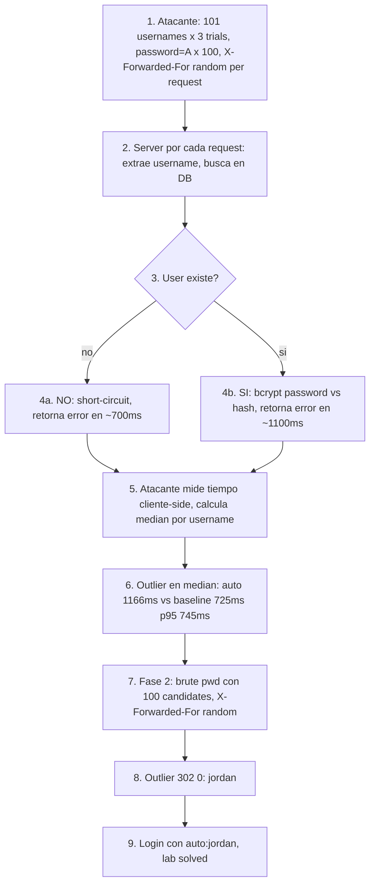

# Writeup: Username enumeration via response timing (PortSwigger)

- **Lab**: Username enumeration via response timing
- **URL**: https://portswigger.net/web-security/authentication/password-based/lab-username-enumeration-via-response-timing
- **Categoría**: Authentication / Username enumeration por timing differential + bypass de rate-limit con `X-Forwarded-For`
- **Dificultad**: Practitioner
- **Credenciales**: `auto:jordan` (descubiertas vía ataque)

---

## 1. Objetivo

Tercer lab de la serie de username enumeration. El server responde con body byte-idéntico y mismo status para username válido vs inválido, anulando todas las técnicas content-level de los labs anteriores. La única diferencia observable es **timing**: cuando el username es válido, el server invoca un hash criptográfico costoso (probablemente bcrypt o similar); cuando es inválido, hace short-circuit y vuelve rápido. Mandando un password razonablemente largo, la diferencia se vuelve estable y mensurable.

Adicional: el server tiene **rate-limit por IP**. Sin bypass, tras 5-10 intentos los responses pasan a ser de ~5 segundos uniformemente (block) o errores 429, contaminando la medición de timing. Bypass clásico: cabecera `X-Forwarded-For` con IP única por request, haciendo que el server crea que cada intento viene de un cliente distinto y no acumule en el contador del rate-limit.

### El insight central

Es el último nivel de la tabla de signals que armé en el writeup anterior:

| Nivel | Signal |
|---|---|
| 1 | Status code |
| 2 | Body length |
| 3 | Hash del body |
| 4 | Content extraído sin noise |
| 5 | Byte específico de un campo extraído |
| **6** | **Timing** |

Cuando el server es genuinamente uniforme en bytes (todos los niveles 1-5 fallan), el timing es la última frontera. La defensa correcta es **constant-time response** que iguala timing entre ramas (lo discutimos en el lab Apprentice de auth y vuelve acá con énfasis renovado).

---

## 2. Reconocimiento

Login form estándar (POST `/login`, `username` + `password`). Sin CSRF token. Una request manual con un username inventado y otra con `wiener` (mi cuenta) muestran responses idénticos a simple vista.

Hipótesis inicial: el server hace bcrypt sólo en rama "user existe". Predicción: con password no-trivial, los usernames válidos tendrán latencia mensurablemente mayor.

Para diseñar el ataque hacen falta dos piezas:
1. **Defeat el rate-limit** (sino los timings se ensucian sistemáticamente).
2. **Maximizar el delta de timing entre rama bcrypt vs short-circuit**, minimizando ruido de red.

---

## 3. Resolución

### 3.1 Bypass del rate-limit con `X-Forwarded-For`

El server probablemente lee la IP del cliente desde un header de proxy (`X-Forwarded-For`, `X-Real-IP`) y la usa como key del rate-limiter. Mandando una IP distinta por request, el rate-limiter ve "muchas IPs distintas" cada con un solo intento, no las acumula.

Implementación: para cada request, generar `X-Forwarded-For: <random IP>` antes de mandar.

```python
def random_ip() -> str:
    return f"{random.randint(1,254)}.{random.randint(0,254)}.{random.randint(0,254)}.{random.randint(1,254)}"

session.post(f'https://{host}/login', data=body, headers={'X-Forwarded-For': random_ip()})
```

### 3.2 Tres intentos de calibrado del password length

El hint del lab dice "set the password to a very long string of characters (about 100 characters should do it)". Lo importante aquí es **por qué 100 bytes y no más**. Probé tres configuraciones con resultados ilustrativos:

#### Intento 1: `pwd-bytes=50000`, `workers=8`

```
[*] median time global: 1086ms
[*] p95: 1166ms
[*] top 5 (mas lentos):
    admin                     1216ms
    adm                       1205ms
    test                      1200ms
    root                      1198ms
    mysql                     1166ms
```

Spread: 160ms. El "outlier" (admin) está sólo 50ms sobre p95. **Falso positivo**: con tantos workers concurrentes y payload de 50KB, el ruido dominaba el signal. La fase 2 confirmó que admin no era el válido (no hubo password match).

#### Intento 2: `pwd-bytes=1000000`, `workers=4`

```
[*] median time global: 1793ms
[*] p95: 1821ms
[*] top 5: agent 1831ms, puppet 1826ms, ec2-user 1825ms, ...
```

Spread: 70ms. Aún peor: el spread *disminuyó*. **Pasarse de password length amplifica el baseline (transferir 1MB lleva tiempo) sin amplificar el signal correspondientemente**. bcrypt está limitado a procesar los primeros 72 bytes del password (limit del algoritmo), así que 1MB no aumenta el costo del hash respecto a 100 bytes; sólo agrega 50-100ms de transmisión TCP, parsing, y variabilidad de red por request — uniforme entre válidos e inválidos. El signal-to-noise ratio cae.

#### Intento 3: `pwd-bytes=100`, `workers=1`

```
[*] median time global: 725ms
[*] p95: 745ms
[*] top 5 (mas lentos):
    auto                      1166ms      <-- ¡el outlier!
    alerts                    787ms
    att                       775ms
    aix                       770ms
    puppet                    745ms
```

Spread: 450ms. `auto` tomó 1166ms cuando el baseline está en 725ms y p95 en 745ms — **400ms sobre p95**, claramente fuera del jitter normal (~30-50ms). Outlier real, no ruido.

### 3.3 ¿Por qué 100 bytes y `workers=1` ganaron?

Tres factores:

1. **bcrypt no escala con password length más allá de ~72 bytes**. 100 bytes y 1MB cuestan lo mismo a bcrypt; pero 1MB cuesta más en transferencia y parsing, sumando noise uniforme que no aporta a la diferenciación.
2. **Workers concurrentes pelean por bandwidth y server threads**. Con la misma conexión TCP haciendo múltiples requests en paralelo, hay queueing, congestion control y server-side scheduling jitter. Un solo worker sequential elimina esa fuente de variabilidad.
3. **Red noise crece con response/request size**. Mantener payload chico minimiza el efecto de TCP windowing, packet scheduling, etc.

Combinado: el delta real (~400ms de bcrypt diff) sobrevive como porcentaje grande del baseline (725ms), claramente separable del jitter sequential (~30ms).

### 3.4 Fase 2: brute-force del password

Con `auto` como username válido, brute-force de la wordlist de passwords. Acá el signal vuelve a ser fingerprint `(status, length)`: el redirect a `/my-account` cambia status a 302.

```
[*] distribucion (status,length): top=[((200, 3245), 75), ((200, 3253), 24), ((302, 0), 1)]

[+] credenciales: auto:jordan
```

Tres clusters interesantes:

- `(200, 3245)`: 75 passwords. Probablemente "Invalid username or password" para passwords incorrectos.
- `(200, 3253)`: 24 passwords. 8 bytes más. Posiblemente refleja parte del username/password en el body (e.g., "Try again, USERNAME") con length proporcional.
- `(302, 0)`: 1 password (`jordan`). Login exitoso, redirect a `/my-account`.

El cluster del 8-byte-larger es side-effect: con username válido, el server puede mostrar mensajes ligeramente más informativos. Confirma que `auto` es realmente válido (si no fuera, todos los responses se distribuirían en un solo bucket).

### 3.5 Login final

`auto:jordan` en el form del navegador → redirect a `/my-account?id=auto`. Lab solved.

---

## 4. Por qué funciona (y por qué cuesta funcionar)

### 4.1 Bcrypt-as-oracle

bcrypt está diseñado intencionalmente para ser lento (cost factor configurable, típicamente 10-12 iteraciones de costo exponencial). Eso es la fortaleza criptográfica para defender contra brute-force offline de hashes filtrados. Pero en el contexto de auth online, ese mismo costo se vuelve un side-channel observable: si el server invoca bcrypt sólo cuando el usuario existe (rama "valid user, check password"), y short-circuit cuando no existe (rama "user not found"), el tiempo de respuesta es un oracle de existencia.

Patrón antipatrón en código:

```python
# MAL — short-circuit timing differential
def login(username, password):
    user = db.find_user(username)
    if user is None:
        return generic_error()  # vuelve en ms
    if not bcrypt.checkpw(password, user.hash):
        return generic_error()  # vuelve en ~100-200ms (bcrypt)
    return success(user)
```

Patrón correcto:

```python
# BIEN — constant-time entre ramas
DUMMY_HASH = bcrypt.hashpw(b'dummy', bcrypt.gensalt(10))  # precomputado al startup

def login(username, password):
    user = db.find_user(username)
    if user is None:
        bcrypt.checkpw(password, DUMMY_HASH)  # mismo costo que rama valid
        return generic_error()
    if not bcrypt.checkpw(password, user.hash):
        return generic_error()
    return success(user)
```

La rama "user not found" ahora hace bcrypt contra un hash dummy precomputado. El tiempo total iguala al de la rama "user found, wrong password". El timing differential desaparece.

Variante elegante en Python con `secrets.compare_digest` y abstracción del check:

```python
def authenticate(username, password):
    user = db.find_user(username)
    target_hash = user.hash if user else DUMMY_HASH
    valid = bcrypt.checkpw(password.encode(), target_hash)
    return user if (user and valid) else None
```

Esta versión es más limpia: `bcrypt.checkpw` se invoca exactamente una vez con el mismo timing en ambas ramas.

### 4.2 X-Forwarded-For como bypass de rate-limit per-IP

El header `X-Forwarded-For` fue diseñado para que proxies y load balancers comuniquen la IP del cliente original al backend. Cuando una aplicación lo usa para identificar al cliente *sin verificar que viene de un proxy confiable*, cualquier atacante puede setearlo arbitrariamente. El rate-limiter del server cuenta intentos por IP-según-XFF, y el atacante mete una IP distinta por request — el contador nunca llega al threshold.

Defensas correctas:

1. **No usar `X-Forwarded-For` en producción a menos que tengas un proxy confiable upstream** (e.g., CloudFlare, AWS ALB). Si lo usás, validar que el request viene de la IP del proxy y leer sólo el último elemento de la lista (que es la IP que el proxy detectó).
2. **Usar `REMOTE_ADDR`** (la IP de la conexión TCP) como key del rate-limiter, no headers HTTP.
3. **Combinar IP + user-agent + cookies + fingerprinting de browser** para account no-existente para que sea más difícil rotar todo simultáneamente.
4. **Rate-limit per-username** independiente del per-IP (defensa contra distributed attacks). Con jitter para no entregar timing exacto del lockout.

### 4.3 Timing attacks contra defensa de uniformidad de bytes

Si el defender se preocupa de body uniforme + status uniforme + ningún side-channel HTTP, todavía queda timing. Para cerrar timing:

- **Constant-time response** con dummy hash en rama "user not found" (lo discutido).
- **Padding artificial**: agregar delay random uniforme en el server para que el delta del bcrypt quede ahogado en el jitter (defensa "burda" pero efectiva).
- **Async + worker pool**: no resolver el response inmediatamente, encolar y devolver con timing fijo regardless del costo real. Costo: latencia mínima alta para todos los requests.

En la práctica, la combinación correcta es: dummy hash (level cero, cost cero) + rate-limit per-IP usando REMOTE_ADDR + per-username + captcha tras N fallos. Las cuatro juntas cierran prácticamente todos los vectores de enum.

### 4.4 Diferencias con los labs anteriores de la serie

| Aspecto | Lab #1 (different) | Lab #2 (subtly) | **Lab #3 (timing)** |
|---|---|---|---|
| Body differential | mensaje distinto | 1 byte (period→space) | 0 bytes |
| Status differential | igual | igual | igual |
| Length differential | 2 bytes | 0 bytes | 0 bytes |
| Hash de content | distinto | igual | **igual** |
| Signal real | mensaje texto | byte exacto | **timing differential** |
| Defensa contra el lab anterior aplica | sí (mensaje uniforme) | sí (byte-level uniformidad) | **NO** (necesita constant-time además) |
| Herramienta principal | Intruder + grep-extract | Intruder + Comparer | **Intruder con response timing column** o script con `time.time()` |
| Adicional | sólo enum | sólo enum | **+ rate-limit con XFF bypass** |

Cada lab cierra la defensa del anterior y abre una nueva. La progresión es pedagógica: cada nivel sube el ROI de defensa requerido proporcionalmente.

---

## 5. Resumen de la cadena



Tres ideas para llevarse:

1. **Timing es el último signal cuando body+status son uniformes**. Si bcrypt corre en una rama y no en la otra, el delta es típicamente 50-200ms — visible con metodología sequential y password de tamaño moderado.
2. **Más bytes en payload no necesariamente ayudan**. bcrypt trunca a 72 bytes; pasar de 100 a 1MB sólo amplifica noise de transferencia y parsing, sin tocar el signal. El sweet spot es payload pequeño y sequential, no payload gigante y concurrente.
3. **`X-Forwarded-For` es bypass canónico de rate-limit que confía en headers HTTP**. La defensa real es usar `REMOTE_ADDR` o validar que XFF viene de un proxy confiable upstream.

---

## 6. Contramedidas

En orden de robustez (acumulativas con las de labs anteriores):

1. **Constant-time response con dummy hash**: en rama "user not found", invocar bcrypt contra un hash dummy precomputado para igualar costo computacional. Lo discutido en lab Apprentice; este lab muestra por qué es indispensable cuando cualquier otra defensa de body-uniformity funciona.
2. **Rate-limiting por IP de conexión (`REMOTE_ADDR`)**, no por header HTTP. Si la app está detrás de un proxy, validar que el request *viene* del proxy y leer sólo el último elemento de XFF.
3. **Rate-limit per-username** independiente del per-IP. Con jitter para evitar entregar timing exacto.
4. **Captcha o desafío criptográfico** tras N fallos. Bloquea automatización aunque las otras defensas se laxen.
5. **Padding random uniforme** en el server: introducir un delay aleatorio (e.g., 50-150ms) que hace que el bcrypt diff quede ahogado en el jitter intrínseco. Defensa burda pero efectiva si la implementación constant-time es difícil.
6. **MFA + WebAuthn** para cuentas críticas. Aunque el atacante adivine username y password, no entra sin el segundo factor.
7. **Logging y alertas** de patrones anómalos: alta tasa de XFF únicas en corto tiempo (sospechoso), distribución de timings anómala desde una IP, bursts de fallos correlacionados con specific username.

---

## 7. Referencias

- PortSwigger Web Security Academy. (s.f.). *Lab: Username enumeration via response timing*. https://portswigger.net/web-security/authentication/password-based/lab-username-enumeration-via-response-timing
- PortSwigger Web Security Academy. (s.f.). *Vulnerabilities in password-based login*. https://portswigger.net/web-security/authentication/password-based
- Provos, N., & Mazières, D. (1999). *A Future-Adaptable Password Scheme*. USENIX. https://www.usenix.org/legacy/event/usenix99/provos/provos_html/ — paper original de bcrypt; explica por qué se trunca a 72 bytes.
- OWASP Foundation. (s.f.). *Authentication Cheat Sheet*. https://cheatsheetseries.owasp.org/cheatsheets/Authentication_Cheat_Sheet.html
- OWASP Foundation. (s.f.). *Password Storage Cheat Sheet*. https://cheatsheetseries.owasp.org/cheatsheets/Password_Storage_Cheat_Sheet.html
- MITRE Corporation. (2024). *CWE-208: Observable Timing Discrepancy*. https://cwe.mitre.org/data/definitions/208.html
- MITRE Corporation. (2024). *CWE-204: Observable Response Discrepancy*. https://cwe.mitre.org/data/definitions/204.html
- MITRE Corporation. (2024). *CWE-307: Improper Restriction of Excessive Authentication Attempts*. https://cwe.mitre.org/data/definitions/307.html
- IETF. (2014). *RFC 7239: Forwarded HTTP Extension*. https://www.rfc-editor.org/rfc/rfc7239 — define el header `Forwarded:` (sucesor de `X-Forwarded-For`).
- Stuttard, D., & Pinto, M. (2011). *The Web Application Hacker's Handbook* (2nd ed.). Wiley. Cap. 6 (Attacking Authentication).
- Writeups hermanos en la serie auth:
  - [`learning/portswigger/username-enumeration-via-different-responses/writeup.md`](../username-enumeration-via-different-responses/writeup.md) — lab #1 (Apprentice), length differential.
  - [`learning/portswigger/username-enumeration-via-subtly-different-responses/writeup.md`](../username-enumeration-via-subtly-different-responses/writeup.md) — lab #2 (Practitioner), byte-level differential.
- Inventario interno: [`inventario/04-explotacion/credenciales/explotacion-brute-force-advanced.md`](../../../inventario/04-explotacion/credenciales/explotacion-brute-force-advanced.md)
- Script: [`bruteforce.py`](bruteforce.py) — variante con timing-based fingerprint y X-Forwarded-For rotation.
