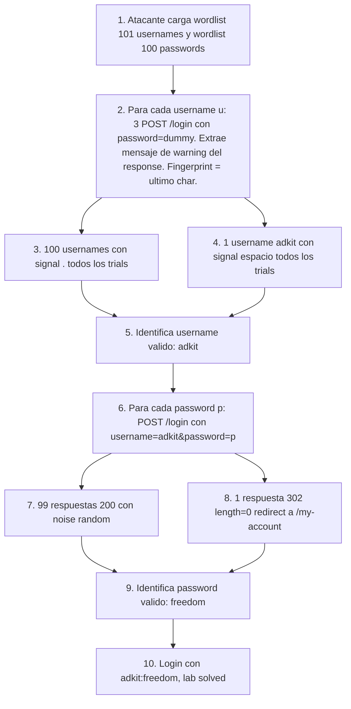

# Writeup: Username enumeration via subtly different responses (PortSwigger)

- **Lab**: Username enumeration via subtly different responses
- **URL**: https://portswigger.net/web-security/authentication/password-based/lab-username-enumeration-via-subtly-different-responses
- **Categoría**: Authentication / Username enumeration por byte-level differential en mensaje de error
- **Dificultad**: Practitioner
- **Credenciales**: `adkit:freedom` (descubiertas vía ataque)

---

## 1. Objetivo

Variante avanzada del lab Apprentice "Username enumeration via different responses". El comportamiento del server es similar (response distinto para username válido vs inválido), pero la diferencia ahora es **un solo byte oculto en el mensaje de error**:

- Username inválido: `"Invalid username or password."` (29 chars, termina en `.`)
- Username válido: `"Invalid username or password "` (29 chars, termina en espacio)

Misma longitud, mismo mensaje aparente, mismo status code, mismo tamaño de response. La única diferencia es el último carácter del string del mensaje. Cualquier detección naive basada en `Content-Length`, status code o substring matching falla; hay que comparar a nivel de byte exacto.

Para complicarlo más, la response tiene **noise random** (analytics ID con dígitos variables, comentario HTML opcional `<!-- -->`) que cambia el length total entre 3335 y 3356 bytes en cada request, **enmascarando** el signal real. Length-based outlier detection no sólo falla por la pequeñez del delta sino porque el noise es órdenes de magnitud más grande que la señal.

### El insight central

PortSwigger diseñó este lab específicamente para enseñar el límite de la detección por length: cuando el server tiene noise random y el delta del signal es 0 bytes (mismo length, distinto content), hay que mirar el **contenido específico** del response, no su volumen. La abstracción correcta para automatizar es "extraer el campo de interés y comparar exactamente", no "comparar length total".

---

## 2. Reconocimiento

### 2.1 Primer intento: reusar el script del lab anterior

Lancé el script `bruteforce.py` del lab Apprentice (basado en `(status, length)` fingerprint) sobre la misma wordlist. Resultado:

```
[*] distribucion (status,length): {(200, 3336): 12, (200, 3352): 16, (200, 3354): 8,
                                    (200, 3339): 10, (200, 3338): 13, (200, 3353): 8,
                                    (200, 3355): 10, (200, 3337): 9, (200, 3356): 8,
                                    (200, 3335): 7}
[!] 85 outliers en fase 1, esperaba 1.
```

10 buckets de length distintos para 101 usernames. La detección por length pierde sentido: el noise distribuye al azar a usernames inválidos en 10 buckets, y el válido se confunde con cualquiera de ellos.

### 2.2 Diagnóstico del noise

Capturé responses de un mismo username (e.g., `xxx_invalid_test`) varias veces. Los lengths variaban 3335-3356, **dentro del mismo username**. Eso descartó length como signal.

Diff entre responses:

```
< 11        <!-- -->
> 11        <script>fetch('/analytics?id=8826852167')</script>
```

Dos fuentes de variación en cada response:

- **Comentario HTML aleatorio**: `<!-- -->` aparece o no aparece (~50% del tiempo, independiente del username).
- **Analytics ID**: `fetch('/analytics?id=N')` donde `N` es un número aleatorio de 8-12 dígitos.

Los dos componen un noise floor de ~20 bytes. Cualquier signal de menor delta queda enterrado.

### 2.3 Intento de normalización

Hice tres niveles de normalización, esperando que tras eliminar noise los responses fueran distinguibles:

1. **Regex replace del analytics ID** → resultados aún variables (3328 vs 3337).
2. **Remover entera la línea con `<!-- -->`** → todos los hashes idénticos `5920c5223f426bb...` o `b1d70d59a4cbc05...`, mismas dos opciones para *cualquier* username.
3. **Hash del content div extraído** (`<div theme="">...</body>`) → un solo hash idéntico para todos los usernames.

El content body, sin noise, es **byte-idéntico** para todos los usernames. Dije "no hay signal acá" y casi descarté el lab.

### 2.4 Hint del lab → señal real

Consulté la documentación oficial del lab. Hint clave:

> "instead of a full stop/period, there is a trailing space"

El mensaje de error reemplaza el `.` final por un ` ` (espacio) **sólo para el username válido**. Mismo length (29 chars), mismo texto visible, distinto último byte.

Por qué mi análisis no lo detectó: los responses con punto final y los con espacio final son idénticos en length (`<p class=is-warning>Invalid username or password.</p>` vs `<p class=is-warning>Invalid username or password </p>` — ambos 60 chars en total, sólo difiere el último char antes del `</p>`). Dentro del HTML completo, cuando el resto del response tiene noise de ±20 bytes por analytics, la diferencia de 1 byte en el char queda invisible al hash o al length.

La señal estaba todo el tiempo en el response, sólo había que mirar el campo correcto.

---

## 3. Resolución

### 3.1 Fingerprint correcto: último char del warning message

Re-escribí el script extrayendo el mensaje de warning con regex y comparando el último char:

```python
WARNING_MSG_RE = re.compile(r'<p class=is-warning>(.*?)</p>', re.S)

def fingerprint(text):
    m = WARNING_MSG_RE.search(text)
    return m.group(1)[-1] if m else '?'
```

Para cada username, el signal es `'.'` (inválido) o `' '` (válido).

Para descartar noise (a veces el regex falla, a veces hay timing issue), tomo **3 trials por username** y exijo que el signal sea estable los tres. Si los 3 trials dan signals distintos, marco como inestable y descarto.

### 3.2 Run

```
[*] Fase 1 (enum usernames): probando 101 candidatos x 3 trials...
[*] signal: ultimo char del mensaje de warning (period vs espacio)
[*] distribucion de signals: {'.': 100, ' ': 1}

[+] username valido: adkit  (signal=' ')
```

100 usernames produjeron `.` consistentemente; uno (`adkit`) produjo ` ` los 3 trials. Outlier limpio.

### 3.3 Fase 2: brute-force del password

Para `adkit`, brute-force con la wordlist de passwords. Acá el signal vuelve a ser `(status, length)` porque el redirect a `/my-account` cambia el response completamente:

```
[*] distribucion (status,length): top=[(200, 3356, 16), (200, 3338, 14), (200, 3337, 14)]
```

99 passwords devolvieron 200 con length variable (todas "Invalid username or password.", noise normal); uno devolvió 302 con length 0:

```
pwd='freedom'             status=302 len=0
```

Password válido: `freedom`. Login con `adkit:freedom` → redirect a `/my-account?id=adkit` → lab solved.

---

## 4. Por qué funciona (y por qué casi no funciona)

### 4.1 La detección de signals tiene niveles

Cuando un atacante quiere extraer información binaria (válido/inválido) de un servidor, tiene varios fingerprints disponibles, en orden de robustez decreciente:

| Nivel | Signal | Bytes diferenciales típicos | Cuándo falla |
|---|---|---|---|
| 1 | Status code | mismo bucket o no | server siempre devuelve 200 |
| 2 | Body length | 1+ bytes | noise random en response (este lab) |
| 3 | Hash del body | 0 bytes (cualquier diferencia detectable) | noise irreversible |
| 4 | Content extraído (sin noise) | 0 bytes en zona limpia | content idéntico |
| 5 | **Byte específico de un campo extraído** | 1 byte exacto en posición conocida | response totalmente idéntico |
| 6 | Timing | ms diferenciales | jitter de red oculta el signal |

El lab Apprestice se resuelve en nivel 2 (length differential). Este lab requiere nivel 5 (byte exacto en posición conocida). Cuando el level 2-4 fallan por noise, hay que escalar a level 5 mirando contenido estructurado (mensajes, campos, fragments específicos del HTML).

Niveles 5+ son donde Burp **Comparer** brilla: comparación visual de dos responses byte-a-byte con highlight de diferencias. Comparer es perfecto para identificar este tipo de signal cuando ya tenés dos responses candidatos; el lab de PortSwigger lo enseña usando Intruder con grep-extract después de identificar la diferencia con Comparer.

### 4.2 Noise como defensa (consciente o accidental)

Que el lab incluya analytics ID variable y comentario HTML aleatorio no es casualidad. PortSwigger lo agregó intencionalmente para defeat naive length-based detection. Esto refleja una práctica defensiva real:

- Aplicaciones serias tienen **CSRF tokens** en el body (longitud variable codificada).
- **Tracking pixels y analytics** con IDs de sesión.
- **Timing jitter** introducido a propósito.
- **Padding aleatorio** en responses para igualar lengths.

La fix defensiva canónica para evitar enum por response differential es **respuesta byte-idéntica** para todas las ramas de fallo. Pero llegar a byte-idéntico requiere disciplina: el server tiene que generar exactamente la misma estructura HTML, los mismos cookies, los mismos headers, el mismo timing. Cualquier rama del código que diverge crea signal.

En este lab, la divergencia es la cadena del mensaje (1 char). Suficiente para enum.

### 4.3 Por qué casi descarto el lab

Mi análisis fue:
1. Length tiene noise → no sirve.
2. Hash de content limpio → todos idénticos.
3. Conclusión preliminar: "no hay signal".

El error: el level 5 (byte específico de campo extraído) requiere tener una hipótesis sobre **dónde** mirar. Sin la hipótesis, no es práctico hacer "diff de cada campo posible del HTML" exhaustivamente. Tener el hint del lab fue equivalente a tener el thread de un security researcher diciendo "el bug está en el mensaje de error".

En auditorías reales sin hint, la disciplina correcta es: **Burp Comparer entre dos responses muy diferentes** (e.g., un username garantizado inválido como `xxxxxx_doesnt_exist_xxxxxx` y un username sospechoso de ser válido como `admin`), después comparar los diffs byte-a-byte y filtrar lo que sea claramente noise. Un punto vs espacio en el body es visible inmediatamente con esa herramienta.

### 4.4 Diferencias con el lab Apprentice (lab #1 de Auth)

| Aspecto | Lab #1 (different responses) | Lab #2 (subtly different) |
|---|---|---|
| Mensaje invalid | "Invalid username" | "Invalid username or password." |
| Mensaje valid | "Incorrect password" | "Invalid username or password " (con espacio) |
| Diferencia visible | palabras distintas | un carácter |
| Length differential | 2 bytes | 0 bytes |
| Status differential | igual (200/200) | igual (200/200) |
| Noise en response | mínimo | analytics ID + comentario aleatorio |
| Detección automatizable con length | sí, trivial | no |
| Detección automatizable con hash de content | sí | no, content idéntico |
| Detección con byte-level differential | overkill | requerido |

El lab Practitioner sube la barra: el atacante necesita herramientas más finas, y el defensor que se preocupa de length-based attacks debe también preocuparse de byte-level attacks.

---

## 5. Resumen de la cadena



Tres ideas para llevarse:

1. **Length-based detection tiene techo bajo cuando el server tiene noise random**. Para signals < 20 bytes (analytics IDs, CSRF tokens, comentarios opcionales), la detección por length está dominada por noise. Hay que escalar a content-level fingerprinting.
2. **El nivel correcto de granularidad depende del defensor**: cuando el server hace todo igual *excepto* un campo específico, el atacante tiene que extraer ese campo y compararlo aisladamente. Burp Comparer + Intruder con grep-extract es la herramienta canónica. Para automatización, regex sobre el HTML.
3. **Multi-trial consensus filtra noise estable**: para descartar respuestas inestables (timeout, regex no matchea, server timeout), exigir signal idéntico en N trials. 3 trials es suficiente para señales reales con noise <50%.

---

## 6. Contramedidas

En orden de robustez (extiende las del lab Apprentice):

1. **Mensaje literalmente idéntico** byte por byte para todas las ramas de fallo. Sin trailing space, sin punctuation differential, sin capitalización distinta. La única forma honesta es generar el mensaje desde una constante única en el código:
   ```python
   ERR_INVALID_CREDS = "Invalid username or password."  # única constante usada en todas las ramas
   ```
   No componer el mensaje en cada rama (`return f"Invalid {field} or password"` por separado).
2. **Constant-time response**: incluso si el mensaje es idéntico, hashear el password contra dummy en la rama "user not found" (cubierto en lab #1). Sin esto, timing differential reemplaza al text-based.
3. **Auditoría de byte-level differential** en code review: comparar dos branches del código de auth y verificar que ningún string, header, cookie, ni elemento de respuesta diverge.
4. **Tests automatizados que comparan responses byte por byte** entre ramas: para cada combinación (user existe / no, password correcta / no, condiciones edge), assert que el response es idéntico.
5. **Padding aleatorio en el body** que iguala lengths entre ramas. Token random de longitud predecible (ej. CSRF token con sigsig) hace que la length total sea siempre la misma. Defensa de "fuerza bruta" cuando ramas no se pueden unificar fácilmente.
6. **Captcha + rate-limiting + MFA** como capas que limitan la velocidad y profundidad del enum aunque la signal se mantenga.

---

## 7. Referencias

- PortSwigger Web Security Academy. (s.f.). *Lab: Username enumeration via subtly different responses*. https://portswigger.net/web-security/authentication/password-based/lab-username-enumeration-via-subtly-different-responses
- PortSwigger Web Security Academy. (s.f.). *Vulnerabilities in password-based login*. https://portswigger.net/web-security/authentication/password-based
- PortSwigger Web Security Academy. (s.f.). *Burp Comparer*. https://portswigger.net/burp/documentation/desktop/tools/comparer — herramienta canónica para detectar diffs byte a byte entre dos responses.
- OWASP Foundation. (s.f.). *Authentication Cheat Sheet*. https://cheatsheetseries.owasp.org/cheatsheets/Authentication_Cheat_Sheet.html
- OWASP Foundation. (s.f.). *WSTG-IDNT-04: Testing for Account Enumeration and Guessable User Account*. https://owasp.org/www-project-web-security-testing-guide/stable/4-Web_Application_Security_Testing/03-Identity_Management_Testing/04-Testing_for_Account_Enumeration_and_Guessable_User_Account
- MITRE Corporation. (2024). *CWE-204: Observable Response Discrepancy*. https://cwe.mitre.org/data/definitions/204.html
- MITRE Corporation. (2024). *ATT&CK Technique T1110.001: Brute Force - Password Guessing*. https://attack.mitre.org/techniques/T1110/001/
- Stuttard, D., & Pinto, M. (2011). *The Web Application Hacker's Handbook* (2nd ed.). Wiley. Cap. 6 (Attacking Authentication).
- Writeup hermano: [`learning/portswigger/username-enumeration-via-different-responses/writeup.md`](../username-enumeration-via-different-responses/writeup.md) — versión Apprentice de la misma técnica con length-based signal trivial.
- Inventario interno: [`inventario/04-explotacion/credenciales/explotacion-brute-force-advanced.md`](../../../inventario/04-explotacion/credenciales/explotacion-brute-force-advanced.md)
- Script: [`bruteforce.py`](bruteforce.py) en este directorio — variante con fingerprint de byte-level differential.
