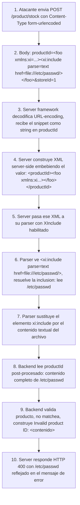

# Writeup: Exploiting XInclude to retrieve files (PortSwigger)

- **Lab**: Exploiting XInclude to retrieve files
- **URL**: https://portswigger.net/web-security/xxe/lab-xinclude-attack
- **Categoría**: XXE-adjacent -> XInclude (vector paralelo, no requiere control del DOCTYPE)
- **Dificultad**: Practitioner
- **Credenciales**: no requiere login

---

## 1. Objetivo

Mismo "Check stock" en una página de producto, mismo objetivo (`/etc/passwd`), pero con un cambio fundamental respecto a los labs XXE anteriores: la app **no acepta XML directo del usuario**. Recibe los parámetros como `application/x-www-form-urlencoded` (`productId=1&storeId=1`), y el server los **inyecta dentro de su propio XML construido server-side**. Eso quita al atacante el control del documento entero, y por tanto la posibilidad de declarar `<!DOCTYPE>` con `<!ENTITY>`. La técnica para sortearlo: **XInclude**, una feature W3C ortogonal a XXE clásico que vive en el body XML como un elemento normal y no necesita DOCTYPE.

### Lo importante antes de tocar nada

- **El lab cambia las reglas**: no controlas el documento entero, solo el valor de un parámetro. Esto invalida el truco de declarar `<!ENTITY>` en `<!DOCTYPE>` (no controlas el DOCTYPE).
- **XInclude no es XXE**, es una W3C spec separada (XML Inclusions, 2006). Reusable cuando "deshabilitamos external entities" no es suficiente.
- **`parse="text"` es obligatorio para targets que no son XML**. `/etc/passwd` no es XML válido; sin `parse="text"` el parser intenta interpretarlo como XML y falla.
- **Defensive takeaway crítico**: deshabilitar DOCTYPE/ENTITY processing **no** deshabilita XInclude. Son dos features ortogonales del parser que se configuran por separado. Equipos que mitigan XXE clásico y se quedan tranquilos siguen siendo vulnerables a XInclude si su parser tiene XInclude activo.

---

## 2. Diferencia con los labs XXE anteriores

Quinto lab de la serie XXE; el primero que abandona la mecánica DOCTYPE+ENTITY.

| Lab | Control del documento | Mecánica |
|---|---|---|
| `retrieve-files` | Total (XML body completo del atacante) | DOCTYPE inline + general entity `file://` |
| `perform-ssrf` | Total | Igual + esquema `http://` |
| `data-retrieval-via-error-messages` | Total | DTD remoto + parameter entities anidadas |
| **Este lab** | **Parcial (solo valor de un parámetro)** | **XInclude (sin DOCTYPE)** |

El cambio mental que el lab fuerza:

> XXE no es "el atacante controla el XML". XXE es "el parser server-side procesa entidades/inclusiones controladas por el atacante en algún punto del documento". El punto de inyección puede ser pequeño y aún así suficiente.

Cualquier app que tome valores form-encoded y los serialice en XML server-side antes de parsearlos cae en este patrón. Ejemplos del mundo real: SOAP wrappers que toman REST input y lo convierten a XML, gateways que envuelven JSON en XML para legacy backends, configuraciones de feeds RSS donde los parámetros vienen por query string pero el contenido se procesa como XML.

---

## 3. Reconocimiento

### 3.1 Detectar que es form-encoded, no XML body

Click "Check stock". Burp captura:

```http
POST /product/stock HTTP/2
Host: LAB.web-security-academy.net
Content-Type: application/x-www-form-urlencoded
Content-Length: ...

productId=1&storeId=1
```

Tres señales clave:
1. `Content-Type: application/x-www-form-urlencoded`, no `application/xml`. El cliente no envía XML.
2. Body es `productId=1&storeId=1`, formato form. Confirma form-encoded.
3. La respuesta sigue diciendo "Invalid product ID: ..." cuando enviamos un valor inválido. Eso significa que **el server procesa los valores y los refleja**, igual que en los labs anteriores.

La pregunta natural: si el server no recibe XML, ¿cómo es vulnerable a algo XML-like? La respuesta es **construcción server-side**: el server toma los valores y construye un XML internamente:

```xml
<stockCheck>
  <productId>1</productId>
  <storeId>1</storeId>
</stockCheck>
```

Y lo pasa a un parser. Ese parser es donde puede vivir XInclude habilitado.

### 3.2 Probar la sospecha de construcción server-side

Mandar `productId=<test>` (URL-encoded). Si el server responde con un error tipo "XML parser exited with error: not well-formed XML", **confirmado**: el server construye XML y parsea. Y el atacante tiene un punto de inyección dentro de ese XML.

(En este lab probablemente no necesites ese paso porque el behavior es conocido, pero en un test real ese sería el indicio.)

---

## 4. Diseño del ataque

### 4.1 Snippet XInclude

```xml
<foo xmlns:xi="http://www.w3.org/2001/XInclude">
  <xi:include parse="text" href="file:///etc/passwd"/>
</foo>
```

Diseccionando:

- **`<foo ...>`**: elemento envoltorio. Necesario porque `<xi:include>` debe estar dentro de algún elemento padre. Nombre arbitrario.
- **`xmlns:xi="http://www.w3.org/2001/XInclude"`**: declara el prefijo de namespace `xi` apuntando al URI canónico de la spec XInclude del W3C. Sin esta declaración, el parser trata `<xi:include>` como un elemento normal sin significado especial. Con ella, lo reconoce como instrucción de inclusión.
- **`<xi:include ... />`**: la directiva. El parser la reemplaza con el contenido del recurso indicado por `href`.
- **`parse="text"`**: clave para este caso. Le dice al parser que el contenido se incluye como **texto plano**. Sin este atributo, el default es `parse="xml"`, que intenta parsear el contenido como XML; `/etc/passwd` no es XML válido y el parser fallaría.
- **`href="file:///etc/passwd"`**: la URL del recurso. Mismo esquema `file://` que en XXE clásico.

### 4.2 Body completo a enviar

```
productId=<foo xmlns:xi="http://www.w3.org/2001/XInclude"><xi:include parse="text" href="file:///etc/passwd"/></foo>&storeId=1
```

URL-encodeado (con Ctrl+U en Burp sobre la selección del snippet, no del `&storeId=1`):

```
productId=%3cfoo+xmlns%3axi%3d%22http%3a%2f%2fwww.w3.org%2f2001%2fXInclude%22%3e%3cxi%3ainclude+parse%3d%22text%22+href%3d%22file%3a%2f%2f%2fetc%2fpasswd%22%2f%3e%3c%2ffoo%3e&storeId=1
```

### 4.3 Cómo se procesa server-side

1. Server recibe `productId=<foo ...>` (decodificado del URL-encoding por el web framework).
2. Server construye XML insertando ese valor:
   ```xml
   <stockCheck>
     <productId><foo xmlns:xi="http://www.w3.org/2001/XInclude"><xi:include parse="text" href="file:///etc/passwd"/></foo></productId>
     <storeId>1</storeId>
   </stockCheck>
   ```
3. Server pasa ese XML al parser (con XInclude processing activo).
4. Parser detecta el `<xi:include>`, resuelve `file:///etc/passwd`, lee el archivo, y reemplaza el elemento por el contenido textual del archivo.
5. El XML procesado tiene `<productId>` con el contenido de `/etc/passwd` como texto.
6. Backend lee `productId`, no matchea ningún producto, construye "Invalid product ID: <contenido>", refleja en respuesta HTTP.

---

## 5. Por qué funciona

### 5.1 XInclude bypassa la mitigación principal de XXE

La defensa clásica contra XXE:
```java
factory.setFeature("http://apache.org/xml/features/disallow-doctype-decl", true);
```

Eso prohíbe `<!DOCTYPE>`. El atacante no puede declarar `<!ENTITY>`. XXE clásico bloqueado.

**Pero XInclude no usa DOCTYPE ni ENTITY**. Es una feature de inclusión que se activa con un atributo de namespace (`xmlns:xi="..."`) en cualquier elemento. El parser, si tiene XInclude habilitado, procesa la inclusión sin pasar por DOCTYPE.

La feature de XInclude se controla con un setting separado:
```java
factory.setXIncludeAware(true);  // habilita XInclude
factory.setNamespaceAware(true); // necesario para XInclude
```

Si una app deshabilita DOCTYPE pero deja `setXIncludeAware(true)` (porque alguna otra parte del código necesita XInclude legítimo), el atacante puede usar XInclude para los mismos ataques (lectura de archivos, SSRF) que el XXE clásico permitiría.

**Lección defensiva**: la mitigación de XXE no es una sola línea. Hay que deshabilitar **todas las features que resuelven recursos externos**: external general entities, external parameter entities, external DTD loading, **y** XInclude. Olvidar cualquiera deja un vector vivo.

### 5.2 No necesitas controlar el documento entero

XXE clásico requiere que el atacante escriba el primer caracter del XML (porque DOCTYPE va al principio, justo después de la declaración `<?xml ?>`). XInclude vive como un elemento normal **en cualquier punto del documento**. Si controlas el contenido de cualquier elemento (o atributo, en algunos parsers), puedes inyectar el namespace y la directiva.

Esto amplía dramáticamente la superficie de ataque. Apps que envuelven input user en XML server-side (patrón muy común en integraciones legacy SOAP, configuraciones de feeds, gateways REST→XML) son vulnerables aunque jamás reciban XML directo del usuario.

### 5.3 `parse="text"` evita el bug de "el archivo no es XML"

Sin `parse="text"`, el default es `parse="xml"`, y el parser intenta validar el contenido del archivo como XML antes de incluirlo. `/etc/passwd` falla esa validación inmediatamente (no tiene root element, los `:` causan ambigüedades). El ataque se rompe ahí.

`parse="text"` instruye al parser a tratar el contenido como cadena UTF-8 sin parsear. Eso permite leer cualquier archivo, no solo XML válido. Para XXE-via-XInclude esto es la default operacional.

---

## 6. Resolución

1. Click "View details" en cualquier producto, click "Check stock".
2. Burp captura POST `/product/stock` con `Content-Type: application/x-www-form-urlencoded` y body `productId=1&storeId=1`.
3. Mandar a Repeater.
4. Reemplazar el valor `1` de `productId` por:
   ```
   <foo xmlns:xi="http://www.w3.org/2001/XInclude"><xi:include parse="text" href="file:///etc/passwd"/></foo>
   ```
5. Seleccionar **solo ese snippet** (sin tocar `productId=` ni `&storeId=1`) y `Ctrl+U` para URL-encodear.
6. Send. La respuesta llega como HTTP 400 con body `"Invalid product ID: root:x:0:0:root:/root:/bin/bash..."` seguido del resto de `/etc/passwd`.
7. Lab Solved.

Si tras enviar:

- **`Invalid product ID: <foo xmlns:xi="..."><xi:include .../></foo>`**: el snippet pasó como texto literal sin procesar. Significa que el parser server-side **no tiene XInclude habilitado**. Este lab debería tenerlo; si pasa, el lab está mal configurado o la versión del lab cambió.
- **Error tipo "XML parser exited" sin contenido del archivo**: `parse="text"` falta o el snippet llegó mal URL-encoded. Re-encodear desde Burp.
- **`Invalid product ID:` con respuesta vacía**: el archivo se incluyó pero algún byte rompió el rendering del response. Revisar Response → Raw para ver el body completo.

---

## 7. Resumen de la cadena



Tres ideas para llevarse:

1. **XXE no es solo `<!DOCTYPE>` + `<!ENTITY>`**. Es cualquier mecanismo del parser que resuelva recursos externos basándose en input atacante-controlable. XInclude, XSLT con `document()`, XPath con `doc()`, schema imports, son todos vectores paralelos. Auditar features del parser es más amplio que "deshabilité DOCTYPE".
2. **No necesitas controlar el documento entero para atacar XML**. Si controlas un fragmento que termina dentro de un XML procesado server-side, ya es atacable. Identificar este patrón requiere mirar **cómo el server procesa el input**, no solo el `Content-Type` de la petición. APIs REST que envuelven JSON en XML server-side son vulnerables aunque parezcan "no-XML".
3. **`parse="text"` es la default operacional para exfiltración de archivos no-XML**. Saltarlo es un error frecuente que rompe el ataque silenciosamente. Recordar que XInclude es estricto con la validez XML del contenido incluido cuando `parse` no se especifica.

---

## 8. Contramedidas

Defensas en orden de robustez:

1. **Deshabilitar XInclude processing en el parser**, además de las features de XXE clásico:
   ```java
   DocumentBuilderFactory factory = DocumentBuilderFactory.newInstance();
   factory.setFeature("http://apache.org/xml/features/disallow-doctype-decl", true);
   factory.setFeature("http://xml.org/sax/features/external-general-entities", false);
   factory.setFeature("http://xml.org/sax/features/external-parameter-entities", false);
   factory.setXIncludeAware(false);  // <-- crítico contra XInclude
   ```
   Si XIncludeAware default era false en versiones nuevas del parser, igual setearlo explícitamente para resistir cambios futuros.
2. **Validar/sanitizar input antes de embeberlo en XML**. Si `productId` debería ser un entero, rechazar cualquier valor que no matchee `^\d+$` antes de construir el XML. Defensa de raíz: si el dato no llega al parser con caracteres XML especiales, no hay vector.
3. **Usar bibliotecas de templating XML que escapen automáticamente**. JAXP `Transformer`, JDOM, dom4j al construir documentos correctamente escapan caracteres especiales en valores de elementos. Usar string concatenation para construir XML es la fuente del bug.
4. **Sandbox de filesystem para el proceso del parser**. Si el parser corre como un usuario que no puede leer `/etc/passwd`, el ataque falla aunque XInclude esté activo. Defense in depth.
5. **WAF con reglas anti-XInclude**. Detectar `xmlns:xi="http://www.w3.org/2001/XInclude"` o `<xi:include` en bodies form-encoded es razonable para apps que no necesitan XInclude legítimo. Bypass posibles con encodings; no sustituye a la fix de raíz.
6. **Migrar a JSON para nuevos endpoints**. Sin equivalente de XInclude/entidades. Reducción de superficie generacional.

---

## 9. Referencias

- PortSwigger Web Security Academy. (s.f.). *Lab: Exploiting XInclude to retrieve files*. https://portswigger.net/web-security/xxe/lab-xinclude-attack
- PortSwigger Web Security Academy. (s.f.). *XML external entity (XXE) injection*. https://portswigger.net/web-security/xxe
- W3C. (2006). *XML Inclusions (XInclude) Version 1.0 (Second Edition)*. https://www.w3.org/TR/xinclude/
- OWASP Foundation. (s.f.). *XML External Entity Prevention Cheat Sheet*. https://cheatsheetseries.owasp.org/cheatsheets/XML_External_Entity_Prevention_Cheat_Sheet.html
- Oracle. (s.f.). *DocumentBuilderFactory.setXIncludeAware*. https://docs.oracle.com/javase/8/docs/api/javax/xml/parsers/DocumentBuilderFactory.html#setXIncludeAware-boolean-
- Writeups previos de la serie XXE:
  - [`learning/portswigger/exploiting-xxe-to-retrieve-files/writeup.md`](../exploiting-xxe-to-retrieve-files/writeup.md)
  - [`learning/portswigger/exploiting-xxe-to-perform-ssrf/writeup.md`](../exploiting-xxe-to-perform-ssrf/writeup.md)
  - [`learning/portswigger/blind-xxe-data-retrieval-via-error-messages/writeup.md`](../blind-xxe-data-retrieval-via-error-messages/writeup.md)
- Inventario interno: [`inventario/03-analisis-vulnerabilidades/web/analisis-xxe.md`](../../../inventario/03-analisis-vulnerabilidades/web/analisis-xxe.md)
