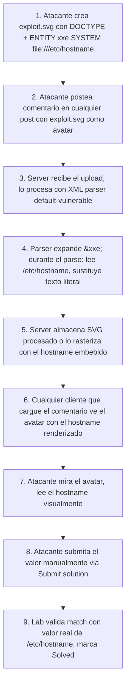

# Writeup: Exploiting XXE via image file upload (PortSwigger)

- **Lab**: Exploiting XXE via image file upload
- **URL**: https://portswigger.net/web-security/xxe/lab-xxe-via-file-upload
- **Categoría**: XXE -> Vector via SVG (XML escondido en formato "imagen")
- **Dificultad**: Practitioner
- **Credenciales**: cualquier login del lab; `wiener:peter` típicamente

---

## 1. Objetivo

Los labs anteriores atacaban endpoints que aceptaban XML directamente. Este cambia el vector: hay que subir un **avatar SVG** malicioso al perfil de usuario / sección de comentarios. SVG es un formato de imagen vectorial **basado en XML**, así que el server-side processor (resize, validación, conversión, thumbnail) lo pasa por un parser XML. Si ese parser tiene external entities habilitadas, el SVG puede contener un payload XXE que lee `/etc/hostname`. Cuando el server expande la entidad, el contenido del archivo queda embebido como texto dentro del SVG y se renderiza visualmente al servir el avatar.

### Lo importante antes de tocar nada

- **SVG es XML**. Esa es la lección entera del lab. Apps que aceptan SVG y lo procesan server-side son XXE-vulnerables si el parser default-vulnerable.
- **El target es `/etc/hostname`, no `/etc/passwd`**: archivo de una línea que cabe en el viewBox del avatar y se renderiza legible. `/etc/passwd` no entraría sin word-wrap manual.
- **Validación del lab**: requiere que el atacante **submita el valor leído manualmente** vía botón "Submit solution". Solo renderizar el avatar no marca Solved; hay que copiar el hostname leído y pegarlo en la solución. Detalle fácil de pasar por alto si vienes de los labs anteriores donde la validación era automática al detectar el patrón en la respuesta HTTP.
- **Vector de superficie real**: cualquier upload de SVG (avatares, banners, ilustraciones embebidas, e-mail signatures con SVG, etc.) en cualquier app es candidato. Auditar uploads no es solo "qué tipos acepta" sino "qué hace con cada tipo después de aceptarlo".

---

## 2. Diferencia con los labs XXE anteriores

Sexto y último lab de la serie XXE en PortSwigger Practitioner. Cierra la categoría con el vector más relevante para auditorías reales.

| Lab | Punto de inyección | Canal de salida |
|---|---|---|
| `retrieve-files` | XML body completo | Reflexión en error |
| `perform-ssrf` | XML body completo | Reflexión en error |
| `data-retrieval-via-error-messages` | XML body + DTD remoto | Mensaje de error verboso |
| `xinclude-attack` | Form param embebido en XML server-side | Reflexión en error |
| **Este lab** | **Archivo SVG subido como imagen** | **Renderizado visual del SVG + Submit solution manual** |

Los cambios fundamentales:

1. **El input no es XML obvio**: es un upload de imagen. El operador del server puede no haberse planteado que "imagen" implica "parser XML".
2. **El canal de salida es visual**: el SVG se renderiza con el contenido del archivo como texto. Lees `/etc/hostname` mirando el avatar.
3. **Lab requiere submit manual del valor**: deliberadamente no se autodetecta; hay que confirmar que entendiste qué leíste.

---

## 3. Background: formatos "ocultamente XML"

La lista de formatos comunes basados en XML que pasan por parsers en pipelines típicos:

- **SVG** (este lab): scalable vector graphics, XML directo.
- **DOCX, XLSX, PPTX**: ZIP que contiene XMLs (`document.xml`, `sharedStrings.xml`, etc.). XXE en uploads de Office es vector real en muchos sistemas (extracción de texto, validación de macros).
- **ODT, ODS**: equivalentes de LibreOffice. Mismo patrón ZIP+XML.
- **EPUB**: ZIP+XML+XHTML. Lectores de e-books que extraen metadata son target.
- **RSS, Atom**: feeds XML. Agregadores que ingesten URLs externas.
- **SOAP, WSDL**: legacy enterprise APIs.
- **KML, GPX**: formatos geo, XML.
- **PDF con XFA forms**: XML embebido.
- **plist (macOS)**: configuración Apple, XML.
- **OpenAPI/Swagger en YAML que se convierte a XML**: en algunos toolchains.
- **OCSP/CRL**: certificados, ASN.1 pero a veces wrapped en XML.

Cada uno es vector XXE potencial si:
1. La app lo procesa server-side (no solo lo guarda).
2. El procesador usa un parser XML default-vulnerable.

Auditar uploads requiere preguntarse para cada formato aceptado: "¿qué hace el server con este archivo después de recibirlo?". Solo "almacenarlo y servirlo" es seguro; cualquier procesamiento (validación de schema, conversión, extracción de metadata, thumbnail) es superficie XXE.

---

## 4. Diseño del ataque

### 4.1 SVG malicioso

```xml
<?xml version="1.0" standalone="yes"?>
<!DOCTYPE test [ <!ENTITY xxe SYSTEM "file:///etc/hostname"> ]>
<svg width="128px" height="128px" xmlns="http://www.w3.org/2000/svg" xmlns:xlink="http://www.w3.org/1999/xlink" version="1.1">
  <text font-size="16" x="0" y="16">&xxe;</text>
</svg>
```

Diseccionando:

- **`<?xml version="1.0" standalone="yes"?>`**: declaración XML. SVG la incluye típicamente. `standalone="yes"` indica que el documento no depende de DTDs externos (ironicamente, cuando estamos usando uno interno). La spec lo permite porque `standalone` se refiere a referencias externas, no a DTD interno.
- **`<!DOCTYPE test [ <!ENTITY xxe SYSTEM "file:///etc/hostname"> ]>`**: igual que en el primer lab XXE. Declara entidad `xxe` que apunta al archivo target.
- **`<svg ... xmlns="http://www.w3.org/2000/svg">`**: root element con su namespace canónico. Sin esto el server podría rechazar el archivo por no validar como SVG.
- **`width="128px" height="128px"`**: tamaño del avatar. Suficiente para mostrar el contenido de `/etc/hostname` (una línea de ~12 caracteres en este lab).
- **`<text font-size="16" x="0" y="16">&xxe;</text>`**: el sink. SVG soporta texto renderizado. `font-size="16"` para legibilidad. `x="0" y="16"`: en SVG la baseline del texto está en `y`; con `font-size="16"` y `y="16"`, la letra ocupa de y=0 a y=16, visible dentro del viewBox.
- **`&xxe;`**: la referencia a la entidad. El parser XML server-side la expande al contenido de `/etc/hostname` antes de almacenar/procesar el SVG.

### 4.2 Por qué se renderiza visiblemente

El server (probablemente):

1. Recibe el SVG.
2. Lo pasa por un parser XML para validar / convertir / generar thumbnail. **El parser expande `&xxe;` durante el parse**.
3. El SVG procesado (en memoria, o almacenado al disk) tiene el contenido de `/etc/hostname` literal en el `<text>`.
4. Almacena el SVG procesado o lo rasteriza a PNG.
5. Cuando un cliente pide el avatar, el server lo sirve. El navegador renderiza el `<text>` y el contenido del archivo aparece como texto en la imagen.

Distinción importante para diagnóstico:

- **Ataque genuino**: el server-side parser expande la entidad. El SVG servido contiene el hostname literal. Cualquiera que abra el SVG ve el dato.
- **Falso positivo cliente-side**: el server almacena el SVG con `&xxe;` sin expandir. Tu navegador, al renderizar el SVG, intenta resolverla — pero los browsers no resuelven `file://` desde SVGs remotos por seguridad. Si ves texto, **es porque el server lo expandió**, no porque tu browser lo hizo.

Para verificar cuál es el caso: abrir la URL del avatar en otra pestaña y ver el source del SVG. Si dice `<text ...>HOSTNAME-VALUE</text>`, server-side. Si dice `<text ...>&xxe;</text>`, el browser está renderizando vacío (ataque no efectivo).

### 4.3 Por qué `/etc/hostname` y no `/etc/passwd`

- **`/etc/hostname`**: una línea, 8-30 caracteres típicamente. Cabe en `<text>` con `font-size="16"` dentro de un viewBox 128x128.
- **`/etc/passwd`**: 30+ líneas. SVG `<text>` no hace word-wrap automático; necesitarías múltiples elementos `<text>` o `<tspan>` con coordenadas calibradas, y aún así muchas líneas no cabrían sin overflow.

El lab elige `/etc/hostname` para que el ataque sea verificable visualmente con un payload simple. Para targets multilinea en explotación real, se usa:
- Wrapper que produce single-line output (`base64 -w 0` server-side, no aplica aquí porque file:// no procesa post-lectura).
- Exfiltración OOB en lugar de canal visual.
- Payload modular con scroll horizontal (`text-anchor="start"` con line-overflow).

---

## 5. Por qué funciona

### 5.1 SVG processors usan parsers XML default-vulnerable

Las librerías típicas para SVG (ImageMagick con MSL/MVG handlers, librsvg, batik en Java, Cairo con SVG support) parsean el archivo con un parser XML antes de rasterizar. Esos parsers son default-vulnerables a XXE en versiones legacy.

ImageMagick específicamente tiene un historial documentado: el incidente "ImageTragick" (2016) explotó una serie de bugs en handlers de ImageMagick incluyendo MVG/MSL y SVG, permitiendo RCE además de XXE. Los fixes pasaron por restringir delegates (`policy.xml` en ImageMagick) y por mantener parsers XML hardenados.

### 5.2 Validación de "es una imagen" no es validación de "es seguro"

Apps validan uploads chequeando:
- Extension (`.svg`, `.png`, etc.).
- MIME type (`image/svg+xml`, `image/png`).
- Magic bytes (los primeros bytes del archivo matcheen el header del formato).
- A veces, dimensiones via parser/rasterizer.

Ninguna de estas validaciones detecta XXE en SVG. El SVG es válido como SVG. La amenaza vive **en el contenido del XML**, no en si el archivo se parece a un SVG.

La defensa correcta: **separar validación de procesamiento**. Si la app necesita validar que el archivo es SVG y mostrarlo, puede:
- Usar un parser hardenado para validar.
- Rasterizar a PNG/JPG inmediatamente y descartar el SVG original (raster output no contiene XML).
- O sanitizar el SVG con una librería que elimine DOCTYPE/entities/scripts (DOMPurify-equivalent para SVG, SVGO con plugins de sanitización).

### 5.3 El avatar es servido por una URL accesible al validador del lab

El lab marca Solved cuando el atacante demuestra que leyó `/etc/hostname`. La validación es manual (Submit solution) en este lab, pero conceptualmente el ataque funciona porque el SVG procesado se sirve en una URL pública. Cualquier visitante del comment ve el avatar con el hostname embebido.

En un escenario real, esto es **information disclosure**. Si el SVG está en un perfil público, el ataque puede:
- Leakear hostnames internos (útil para mapeo de red).
- Leakear paths de configuración accidentalmente sensibles.
- Combinarse con SSRF vía `http://internal/...` para el mismo vector con metadata service AWS.

---

## 6. Resolución

1. Crear `exploit.svg` localmente con el contenido de la sección 4.1.
2. En el lab, ir a cualquier post del blog. En la sección de comentarios, postear un comentario:
   - Comment: cualquier texto.
   - Name: cualquiera.
   - Email: cualquiera (formato válido).
   - Website: opcional.
   - **Avatar**: subir `exploit.svg`.
   - Submit.
3. Volver al post (refresh). Tu comentario aparece. Mirar el avatar: debe mostrar el hostname del server (algo tipo `64186f984a81` — un container ID de Docker en este lab).
4. **Click el botón "Submit solution"** en la barra superior del lab. Pegar el valor del hostname leído en el campo. Submit.
5. Lab marca como Solved.

Si tras submit el lab no resuelve:

- **Hostname mal copiado**: caracteres adicionales (espacios, newline al final). Copy-paste limpio del avatar.
- **Avatar no muestra el hostname, sino `&xxe;` literal**: server hardenado, parser no expandió. Lab no resoluble por este vector si pasa.
- **Solo aparece parte del hostname**: `font-size` o coordenadas cortan el render. Subir `font-size` a 12 o aumentar `width` del SVG.
- **Server rechaza upload**: validación de MIME estricta. Forzar `Content-Type: image/svg+xml` desde Burp interceptando el upload.

---

## 7. Resumen de la cadena



Tres ideas para llevarse:

1. **Auditar uploads no es "qué tipos acepta" sino "qué hace con cada tipo"**. SVG, DOCX, EPUB, RSS, todos son XML escondido. Cualquier procesamiento server-side de cualquiera de ellos es XXE potencial. La pregunta clave en cada upload endpoint: ¿se parsea? ¿con qué librería? ¿hardenada?
2. **Canal de exfiltración visual es legítimo y útil para targets pequeños**. SVG con `<text>` que renderiza el contenido de un archivo es una técnica genérica reusable. Limitada por el viewBox y la falta de word-wrap, pero perfecta para hostnames, IDs, secrets cortos, hashes.
3. **Submit-solution-manual es una clase de validación distinta**. Algunos labs requieren copy-paste del valor leído, no autodetectan. Si el ataque "funciona" pero el lab no marca Solved, revisar siempre el botón "Submit solution" antes de buscar bugs en el payload.

---

## 8. Contramedidas

Defensas en orden de robustez:

1. **No procesar SVG server-side con parser XML general**. Si la app solo necesita servir SVG como imagen, almacenarlo as-is y servirlo con `Content-Type: image/svg+xml`. El navegador del cliente lo renderiza con su propio parser hardened. Cero superficie XXE server-side.
2. **Si tienes que procesar SVG**, usar parser hardenado igual que para XML general:
   ```java
   factory.setFeature("http://apache.org/xml/features/disallow-doctype-decl", true);
   factory.setFeature("http://xml.org/sax/features/external-general-entities", false);
   factory.setFeature("http://xml.org/sax/features/external-parameter-entities", false);
   ```
3. **Sanitizar SVG eliminando DOCTYPE/entidades/scripts**. Librerías:
   - **SVGO** con plugins de sanitización (`removeXMLProcInst`, `removeDoctype`, `removeScriptElement`).
   - **DOMPurify** (cliente y servidor con `jsdom`) tiene mode SVG.
   - **svg-sanitizer** (PHP), similar para PHP backends.
4. **Rasterizar inmediatamente y descartar el SVG**. Si la app puede vivir con PNG/JPG output (avatares, thumbnails), convertir on-upload con un rasterizer hardenado (librsvg con flags safe, ImageMagick con `policy.xml` que prohíbe MSL/MVG/HTTPS/SVG) y guardar solo el raster. Sin XML almacenado, no hay vector.
5. **Sandbox de filesystem para el proceso**. El parser corre como usuario que no puede leer archivos sensibles. Defense in depth.
6. **Content-Disposition + servir desde dominio sandbox**. Servir uploads desde `usercontent.example.com` separado del dominio principal mitiga XSS via SVG (el SVG puede contener `<script>`) pero no XXE; ambos vectores son ortogonales y necesitan defensas separadas.

---

## 9. Referencias

- PortSwigger Web Security Academy. (s.f.). *Lab: Exploiting XXE via image file upload*. https://portswigger.net/web-security/xxe/lab-xxe-via-file-upload
- PortSwigger Web Security Academy. (s.f.). *XML external entity (XXE) injection*. https://portswigger.net/web-security/xxe
- W3C. (2011). *Scalable Vector Graphics (SVG) 1.1 (Second Edition)*. https://www.w3.org/TR/SVG11/
- ImageTragick. (2016). *ImageMagick Is On Fire — CVE-2016-3714*. https://imagetragick.com/
- OWASP Foundation. (s.f.). *XML External Entity Prevention Cheat Sheet*. https://cheatsheetseries.owasp.org/cheatsheets/XML_External_Entity_Prevention_Cheat_Sheet.html
- OWASP Foundation. (s.f.). *File Upload Cheat Sheet*. https://cheatsheetseries.owasp.org/cheatsheets/File_Upload_Cheat_Sheet.html
- DOMPurify. (s.f.). *DOMPurify SVG support*. https://github.com/cure53/DOMPurify
- SVGO. (s.f.). *SVGO project*. https://github.com/svg/svgo
- Writeups previos de la serie XXE:
  - [`learning/portswigger/exploiting-xxe-to-retrieve-files/writeup.md`](../exploiting-xxe-to-retrieve-files/writeup.md)
  - [`learning/portswigger/exploiting-xxe-to-perform-ssrf/writeup.md`](../exploiting-xxe-to-perform-ssrf/writeup.md)
  - [`learning/portswigger/blind-xxe-data-retrieval-via-error-messages/writeup.md`](../blind-xxe-data-retrieval-via-error-messages/writeup.md)
  - [`learning/portswigger/xinclude-attack-retrieve-files/writeup.md`](../xinclude-attack-retrieve-files/writeup.md)
- Inventario interno: [`inventario/03-analisis-vulnerabilidades/web/analisis-xxe.md`](../../../inventario/03-analisis-vulnerabilidades/web/analisis-xxe.md)
- Inventario interno (file upload general, si existe): [`inventario/03-analisis-vulnerabilidades/web/analisis-fileupload.md`](../../../inventario/03-analisis-vulnerabilidades/web/analisis-fileupload.md)
