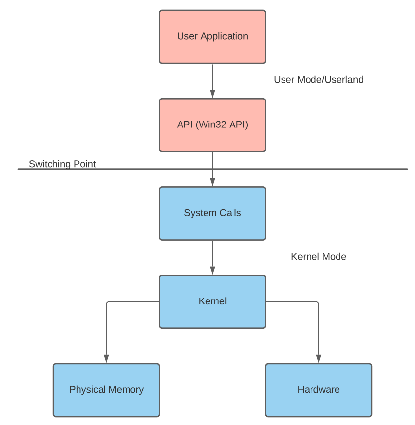

# Task 2 - Subsystem and Hardware Interaction

Programs often need to access or modify Windows subsystems or hardware but are restricted to maintain machine stability. To solve this problem, Microsoft released the Win32 , a library to interface between user-mode applications and the kernel.

Windows distinguishes hardware access by two distinct modes: user and kernel mode. These modes determine the hardware, kernel, and memory access an application or driver is permitted. API or system calls interface between each mode, sending information to the system to be processed in kernel mode.

| User mode | Kernel mode |
| --- | --- |
| No direct hardware access | Direct hardware access |
| Access to "owned" memory locations | Access to entire physical memory |

Below is a visual representation of how a user application can use API calls to modify kernel components.

When looking at how languages interact with the Win32 API, this process can become further warped; the application will go through the language runtime before going through the API.

