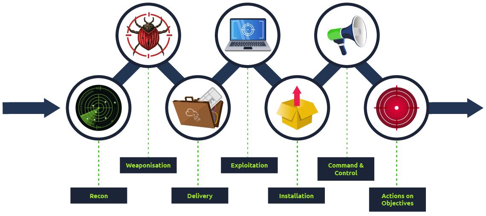
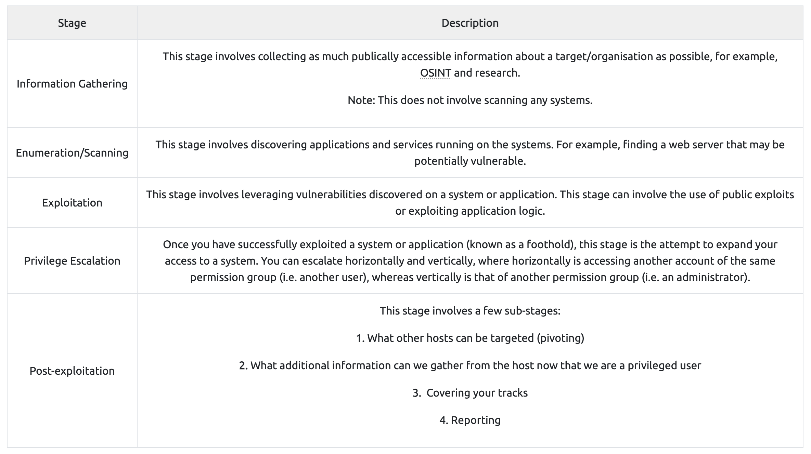

# HNotes

Summary of my studies about hacking

<a href="HNotes/Cheatsheet%202989cb7e495280fa9856fd72986ae0a0.html">Cheatsheet</a>

<a href="HNotes/Recon%209887b34a182b4aed8758aeee77a9baf8.html">Recon</a>

<a href="HNotes/Hacking%20a2daa3201b074b46a20d4ff33dde9861.html">Hacking</a>

<a href="HNotes/General%20ae5c03ea4214450eaec5e96022ec6b5e.html">General</a>

psexec is used to get a windows shell

<a href="HNotes/Burp%20Suite%20Labs%201089cb7e49528062bafada8ae6bed00d.html">Burp Suite Labs</a>

<a href="HNotes/TryHackMe%202aa9cb7e495280289b49cf0c1225fee1.html">TryHackMe</a>
