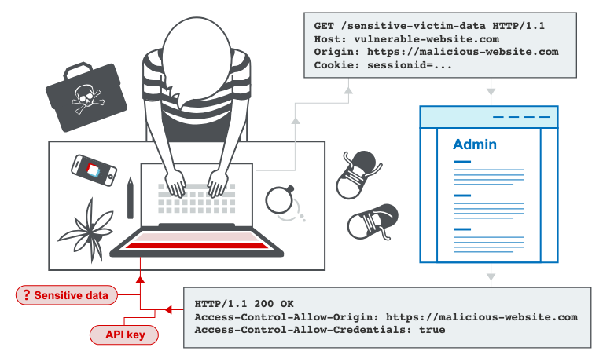

# What is CORS?

**Cross-origin resource sharing (CORS)** is a browser mechanism which **enables controlled access** to resources located outside of a given domain.

It extends and adds flexibility to the [same-origin policy (SOP)](What%20is%20CORS%2014d9cb7e49528012a38df6b130d9f0cc.html). However, **it also provides potential for cross-domain attacks**, if a website's CORS policy is poorly configured and implemented.

CORS is not a protection against cross-origin attacks such as cross-site request forgery (CSRF).



## **Same-origin policy**

The same-origin policy is a restrictive cross-origin specification that limits the ability for a website to interact with resources outside of the source domain.

The same-origin policy was defined many years ago in response to potentially malicious cross-domain interactions, such as one website stealing private data from another.

It generally allows a domain to issue requests to other domains, but not to access the responses.

## **Relaxation of the same-origin policy**

The **same-origin policy** is very restrictive and consequently various approaches have been devised to circumvent the constraints. Many websites interact with subdomains or third-party sites in a way that requires full cross-origin access.

A controlled relaxation of the same-origin policy is possible using **cross-origin resource sharing** (CORS).

The cross-origin resource sharing protocol uses a suite of HTTP headers that define trusted web origins and associated properties such as whether authenticated access is permitted.

These are combined in a header exchange between a browser and the cross-origin web site that it is trying to access.

## CORS Headers

The headers related to Cross-Origin Resource Sharing (CORS) are used to control how resources on a web server can be accessed by web pages from different origins. Here are the key CORS headers:

1.  **Access-Control-Allow-Origin**: Specifies which origins are allowed to access the resource.

    ```
    Access-Control-Allow-Origin: *
    Access-Control-Allow-Origin: http://example.com
    ```

<!-- -->

2.  **Access-Control-Allow-Methods**: Specifies the HTTP methods that are allowed when accessing the resource.

    ```
    Access-Control-Allow-Methods: GET, POST, PUT, DELETE
    ```

<!-- -->

3.  **Access-Control-Allow-Headers**: Specifies the headers that can be used when making the actual request.

    ```
    Access-Control-Allow-Headers: Content-Type, Authorization
    ```

<!-- -->

4.  **Access-Control-Allow-Credentials**: Indicates whether or not the response to use victim browser credentials cookies.

    ```
    Access-Control-Allow-Credentials: true
    ```

<!-- -->

5.  **Access-Control-Expose-Headers**: Specifies which headers can be exposed as part of the response.

    ```
    Access-Control-Expose-Headers: Content-Length, X-Kuma-Revision
    ```

<!-- -->

6.  **Access-Control-Max-Age**: Indicates how long the results of a preflight request can be cached.

    ```
    Access-Control-Max-Age: 86400
    ```

<!-- -->

7.  **Access-Control-Request-Method**: Used in preflight requests to let the server know which HTTP method will be used in the actual request.

    ```
    Access-Control-Request-Method: POST
    ```

<!-- -->

8.  **Access-Control-Request-Headers**: Used in preflight requests to let the server know which HTTP headers will be used in the actual request.

    ```
    Access-Control-Request-Headers: X-PINGOTHER, Content-Type
    ```

These headers are used by the browser and server to negotiate permissions for cross-origin requests. The server responds with the appropriate headers to indicate what is allowed, and the browser enforces these rules.

### What are preflight checks?

Preflight checks in HTTP are a mechanism used by web browsers as part of the **Cross-Origin Resource Sharing (CORS)** protocol. They are an additional request made by the browser before the actual HTTP request when a request is considered "non-simple."

The purpose of a preflight check is to ensure that the server explicitly allows the requested cross-origin operation and to confirm the permissions for the main request.

## **How to prevent CORS-based attacks**

CORS vulnerabilities arise primarily as misconfigurations. Prevention is therefore a configuration problem. The following sections describe some effective defenses against CORS attacks.

### Proper configuration of cross-origin requests

If a web resource contains sensitive information, the origin should be properly specified in the `Access-Control-Allow-Origin` header.

### Only allow trusted sites

It may seem obvious but origins specified in the `Access-Control-Allow-Origin` header should only be sites that are trusted. In particular, dynamically reflecting origins from cross-origin requests without validation is readily exploitable and should be avoided.

### **Avoid whitelisting null**

Avoid using the header `Access-Control-Allow-Origin: null`. Cross-origin resource calls from internal documents and sandboxed requests can specify the `null` origin. CORS headers should be properly defined in respect of trusted origins for private and public servers.

### **Avoid wildcards in internal networks**

Avoid using wildcards in internal networks. Trusting network configuration alone to protect internal resources is not sufficient when internal browsers can access untrusted external domains.

### **CORS is not a substitute for server-side security policies**

CORS defines browser behaviors and is never a replacement for server-side protection of sensitive data - an attacker can directly forge a request from any trusted origin. Therefore, web servers should continue to apply protections over sensitive data, such as authentication and session management, in addition to properly configured CORS.
